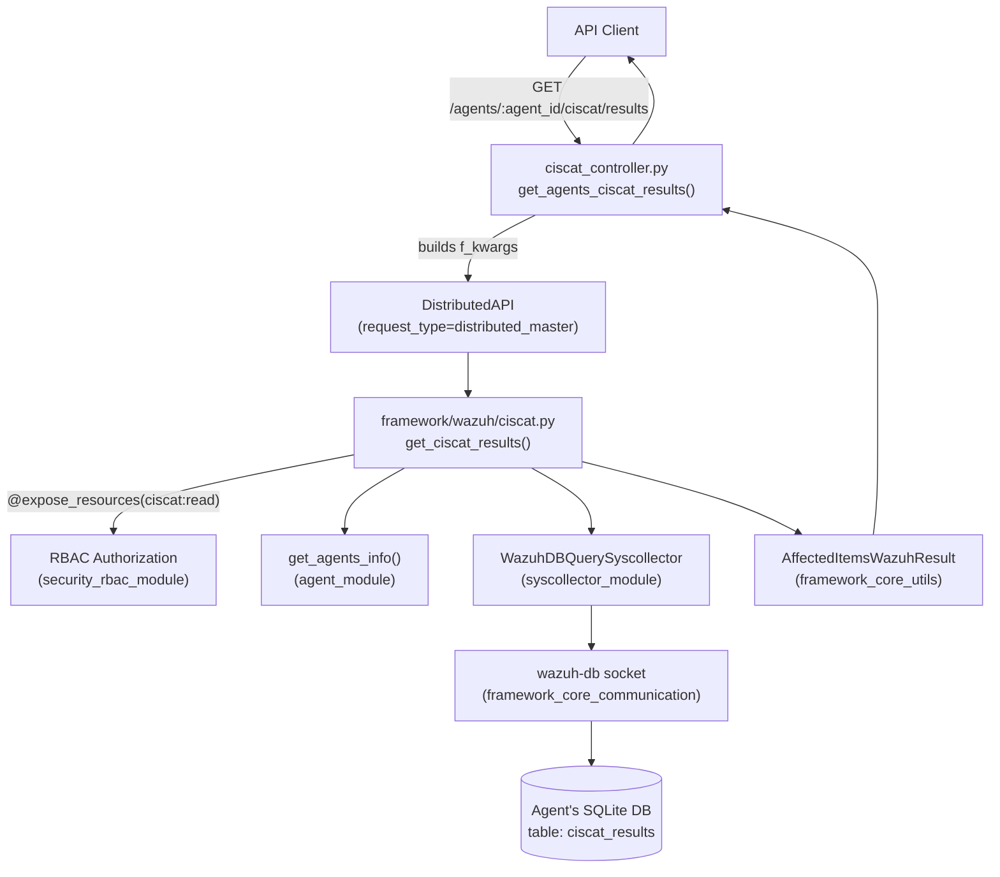
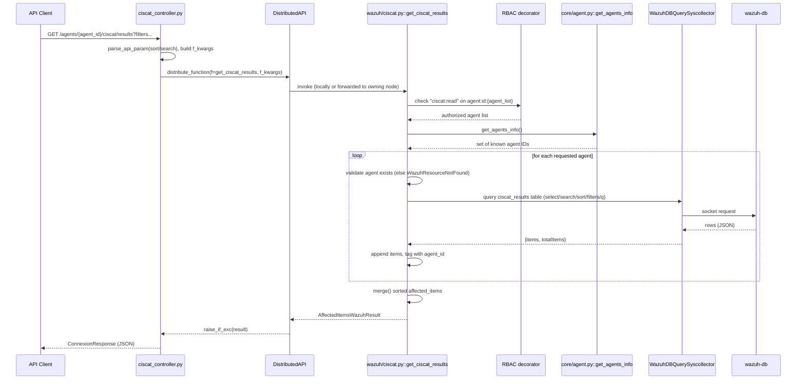

# CIS-CAT Module

## 1. Introduction and Purpose

The **CIS-CAT Module** exposes CIS-CAT (Center for Internet Security Configuration Assessment Tool) compliance
scan results through the Wazuh API. CIS-CAT is a benchmark scanning tool executed on agents (driven by the
`wm_ciscat` wodule, part of the [Wazuh Modules Daemon](Wazuh_Modules_Daemon_(C).md)), and its findings
(benchmark, profile, pass/fail/error counters, and final score) are persisted per-agent in the agent's
Syscollector-managed SQLite database (`ciscat_results` table) inside `wazuh-db`.

This module is intentionally small and focused: it provides a **single read-only capability** — querying,
filtering, sorting and paginating the CIS-CAT scan results stored for one or more agents — and delegates all
storage and low-level query mechanics to the shared Syscollector database-query infrastructure.

Because of its small size (two tightly-coupled files implementing a single feature), this module is **not**
split into sub-modules. It is documented as a single cohesive unit.

## 2. Architecture Overview

The module follows the standard two-layer pattern used throughout the Wazuh API/Framework codebase:

1. **API Controller Layer** (`api/api/controllers/ciscat_controller.py`) — a Connexion/FastAPI-style async
   HTTP handler that parses and validates HTTP query parameters, builds the framework function arguments, and
   dispatches the call through the **Distributed API (DAPI)** so it can be executed locally or forwarded to the
   node holding the requested agent's data (master/worker cluster awareness).
2. **Framework Business Logic Layer** (`framework/wazuh/ciscat.py`) — the actual implementation, decorated with
   the RBAC resource-authorization decorator, which validates the requested agents exist, queries the
   Syscollector-backed `ciscat_results` table for each agent, aggregates the results, and returns them wrapped
   in a standardized `AffectedItemsWazuhResult`.



### Component Responsibilities

| Component | File | Responsibility |
|---|---|---|
| `get_agents_ciscat_results` | `api/api/controllers/ciscat_controller.py` | HTTP entry point; parameter parsing (`select`, `sort`, `search`, filters); DAPI dispatch; response formatting. |
| `get_ciscat_results` | `framework/wazuh/ciscat.py` | RBAC-guarded business logic; agent existence validation; per-agent Syscollector query; result aggregation, sorting and merging. |

## 3. Request Flow



## 4. Core Components

### 4.1 `api/api/controllers/ciscat_controller.py::get_agents_ciscat_results`

Async controller function bound to the `GET /agents/{agent_id}/ciscat/results` endpoint. Responsibilities:

- Accepts pagination (`offset`, `limit`), field selection (`select`), sorting (`sort`), free-text search
  (`search`), and CIS-CAT-specific filters (`benchmark`, `profile`, `pass`, `fail`, `error`, `notchecked`,
  `unknown`, `score`), plus a generic query string (`q`).
- Normalizes filter dict via `remove_nones_to_dict` before dispatch.
- Delegates execution to `wazuh.ciscat.get_ciscat_results` through a `DistributedAPI` instance configured with
  `request_type='distributed_master'`, meaning the call is routed to the cluster node that owns the target
  agent's data (see [Cluster Module](cluster_module.md) for DAPI internals).
- Propagates the caller's RBAC policies (`request.context['token_info']['rbac_policies']`) to the DAPI call so
  authorization is enforced consistently.
- Wraps the final result with `json_response(..., pretty=pretty)`.

This controller follows the exact same conventions used by sibling controllers such as
`sca_controller.py` (see [SCA Module](sca_module.md)) and `rootcheck_controller.py`
(see [Rootcheck Module](rootcheck_module.md)).

### 4.2 `framework/wazuh/ciscat.py::get_ciscat_results`

The core business function, decorated with `@expose_resources(actions=["ciscat:read"], resources=["agent:id:{agent_list}"])`
from the [Security & RBAC Module](security_rbac_module.md), which filters the incoming `agent_list` down to
only those agents the authenticated user/role is permitted to read.

Key behavior:

1. Builds an `AffectedItemsWazuhResult` with CIS-CAT-specific success/partial/failure messages and default
   sorting by `agent_id`.
2. Defines `valid_select_fields`, mapping public API field names (e.g. `scan.id`, `scan.time`) to internal
   database column names (`scan_id`, `scan_time`) for the `ciscat_results` table.
3. Retrieves the full set of known agents via `get_agents_info()` (from
   [Agent Module](agent_module.md) → `framework/wazuh/core/agent.py`).
4. Iterates the (RBAC-filtered) `agent_list`:
   - Raises `WazuhResourceNotFound(1701)` for agents that do not exist, recorded as a failed item rather than
     aborting the whole request.
   - For valid agents, opens a `WazuhDBQuerySyscollector` (from
     [Syscollector Module](syscollector_module.md) → `framework/wazuh/core/syscollector.py`) scoped to the
     `ciscat_results` table, applying the requested pagination/sorting/search/filters/`q`.
   - Executes the query (`db_query.run()`), which communicates with the `wazuh-db` daemon over its socket
     protocol (see [Framework Core Communication](framework_core_communication.md) for `WazuhDBConnection`
     internals).
   - Tags each returned item with its `agent_id` and appends it to `result.affected_items`, accumulating
     `total_affected_items`.
5. After processing all agents, calls `merge()` (from
   [Framework Core Utilities](framework_core_utils.md) → `framework/wazuh/core/results.py`) to produce a single
   globally sorted list of affected items across all agents, honoring the requested sort fields/order/casting.
6. Returns the populated `AffectedItemsWazuhResult`.

## 5. Data Model / Fields

The `ciscat_results` table (queried indirectly via Syscollector's generic query engine) exposes the following
API-visible fields:

| API Field | DB Column | Description |
|---|---|---|
| `scan.id` | `scan_id` | Unique CIS-CAT scan identifier. |
| `scan.time` | `scan_time` | Timestamp of the scan. |
| `benchmark` | `benchmark` | CIS benchmark name evaluated. |
| `profile` | `profile` | Benchmark profile applied. |
| `pass` | `pass` | Number of checks passed. |
| `fail` | `fail` | Number of checks failed. |
| `error` | `error` | Number of checks that errored. |
| `notchecked` | `notchecked` | Number of checks not evaluated. |
| `unknown` | `unknown` | Number of checks with unknown result. |
| `score` | `score` | Overall compliance score. |

## 6. Error Handling

- Non-existent agents produce a `WazuhResourceNotFound` (error code `1701`), captured per-agent via
  `result.add_failed_item(id_=agent, error=e)` so that a request for multiple agents can partially succeed.
- All other exceptions propagate through the standard DAPI exception handling
  (`raise_if_exc`) established in the [Cluster Module](cluster_module.md).

## 7. Relationship to Other Modules

| Related Module | Interaction |
|---|---|
| [Agent Module](agent_module.md) | Provides `get_agents_info()` used to validate agent existence. |
| [Syscollector Module](syscollector_module.md) | Supplies `WazuhDBQuerySyscollector`, the generic query engine used against the `ciscat_results` table (which lives in the same per-agent Syscollector database). |
| [Framework Core Communication](framework_core_communication.md) | Underlying `wazuh-db` socket protocol used by `WazuhDBQuerySyscollector` to fetch rows. |
| [Framework Core Utilities](framework_core_utils.md) | `AffectedItemsWazuhResult` and `merge()` used to standardize and combine results. |
| [Security & RBAC Module](security_rbac_module.md) | `expose_resources` decorator enforcing the `ciscat:read` permission per agent. |
| [Cluster Module](cluster_module.md) | `DistributedAPI` used by the controller to route requests to the correct cluster node. |
| [SCA Module](sca_module.md) / [Rootcheck Module](rootcheck_module.md) | Sibling "scan-result" API modules sharing the same controller/framework pattern. |
| [Wazuh Modules Daemon (C)](Wazuh_Modules_Daemon_(C).md) | The `wm_ciscat` wodule (`wm_ciscat.c`) that actually runs CIS-CAT benchmarks on the agent and produces the data eventually queried here. |

## 8. Example API Usage

```
GET /agents/001/ciscat/results?benchmark=CIS_Ubuntu&score=80&sort=-scan.time&limit=10
Authorization: Bearer <token>
```

Returns up to 10 CIS-CAT scan result rows for agent `001`, filtered by benchmark name and score, sorted by scan
time descending.

## 9. Summary

The CIS-CAT module is a compact, read-only reporting feature. It contributes no unique persistence or protocol
logic of its own; instead, it composes capabilities from the Agent, Syscollector, RBAC, and Cluster/DAPI
modules to expose a clean, filterable REST endpoint for CIS-CAT compliance scan results. Its simplicity (a
single controller function and a single framework function) means no further sub-module decomposition is
warranted.
