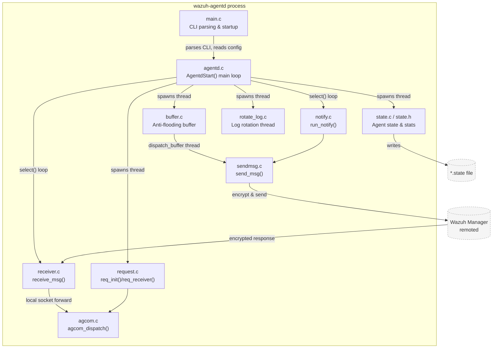
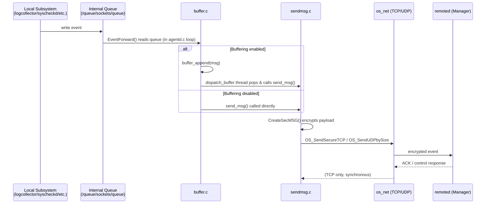

# Client Agent Native Module (`wazuh-agentd`)

## 1. Introduction

The **client_agent_native** module implements **`wazuh-agentd`**, the core native (C) daemon that runs on every Wazuh **agent**. It is the process responsible for:

- Establishing and maintaining the secure, encrypted connection with a Wazuh **manager** (or manager cluster) over TCP/UDP.
- Sending periodic "keep-alive" notifications, agent state, and shared-configuration checksums to the manager.
- Receiving control messages, active-response commands, shared configuration (`merged.mg`) updates, and file transfers from the manager, and dispatching them to local subsystems (execd, syscheck, syscollector, wmodules, etc.).
- Buffering outgoing events with an anti-flooding mechanism to avoid overwhelming the manager or the local network link.
- Forwarding local events read from the agent's internal queue (`/queue/sockets/queue`) to the manager.
- Exposing a local IPC socket (`agent` socket) so that other agent components can query the daemon's configuration/state or issue "remote requests" that are proxied to the manager.
- Persisting/reporting the daemon's operational status (`connected`, `disconnected`, `pending`) and simple counters used by API/CLI tooling.
- Rotating its own internal log files (`ossec.log` / `ossec.json`).

This module is one of several **native daemons** documented under `Agent_&_Manager_Native_Daemons_(C)`. It sits at the heart of the agent-side data path: raw events collected by `logcollector`, `syscheckd`, `rootcheck`, and the `wazuh_modules` are placed on a local queue and ultimately transmitted to the manager through the components implemented here.

## 2. Architecture Overview

`wazuh-agentd` is organized as a small set of cooperating threads sharing a global `agent` configuration/state structure (`agt`). The diagram below summarizes the runtime architecture and the relationship between the source files in this module.

### Key runtime flows

1. **Startup**: `main.c` parses CLI arguments, reads `ossec.conf` (`ClientConf`), validates the manager address, and calls `AgentdStart()` in `agentd.c`.
2. **Connection & keep-alive**: `AgentdStart()` opens the local event queue, forks helper threads, and enters a `select()`-based loop. `notify.c::run_notify()` is called on every loop iteration to send periodic keep-alive messages (agent info, shared-file checksum, labels) once `notify_time` elapses, and to trigger reconnection when the manager is unresponsive or a forced-reconnect interval expires.
3. **Sending events**: Events collected by other agent components arrive at the daemon via the internal message queue. If buffering is enabled (`agt->buffer`), events are queued in `buffer.c` and drained by a dedicated thread that calls `send_msg()` (`sendmsg.c`) with flow-control (EPS limiting) and buffer-state notifications (normal/warning/full/flood). If buffering is disabled, events are sent directly.
4. **Encryption & transport**: `sendmsg.c::send_msg()` encrypts the payload with `CreateSecMSG()` and transmits it via `OS_SendUDPbySize()`/`OS_SendSecureTCP()` from the `os_net` module, depending on the configured protocol.
5. **Receiving from the manager**: `receiver.c::receive_msg()` decrypts incoming manager traffic with `ReadSecMSG()`, and dispatches control headers to the right subsystem: active-response (execd queue), shared configuration file updates, syscheck/syscollector sync headers, SCA dump requests, forced-reconnect signals, and "request" messages.
6. **Remote requests**: `request.c` implements a generic RPC-like mechanism ("remote request") allowing the manager to query local agent subsystems (e.g. `agent getconfig`, `logcollector getstate`) through `agcom.c::agcom_dispatch()` and equivalent dispatchers in other modules, returning the response back to the manager.
7. **State & statistics**: `state.c` maintains connection status and counters (`msg_count`, `msg_sent`, buffered event count) and periodically writes them to a `<agent-name>.state` file; it also serves a JSON snapshot through the local IPC command `getstate`.
8. **Log rotation**: `rotate_log.c` runs a background thread that rotates and compresses `ossec.log`/`ossec.json` daily or when they exceed a configured size, reusing `monitord`'s rotation logic (`w_rotate_log`).
9. **Reload on demand**: `agentd.c::reload_handler()` reacts to `SIGUSR1` to hot-reload the buffer configuration (`CBUFFER` section of `ossec.conf`/`agent.conf`) without restarting the whole daemon.

## 3. Sub-modules

This module is organized into the following functional sub-modules. Each is documented in its own file:

| Sub-module | Description | Documentation |
|---|---|---|
| **Lifecycle & Startup** | CLI parsing, daemon bootstrap, main event loop, hot-reload, and uninstall anti-tampering validation | [client_agent_native_lifecycle.md](client_agent_native_lifecycle.md) |
| **Manager Communication** | Encrypted send/receive of events and control messages, keep-alive notifications, reconnection logic | [client_agent_native_communication.md](client_agent_native_communication.md) |
| **Anti-flooding Buffer** | In-memory circular buffer that decouples event generation from transmission rate, with dynamic resize | [client_agent_native_buffer.md](client_agent_native_buffer.md) |
| **Agent State & Statistics** | Tracks connection status and message counters; exposes a state file and JSON snapshot | [client_agent_native_state.md](client_agent_native_state.md) |
| **Local & Remote Request Handling** | Local IPC command dispatcher (`agent` socket) and the generic manager→agent "remote request" relay | [client_agent_native_requests.md](client_agent_native_requests.md) |
| **Internal Log Rotation** | Background thread that rotates/compresses the agent's own log files | [client_agent_native_logrotation.md](client_agent_native_logrotation.md) |

## 4. Relationship to Other Modules

`client_agent_native` does not operate in isolation; it depends heavily on shared infrastructure and interacts with the manager-side counterpart:

- **[headers.md](headers.md)** – Shared C headers (`shared.h`, `sec.h`, `os_net.h`, etc.) that define core data structures (`keyentry`, `keystore`, sockets, queues) used throughout this module.
- **[shared_lib.md](shared_lib.md)** – Generic shared utilities (`debug_op`, `file_op`, `mq_op`, `queue_op`, `string_op`, `time_op`, etc.) used for logging, message-queue access, and string handling.
- **[os_net.md](os_net.md)** – Low-level socket/transport primitives (`OS_SendSecureTCP`, `OS_SendUDPbySize`, `OS_ConnectTCP`, etc.) used by `sendmsg.c` and `receiver.c` to talk to the manager.
- **[os_crypto.md](os_crypto.md)** – Encryption/decryption (`CreateSecMSG`, `ReadSecMSG`) and hashing (MD5) primitives used to secure the agent-manager channel and validate shared files.
- **[os_auth.md](os_auth.md)** – Agent enrollment and key management; `agentd.c::AgentdStart()` relies on `OS_ReadKeys()`/`OS_CheckKeys()` (defined via `sec.h`) which are populated during enrollment.
- **[os_execd.md](os_execd.md)** – Receives active-response commands forwarded by `receiver.c` through the `EXECQUEUE` local socket.
- **[remoted.md](remoted.md)** – The manager-side daemon that terminates the connection originated by this module; understanding `remoted`'s protocol (control headers, `HC_*` constants, TCP/UDP framing) is essential to understand `receiver.c`/`sendmsg.c`.
- **[monitord.md](monitord.md)** – Shares the log-rotation implementation (`w_rotate_log`) invoked by this module's `rotate_log.c`.
- **[wazuh_modules_core.md](wazuh_modules_core.md)** and syscheckd/logcollector – Local subsystems whose sockets (`SOCKET_SYSCHECK`, `SOCKET_WMODULES`, `SOCKET_LOGCOLLECTOR`) are referenced by `request.c` when relaying "remote requests" from the manager to these components.
- **[Client_Config.md](Client_Config.md)** – The `agent`/`anti_tampering` configuration structures (`client-config.h`) populated by `ClientConf()` and consumed as the global `agt`/`atc` objects throughout this module.

## 5. Data Flow Diagram: Event Lifecycle

## 6. Configuration & Runtime State

- Configuration is read once at startup (`ClientConf()`), and select sections (buffer, labels, internal options) can be **hot-reloaded** via `SIGUSR1` without restarting the daemon (see `agentd.c::reload_handler`).
- Runtime status is exposed both as a flat **state file** (`<agent-name>.state`) written every `state_interval` seconds, and via the **local socket command** `getstate`, both implemented in `state.c`.
- The daemon can optionally validate an **uninstall request** against the manager API (`--uninstall-auth-token` / `--uninstall-auth-login` CLI options in `main.c`), preventing unauthorized package removal — a defense-in-depth "anti-tampering" feature.

## 7. Further Reading

Refer to the sub-module documents linked in Section 3 for detailed descriptions of each source file's public functions, data structures, and error-handling behavior.
