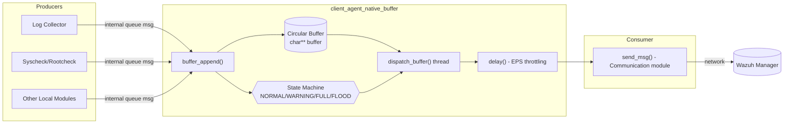
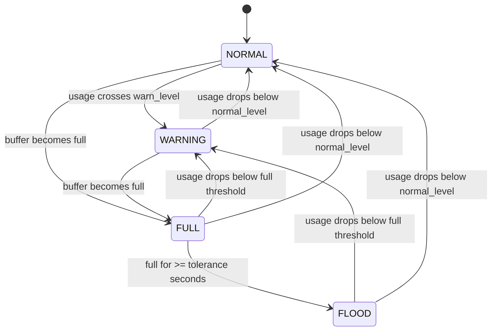
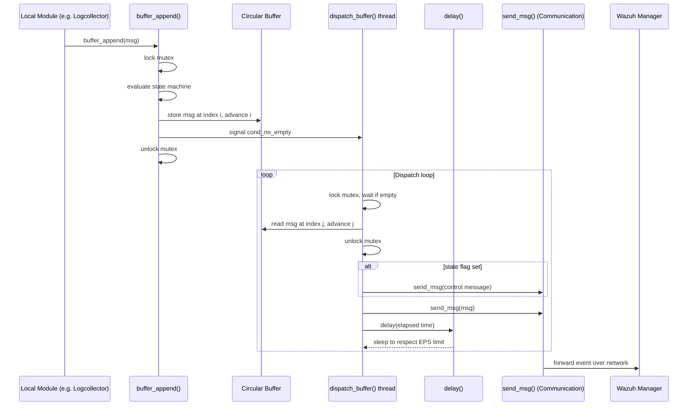
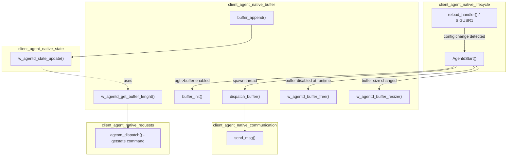
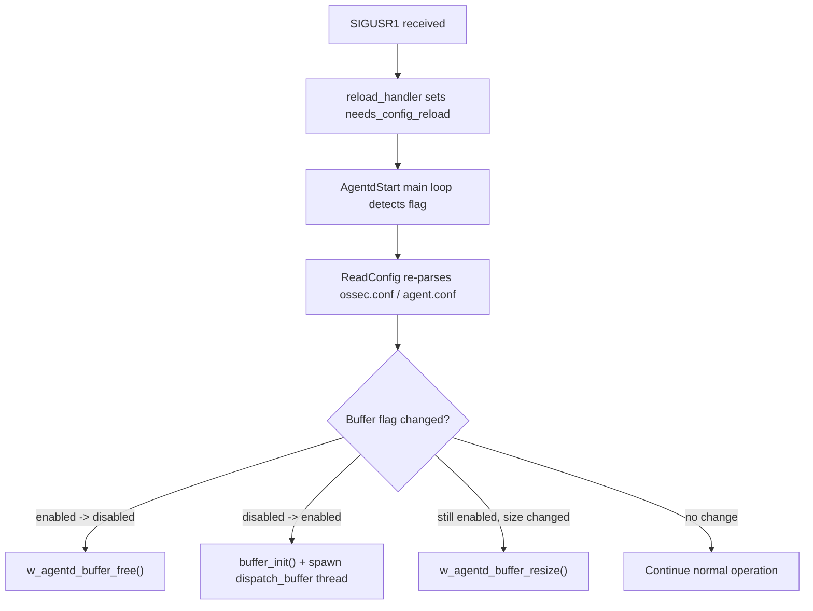

# Client Agent Native Buffer

## Introduction

The **client_agent_native_buffer** module implements the **anti-flooding mechanism** of the Wazuh agent's client daemon (`wazuh-agentd`). It provides an internal, thread-safe, in-memory circular queue that decouples the *producers* of events (log collector, syscheck, rootcheck, and other local modules writing to the agent's internal queue) from the *consumer* — the network sender that forwards events to the Wazuh manager.

Its core responsibility is to protect the agent from overwhelming the manager (or from losing events irrecoverably) when the rate of generated events temporarily exceeds the configured events-per-second (EPS) throughput limit. It does this by:

- Buffering outbound messages in a fixed/resizable circular array.
- Tracking buffer occupancy through a **state machine** (`NORMAL` → `WARNING` → `FULL` → `FLOOD`) and emitting internal notification messages when transitions occur.
- Throttling the dispatch rate according to the `agt->events_persec` (max EPS) configuration.
- Supporting **live resize** of the buffer capacity when the agent configuration is reloaded (`SIGUSR1`) without requiring a full agent restart.

This module is a single-file component (`src/client-agent/buffer.c`) that lives inside the broader `client_agent_native` daemon and is tightly coupled to the daemon's lifecycle and state-reporting subsystems, documented separately:

- Lifecycle / startup: see [client_agent_native_lifecycle](client_agent_native_lifecycle.md) (`agentd.c`, `main.c`)
- Communication (network send/receive): see [client_agent_native_communication](client_agent_native_communication.md) (`sendmsg.c`, `receiver.c`, `notify.c`)
- Agent state reporting: see [client_agent_native_state](client_agent_native_state.md) (`state.c`, `state.h`)
- Local command/config dispatch (AGCOM socket): see [client_agent_native_requests](client_agent_native_requests.md) (`agcom.c`, `request.c`)
- Log rotation: see [client_agent_native_logrotation](client_agent_native_logrotation.md) (`rotate_log.c`)
- Shared primitives (mutexes, queues, config macros): see [Agent_&_Manager_Native_Daemons_(C)](Agent_&_Manager_Native_Daemons_(C).md) and the `shared_lib` children documentation.

## Purpose and Core Functionality

| Capability | Description |
|---|---|
| **Buffer initialization** (`buffer_init`) | Allocates the circular buffer array (`agt->buflength + 1` slots), reads internal tunables (`warn_level`, `normal_level`, `tolerance`), and initializes the mutex/condition variable used for thread synchronization. |
| **Message enqueue** (`buffer_append`) | Called by the internal queue receiver whenever a new local event arrives. Copies the message into the next free buffer slot, updates the state machine, and signals the dispatch thread. Drops the message and returns `-1` if the buffer is full. |
| **Message dispatch** (`dispatch_buffer`) | Runs as a dedicated background thread. Waits on a condition variable until data is available, extracts the oldest message (FIFO), reacts to state-machine transitions (sending internal `full`/`flood`/`warning`/`normal` control messages to the manager), and finally forwards the message via `send_msg()`, applying a rate-limiting `delay()` between sends. |
| **Rate limiting** (`delay`) | Computes the ideal inter-message interval from `agt->events_persec` and sleeps the remaining time not already consumed by the loop iteration, effectively enforcing the configured maximum EPS. |
| **Buffer length introspection** (`w_agentd_get_buffer_lenght`) | Thread-safe helper that computes the number of messages currently queued (used by the state-reporting subsystem, see [client_agent_native_state](client_agent_native_state.md)). |
| **Dynamic resize** (`w_agentd_buffer_resize`) | Reallocates the circular buffer to a new capacity while preserving in-flight messages (handles both contiguous and wrapped/circular data layouts), used when configuration is reloaded via `SIGUSR1`. |
| **Buffer teardown** (`w_agentd_buffer_free`) | Frees all pending messages and the buffer array itself, used when the buffer feature is disabled at runtime via configuration reload. |

## Architecture

The buffer sits between the local queue receiver (which reads from the Unix socket `/queue/sockets/queue`, handled elsewhere in the receiver/communication component) and the outbound network sender (`send_msg`). It is a classic **bounded producer/consumer queue** guarded by a mutex and a condition variable.

### State Machine

The buffer occupancy is monitored through four states. Transitions are evaluated both when a message is appended (`buffer_append`) and when one is dispatched (`dispatch_buffer`).

Each state transition sets a flag (`buff.warn`, `buff.full`, `buff.flood`, `buff.normal`) which is consumed by `dispatch_buffer` to emit an internal control message (via `send_msg`) informing the manager of the buffer status (`OS_WARN_BUFFER`, `OS_FULL_BUFFER`, `OS_FLOOD_BUFFER`, `OS_NORMAL_BUFFER`).

## Data Flow

## Component Interaction

The buffer module does not operate in isolation — it is initialized and managed by the client-agent lifecycle component, reports metrics to the state component, and hands off messages to the communication component.

## Key Data Structures

| Structure / Variable | Purpose |
|---|---|
| `static char ** buffer` | The circular buffer array holding pointers to heap-allocated message strings. Sized `agt->buflength + 1` to distinguish full vs. empty states. |
| `volatile int i`, `volatile int j` | Head (`i`, next write position) and tail (`j`, next read position) indices of the circular buffer. |
| `static volatile int state` | Current state-machine value (`NORMAL`, `WARNING`, `FULL`, `FLOOD`). |
| `struct { unsigned full:1; warn:1; flood:1; normal:1; } buff` | Bitfield flags indicating a pending state-transition notification to be sent to the manager. |
| `pthread_mutex_t mutex_lock` | Protects all shared buffer state (indices, array contents, `state`). |
| `pthread_cond_t cond_no_empty` | Used by `dispatch_buffer` to sleep until a new message is appended (or a shutdown is requested via `agt->buffer` being cleared). |
| `warn_level`, `normal_level`, `tolerance` | Internal configuration options (`agent.warn_level`, `agent.normal_level`, `agent.tolerance`) controlling state-machine thresholds and the flood-detection timeout. |

## Process Flows

### Initialization Flow

1. `AgentdStart()` (in [client_agent_native_lifecycle](client_agent_native_lifecycle.md)) checks `agt->buffer`; if enabled, it calls `buffer_init()`.
2. `buffer_init()` allocates the buffer array and reads internal options (`warn_level`, `normal_level`, `tolerance`).
3. `AgentdStart()` spawns the `dispatch_buffer` thread, which begins waiting for messages.

### Runtime Append/Dispatch Flow

1. A local module writes an event to the agent's internal queue socket; the receiver reads it and calls `buffer_append(msg)`.
2. `buffer_append` locks the mutex, evaluates whether the buffer has become full or crossed the warning threshold, stores the message, signals the condition variable, and unlocks.
3. The `dispatch_buffer` thread wakes up, dequeues the oldest message, evaluates whether the buffer has drained below thresholds, and sends any pending state-transition notifications followed by the actual message via `send_msg()`.
4. `delay()` is applied after each send to respect the configured `events_persec` throughput.

### Runtime Reconfiguration Flow (SIGUSR1)

`w_agentd_buffer_resize()` handles two cases:
- **Growing** the buffer: allocates a larger array and copies existing messages preserving FIFO order (handling both contiguous and wrap-around layouts).
- **Shrinking** the buffer: allocates a smaller array, retains only the oldest messages that fit (discarding overflow), and reports the adjusted message count to the state module via `RESET_MSG_COUNT_ON_SHRINK`.

## Dependencies

| Dependency | Relationship |
|---|---|
| [client_agent_native_lifecycle](client_agent_native_lifecycle.md) | Owns the daemon main loop; initializes, resizes, and frees the buffer in response to startup and configuration-reload events. |
| [client_agent_native_communication](client_agent_native_communication.md) | `dispatch_buffer` calls `send_msg()` to actually transmit buffered messages and internal status notifications to the manager. |
| [client_agent_native_state](client_agent_native_state.md) | `buffer_append` calls `w_agentd_state_update()` to increment message counters; `w_agentd_get_buffer_lenght()` is queried by the state reporting subsystem to expose current buffer occupancy (e.g., via the `getstate` AGCOM command). |
| [client_agent_native_requests](client_agent_native_requests.md) | `agcom_dispatch()`'s `getstate` command surfaces buffer-derived statistics gathered through the state module. |
| `framework_core_communication` (shared queue/socket primitives) | The underlying agent-manager socket transport used by `send_msg`, documented in [Agent_&_Manager_Native_Daemons_(C)](Agent_&_Manager_Native_Daemons_(C).md) `shared_lib` children (`os_net`, `mq_op.c`). |

## Configuration Parameters

These are read from `internal_options.conf` (agent section) during `buffer_init()`:

| Option | Range | Purpose |
|---|---|---|
| `agent.warn_level` | 1–100 | Buffer usage percentage that triggers the `WARNING` state. |
| `agent.normal_level` | 0–(warn_level-1) | Buffer usage percentage below which the state returns to `NORMAL`. |
| `agent.tolerance` | 0–600 seconds | Time the buffer may remain `FULL` before escalating to `FLOOD`. A value of `0` disables the tolerance window (with a warning logged). |

Additionally, `agt->buflength` (buffer capacity) and `agt->events_persec` (max EPS) are read from the main agent configuration (`client-config`, see [Client_Config](Client_Config.md)) and drive buffer sizing and dispatch throttling respectively.

## Summary

The `client_agent_native_buffer` module is a small but critical piece of the Wazuh agent's resilience strategy: it smooths out bursts of local events, prevents unbounded memory growth or network overload, and gives operators visibility into agent health through its state-machine-driven notifications. It is designed for safe concurrent access (single writer thread via `buffer_append`, single reader thread via `dispatch_buffer`) and supports live reconfiguration without requiring an agent restart.
