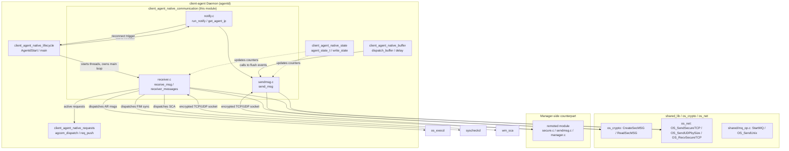
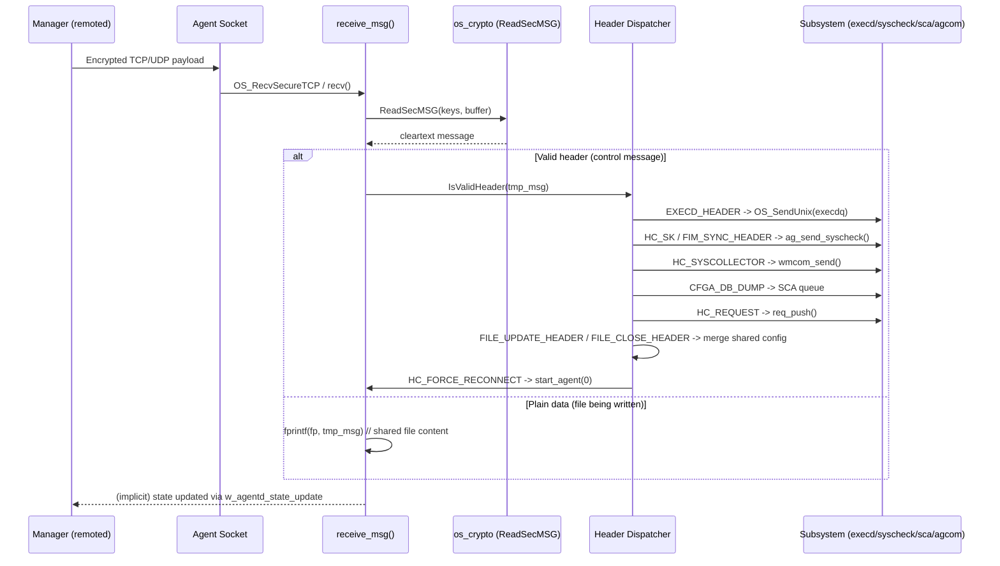
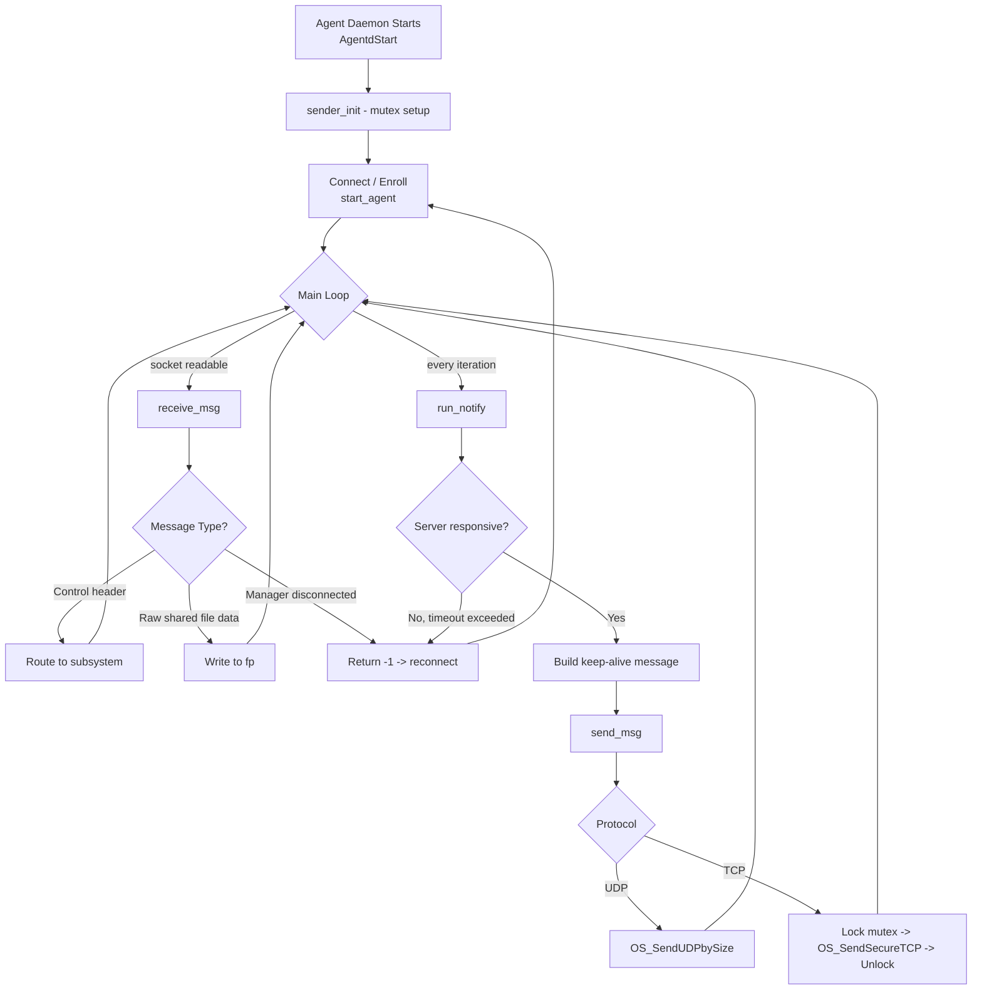

# Client Agent Native Communication

## Introduction

The **client_agent_native_communication** module implements the low-level, secure network communication layer of the Wazuh Agent daemon (`client-agent`, also known as `agentd`). It is responsible for **receiving** encrypted events/commands from the Wazuh Manager, **sending** encrypted events and keep-alive/heartbeat messages back to the Manager, and periodically **notifying** the Manager of the agent's state (system information, shared-configuration checksums, and current IP address).

This module sits at the heart of the agent-manager trust relationship: every byte that crosses the wire between an agent and its manager (outside of the enrollment/authentication handshake performed by `os_auth`) passes through the functions documented here. It is a sibling of other `client_agent_native` sub-modules (lifecycle, buffering, state, requests, and log rotation) and depends heavily on lower-level shared libraries for cryptography, networking, and queueing.

Because this is native C code compiled directly into the `wazuh-agentd` binary, it has no independent process boundary — it operates as a set of functions/threads inside the single agent daemon process.

## Purpose and Core Functionality

The module provides three tightly related responsibilities:

1. **Message Reception (`receiver.c`)** — Reads raw bytes from the agent's TCP/UDP socket to the manager, decrypts them (`ReadSecMSG`), and dispatches them based on message header/prefix to the appropriate internal subsystem (active-response `execd`, syscheck/FIM, syscollector, security configuration assessment (SCA), shared-file merge updates, or generic active requests).
2. **Message Sending (`sendmsg.c`)** — Encrypts (`CreateSecMSG`) and transmits outbound messages (events, keep-alives, command acknowledgements) to the manager over either UDP or TCP, using a mutex to serialize TCP writes from multiple threads.
3. **Periodic Notification (`notify.c`)** — Implements the "keep-alive" heartbeat loop that periodically informs the manager about the agent's OS version (`uname`), shared configuration file checksum, custom labels, and (optionally) the agent's current source IP address. It also detects manager unavailability and triggers agent re-enrollment/reconnection (`start_agent`) when necessary.

## Architecture Overview



## Component Relationships

| Component | File | Responsibility |
|---|---|---|
| `receive_msg` | `receiver.c` | Main receive loop (POSIX): reads from `agt->sock`, decrypts, and routes messages by header prefix. |
| `receiver_messages` | `receiver.c` | Windows-specific receive loop using `select()` with a 1‑second timeout, calling `receive_msg`. |
| `send_msg` | `sendmsg.c` | Encrypts and transmits a buffer to the manager socket (UDP or mutex-protected TCP). |
| `sender_init` | `sendmsg.c` | Initializes the mutex protecting concurrent TCP sends. |
| `run_notify` | `notify.c` | Periodic heartbeat: builds and sends the keep-alive control message; detects/reacts to manager unavailability and forced reconnects. |
| `get_agent_ip` | `notify.c` | Resolves the local IP address bound to the agent's socket (IPv4/IPv6 aware) for inclusion in keep-alives. |
| `getsharedfiles` | `notify.c` | Computes the MD5 checksum of the merged shared configuration file (`merged.mg`) for the keep-alive payload. |
| `clear_merged_hash_cache` | `notify.c` | Invalidates the cached shared-file hash so it is recomputed on the next notification. |

## Data Flow: Receiving a Message from the Manager



## Data Flow: Sending Keep-Alive / Events

```mermaid
sequenceDiagram
    participant Loop as AgentdStart main loop
    participant Notify as run_notify()
    participant Send as send_msg()
    participant Crypto as os_crypto (CreateSecMSG)
    participant Net as os_net (OS_SendSecureTCP/UDP)
    participant Mgr as Manager (remoted)

    Loop->>Notify: called every iteration (rate-limited by agt->notify_time)
    Notify->>Notify: getuname(), labels_format(), getsharedfiles(), get_agent_ip()
    Notify->>Send: send_msg(control_message)
    Send->>Crypto: CreateSecMSG(keys, msg)
    Crypto-->>Send: encrypted buffer
    alt protocol == UDP
        Send->>Net: OS_SendUDPbySize()
    else protocol == TCP
        Send->>Send: lock(send_mutex)
        Send->>Net: OS_SendSecureTCP()
        Send->>Send: unlock(send_mutex)
    end
    Net->>Mgr: encrypted payload
    Send-->>Notify: retval
    Notify->>Notify: w_agentd_state_update(UPDATE_KEEPALIVE)
```

## Message Header Routing Table (receiver.c)

The receiver dispatches decrypted messages based on well-known header prefixes:

| Header / Prefix | Destination | Purpose |
|---|---|---|
| `EXECD_HEADER` | `os_execd` queue (`agt->execdq`) | Active response command execution |
| `HC_FORCE_RECONNECT` | `start_agent(0)` (this module) | Forces the agent to re-run the connection/enrollment handshake |
| `HC_SK` / `FIM_SYNC_HEADER` | `ag_send_syscheck()` (syscheckd) | Syscheck/FIM configuration & sync messages |
| `HC_SYSCOLLECTOR` / `SYSCOLECTOR_SYNC_HEADER` | `wmcom_send()` (syscollector wmodule) | Syscollector sync/config messages |
| `HC_ACK` | ignored (no-op) | Manager acknowledgement |
| `HC_REQUEST` (`IS_REQ`) | `req_push()` (`client_agent_native_requests`) | Active request/response protocol |
| `CFGA_DB_DUMP` | SCA queue (`agt->cfgadq`) / `wm_sca_push_request_win` on Windows | Security Configuration Assessment DB dump request |
| `FILE_UPDATE_HEADER` | Local file write (`fp`) | Beginning of a shared configuration file transfer |
| `FILE_CLOSE_HEADER` | `UnmergeFiles`, `verifyRemoteConf`, `reloadAgent` | Finalizes shared file transfer, validates MD5, triggers config reload |
| *(none matched)* | Warning log | Unknown message received |

## Key Design Points

- **Thread Safety**: `send_msg` uses a dedicated mutex (`send_mutex`, initialized via `sender_init`) to serialize TCP sends, since multiple agent threads (event forwarder, buffer dispatcher, notifier, request responder) may call it concurrently. UDP sends do not require this since `sendto` is typically atomic for datagrams of this size.
- **Protocol Awareness**: Both `send_msg` and `receive_msg` branch on `agt->server[agt->rip_id].protocol` (`IPPROTO_TCP` vs UDP) to select the correct underlying `os_net` primitive (`OS_SendSecureTCP`/`OS_RecvSecureTCP` vs `OS_SendUDPbySize`/`recv`).
- **Cross-Platform Handling**: `receiver.c` provides a Windows-specific event loop (`receiver_messages`) using `select()` with timeouts, since Windows agent daemons run differently from the POSIX `AgentdStart` main loop (see `client_agent_native_lifecycle`). Active-response dispatch also differs (`queue_push_ex` on Windows vs `OS_SendUnix` on POSIX).
- **Directory Traversal Protection**: The `FILE_UPDATE_HEADER` handler explicitly checks incoming shared-file paths with `w_ref_parent_folder()` to reject any path attempting a directory traversal attack before writing to disk.
- **Reconnection & Health Detection**: `run_notify()` monitors `available_server` (last successful ACK timestamp) against `agt->max_time_reconnect_try`; if exceeded, it invokes `start_agent(0)` to force re-enrollment/reconnection. It also supports a configurable `force_reconnect_interval` for periodic proactive reconnects, and reacts to explicit `HC_FORCE_RECONNECT` messages from the manager.
- **Shared Configuration Sync**: The keep-alive payload includes an MD5 checksum of the merged shared configuration (`getsharedfiles`), allowing the manager to detect configuration drift. The hash is cached (`g_shared_mg_file_hash`) and invalidated (`clear_merged_hash_cache`) when the merged file is deleted or updated via `FILE_CLOSE_HEADER` processing.
- **IP Reporting**: `get_agent_ip()` uses `getsockname()` on the active agent socket and supports both IPv4 and IPv6 (`get_ipv4_string`/`get_ipv6_string`), refreshed at the configurable `main_ip_update_interval`.

## Interactions with Other Modules

- **[client_agent_native_lifecycle](client_agent_native_lifecycle.md)**: `AgentdStart()` is the owner of the main select-loop that invokes `receive_msg()` (POSIX) when the agent socket becomes readable, and calls `run_notify()` on every loop iteration. It also performs the initial connection handshake (`start_agent`) referenced by this module for reconnection logic.
- **[client_agent_native_buffer](client_agent_native_buffer.md)**: The event buffering/dispatch thread (`dispatch_buffer`) ultimately calls into `send_msg()` from this module to flush queued events to the manager at a rate controlled by `delay()`.
- **[client_agent_native_state](client_agent_native_state.md)**: Both `receive_msg` and `send_msg` update agent statistics (`w_agentd_state_update`) that are persisted by the state module (`agent_state_t`, `write_state`).
- **[client_agent_native_requests](client_agent_native_requests.md)**: `HC_REQUEST`-prefixed messages received in `receive_msg` are forwarded to `req_push()`, part of the active request/response subsystem that supports remote command/query patterns used by the manager (e.g., cluster/API forwarded requests).
- **[client_agent_native_logrotation](client_agent_native_logrotation.md)**: Indirectly related via the `AgentdStart` daemon lifecycle; log rotation runs in a separate background thread and does not interact directly with the send/receive paths.
- **[framework_core_communication](framework_core_communication.md)**: Analogous concepts (socket wrappers, JSON-based queue communication) exist in the Python framework layer used by the API and cluster daemons, though this module operates purely in C at the native daemon layer for agent–manager traffic.
- **`remoted` module** (part of `Agent_&_Manager_Native_Daemons_(C)`, see `remoted` component group): The server-side counterpart that accepts, decrypts, and processes what this module sends over TCP/UDP secure sockets (`src/remoted/secure.c`, `src/remoted/sendmsg.c`, `src/remoted/manager.c`).
- **`os_crypto`** (`shared_lib` / `os_crypto` component group): Provides `CreateSecMSG`/`ReadSecMSG` used for message encryption/decryption based on the agent's registered keys (`keys` structure, populated via `OS_ReadKeys`).
- **`os_net`**: Supplies the underlying socket I/O primitives (`OS_SendSecureTCP`, `OS_SendUDPbySize`, `OS_RecvSecureTCP`, `get_ipv4_string`, `get_ipv6_string`).
- **`os_execd`**, **`syscheckd`**, **Wazuh Modules Daemon (`wm_sca`, syscollector wmodule)**: Downstream consumers of specific message types routed by `receive_msg`.

## Process Flow: Agent Communication Lifecycle



## Summary

The `client_agent_native_communication` module is the transport and protocol-dispatch core of the Wazuh agent's connection to its manager. It combines secure encryption (via `os_crypto`), transport abstraction (via `os_net`), and message-routing logic to bridge the raw network socket with the rest of the agent's internal subsystems (active response, FIM, syscollector, SCA, and the generic active-request framework). Its correctness and robustness are critical since it directly governs agent availability, reconnection behavior, and the integrity of shared configuration distribution across the Wazuh deployment.
