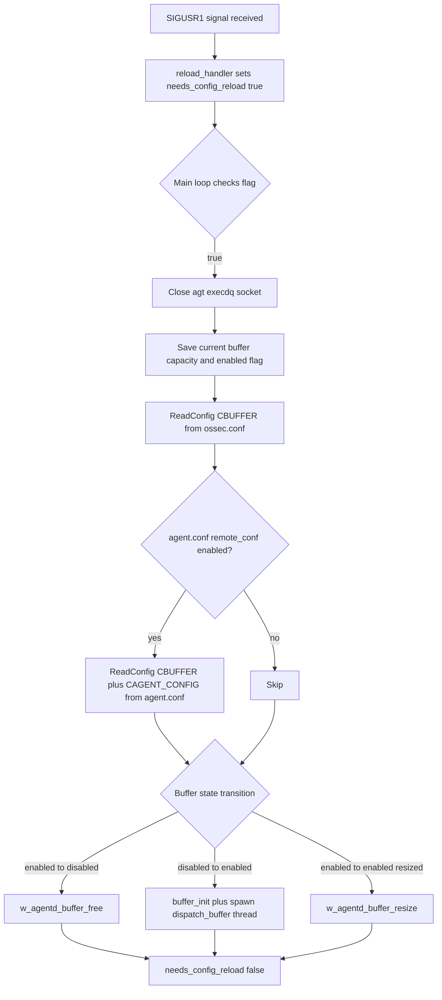
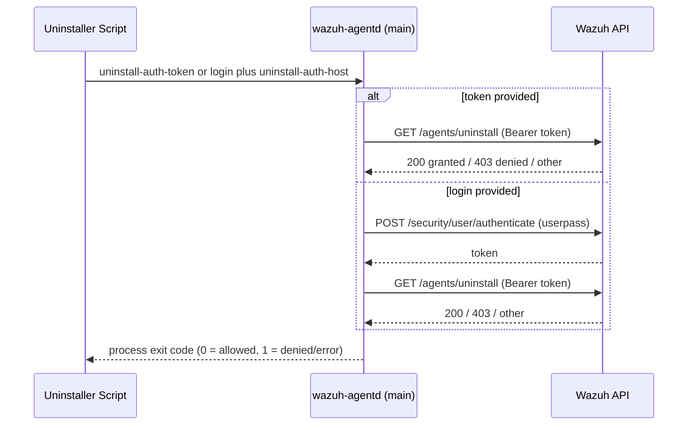

# Client Agent Native Lifecycle

## Introduction

The **`client_agent_native_lifecycle`** module is the entry point and central runtime orchestrator of the Wazuh Agent's native C daemon (`wazuh-agentd`). It is responsible for:

- Parsing command-line arguments and bootstrapping the agent process (`main.c`).
- Validating configuration, privilege separation (user/group), and daemon initialization.
- Running the agent's main event loop (`AgentdStart`), which manages the connection to the manager, dispatches incoming/outgoing events, and coordinates auxiliary threads (buffering, state reporting, log rotation, request handling).
- Handling live configuration reloads triggered via `SIGUSR1`.
- Enforcing anti-tampering/uninstall-protection checks by contacting the Wazuh API before allowing an agent uninstall.

This module sits at the top of the `client_agent_native` component family and acts as the **glue** that wires together the other client-agent sub-modules — communication, buffering, state reporting, request handling, and log rotation — into a single running daemon. It does not implement the low-level networking, buffering, or state logic itself; instead it initializes and supervises the threads/functions provided by sibling modules.

---

## Module Purpose & Core Functionality

| Responsibility | Description |
|---|---|
| **Process bootstrap** | `main()` parses CLI flags (`-f`, `-d`, `-t`, `-u`, `-g`, `-c`, `--uninstall-auth-*`), sets the working directory, loads client configuration (`ClientConf`), validates the manager address/IPv6 link-local interface, and resolves the run-as user/group. |
| **Anti-tampering / uninstall protection** | When `--uninstall-auth-token`/`--uninstall-auth-login` plus `--uninstall-auth-host` are supplied, the daemon contacts the Wazuh API (`/security/user/authenticate`, `/agents/uninstall`) to verify that uninstallation is authorized before exiting the process with a pass/fail code. |
| **Daemon startup** | `AgentdStart()` performs privilege drop, key loading (`OS_ReadKeys`), queue creation (`StartMQ`), PID file creation, and signal handling setup. |
| **Thread orchestration** | Spawns and supervises the following threads: log rotation (`w_rotate_log_thread`), buffer dispatcher (`dispatch_buffer`), state reporter (`state_main`), and the request receiver (`req_receiver`). |
| **Main select() loop** | Waits on the manager socket and the local message queue (`agt->m_queue`) using `select()`, dispatching to `receive_msg()` (communication module) and `EventForward()` (communication module) as data becomes available. |
| **Live reload** | On `SIGUSR1`, sets a flag (`needs_config_reload`) that the main loop uses to safely re-read the buffer-related configuration and adjust the buffer/dispatcher threads without restarting the whole daemon. |

---

## Architecture Overview

```mermaid
graph TB
    subgraph client_agent_native_lifecycle["client_agent_native_lifecycle (this module)"]
        MAIN["main.c::main<br/>CLI parsing & bootstrap"]
        HELP["main.c::help_agentd"]
        START["agentd.c::AgentdStart<br/>daemon init & main loop"]
        RELOAD["agentd.c::reload_handler<br/>SIGUSR1 handler"]
    end

    subgraph siblings["Sibling client-agent modules"]
        COMM["client_agent_native_communication<br/>(receive_msg, EventForward, send_msg)"]
        BUFFER["client_agent_native_buffer<br/>(buffer_init, dispatch_buffer)"]
        STATE["client_agent_native_state<br/>(state_main, w_agentd_state_*)"]
        REQ["client_agent_native_requests<br/>(req_init, req_receiver, agcom_dispatch)"]
        ROTATE["client_agent_native_logrotation<br/>(w_rotate_log_thread)"]
    end

    subgraph external["External Wazuh Systems"]
        CONF["Configuration_Data_Structures_(C_Headers)<br/>client-config.h / ClientConf"]
        SHARED["shared_lib<br/>(privilege sep, keys, queue, sig)"]
        WQUEUE["framework_core_communication_queue /<br/>src/shared/mq_op.c (StartMQ)"]
        API["API_&_Management_Framework<br/>/agents/uninstall, /security/user/authenticate"]
    end

    MAIN --> HELP
    MAIN --> START
    MAIN --> CONF
    MAIN --> API
    START --> RELOAD
    START --> COMM
    START --> BUFFER
    START --> STATE
    START --> REQ
    START --> ROTATE
    START --> SHARED
    START --> WQUEUE
```



---

## Component Relationships

```mermaid
classDiagram
    class main_c {
        +help_agentd(home_path) void
        +main(argc, argv) int
    }
    class agentd_c {
        +bool needs_config_reload
        +reload_handler(signum) void
        +AgentdStart(uid, gid, user, group) void
        +check_uninstall_permission(token, host, ssl_verify) bool
        +authenticate_and_get_token(userpass, host, ssl_verify) char*
        +package_uninstall_validation(...) bool
    }
    class agent_state_t {
        client_agent_native_state
    }
    class ClientConfig {
        Configuration_Data_Structures
        agent
        agent_server
        anti_tampering
    }

    main_c --> agentd_c : invokes AgentdStart()
    main_c --> ClientConfig : ClientConf()
    agentd_c --> agent_state_t : w_agentd_state_init/update
    agentd_c ..> COMM2["client_agent_native_communication"] : receive_msg/EventForward
    agentd_c ..> BUFFER2["client_agent_native_buffer"] : buffer_init/dispatch_buffer
    agentd_c ..> REQ2["client_agent_native_requests"] : req_init/req_receiver
    agentd_c ..> ROTATE2["client_agent_native_logrotation"] : w_rotate_log_thread
```

---

## Startup Sequence (Process Flow)

```mermaid
sequenceDiagram
    participant OS as OS / Init System
    participant Main as main()
    participant Conf as ClientConf()
    participant Agentd as AgentdStart()
    participant Threads as Worker Threads
    participant Loop as select() Main Loop

    OS->>Main: exec wazuh-agentd [flags]
    Main->>Main: parse argv (getopt_long)
    alt uninstall-auth flags present
        Main->>Main: package_uninstall_validation()
        Main-->>OS: exit(pass/fail)
    end
    Main->>Conf: ClientConf(cfg)
    Conf-->>Main: agt struct populated
    Main->>Main: Validate_Address / Validate_IPv6_Link_Local_Interface
    Main->>Main: Privsep_GetUser / Privsep_GetGroup
    alt test_config
        Main-->>OS: exit(0)
    end
    Main->>Agentd: AgentdStart(uid, gid, user, group)
    Agentd->>Agentd: srandom_init(), sender_init()
    Agentd->>Agentd: goDaemon() (unless -f)
    Agentd->>Agentd: Privsep_SetGroup/SetUser
    Agentd->>Agentd: OS_CheckKeys() / OS_ReadKeys()
    Agentd->>Agentd: StartMQ(DEFAULTQUEUE, READ)
    Agentd->>Agentd: CreatePID()
    Agentd->>Agentd: sigaction(SIGUSR1, reload_handler)
    Agentd->>Threads: w_rotate_log_thread (if enabled)
    Agentd->>Threads: dispatch_buffer (if agt->buffer)
    Agentd->>Threads: state_main
    Agentd->>Agentd: start_agent(1) -- connect to manager
    Agentd->>Threads: req_receiver
    Agentd->>Loop: enter infinite select() loop
    loop every iteration
        Loop->>Loop: run_notify()
        Loop->>Loop: select(agt->sock, agt->m_queue)
        alt SIGUSR1 received
            Loop->>Loop: reload buffer config (ReadConfig)
        end
        alt agt->sock readable
            Loop->>Loop: receive_msg()
        end
        alt agt->m_queue readable
            Loop->>Loop: EventForward()
        end
    end
```

---

## Configuration Reload Flow



---

## Anti-Tampering / Uninstall Validation Flow



> This flow directly calls the Wazuh Manager's REST API described in [api_core_infrastructure.md](api_core_infrastructure.md) and the [security_rbac_module.md](security_rbac_module.md) authentication endpoints.

---

## Key Data Structures & Globals

| Symbol | Defined In | Purpose |
|---|---|---|
| `agt` (`agent*`) | `agentd.h` / `client-config.h` (`_agent`) | Global struct holding all agent runtime configuration (servers, buffer settings, notify intervals, sockets). See [Client_Config.md](Client_Config.md). |
| `atc` (`anti_tampering*`) | `client-config.h` (`_anti_tampering`) | Anti-tampering configuration block. |
| `needs_config_reload` | `agentd.c` | Boolean flag toggled by `reload_handler`, consumed by the main loop for safe hot-reload. |
| `keys` | `os_crypto` / `sec.h` (`_keystore`) | In-memory keystore populated by `OS_ReadKeys`, used for secure communication with the manager. |

---

## Dependencies on Other Modules

The lifecycle module coordinates but delegates actual work to several sibling and cross-cutting modules:

- **[client_agent_native_communication](client_agent_native_communication.md)** — `receive_msg()`, `EventForward()`, `send_msg()`, and socket/notify handling used inside the `AgentdStart` main loop.
- **[client_agent_native_buffer](client_agent_native_buffer.md)** — `buffer_init()`, `dispatch_buffer()` thread, and buffer resize/free routines invoked both at startup and during reload.
- **[client_agent_native_state](client_agent_native_state.md)** — `state_main()` thread and `w_agentd_state_init/update` calls for agent status reporting (`GA_STATUS_ACTIVE`/`NACTIVE`).
- **[client_agent_native_requests](client_agent_native_requests.md)** — `req_init()`/`req_receiver()` thread for handling internal command requests (`agcom_dispatch`).
- **[client_agent_native_logrotation](client_agent_native_logrotation.md)** — `w_rotate_log_thread()` for log file rotation, conditionally started based on `monitord.rotate_log` internal option.
- **shared_lib** (`src/shared/*`, part of [Agent_&_Manager_Native_Daemons_(C).md](Agent_%26_Manager_Native_Daemons_(C).md)) — Privilege separation (`Privsep_GetUser/GetGroup/SetUser/SetGroup`), PID file management (`CreatePID`), signal helpers, and `mq_op.c::StartMQ` for queue creation.
- **[Client_Config.md](Client_Config.md)** — `ClientConf()` parsing of `ossec.conf`/`agent.conf`, and the `agent`/`agent_server`/`anti_tampering` structures.
- **os_auth** (part of [Agent_&_Manager_Native_Daemons_(C).md](Agent_%26_Manager_Native_Daemons_(C).md)) — Key management (`OS_CheckKeys`, `OS_ReadKeys`, `OS_PassEmptyKeyfile`) shared with the enrollment/auth daemon.
- **API_&_Management_Framework** — HTTP(S) calls (`wurl_http_request`) to the manager's REST API for uninstall authorization, tying into [api_core_infrastructure_auth_config.md](api_core_infrastructure_auth_config.md) and [security_rbac_module.md](security_rbac_module.md).

---

## Error Handling & Resilience

- All fatal configuration/privilege errors call `merror_exit`/`mlerror_exit`, terminating the process with a clear log message (e.g., invalid manager IP, missing keys, invalid user/group).
- The main loop treats a failed `receive_msg()` as a disconnection: it marks the agent state as `GA_STATUS_NACTIVE`, calls `os_setwait()`, and retries `start_agent(0)` until reconnected, then restores `GA_STATUS_ACTIVE`.
- `select()` retries transparently on `EINTR` and only exits fatally on other errors (`SELECT_ERROR`).
- `SIGPIPE` is ignored so that transient socket write failures do not crash the daemon; failures are instead surfaced through `recv`/`send` return codes.
- `atexit(send_agent_stopped_message)` ensures the manager is notified when the agent process terminates normally.

---

## Summary

`client_agent_native_lifecycle` is the **control plane** of the Wazuh Agent's C daemon: it owns process startup, configuration validation, privilege dropping, thread orchestration, the core `select()`-based event loop, and safe runtime configuration reload. It has minimal business logic of its own — its primary role is to correctly sequence initialization and to remain responsive to OS signals and manager connectivity changes, delegating actual message processing, buffering, state reporting, and request handling to the sibling `client_agent_native_*` modules.
