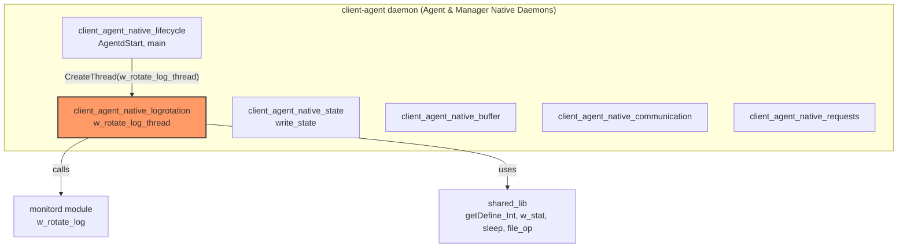
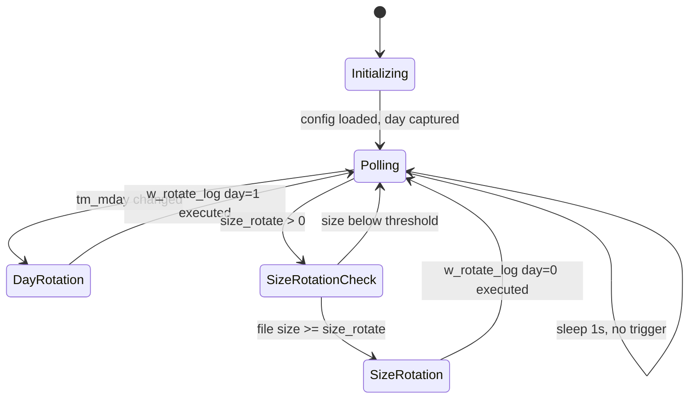
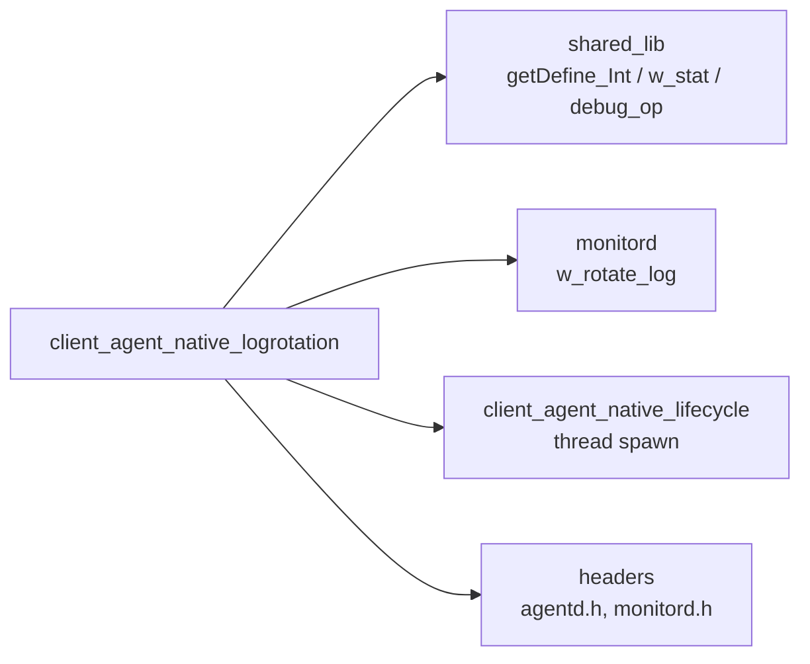
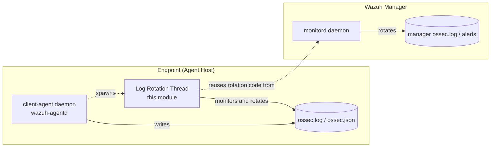

# Client Agent Native — Log Rotation Module

## Introduction

The **Log Rotation** module is a small but critical background subsystem of the Wazuh **agent daemon** (`client-agent`, a.k.a. `wazuh-agentd`). It runs as a dedicated thread that periodically checks the size and age of the agent's own internal log files (`ossec.log` / `ossec.json`) and triggers rotation (and optional compression) when a daily boundary is crossed or when the file exceeds a configured maximum size. This keeps the agent's local log footprint bounded and prevents unbounded disk growth on the endpoint being monitored.

This module is implemented entirely in `src/client-agent/rotate_log.c` and is a sibling of the other `client_agent_native` submodules (lifecycle, communication, buffer, state, requests) that together implement the native C `client-agent` daemon. For the broader daemon context, see [client_agent_native.md](./client_agent_native.md).

## Purpose and Core Functionality

The module's single responsibility is to run `w_rotate_log_thread`, a long-lived background thread started by the agent's main lifecycle logic (see [client_agent_native_lifecycle.md](./client_agent_native_lifecycle.md)). The thread:

1. Reads rotation-related internal options (`monitord.compress`, `monitord.keep_log_days`, `monitord.day_wait`, `monitord.size_rotate`, `monitord.daily_rotations`) via `getDefine_Int`.
2. Tracks the current calendar day (`struct tm`) to detect day-boundary crossings.
3. Periodically (every second) polls the size of `ossec.log` and `ossec.json` using `stat`/`w_stat`.
4. Invokes the shared `w_rotate_log()` routine (implemented in the `monitord` module, see [monitord.md](./monitord.md)) to perform the actual rotation/compression/cleanup work — either:
   - **Daily rotation**: once per day, shortly after midnight (after sleeping `day_wait` seconds to avoid rotating exactly at midnight collisions), or
   - **Size-based rotation**: whenever the current log file size reaches the configured `size_rotate` threshold (converted from MB to bytes).

Because the agent process itself is the one whose logs are being rotated, this logic lives inside `client-agent` rather than being delegated purely to `monitord` (which handles rotation of *manager*-side logs). The module simply reuses `monitord`'s battle-tested rotation implementation as a shared library function.

## Architecture



### Component Relationship within `client_agent_native`

| Sibling Module | Relationship |
|---|---|
| `client_agent_native_lifecycle` | Spawns the log-rotation thread during agent startup (`AgentdStart`). |
| `client_agent_native_state` | Independent thread that also periodically writes agent state; both run concurrently but operate on different files. |
| `client_agent_native_buffer` | Unrelated data-path thread (event buffering); mentioned only because it shares the same daemon process/thread pool. |
| `client_agent_native_communication` | Handles socket I/O with the manager; unrelated to log rotation but shares the same process logging output that this module rotates. |
| `monitord` (top-level module) | Supplies the actual `w_rotate_log()` implementation reused here, avoiding duplicated rotation/compression logic between manager and agent. |

## Data Flow / Process Flow

```mermaid
sequenceDiagram
    participant Main as AgentdStart (lifecycle)
    participant Thread as w_rotate_log_thread
    participant Cfg as Internal Options (getDefine_Int)
    participant FS as Filesystem (ossec.log / ossec.json)
    participant Rot as w_rotate_log (monitord)

    Main->>Thread: CreateThread() at agent startup
    Thread->>Cfg: read compress, keep_log_days, day_wait, size_rotate, daily_rotations
    Thread->>Thread: capture current day (localtime_r)
    loop every 1 second (infinite loop)
        Thread->>Thread: now = time(NULL); localtime_r()
        alt day has changed
            Thread->>Thread: sleep(day_wait)
            Thread->>Rot: w_rotate_log(compress, keep_log_days, is_day_rotation=1, is_json=0, daily_rotations)
            Thread->>Thread: update today
        end
        alt size_rotate > 0
            Thread->>FS: w_stat(ossec.log)
            FS-->>Thread: file size
            opt size >= size_rotate
                Thread->>Rot: w_rotate_log(day=0, json=0)
            end
            Thread->>FS: w_stat(ossec.json)
            FS-->>Thread: file size
            opt size >= size_rotate
                Thread->>Rot: w_rotate_log(day=0, json=1)
            end
        else size_rotate == 0
            Thread->>Thread: mdebug1 disabled rotation message
        end
        Thread->>Thread: sleep(1)
    end
```

## State / Trigger Diagram



## Key Component Details

### `w_rotate_log_thread` (thread entry point)
- **Platform variants**: Compiled as a `DWORD WINAPI` function on Windows and a POSIX `void *` thread function elsewhere, both scheduled via the shared threading abstraction used across the native daemons.
- **Configuration source**: All tunables (`compress`, `keep_log_days`, `day_wait`, `size_rotate`, `daily_rotations`) come from the `monitord` section of `internal_options.conf`, even though this thread executes inside the agent (`client-agent`) process — reflecting historical code sharing between agent and manager log-rotation logic.
- **Global state variables**: `log_compress`, `keep_log_days`, `day_wait`, `daily_rotations`, `size_rotate_read` are declared at file scope (not `static`), making them accessible/patchable from other translation units and from unit tests via linkage.
- **Paths**: `LOGFILE` and `LOGJSONFILE` macros (defined in shared headers) resolve to the agent's own log paths, identical on Windows and Unix builds in this file (the `#ifdef WIN32` branches are present but functionally identical here).

### Local Data Types
| Component | Description |
|---|---|
| `stat` (via `struct stat buf`) | Used to query file size (`st_size`) for both the plaintext and JSON log files. |
| `tm` (`struct tm tm = { .tm_sec = 0 }`) | Holds the decoded current time, used solely to detect a change in `tm_mday` (day-of-month) as the daily-rotation trigger. |

## Dependencies



- **`shared_lib`**: provides `getDefine_Int` for reading internal configuration limits, `w_stat` for cross-platform `stat()` semantics, and debug logging macros (`mdebug1`). See [shared_lib.md](./shared_lib.md).
- **`monitord`**: provides the actual `w_rotate_log()` implementation which performs file renaming, compression (via bzip2/zlib wrappers), and deletion of logs older than `keep_log_days`. This module treats `monitord`'s rotation function as an external, reusable service. See [monitord.md](./monitord.md).
- **`client_agent_native_lifecycle`**: responsible for creating this thread as part of `AgentdStart()`. See [client_agent_native_lifecycle.md](./client_agent_native_lifecycle.md).
- **Headers**: `shared.h`, `agentd.h`, and `monitord/monitord.h` (for the `monitor_config`-related type definitions and rotation function prototypes).

## How It Fits Into the Overall System



This module is a small but essential piece of the **Agent & Manager Native Daemons (C)** codebase (parent module: [client_agent_native.md](./client_agent_native.md)). It ensures that:

- The agent daemon remains self-sufficient in managing its own disk usage, without needing intervention from `monitord` (which only manages logs on the manager side).
- Log growth is bounded regardless of agent uptime, which is particularly important on resource-constrained or long-lived endpoints.
- Rotation behavior (compression, retention days, size threshold, daily rotation count) is centrally configurable through the same `internal_options.conf` keys used by `monitord`, ensuring consistent operator experience across agent and manager.

## Related Documentation

- [client_agent_native.md](./client_agent_native.md) — Parent module: overview of the full `client-agent` native daemon.
- [client_agent_native_lifecycle.md](./client_agent_native_lifecycle.md) — Daemon startup/shutdown logic that spawns this rotation thread.
- [client_agent_native_state.md](./client_agent_native_state.md) — Sibling thread responsible for periodic agent state file writes.
- [client_agent_native_communication.md](./client_agent_native_communication.md) — Handles the socket communication whose activity is reflected in the logs this module rotates.
- [client_agent_native_buffer.md](./client_agent_native_buffer.md) — Sibling thread handling event buffering within the same daemon.
- [client_agent_native_requests.md](./client_agent_native_requests.md) — Sibling module handling command/request dispatch within the same daemon.
- [monitord.md](./monitord.md) — Owner of the shared `w_rotate_log()` implementation and the manager-side log rotation daemon.
- [shared_lib.md](./shared_lib.md) — Common utility library (`getDefine_Int`, `w_stat`, debug logging) used throughout the native C daemons.
