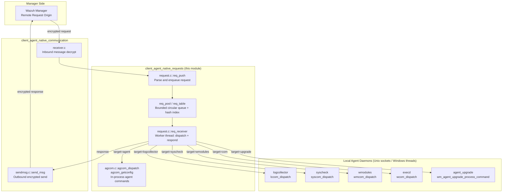
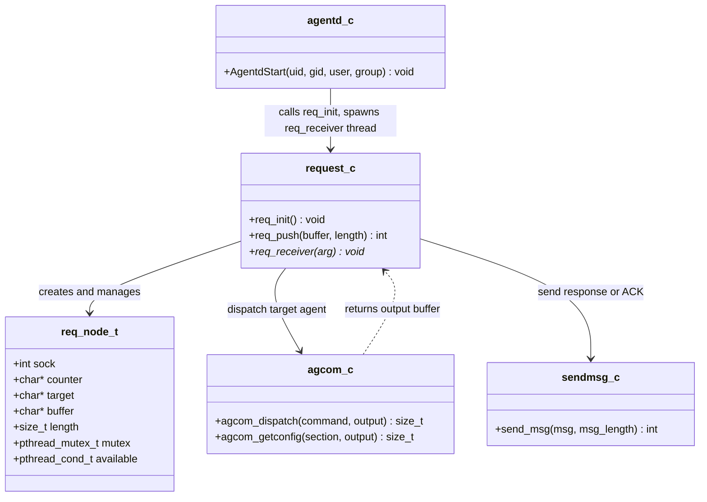
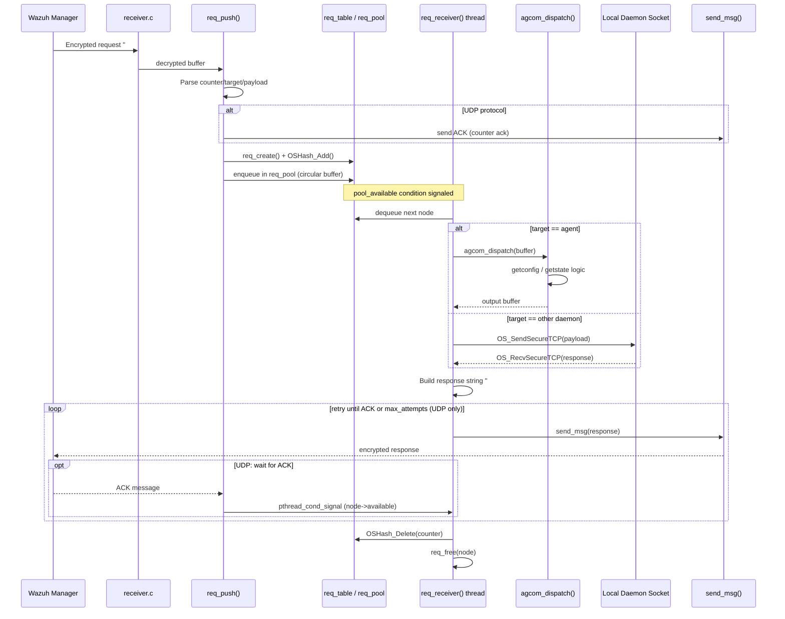
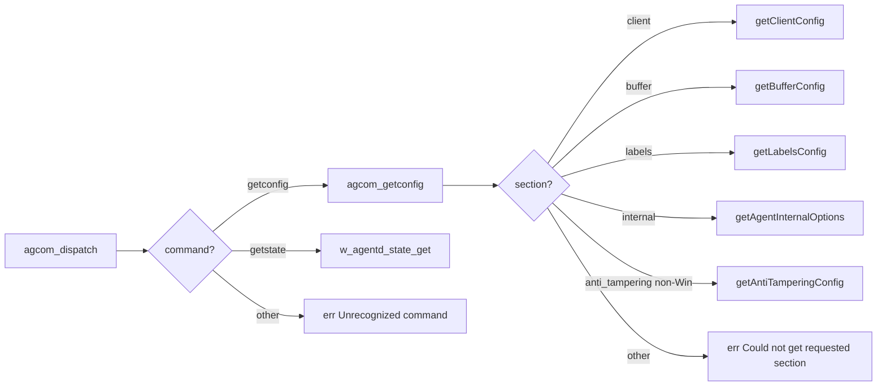
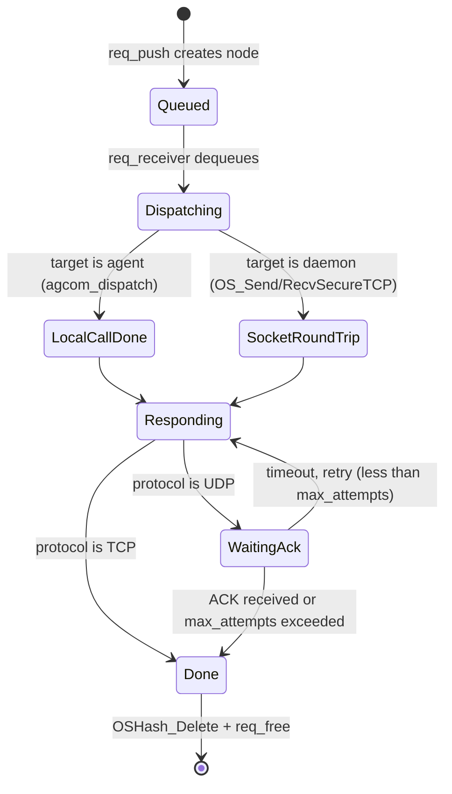

# client_agent_native_requests

## Introduction

The `client_agent_native_requests` module implements the **remote request subsystem** of the Wazuh Agent's `client-agent` (agentd) daemon. It provides a generic, asynchronous request/response mechanism that lets the Wazuh Manager query or command the agent's local components (e.g., `logcollector`, `syscheck`, `wmodules`, `com`/`execd`, and the agent core itself) through the encrypted agent-manager channel, without those local components needing any direct network exposure.

In short, this module is the **bridge between manager-initiated remote requests and the agent's local Unix-domain sockets**. It receives a request forwarded by the manager, routes it to the appropriate local daemon socket (or handles it internally for agent-specific commands), waits for the local response, and relays that response back to the manager — including retry/ACK handling over UDP.

This module is a child of [client_agent_native.md](client_agent_native.md), sitting alongside sibling modules such as `client_agent_native_communication` (message send/receive), `client_agent_native_buffer` (event buffering), `client_agent_native_state` (agent status reporting), and `client_agent_native_lifecycle` (daemon startup/shutdown). For the manager-side counterpart of remote request orchestration, see [cluster_dapi.md](cluster_dapi.md) and [Router.md](Router.md) (`DistributedAPI`/task-forwarding).

## Purpose and Core Functionality

The two core source files in this module are:

| File | Responsibility |
|---|---|
| `src/client-agent/agcom.c` | Implements **agent-local** command dispatch (`agcom_dispatch`) for requests targeted at the agent process itself (e.g., `getconfig`, `getstate`). |
| `src/client-agent/request.c` | Implements the **generic request pipeline**: initialization (`req_init`), inbound message parsing/queuing (`req_push`), and the worker thread that dispatches requests to local sockets and returns responses to the manager (`req_receiver`). |

### Key responsibilities

1. **Request lifecycle management** — Each remote request is identified by a counter, tracked in a hash table (`req_table`) and a bounded circular pool (`req_pool`) sized by the `request_pool` internal option.
2. **Local dispatch routing** — Based on the `target` field of the incoming request (`agent`, `logcollector`, `syscheck`, `wmodules`, `com`, `upgrade`), the request is forwarded either to `agcom_dispatch` (in-process) or to the corresponding local Unix socket via `OS_SendSecureTCP`/`OS_RecvSecureTCP`.
3. **Windows-specific in-process dispatch** — On Windows, since local daemons run as threads within the same process rather than separate daemons with sockets, `req_receiver` calls each subsystem's dispatch function directly (`lccom_dispatch`, `wcom_dispatch`, `syscom_dispatch`, `wmcom_dispatch`, `wm_agent_upgrade_process_command`).
4. **Reliable delivery over UDP** — When the agent-manager protocol is UDP, an ACK/retry scheme is used (`rto_sec`/`rto_msec`/`max_attempts` internal options) to guarantee the response reaches the manager.
5. **Agent self-inspection commands** — `agcom_dispatch`/`agcom_getconfig` expose the agent's own runtime configuration (`client`, `buffer`, `labels`, `internal`, `anti_tampering`) and runtime state (`getstate`) to the manager without needing a socket round-trip.

## Architecture

## Component Relationships

## Data Flow: Handling a Remote Request

The following sequence illustrates a manager-initiated `getconfig` request handled entirely in-process (`agcom`), and a request forwarded to a local daemon socket (e.g., `syscheck`).

## `agcom_dispatch` Command Reference

`agcom_dispatch` handles requests where `target == "agent"`. It parses the command word and routes to a handler:

| Command | Behavior |
|---|---|
| `getconfig <section>` | Delegates to `agcom_getconfig`, returning JSON for `client`, `buffer`, `labels`, `internal`, or (non-Windows) `anti_tampering` configuration sections. |
| `getstate` | Returns the agent's current runtime status via `w_agentd_state_get()` (see [client_agent_native_state.md](client_agent_native_state.md)). |
| *(unrecognized)* | Returns `"err Unrecognized command"`. |

## Concurrency Model

The module uses a producer/consumer pattern:

- **Producer**: `req_push`, invoked from the network-receive path (see [client_agent_native_communication.md](client_agent_native_communication.md)), parses inbound manager messages and enqueues `req_node_t` entries.
- **Bounded queue**: `req_pool` is a fixed-size circular buffer (`request_pool` internal option) guarded by `mutex_pool` and `pool_available` condition variable; `req_table` is an `OSHash`-based lookup keyed by request counter, guarded by `mutex_table`.
- **Consumer**: A single `req_receiver` thread (spawned once from `AgentdStart`, see [client_agent_native_lifecycle.md](client_agent_native_lifecycle.md)) dequeues nodes, performs dispatch (local call or local-socket round trip), and manages the reliable-delivery retry loop back to the manager.
- **Per-node synchronization**: Each `req_node_t` carries its own `mutex`/`available` condition variable so that a late-arriving ACK from the manager (processed inside `req_push`) can wake the specific worker iteration waiting for it, decoupling ACK reception from response transmission.

## Dependencies

- **[client_agent_native_communication.md](client_agent_native_communication.md)** — supplies `send_msg` (used to transmit ACKs and final responses) and the inbound receive path that feeds `req_push`.
- **[client_agent_native_lifecycle.md](client_agent_native_lifecycle.md)** — `AgentdStart` initializes the module (`req_init()`) and spawns the `req_receiver` worker thread as part of agent daemon startup.
- **[client_agent_native_state.md](client_agent_native_state.md)** — `agcom_dispatch`'s `getstate` command surfaces agent state (`w_agentd_state_get`) maintained by this sibling module.
- **[client_agent_native.md](client_agent_native.md)** — parent module; shared header `headers/request_op.h` defines the `req_node_t` structure used by both `agcom.c` and `request.c`, and shared `os_net` (`OS_ConnectUnixDomain`, `OS_SendSecureTCP`, `OS_RecvSecureTCP`) and `OSHash` utilities back the local-socket round trips and request table respectively.
- **Local daemon dispatch entry points** — `lccom_dispatch` (logcollector), `syscom_dispatch` (syscheckd), `wcom_dispatch` (os_execd), `wmcom_dispatch` and `wm_agent_upgrade_process_command` (wazuh_modules / agent_upgrade module, see [agent_upgrade_module.md](agent_upgrade_module.md)) — these are the routing targets on Windows (direct call) or via local sockets on Unix.

## Configuration

Behavior is tuned via internal options read in `req_init()`:

| Option | Range | Purpose |
|---|---|---|
| `remoted.request_pool` | 1–4096 | Size of the circular request queue (`req_pool`). |
| `remoted.request_rto_sec` / `remoted.request_rto_msec` | 0–60 / 0–999 | Retransmission timeout components for UDP ACK waiting. |
| `remoted.max_attempts` | 1–16 | Maximum retransmission attempts before giving up on a response (UDP only). |

## Summary

`client_agent_native_requests` is a small but critical piece of agent infrastructure: it turns the manager's ability to issue ad-hoc commands (fetch config, get state, query FIM/log-collector/module status, trigger upgrades) into a safe, queued, and reliably-delivered local dispatch mechanism, insulating the rest of the agent's daemons from direct network exposure while preserving manager-agent interactive control capabilities.
