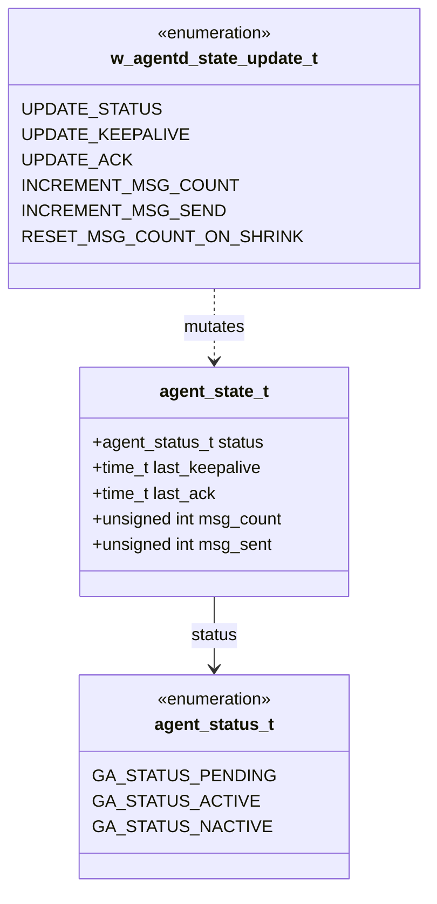
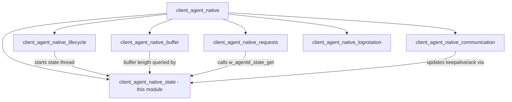
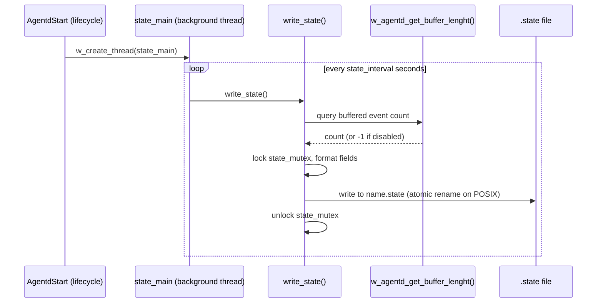
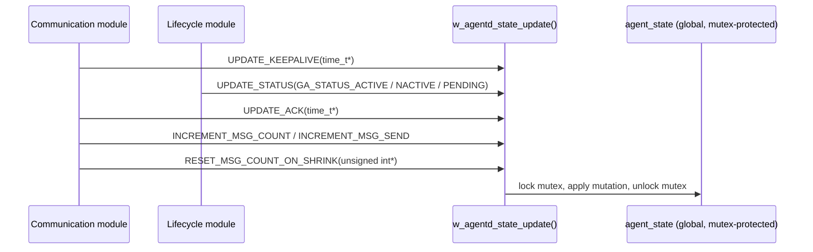
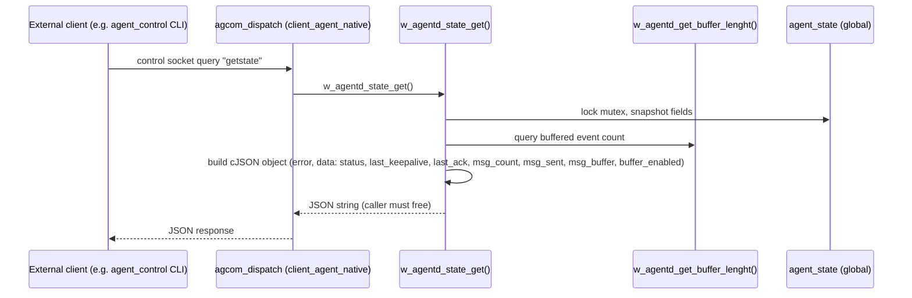
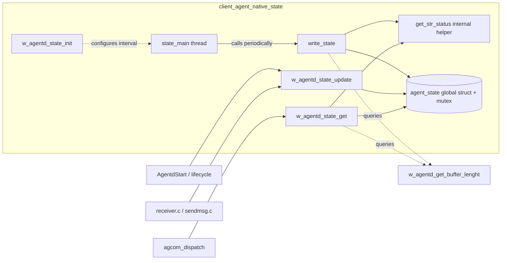

# Client Agent Native State Module

## Introduction

The **client_agent_native_state** module is a small but critical subsystem of the Wazuh Agent (`client-agent`) daemon. It is responsible for tracking, persisting, and exposing the **runtime status of the agent** — including its connection state, keepalive/ack timestamps, and message counters. This information is written periodically to a `.state` file on disk (consumed by monitoring/health-check tooling and the `agent_control` CLI) and is also exposed synchronously in JSON format through the agent's internal query/request interface (`agcom`/`request` handlers).

This module is intentionally minimal in scope: it owns a single global, mutex-protected data structure (`agent_state_t`) and provides a small, thread-safe API for other parts of the agent to update and read that state. It does not perform networking, encryption, or message dispatch itself — it purely aggregates status signals produced by other client-agent components.

## Purpose and Core Functionality

The module has three main responsibilities:

1. **State Storage** – Maintain an in-memory representation (`agent_state_t`) of the agent's current operational status: `pending`, `connected`, or `disconnected`, along with the last keepalive time, last ACK time, and message counters (generated vs. sent).
2. **State Persistence** – Periodically (on a configurable interval, `agent.state_interval`) write a human-readable `.state` file to disk containing the same information, plus the current buffered-event count (queried live from the [client_agent_native_buffer](client_agent_native_buffer.md) module).
3. **State Exposure** – Provide a synchronous, on-demand JSON snapshot of the agent state (`w_agentd_state_get`) for use by other in-process consumers, notably the request-handling logic in [client_agent_native](client_agent_native.md) (`agcom.c`) which serves `getstate` queries over the local control socket.

## Architecture and Component Relationships

### Key Files

| File | Core Components | Responsibility |
|---|---|---|
| `src/client-agent/state.c` | `write_state`, `tm` (local struct usage) | Implements state file writing, the background state-update thread, and the public update/get API |
| `src/client-agent/state.h` | `agent_state_t` | Defines the state data structure, update-type enum, and field name/format constants |

### Data Model



`agent_state_t` is a single global instance (`agent_state`), guarded by a dedicated `pthread_mutex_t` (`state_mutex`). All reads and writes to the structure go through the mutex to ensure thread safety, since the agent is highly multi-threaded (main loop, buffer dispatcher, receiver, request handler, log rotation, etc.).

### Module Position within `client_agent_native`

This module is one of six sibling children under `client_agent_native` (the C implementation of the Wazuh Agent daemon):



- **[client_agent_native_lifecycle](client_agent_native_lifecycle.md)** (`agentd.c`, `main.c`): `AgentdStart` initializes the state subsystem (`w_agentd_state_init()`) and spawns the background thread (`state_main`) that periodically calls `write_state()`. It also calls `w_agentd_state_update(UPDATE_STATUS, ...)` directly when the agent connects/disconnects from the manager.
- **[client_agent_native_buffer](client_agent_native_buffer.md)** (`buffer.c`): The state module queries `w_agentd_get_buffer_lenght()` (owned by the buffer module) both when writing the state file and when building the JSON snapshot, to report the number of currently buffered events.
- **client_agent_native_requests** (`agcom.c`, `request.c`, documented within [client_agent_native](client_agent_native.md)): The `agcom_dispatch` handler responds to `getstate` control-socket queries by calling `w_agentd_state_get()` from this module and returning the resulting JSON payload to the requester (e.g., `agent_control`).
- **[client_agent_native_communication](client_agent_native_communication.md)** (`receiver.c`, `sendmsg.c`, `notify.c`): These components report keepalive sends and ACK receipts, driving `UPDATE_KEEPALIVE` and `UPDATE_ACK` calls into this module.

### Broader System Context

The client-agent daemon as a whole is documented in full at [client_agent_native](client_agent_native.md), part of the wider native-daemons domain covering `wazuh-agentd`, `wazuh-remoted`, `wazuh-authd`, and related processes. State reporting produced here is ultimately surfaced to administrators via CLI tools such as `agent_control`, and, on the manager side, aggregated by agent-summary APIs in the [agent_module](agent_module.md) (e.g., `get_agent_summary_status`).

## Data Flow

### 1. Periodic State File Write



Key implementation details:
- On POSIX systems, the file is written to a temporary path (`<name>.state.temp`) and then atomically `rename()`d over the final path to avoid partial reads by external consumers.
- On Windows, the file is written directly (no atomic rename step).
- The write is skipped (returns error) if `__local_name` (the agent's registered name) is not yet set.
- Timestamps (`last_keepalive`, `last_ack`) are converted from `time_t` to a formatted string (`W_AGENTD_STATE_TIME_FORMAT = "%Y-%m-%d %H:%M:%S"`) using `localtime_r`.

### 2. State Update from Other Components



### 3. On-Demand JSON State Query



## Component Interaction Overview



## API Reference (Public Functions)

| Function | Description |
|---|---|
| `void w_agentd_state_init()` | Initializes the state mutex and reads the `agent.state_interval` configuration option (default range 0–86400 seconds). Must be called once before the state thread starts. |
| `void* / DWORD state_main(void*)` | Thread entry point. If `interval` is 0, the state file feature is disabled and the thread exits immediately. Otherwise loops forever, calling `write_state()` then sleeping for `interval` seconds. |
| `int write_state()` | Formats and writes the current agent state to the `.state` file. Returns `0` on success, `-1` on failure (e.g., file open error, unset agent name). Declared `static` in the implementation (exposed to unit tests via `STATIC` macro override). |
| `void w_agentd_state_update(w_agentd_state_update_t type, void* data)` | Thread-safe mutator for the global `agent_state`. The `type` selects which field(s) to update and how `data` should be interpreted (see enum table below). |
| `char* w_agentd_state_get()` | Builds and returns a heap-allocated JSON string snapshot of the current state. Caller is responsible for freeing the returned pointer. |

### `w_agentd_state_update_t` Enum Semantics

| Value | Expected `data` | Effect |
|---|---|---|
| `UPDATE_STATUS` | `agent_status_t` (cast via pointer value) | Sets `agent_state.status` |
| `UPDATE_KEEPALIVE` | `time_t*` | Sets `agent_state.last_keepalive` |
| `UPDATE_ACK` | `time_t*` | Sets `agent_state.last_ack` |
| `INCREMENT_MSG_COUNT` | ignored | Increments `agent_state.msg_count` |
| `INCREMENT_MSG_SEND` | ignored | Increments `agent_state.msg_sent` |
| `RESET_MSG_COUNT_ON_SHRINK` | `unsigned int*` | Overwrites `agent_state.msg_count` (used when the event buffer is resized/shrunk, to keep counters consistent) |

## State File Format

The `.state` file is a plain-text, shell-variable-style file (similar to other Wazuh state files, e.g. `remoted.state`, `logcollector.state`). Example fields written:

```
status='connected'
last_keepalive='2024-01-01 10:00:00'
last_ack='2024-01-01 10:00:05'
msg_count='120'
msg_sent='118'
msg_buffer='3'
```

This format is designed for easy parsing by shell scripts and by the `agent_control` CLI utility.

## Design Notes

- **Thread Safety**: A single mutex (`state_mutex`) protects the entire `agent_state` structure. All public functions (`write_state`, `w_agentd_state_update`, `w_agentd_state_get`) acquire this lock before touching shared state, and release it before performing I/O (file write) — note that in `write_state()`, the mutex is held for the *entire* file-write operation, including the atomic rename on POSIX, which is a deliberate trade-off favoring consistency over throughput given the low frequency of state writes.
- **Graceful Degradation**: If the state-file feature is disabled (`state_interval == 0`), the background thread logs a message and exits without erroring, allowing the rest of the agent to function normally.
- **Buffer Awareness**: The module has a soft dependency on [client_agent_native_buffer](client_agent_native_buffer.md) via `w_agentd_get_buffer_lenght()`. When the anti-flooding buffer is disabled, this function returns a negative value, which this module maps to an empty/absent `msg_buffer` field (file output) or `buffer_enabled: false` (JSON output).
- **Testability**: The `static` qualifier on internal helpers (e.g., `write_state`, `get_str_status`) is conditionally removed under `WAZUH_UNIT_TESTING` (via the `STATIC` macro), allowing white-box unit testing without exposing these symbols in production builds.

## Related Documentation

- [client_agent_native](client_agent_native.md) — Parent module: the full `wazuh-agentd` daemon, including lifecycle, communication, buffer, requests, and log rotation.
- [client_agent_native_lifecycle](client_agent_native_lifecycle.md) — Owns agent startup/shutdown and drives state initialization and connection-status transitions.
- [client_agent_native_communication](client_agent_native_communication.md) — Source of keepalive/ACK events consumed by this module.
- [client_agent_native_buffer](client_agent_native_buffer.md) — Provides buffered-event counts displayed in both the state file and JSON snapshot.
- [agent_module](agent_module.md) — Manager-side API that aggregates agent status information (e.g., connection/disconnection summaries) originally derived from per-agent state such as that tracked here.
