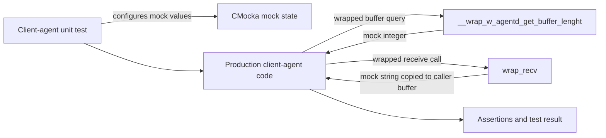
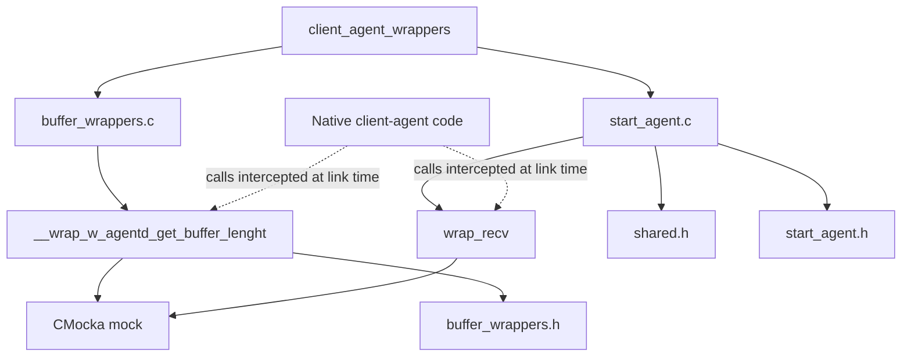
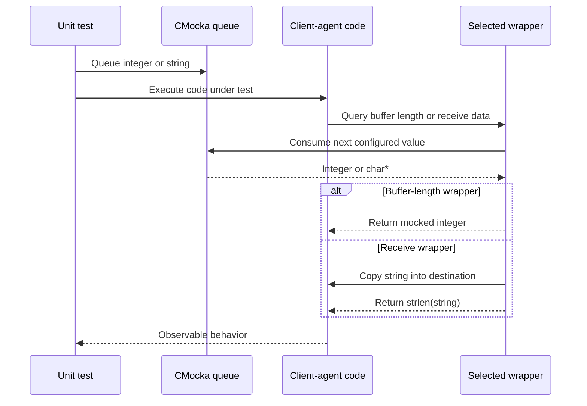
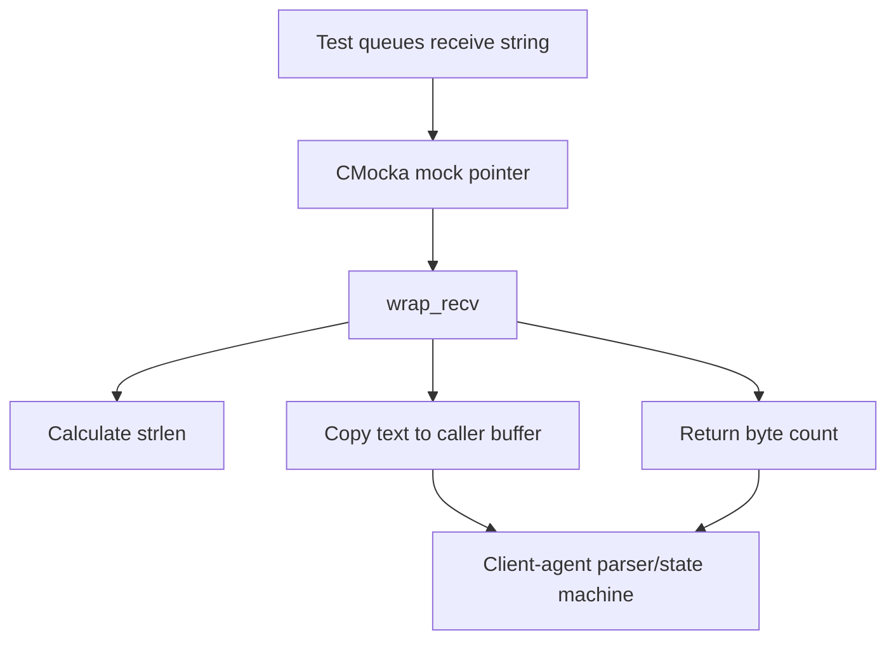
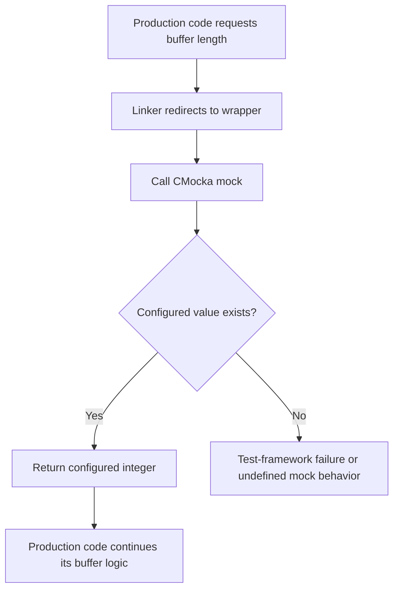
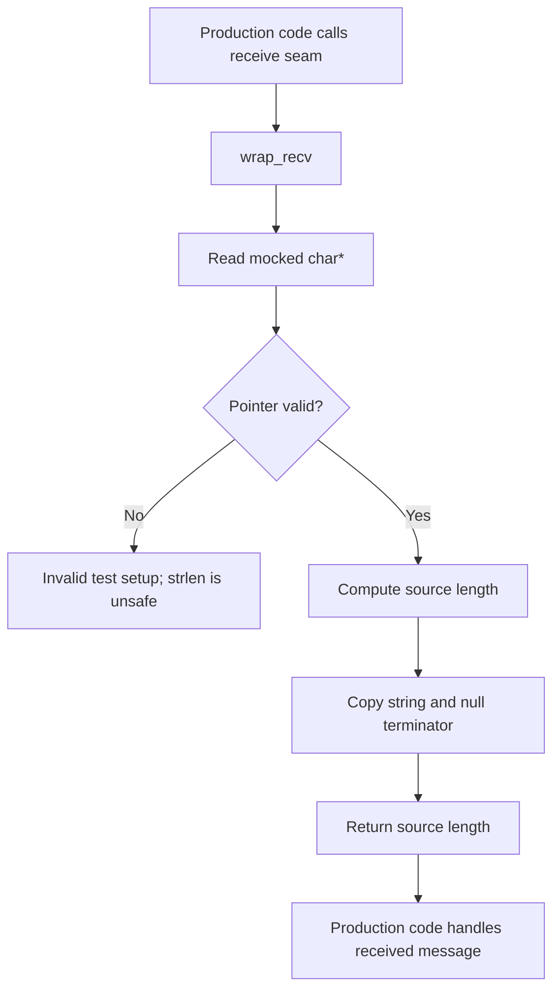
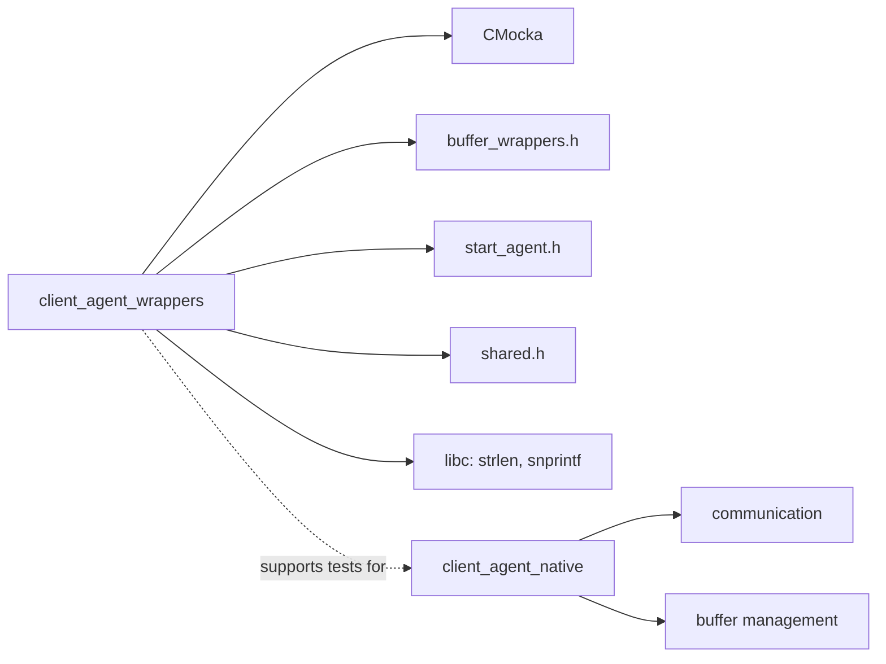

# Client-agent wrappers

## Introduction

`client_agent_wrappers` is a small C test-double module used by Wazuh unit tests. It supplies controllable replacements for two client-agent operations: obtaining the agent buffer length and receiving data from a file descriptor. The wrappers isolate tests from live client-agent buffers and sockets while preserving the production functions' return-value shape.

This is test infrastructure, not part of the running agent. For the production lifecycle, buffering, communication, and state model, see [client_agent_native.md](client_agent_native.md) and [client_agent_native_buffer.md](client_agent_native_buffer.md).

## Purpose and scope

The module contains two wrappers under `src/unit_tests/wrappers/wazuh/client-agent/`:

| Source | Wrapper | Test seam |
| --- | --- | --- |
| `buffer_wrappers.c` | `__wrap_w_agentd_get_buffer_lenght()` | Replaces the client-agent buffer-length query. |
| `start_agent.c` | `wrap_recv(int, void *, size_t, int)` | Replaces `recv()`-style input with a string supplied by the test. |

Both implementations use CMocka's mock queue. Tests configure the next return value with `will_return()` or the equivalent mock setup, then invoke the production code under test.

## Architecture

The wrappers sit between client-agent unit tests and the native client-agent implementation. Link-time wrapping redirects selected calls to this module; unrelated functions continue to use their normal implementations or other test wrappers.



### Component relationships



The header files shown in the diagram are included by the source files but are not represented as separate module-tree components. They provide declarations and test-build integration for the wrappers.

## Components

### `__wrap_w_agentd_get_buffer_lenght`

`__wrap_w_agentd_get_buffer_lenght()` has no parameters and returns `mock()`. The function intentionally delegates all behavior to CMocka, allowing a test to model values such as an empty buffer, available capacity, or an error/sentinel value without allocating a real agent buffer.

The identifier preserves the existing production spelling, `lenght`. It should not be renamed casually: the linker wrapper name and test expectations must match the symbol used by the code under test.

```c
int __wrap_w_agentd_get_buffer_lenght(void) {
    return mock();
}
```

### `wrap_recv`

`wrap_recv` provides deterministic receive data. It obtains a `char *` from CMocka using `mock_ptr_type(char*)`, computes its length, copies the string—including its terminating null byte—into the caller-provided buffer with `snprintf`, and returns the source length.

The descriptor, requested byte count, and flags are marked unused because this test double models content rather than operating-system socket semantics. The wrapper therefore assumes that the test supplies a valid non-null mock string and that the destination buffer is large enough for the copied value.

```c
ssize_t wrap_recv(int fd, void *buf, size_t n, int flags) {
    char *rcv = mock_ptr_type(char *);
    int len = strlen(rcv);
    snprintf(buf, len + 1, "%s", rcv);
    return len;
}
```

## Data flow



For `wrap_recv`, the data path is:



## Process flows

### Buffer-length call



### Receive call



## Dependencies and integration



The module depends on:

- CMocka headers and runtime support (`cmocka.h`) for `mock()` and `mock_ptr_type()`.
- Local wrapper headers for declarations and build conventions.
- Standard C library routines used by `wrap_recv`: `strlen` and `snprintf`.
- The native client-agent code only through intercepted symbols; it does not own or persist production state.

The broader unit-test wrapper collection contains related seams for networking, queues, cryptography, and shared helpers. Those concerns should be documented through their respective module pages rather than duplicated here.

## Test design considerations

### Determinism

Tests control all wrapper outputs. This removes timing, socket availability, and buffer-content variability from tests that exercise client-agent logic.

### Contract boundaries

The wrappers preserve the most relevant contracts:

- The buffer wrapper returns an `int`, matching the queried buffer-length API.
- The receive wrapper returns an `ssize_t` count and writes the received payload to the supplied destination.
- The received count is the source string length, excluding the null terminator, while the destination receives a null-terminated string.

### Safety assumptions

These are intentionally lightweight test doubles. They do not validate `__buf`, `__n`, or the mock pointer, and they do not emulate partial reads, `EAGAIN`, interrupted system calls, truncation, or binary payloads. Tests requiring those behaviors should use a more specialized wrapper or add explicit coverage at the appropriate networking layer.

## Maintenance guidance

When changing the production client-agent API:

1. Check whether the wrapped symbol or signature changed.
2. Update the wrapper declaration and linker configuration together.
3. Preserve the mock value type expected by existing tests.
4. Add tests for changed boundary behavior, especially receive sizes and empty payloads.
5. Keep production behavior documentation in [client_agent_native.md](client_agent_native.md); keep buffer-specific behavior in [client_agent_native_buffer.md](client_agent_native_buffer.md).

## Summary

`client_agent_wrappers` provides two narrow, controllable seams for native client-agent tests. One injects buffer-length results; the other injects text received from a communication endpoint. Together they let unit tests exercise client-agent control flow without depending on real buffers or sockets, while leaving protocol and production implementation details to the native client-agent modules.
