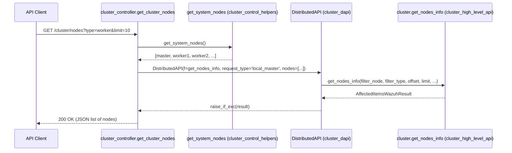
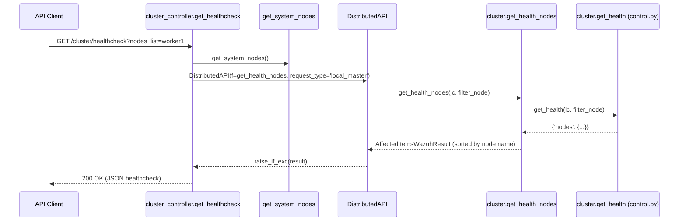
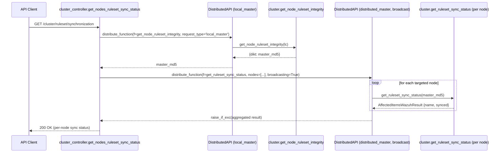
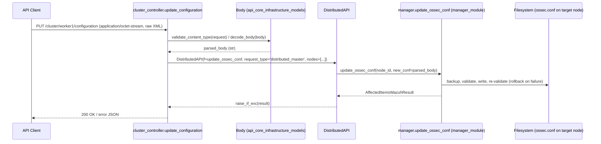
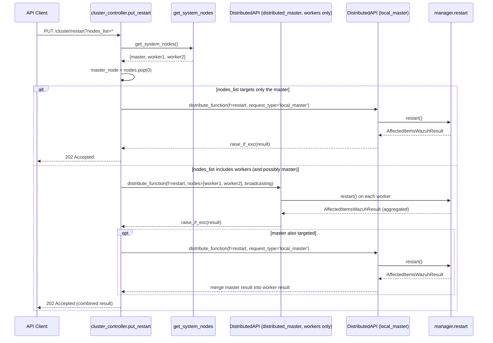

# Cluster API Controller

## 1. Introduction and Purpose

The **Cluster API Controller** module (`api/api/controllers/cluster_controller.py`) is the HTTP-facing entry point
for every `/cluster/*` REST API endpoint in Wazuh. It is the thinnest possible layer between an incoming HTTP
request and the distributed execution engine: it parses/normalizes request parameters, resolves which cluster
nodes are involved, wraps the appropriate framework function in a `DistributedAPI` (DAPI) call, and converts the
result into a `ConnexionResponse`.

Through this module, API clients (the Wazuh dashboard, `wazuh-clusterd` administration tools, or any REST
consumer) can:

- Discover cluster topology (`GET /cluster/nodes`, `GET /cluster/local/info`).
- Check overall cluster health and node connectivity (`GET /cluster/healthcheck`).
- Verify custom ruleset synchronization status across nodes (`GET /cluster/ruleset/synchronization`).
- Read/update a specific node's `ossec.conf` (`GET`/`PUT /cluster/{node_id}/configuration`).
- Read on-demand active configuration for a component on a node (`GET /cluster/{node_id}/configuration/{component}/{configuration}`).
- Retrieve daemon/status/log information for a specific node (`GET /cluster/{node_id}/status`, `/info`, `/logs`,
  `/logs/summary`, `/stats`, `/stats/hourly`, `/stats/weekly`, `/daemons/stats`).
- Trigger a coordinated restart of the whole cluster or a subset of nodes (`PUT /cluster/restart`).
- Validate the Wazuh configuration on one, several, or all nodes (`GET /cluster/configuration/validation`).

Like its single-node counterpart described in [manager_module.md](manager_module.md), this module contains **no
business logic**. Every handler follows the same skeleton: build `f_kwargs`, resolve the participating node list
via `get_system_nodes()`, instantiate a `DistributedAPI`, `await distribute_function()`, and serialize the result.
What makes this module distinct from `manager_module` is that almost every call must first determine **which
node(s)** should execute the request — a single node, a subset, or the entire cluster (broadcast) — and the
underlying framework functions are frequently the *same* ones used by `manager_module`, simply invoked with
`request_type='distributed_master'` instead of `local_any`.

## 2. Architecture

### 2.1 Layered / Component View

```mermaid
graph TB
    subgraph "HTTP Layer"
        Client["API Client / Dashboard / CLI"]
    end

    subgraph "cluster_api_controller"
        Controller["api/api/controllers/cluster_controller.py<br/>async endpoint handlers"]
    end

    subgraph "Cluster Framework (siblings in cluster_module)"
        HighAPI["cluster_high_level_api<br/>wazuh/cluster.py<br/>get_status_json, read_config_wrapper,<br/>get_health_nodes, get_ruleset_sync_status"]
        ControlHelpers["cluster_control_helpers<br/>wazuh/core/cluster/control.py<br/>get_system_nodes, get_health, get_node"]
        DapiMod["cluster_dapi<br/>wazuh/core/cluster/dapi/dapi.py<br/>DistributedAPI"]
    end

    subgraph "Delegated Business Logic (other modules)"
        ManagerFw["manager_module<br/>wazuh/manager.py<br/>get_status, get_basic_info, read_ossec_conf,<br/>update_ossec_conf, get_config, restart, validation"]
        StatsFw["stats_module<br/>wazuh/stats.py<br/>get_daemons_stats, totals, hourly, weekly"]
    end

    subgraph "Shared Infrastructure"
        ReqUtils["api_core_infrastructure_request_utils<br/>parse_api_param, remove_nones_to_dict,<br/>raise_if_exc, deserialize_date, check_component_configuration_pair"]
        Models["api_core_infrastructure_models<br/>Body (request payload validation)"]
        ResultsUtil["framework_core_utils<br/>AffectedItemsWazuhResult, common constants"]
    end

    Client -->|HTTP request| Controller
    Controller --> ControlHelpers
    Controller --> ReqUtils
    Controller --> Models
    Controller -->|f=...| DapiMod
    DapiMod -->|local_any / local_master| HighAPI
    DapiMod -->|distributed_master, nodes=[...]| ManagerFw
    DapiMod -->|distributed_master, nodes=[...]| StatsFw
    Controller --> ResultsUtil
```

### 2.2 Component Responsibilities

| Component | File | Responsibility |
|---|---|---|
| **This module** | `api/api/controllers/cluster_controller.py` | Defines async endpoint handlers wired to the OpenAPI spec for the `/cluster/*` group. Parses query/path/body parameters, resolves the target node list, and dispatches through `DistributedAPI`. |
| [cluster_control_helpers](cluster_control_helpers.md) | `framework/wazuh/core/cluster/control.py` | Provides `get_system_nodes()` — asks the local cluster daemon (via `LocalClient`) for the full list of node names — used by almost every handler in this module to populate the `nodes=` argument of `DistributedAPI`. |
| [cluster_high_level_api](cluster_high_level_api.md) | `framework/wazuh/cluster.py` | Implements node-agnostic, cluster-wide operations that don't need to be distributed to a specific node: `get_status_json` (local cluster status), `read_config_wrapper` (local `cluster.json`), `get_health_nodes` (aggregate healthcheck), `get_ruleset_sync_status` (per-node ruleset MD5 comparison). |
| [cluster_dapi](cluster_dapi.md) | `framework/wazuh/core/cluster/dapi/dapi.py` | The `DistributedAPI` class — the routing/execution engine that decides whether to run a function locally, forward it to the master, or fan it out (broadcast) to multiple nodes/workers, aggregating the responses back into a single result. |
| [manager_module](manager_module.md) | `framework/wazuh/manager.py` | Supplies most of the per-node business functions reused here (`get_status`, `get_basic_info`, `read_ossec_conf`, `update_ossec_conf`, `get_config`, `restart`, `validation`, `ossec_log`, `ossec_log_summary`, `get_api_config`) — the *only* difference vs. `manager_module`'s own controller is the `request_type` (`distributed_master` here, `local_any`/`local_master` there) and the explicit `node_id`/`nodes` targeting. |
| [stats_module](stats_module.md) | `framework/wazuh/stats.py` | Supplies statistic-retrieval functions (`get_daemons_stats`, `totals`, `hourly`, `weekly`, `deprecated_get_daemons_stats`) reused for the per-node stats endpoints. |
| [api_core_infrastructure_request_utils](api_core_infrastructure_request_utils.md) | `api/api/util.py`, `api/api/validator.py` | `parse_api_param` (sort/search DSL parsing), `remove_nones_to_dict`, `raise_if_exc`, `deserialize_date`, `deprecate_endpoint`, and `check_component_configuration_pair` (validates the `component`/`configuration` pair for on-demand config requests). |
| [api_core_infrastructure_models](api_core_infrastructure_models.md) | `api/api/models/base_model_.py` | `Body` class used to validate/decode the raw XML payload sent to `update_configuration`. |
| [framework_core_utils](framework_core_utils.md) | `wazuh/core/common.py`, `wazuh/core/results.py` | Supplies path/name constants (`ANALYSISD_STATS`, `REMOTED_STATS`) for the deprecated per-daemon stats endpoints, and the `AffectedItemsWazuhResult` type used to detect whether a raw-XML or JSON response should be produced in `get_configuration_node`. |

### 2.3 Endpoint Reference

All functions are `async` and return `ConnexionResponse`. They are grouped below by responsibility.

| Function | HTTP Purpose | Delegates to |
|---|---|---|
| `get_cluster_node` | Basic info about the *local* node (name/type). | `cluster.get_node_wrapper` (`local_any`) |
| `get_cluster_nodes` | List/filter all nodes in the cluster (type, search, sort, pagination). | `cluster.get_nodes_info` (`local_master`) |
| `get_healthcheck` | Cluster-wide healthcheck (keepalive, last sync, agent counts). | `cluster.get_health_nodes` (`local_master`) |
| `get_nodes_ruleset_sync_status` | Compare each node's custom-ruleset MD5 against the master's. | `cluster.get_node_ruleset_integrity` (local) + `cluster.get_ruleset_sync_status` (`distributed_master`, broadcast) |
| `get_status` | Cluster enabled/disabled + running state. | `cluster.get_status_json` (`local_master`) |
| `get_config` | Local node's `cluster.json` configuration. | `cluster.read_config_wrapper` (`local_any`) |
| `get_status_node` | Daemon status on a specific node. | `manager.get_status` (`distributed_master`) |
| `get_info_node` | Basic Wazuh info (version, install path) on a specific node. | `manager.get_basic_info` (`distributed_master`) |
| `get_configuration_node` | Read `ossec.conf` (JSON or raw XML) on a specific node. | `manager.read_ossec_conf` (`distributed_master`) |
| `update_configuration` | Replace `ossec.conf` on a specific node (raw XML body). | `manager.update_ossec_conf` (`distributed_master`) |
| `get_node_config` | On-demand active configuration for a component on a node. | `manager.get_config` (`distributed_master`), validated via `check_component_configuration_pair` |
| `get_conf_validation` | Validate configuration on one/many/all nodes. | `manager.validation` (`distributed_master`, optionally broadcast) |
| `put_restart` | Restart the cluster or a subset of nodes (master handled specially). | `manager.restart` (`local_master` for master, `distributed_master` for workers) |
| `get_daemon_stats_node` | Daemon statistics for a list of daemons on a node. | `stats.get_daemons_stats` (`distributed_master`) |
| `get_stats_node` | Daily statistics totals for a node/date. | `stats.totals` (`distributed_master`) |
| `get_stats_hourly_node` | Hourly-average statistics for a node. | `stats.hourly` (`distributed_master`) |
| `get_stats_weekly_node` | Weekly-average statistics for a node. | `stats.weekly` (`distributed_master`) |
| `get_stats_analysisd_node` *(deprecated)* | Legacy `analysisd` stats file. | `stats.deprecated_get_daemons_stats` (`distributed_master`) |
| `get_stats_remoted_node` *(deprecated)* | Legacy `remoted` stats file. | `stats.deprecated_get_daemons_stats` (`distributed_master`) |
| `get_log_node` | Tail/filter `ossec.log` on a node. | `manager.ossec_log` (`distributed_master`) |
| `get_log_summary_node` | Aggregated log counts (per tag/level) on a node. | `manager.ossec_log_summary` (`distributed_master`) |
| `get_api_config` | Active REST API configuration for one/many/all nodes. | `manager.get_api_config` (`distributed_master`, optionally broadcast) |

## 3. Request Flow Diagrams

### 3.1 Listing Cluster Nodes — `GET /cluster/nodes`



### 3.2 Cluster Healthcheck — `GET /cluster/healthcheck`



### 3.3 Ruleset Synchronization Status — `GET /cluster/ruleset/synchronization`

This endpoint performs a **two-phase DAPI call**: first it queries the master node locally for its own ruleset
integrity hash, then it broadcasts a comparison request to the requested nodes.



### 3.4 Node Configuration Update — `PUT /cluster/{node_id}/configuration`



### 3.5 Cluster Restart — `PUT /cluster/restart`

`put_restart` is the most elaborate handler: it deliberately **excludes the master node** from the broadcast call
and issues its restart as a separate, explicit `local_master` request. This avoids a race condition where the
master process could be killed mid-flight while it is still coordinating the distributed restart of the workers.



## 4. Data Model Summary

| Type | Defined in | Used for |
|---|---|---|
| `AffectedItemsWazuhResult` | [framework_core_utils](framework_core_utils.md) (`wazuh.core.results`) | Standard multi-item response wrapper returned by nearly every delegated function (node list, healthcheck, status, config, restart, stats, logs). Also used by `get_configuration_node` to decide between a JSON (`AffectedItemsWazuhResult`) or raw-XML (`ConnexionResponse` with `XML_CONTENT_TYPE`) response. |
| `Body` | [api_core_infrastructure_models](api_core_infrastructure_models.md) | Validates content-type (`application/octet-stream`) and decodes the raw XML payload in `update_configuration`. |
| Node list (`list[str]`) | Produced by `get_system_nodes()` ([cluster_control_helpers](cluster_control_helpers.md)) | Passed as the `nodes=` argument to almost every `DistributedAPI` instantiation in this module, telling the DAPI which nodes are eligible/targeted for the call. |

## 5. Relationship to Other Modules

- **[cluster_control_helpers](cluster_control_helpers.md)** — `get_system_nodes()` is called at the top of nearly
  every handler to resolve the full node list before constructing the `DistributedAPI` call.
- **[cluster_high_level_api](cluster_high_level_api.md)** — Backs the cluster-wide, non-per-node endpoints
  (`get_cluster_node`, `get_cluster_nodes`, `get_healthcheck`, `get_status`, `get_config`, and the ruleset
  sync-status master-side query).
- **[cluster_dapi](cluster_dapi.md)** — Every handler ultimately delegates execution to `DistributedAPI`, which
  implements the actual local/master/distributed/broadcast routing semantics described in that module's
  documentation, including how requests reach [cluster_master](cluster_master.md) and
  [cluster_worker](cluster_worker.md) handlers on remote nodes.
- **[cluster_control_helpers](cluster_control_helpers.md)** and **[cluster_local_client](cluster_local_client.md)**
  — `get_system_nodes()` and the ruleset-integrity master query both use a `LocalClient` to talk to the local
  `wazuh-clusterd` process over its Unix socket.
- **[manager_module](manager_module.md)** — Supplies the majority of per-node business logic
  (`get_status`, `get_basic_info`, `read_ossec_conf`, `update_ossec_conf`, `get_config`, `restart`, `validation`,
  `ossec_log`, `ossec_log_summary`, `get_api_config`). This controller is effectively `manager_controller.py`'s
  sibling: same framework functions, `distributed_master` request type, explicit `node_id`/`nodes` targeting.
- **[stats_module](stats_module.md)** — Supplies `get_daemons_stats`, `totals`, `hourly`, `weekly`, and
  `deprecated_get_daemons_stats`, reused verbatim for the per-node statistics endpoints.
- **[security_rbac_module](security_rbac_module.md)** — Every `DistributedAPI` instantiation forwards
  `request.context['token_info']['rbac_policies']`, established by the authentication middleware described in
  [api_core_infrastructure_auth_config](api_core_infrastructure_auth_config.md); RBAC enforcement itself happens
  inside the delegated framework functions (`@expose_resources`).
- **[api_core_infrastructure_request_utils](api_core_infrastructure_request_utils.md)** — Supplies
  `parse_api_param` (sort/search parsing), `remove_nones_to_dict`, `raise_if_exc`, `deserialize_date`,
  `deprecate_endpoint`, and `check_component_configuration_pair`.
- **[api_core_infrastructure_models](api_core_infrastructure_models.md)** — Supplies `Body`, used to validate and
  decode the raw configuration payload in `update_configuration`.
- **[framework_core_utils](framework_core_utils.md)** — Supplies `common.ANALYSISD_STATS`/`common.REMOTED_STATS`
  path constants (deprecated stats endpoints) and the `AffectedItemsWazuhResult` type.
- **[wazuh_clusterd_daemon](wazuh_clusterd_daemon.md)** and **[cluster_control_cli](cluster_control_cli.md)** —
  Not called directly by this API controller, but they operate on the same cluster state (node registry, health,
  ruleset sync) surfaced here over HTTP; `wazuh-clusterd` is the daemon that actually implements node-to-node
  communication behind `LocalClient`/`DistributedAPI`.

## 6. Notable Design Points

- **Master-aware restart logic**: `put_restart` explicitly separates the master node from the list returned by
  `get_system_nodes()` (`nodes.pop(0)`, since the master is always first) so that the master is restarted via a
  distinct `local_master` call *after* all worker restarts have been dispatched, preventing the coordinating
  process from disappearing mid-broadcast.
- **Two-phase distributed queries**: `get_nodes_ruleset_sync_status` demonstrates a common pattern in this module:
  a first `local_master` call gathers a baseline value (the master's ruleset MD5) which is then passed as an
  argument into a second, `distributed_master`/broadcast call so every node can compare itself against it.
- **Content-negotiated responses**: `get_configuration_node` inspects the *type* of the result returned by the
  DAPI (`AffectedItemsWazuhResult` vs. a raw dict) to decide whether to return `application/json` or
  `application/xml`, enabling both structured (parsed) and raw (file-download-style) access to `ossec.conf`.
- **Dynamic broadcasting flag**: Several handlers (`get_nodes_ruleset_sync_status`, `get_conf_validation`,
  `put_restart`, `get_api_config`) compute `broadcasting=nodes_list == '*'` inline, letting a single controller
  function serve both "one specific node" and "all nodes" semantics without branching business logic.
- **Deprecated compatibility endpoints**: `get_stats_analysisd_node` and `get_stats_remoted_node` are annotated
  with `@deprecate_endpoint()` (from [api_core_infrastructure_request_utils](api_core_infrastructure_request_utils.md))
  and are slated for removal in Wazuh v5.0, but currently remain thin wrappers around the generic
  `stats.deprecated_get_daemons_stats` function shared with [stats_module](stats_module.md).
- **Uniform controller shape**: Aside from `put_restart`, every handler follows the exact same five-step shape —
  build `f_kwargs` → `get_system_nodes()` → construct `DistributedAPI` → `raise_if_exc(await dapi.distribute_function())`
  → `json_response(data, pretty=pretty)` — making the module easy to extend when new `/cluster/*` endpoints are
  added.
