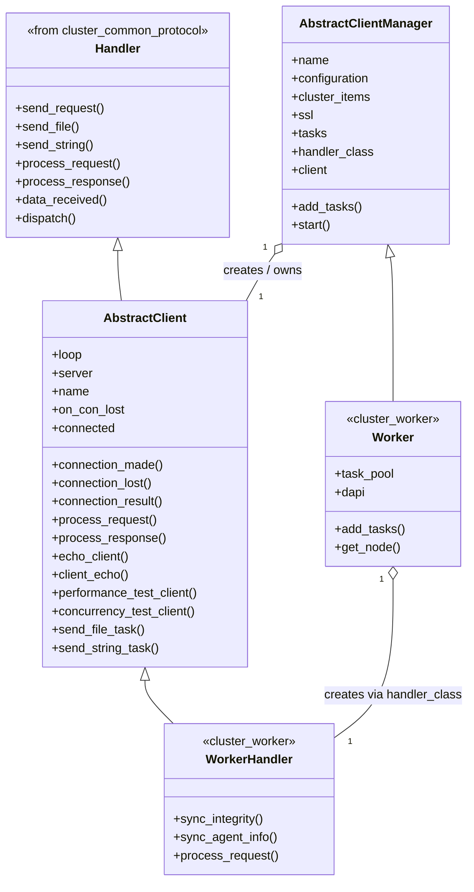
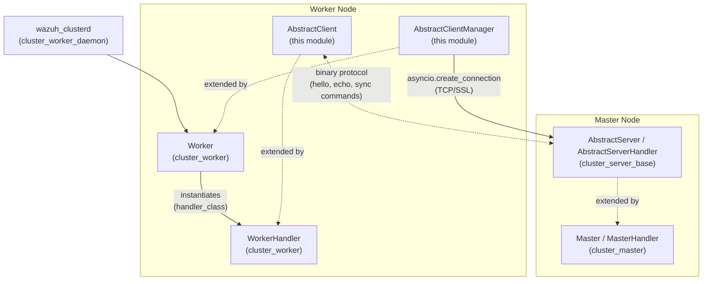
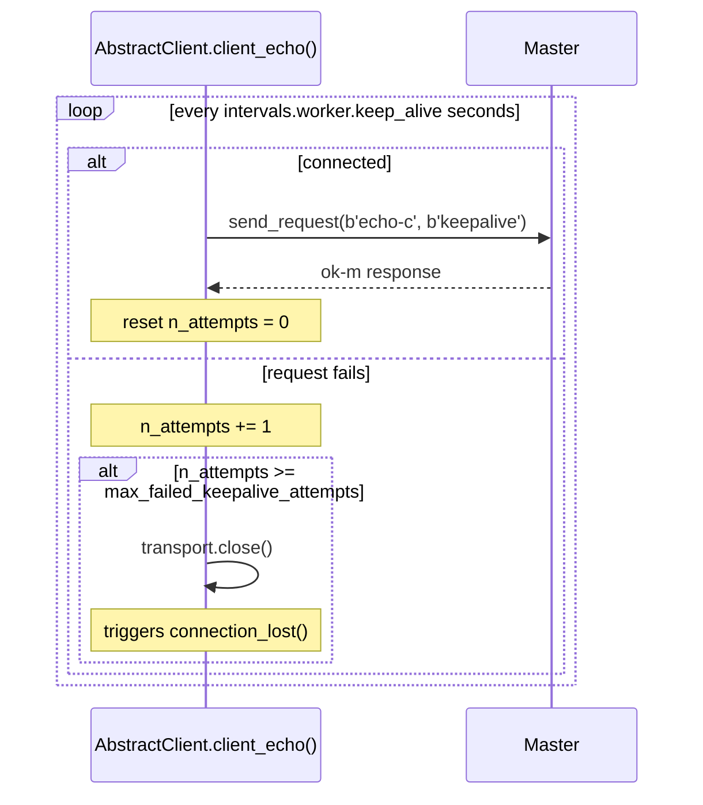
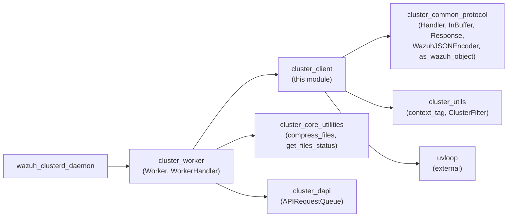
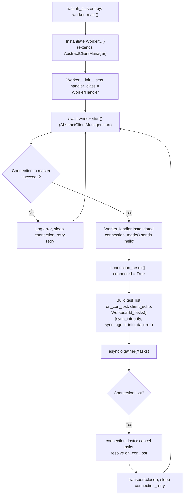

# Cluster Client

## Introduction

The **Cluster Client** module (`framework/wazuh/core/cluster/client.py`) provides the abstract, transport-level foundation used by every Wazuh cluster node that needs to *connect out* to another node acting as a server. In the Wazuh cluster architecture, the **worker node's connection to the master** is the primary consumer of this module: a worker doesn't listen for incoming connections from the master, it actively dials the master and keeps that connection alive for as long as the daemon runs.

This module defines two cooperating abstractions:

- **`AbstractClientManager`** – owns the connection lifecycle: it opens (and, on failure, retries) a TCP/SSL connection to the remote server, instantiates the protocol handler for that connection, and supervises a set of long-running asyncio tasks bound to the connection's lifetime.
- **`AbstractClient`** – an asyncio `Protocol` (subclassing the shared [`Handler`](cluster_common_protocol.md) class) that implements the client side of the Wazuh binary cluster protocol: performing the initial `hello` handshake, sending periodic keep-alives, and reacting to connection loss.

Because both classes are abstract, they contain no cluster-specific business logic (no integrity sync, no agent-info sync, etc.). Instead, they are subclassed by [`cluster_worker`](cluster_worker.md) (`Worker` / `WorkerHandler`) to implement the real worker-to-master synchronization behavior. This module can be seen as the **client half** of the client/server pair defined for the cluster protocol, mirroring [`cluster_server_base`](cluster_server_base.md) (`AbstractServer` / `AbstractServerHandler`) which implements the server half used by the master node.

## Purpose and Core Functionality

| Responsibility | Component | Description |
|---|---|---|
| Connection lifecycle management | `AbstractClientManager` | Opens connection, retries on failure, tracks background tasks, restarts the whole cycle if the connection drops |
| Protocol handshake | `AbstractClient.connection_made` / `connection_result` | Sends a `hello` request identifying the client to the server and validates the response |
| Keep-alive / health check | `AbstractClient.client_echo` | Periodically pings the server; disconnects after too many consecutive failures |
| Graceful/faulty disconnection handling | `AbstractClient.connection_lost` | Cancels pending tasks, closes local-server sub-clients, notifies future waiters |
| Request/response dispatch (client-specific) | `AbstractClient.process_request` / `process_response` | Adds the `echo-m`/`ok-m` commands on top of the generic protocol implemented in `Handler` |
| Development/perf testing helpers | `performance_test_client`, `concurrency_test_client`, `send_file_task`, `send_string_task` | Non-production coroutines used to benchmark the underlying transport (large payloads, many concurrent requests, file transfer, big strings) |

The module does **not** implement any cluster synchronization logic itself (integrity checks, agent info sync, DAPI forwarding). That logic lives in `WorkerHandler` (see [`cluster_worker`](cluster_worker.md)), which extends `AbstractClient`, and in `Worker`, which extends `AbstractClientManager`.

## Architecture

### Class Relationships



### Position in the Wazuh Cluster



The [`wazuh_clusterd_daemon`](wazuh_clusterd_daemon.md) process instantiates a `Worker` object (which extends `AbstractClientManager`) when running in worker mode, and calls `start()` to begin the connect/retry loop implemented in this module.

## Data Flow

### Connection Establishment and Retry Loop

```mermaid
sequenceDiagram
    participant Manager as AbstractClientManager
    participant Loop as asyncio event loop
    participant Client as AbstractClient
    participant Server as Master (AbstractServerHandler)

    Manager->>Manager: start()
    loop until connected
        Manager->>Loop: create_connection(handler_class, host, port, ssl)
        alt Connection refused / OSError
            Loop-->>Manager: exception
            Manager->>Manager: sleep(connection_retry)
        else Connection established
            Loop->>Client: instantiate AbstractClient
            Loop->>Client: connection_made(transport)
            Client->>Server: send_request(b'hello', client_data)
            Server-->>Client: response (ok / error)
            Client->>Client: connection_result() -> connected = True
        end
    end
    Manager->>Manager: tasks = [on_con_lost, client_echo, add_tasks()...]
    Manager->>Loop: asyncio.gather(*tasks)
    Note over Manager,Client: Tasks run concurrently until<br/>on_con_lost future resolves
    Server-->>Client: connection dropped / EOF
    Client->>Client: connection_lost(exc)
    Client->>Client: cancel_all_tasks(), on_con_lost.set_result(True)
    Manager->>Manager: transport.close(), sleep(connection_retry), loop restarts
```

### Keep-Alive Mechanism



## Component Details

### `AbstractClientManager`

Responsible for the outer connect/retry loop and for bootstrapping the per-connection protocol object.

Key attributes (populated from `configuration` and `cluster_items`, both loaded from `cluster.json` / cluster configuration — see [`cluster_utils`](cluster_utils.md)):

- `name`, `configuration`, `cluster_items`, `ssl`
- `performance_test`, `concurrency_test`, `file`, `string`: developer/test-only knobs, normally `0`/`None` in production, wired from CLI arguments passed via [`wazuh_clusterd_daemon`](wazuh_clusterd_daemon.md)
- `handler_class`: defaults to `AbstractClient`; subclasses (e.g. `Worker`) override it with `WorkerHandler` so `asyncio.loop.create_connection` builds the correct protocol
- `extra_args`: extra keyword arguments forwarded to `handler_class` on construction (used by `Worker` to pass `cluster_name`, `version`, `node_type`)

Key methods:

- **`add_tasks()`** — returns the list of coroutines (with their arguments) that should run for the lifetime of the connection. The base implementation only adds development/testing tasks (performance, concurrency, file/string transfer tests); `Worker.add_tasks()` extends this with `sync_integrity`, `sync_agent_info`, and the DAPI request queue runner (see [`cluster_dapi`](cluster_dapi.md)).
- **`start()`** — the main loop:
  1. Sets `uvloop` as the event loop policy and registers a global asyncio exception handler.
  2. Optionally builds an SSL context.
  3. Attempts `loop.create_connection(...)`, retrying on `ConnectionRefusedError`/`OSError` after `intervals.worker.connection_retry` seconds.
  4. Once connected, builds the task list (`on_con_lost` future, `client_echo`, plus `add_tasks()`), runs them all with `asyncio.gather`, and — no matter how they end — closes the transport and restarts the loop.

### `AbstractClient`

Implements the asyncio `Protocol` interface for the client side, built on top of the shared [`Handler`](cluster_common_protocol.md) class, which provides the generic Wazuh cluster wire protocol (message framing, encryption via Fernet, file/string chunked transfer, request/response correlation via a counter-based "box").

Key behaviors:

- **`connection_made(transport)`** — immediately sends a `hello` request containing the client's name (`client_data`) and attaches `connection_result` as the done-callback.
- **`connection_result(future_result)`** — inspects the hello response; sets `self.connected = True` on success or closes the transport on failure/exception.
- **`connection_lost(exc)`** — logs the reason for disconnection, resolves `on_con_lost` if not already resolved, and cancels all pending asyncio tasks as well as any local-server sub-clients (`self.get_manager().local_server.clients`) — see [`cluster_local_server`](cluster_local_server.md) for what those sub-clients represent (local API/CLI connections proxied through the cluster protocol).
- **`process_request` / `process_response`** — extend the generic dispatch defined in `Handler` with the `echo-m` command (used for keep-alives) and its `ok-m` response.
- **`client_echo()`** — the keep-alive coroutine described above; disconnects after `max_failed_keepalive_attempts` consecutive failures.
- **Testing coroutines** (`performance_test_client`, `concurrency_test_client`, `send_file_task`, `send_string_task`) — not used in production flows; they exist to benchmark the underlying `send_request`/`send_file`/`send_string` primitives from `Handler`.

## Dependencies



- **[`cluster_common_protocol`](cluster_common_protocol.md)**: Supplies the `Handler` base class (message framing/encryption/dispatch), `InBuffer`, `Response`, and JSON encode/decode helpers (`WazuhJSONEncoder`, `as_wazuh_object`) used for propagating structured errors between nodes.
- **[`cluster_utils`](cluster_utils.md)**: Provides `context_tag` (used to tag log messages with the current node/task context) referenced indirectly through the `Handler` base and directly set in `AbstractClientManager.__init__`.
- **[`cluster_worker`](cluster_worker.md)**: The primary consumer/extension point — `Worker(AbstractClientManager)` and `WorkerHandler(AbstractClient, WazuhCommon)` implement the actual worker-node behavior (integrity sync, agent-info sync, agent-groups sync, DAPI/response forwarding) using the connection machinery defined here.
- **[`cluster_server_base`](cluster_server_base.md)**: The conceptual counterpart on the master side; together with this module they form the two ends of the Wazuh cluster binary protocol.
- **[`cluster_dapi`](cluster_dapi.md)**: `Worker.add_tasks()` schedules `self.dapi.run()` (an `APIRequestQueue`) as one of the long-running tasks managed by the connection loop from this module.
- **[`wazuh_clusterd_daemon`](wazuh_clusterd_daemon.md)**: The entry point (`framework/scripts/wazuh_clusterd.py`) that decides whether to run as `Master` or `Worker` and calls `Worker.start()` (inherited from `AbstractClientManager`) to begin operating.
- **External library `uvloop`**: Used as the asyncio event loop policy for performance.

## Process Flow: Worker Startup Using This Module



## Key Design Notes

- **Separation of transport and business logic**: By keeping `AbstractClientManager`/`AbstractClient` free of cluster-specific synchronization logic, the same connection/retry/keep-alive machinery could, in principle, support other client roles beyond `Worker`, without modification.
- **Resilience**: The `start()` loop never gives up — connection failures and disconnections are treated as transient and always lead to a retry after a fixed interval (`cluster_items['intervals']['worker']['connection_retry']`), making the worker self-healing with respect to master restarts or network partitions.
- **Task supervision via `asyncio.gather`**: All tasks tied to a connection (built-in `client_echo` plus subclass-provided tasks) are awaited together; if any one of them raises or the connection-lost future resolves, the whole group unwinds and the transport is closed, ensuring no orphaned tasks survive a reconnect cycle.
- **Test/benchmark hooks built into production code path**: `performance_test`, `concurrency_test`, `file`, and `string` constructor arguments allow operators/developers to run wire-protocol benchmarks using the same code path used by real workers, without a separate test harness.
