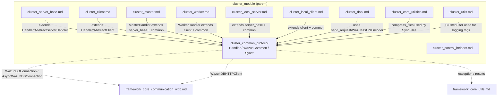
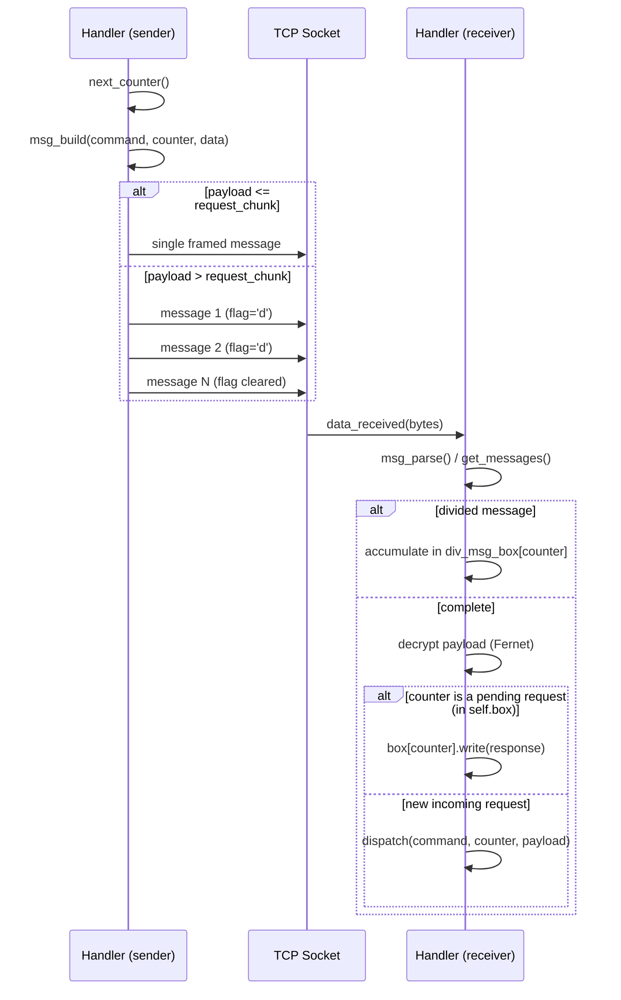
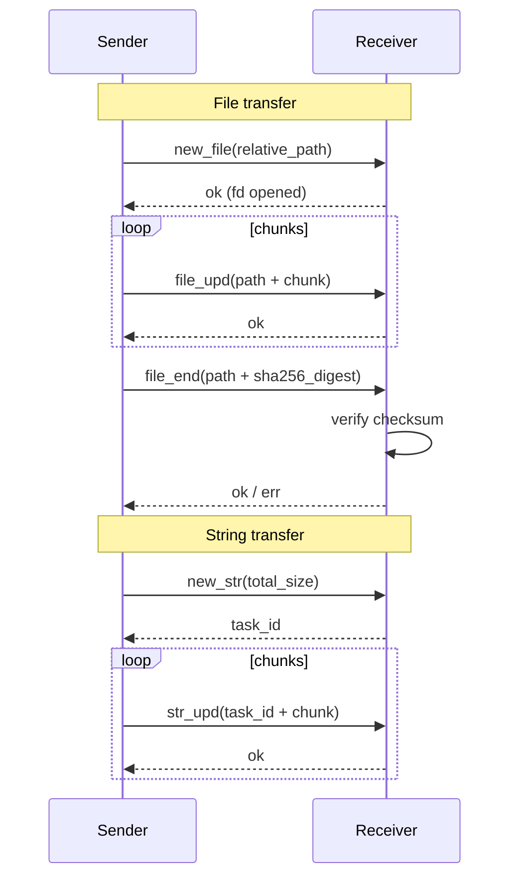
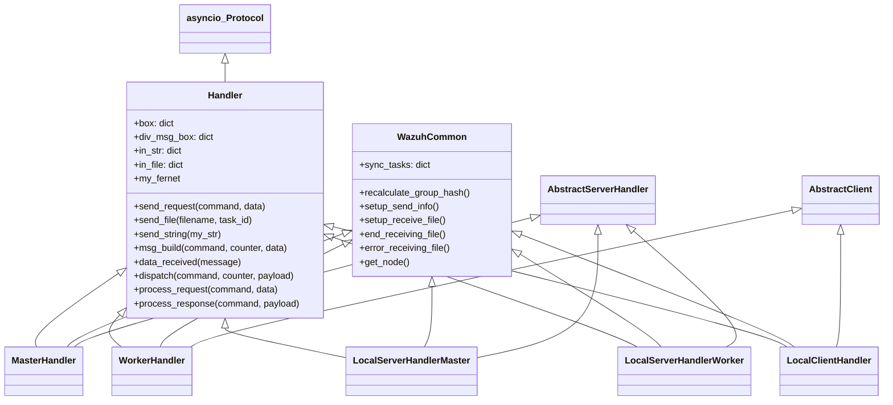
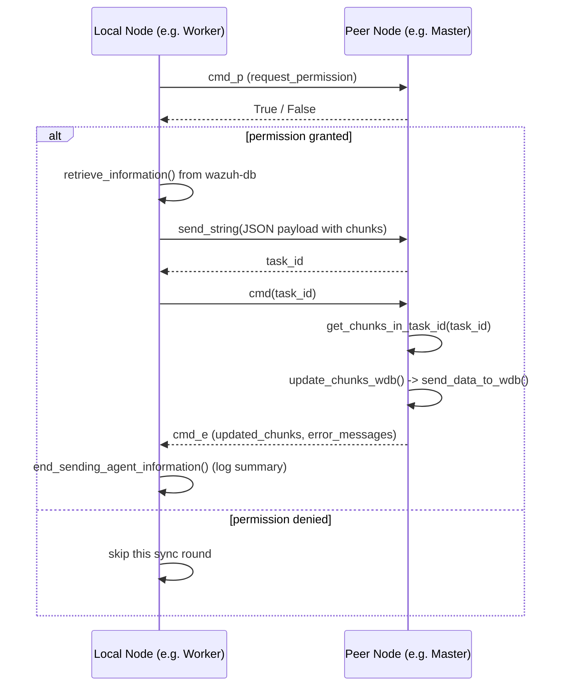
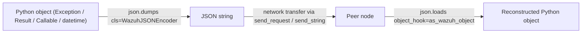
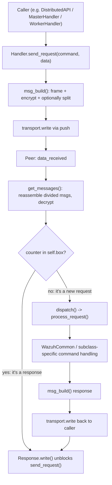

# Cluster Common Protocol

## Introduction

The **Cluster Common Protocol** module (`framework/wazuh/core/cluster/common.py`) is the foundational communication layer shared by every node in a Wazuh cluster. It defines the low-level wire protocol, message framing, encryption, and the base abstractions (`Handler`, `WazuhCommon`) that all cluster actors — the [Master](cluster_master.md), the [Worker](cluster_worker.md), the [Local Server](cluster_local_server.md) and the [Local Client](cluster_local_client.md) — extend to implement their specific synchronization logic.

This module does not implement any cluster role by itself. Instead, it provides:

- A **binary framing protocol** (header + encrypted payload) used over TCP sockets between cluster nodes.
- A **request/response** abstraction (`send_request`/`process_request`) with correlation IDs, so that asynchronous messages can be matched to their replies.
- **Chunked large-payload transfer** primitives for files (`send_file`) and strings (`send_string`), including support for messages larger than a single TCP frame (message "division").
- **Synchronization helpers** (`SyncTask`, `SyncFiles`, `SyncWazuhdb`) used to push files or database chunks to a peer node and track the master/worker handshake.
- **Custom JSON serialization** (`WazuhJSONEncoder` / `as_wazuh_object`) capable of encoding/decoding Wazuh exceptions, results, callables and datetimes so they can travel across the wire and be reconstructed faithfully on the other side.

Because nearly every other cluster component depends on it, this module acts as the shared "protocol library" for the whole [cluster subsystem](cluster_module.md).

## Where This Module Fits



Related documentation:
- [cluster_module.md](cluster_module.md) — top-level cluster module overview.
- [cluster_server_base.md](cluster_server_base.md) — `AbstractServer` / `AbstractServerHandler`, extended by master and local server handlers.
- [cluster_client.md](cluster_client.md) — `AbstractClient` / `AbstractClientManager`, extended by worker and local client.
- [cluster_master.md](cluster_master.md) — `Master` / `MasterHandler`, the server-side role that uses this protocol to sync with workers.
- [cluster_worker.md](cluster_worker.md) — `Worker` / `WorkerHandler`, the client-side role.
- [cluster_local_server.md](cluster_local_server.md) and [cluster_local_client.md](cluster_local_client.md) — intra-node (API ↔ cluster daemon) communication built on the same `Handler`/`WazuhCommon` base.
- [cluster_dapi.md](cluster_dapi.md) — Distributed API, which relies on `send_request`, `WazuhJSONEncoder`/`as_wazuh_object` to forward API calls between nodes.
- [cluster_core_utilities.md](cluster_core_utilities.md) — `compress_files`/`get_files_status`, used by `SyncFiles` to prepare integrity payloads.
- [cluster_utils.md](cluster_utils.md) — `ClusterFilter`, used to tag log records per synchronization task.
- [framework_core_communication_wdb.md](framework_core_communication_wdb.md) — `WazuhDBConnection`, `AsyncWazuhDBConnection`, `WazuhDBHTTPClient` used by `SyncWazuhdb` to read/write agent data.

## Core Components

### 1. Wire-Level Message Framing

| Component | Responsibility |
|---|---|
| `InBuffer` | Accumulates a single incoming message's bytes, parses the header (counter, total size, command, division flag) and appends payload chunks as they arrive. |
| `Handler` | The `asyncio.Protocol` subclass implementing the full framing protocol: message building (`msg_build`), parsing (`msg_parse`/`get_messages`), request/response correlation (`send_request`, `box`), dispatch (`dispatch`, `process_request`), and encryption via `cryptography.fernet`. |

Every message on the wire has the format:

```
+-------------------+-------------------+-----------------------+-----------------------------+
| counter (4 bytes) | length (4 bytes)  | command (12 bytes)    | encrypted payload (N bytes)  |
+-------------------+-------------------+-----------------------+-----------------------------+
```

- `counter`: a numeric ID generated by `next_counter()`; used to correlate requests and responses via `self.box`.
- `command`: a fixed 12-byte, dash-padded command name; the last byte is reserved as a "divided message" flag (`InBuffer.divide_flag`, `b'd'`).
- Payload: encrypted with Fernet symmetric encryption (`my_fernet`) using a shared cluster key, unless `fernet_key` is empty (used in local, same-host connections).

If a payload is larger than `request_chunk` (default 5 MB), `msg_build` automatically splits it into multiple messages sharing the same `counter`, and the receiving `Handler` reassembles them via `div_msg_box` before decrypting.



### 2. Request/Response Correlation

- `Response`: wraps an `asyncio.Event` plus a content buffer. `send_request()` registers a `Response` object under a message counter in `Handler.box`; when the matching reply arrives, `data_received()` calls `Response.write()`, releasing whoever is `await`ing `Response.read()`.
- `send_request(command, data)`: builds/sends the message(s), waits (with a timeout from `cluster_items['intervals']['communication']['timeout_cluster_request']`) for the response, and raises `WazuhClusterError` (3020) on timeout.
- `dispatch(command, counter, payload)`: called for messages that are *not* responses to a pending request; delegates to `process_request()` (implemented per-command in `Handler` and overridden by subclasses like `MasterHandler`/`WorkerHandler`) and sends back the result via `msg_build`.

### 3. Bulk Data Transfer Primitives

| Primitive | Purpose | Key methods |
|---|---|---|
| **File transfer** | Send a full file to a peer, chunked and checksummed. | `Handler.send_file()`, `receive_file()`, `update_file()`, `end_file()` |
| **String transfer** | Send an arbitrarily large string (typically a JSON blob) to a peer using a "reservation" pattern. | `Handler.send_string()`, `receive_str()`, `str_upd()`, `process_error_str()` |
| **Task tracking** | Long-lived asyncio tasks correlated to files/strings being sent or received, so cancellation and cleanup are consistent. | `SendStringTask`, `ReceiveStringTask`, `ReceiveFileTask` |

`send_file()` streams the file in chunks of `request_chunk` bytes, computing a running SHA-256 hash; the receiver validates the hash in `end_file()` before considering the transfer complete. `send_string()` first reserves space on the peer (`new_str` command, returning a `task_id`), then streams the content in `str_upd` messages tagged with that `task_id`.

`SendStringTask`/`ReceiveStringTask`/`ReceiveFileTask` are asyncio task wrappers with `set_up_coro()` deliberately left abstract — concrete coroutines are supplied by [`cluster_master.md`](cluster_master.md) (`ReceiveAgentInfoTask`, `ReceiveIntegrityTask`, `ReceiveExtraValidTask`, `SendEntireAgentGroupsTask`) and [`cluster_worker.md`](cluster_worker.md) (`ReceiveAgentGroupsTask`, `ReceiveEntireAgentGroupsTask`, `ReceiveIntegrityTask`) equivalents.



### 4. Command Dispatch Table (`process_request` / `process_response`)

`Handler.process_request()` defines the baseline commands understood by every node:

| Command | Handler method | Description |
|---|---|---|
| `echo` | `echo()` | Simple connectivity/heartbeat check. |
| `new_file` / `file_upd` / `file_end` | `receive_file()`, `update_file()`, `end_file()` | File reception state machine. |
| `new_str` / `str_upd` / `err_str` | `receive_str()`, `str_upd()`, `process_error_str()` | String reception state machine. |
| `cancel_task` | `cancel_task()` | Peer requests to abort an in-flight sync task; logs the reason and marks the task ID as interrupted. |
| `dapi_err` | `process_dapi_error()` | Forwards a Distributed API error to the correct local client (see [cluster_dapi.md](cluster_dapi.md) and [cluster_local_server.md](cluster_local_server.md)). |
| *(unrecognized)* | `process_unknown_cmd()` | Returns an `err` response. |

`process_response()` handles the generic `ok`/`err` response commands; subclasses in `cluster_master.py`/`cluster_worker.py` extend both tables with domain-specific commands (e.g., `syn_m_a_e`, `syn_w_g_e`).

### 5. `WazuhCommon` — Wazuh-Specific Cross-Cutting Behavior

`WazuhCommon` is a mixin (not an `asyncio.Protocol`) that supplements `Handler` with Wazuh-domain logic shared by all concrete server/client handlers:

- `sync_tasks`: dict mapping task IDs to `ReceiveStringTask`/`ReceiveFileTask` instances currently in flight.
- `recalculate_group_hash()`: static helper invoked before agent-group synchronization to force wazuh-db to recompute agent-group hashes.
- `setup_send_info()` / `setup_receive_file()`: factory helpers that instantiate the correct `SendStringTask`/`ReceiveFileTask` subclass, register it in `sync_tasks`, and return its generated task ID to the peer.
- `end_receiving_file()` / `error_receiving_file()`: complete the file-reception state machine by pointing the corresponding task's `filename` attribute to the final path (or an error payload) and signalling the associated `asyncio.Event`.
- `get_node()`: delegates to `get_manager().get_node()` to answer "who are you" queries.

Concrete subclasses (`MasterHandler`, `WorkerHandler`, `LocalServerHandlerMaster`, `LocalServerHandlerWorker`, `LocalClientHandler`) combine `Handler` + `WazuhCommon` + their respective `Abstract*` base class from [cluster_server_base.md](cluster_server_base.md) / [cluster_client.md](cluster_client.md).



### 6. Synchronization Task Hierarchy

| Class | Purpose |
|---|---|
| `SyncTask` | Base class holding the request command, logger and manager reference; implements `request_permission()` — asks the peer for a `<cmd>_p` grant before starting a sync round. |
| `SyncFiles(SyncTask)` | Compresses a set of files plus a `files_metadata.json` descriptor (via [`compress_files`](cluster_core_utilities.md)) and streams the resulting zip with `Handler.send_file()`. Dynamically tunes `current_zip_limit` up or down based on how close the transfer came to timing out (adaptive throttling). |
| `SyncWazuhdb(SyncTask)` | Pulls chunks of data out of the local `wazuh-db` (via a supplied `data_retriever` callable, `WazuhDBConnection`/`AsyncWazuhDBConnection`, or `WazuhDBHTTPClient`) and pushes them to the peer using `Handler.send_string()`, wrapped in a JSON envelope describing the target command/payload. Also exposes `retrieve_agents_information()` which queries the [`wdb_http`](framework_core_communication_wdb.md) endpoint for agent sync info. |

Helper functions `send_data_to_wdb()`, `end_sending_agent_information()`, `error_receiving_agent_information()` complete the wazuh-db synchronization flow on the receiving side, translating the transferred chunks into `global sync-agent-info-set` / `wdb_client.set_agents_sync()` calls and reporting per-chunk error counts back to the caller.



### 7. Custom JSON Serialization

Because cluster nodes must exchange rich Python objects (exceptions, `AbstractWazuhResult`s, callables referencing bound methods on the `Wazuh` singleton, and `datetime` values), the module provides a symmetric encode/decode pair:

- `WazuhJSONEncoder(json.JSONEncoder)`: serializes:
  - Callables → `{"__callable__": {...}}` including `__name__`, `__module__`, `__qualname__`, and — if bound to a `Wazuh` instance — a nested `__wazuh__` dict from `Wazuh.to_dict()`.
  - `WazuhException` subclasses → `{"__wazuh_exception__": {"__class__": ..., "__object__": ...}}`.
  - `AbstractWazuhResult` subclasses (see [framework_core_utils.md](framework_core_utils.md)) → `{"__wazuh_result__": {...}}`.
  - `datetime`/`date` → `{"__wazuh_datetime__": isoformat}`.
  - Generic exceptions → `{"__unhandled_exc__": {"__class__": ..., "__args__": ...}}`.
- `as_wazuh_object(dct)`: the paired `object_hook` used with `json.loads()` to reconstruct any of the above back into live Python objects (re-importing modules/classes as needed, or rehydrating a `Wazuh()` instance for bound methods).

This pair is used throughout the cluster stack — most visibly in [`cluster_dapi.md`](cluster_dapi.md) to serialize `DistributedAPI` results/errors between nodes, and in `cancel_task`/`process_dapi_error` to transmit exception details.



## End-to-End Request Flow

The diagram below illustrates how a generic cluster request travels through the protocol layer, tying together framing, dispatch and Wazuh-specific hooks.



## Error Handling

All protocol-level failures are surfaced as `WazuhClusterError` (from `wazuh.core.exception`), with dedicated codes for common conditions:

- `3018` — generic error building/sending a message.
- `3020` — request timeout waiting for a response.
- `3024` — command name exceeds the 12-byte header budget.
- `3025` — Fernet decryption failure (`InvalidToken`).
- `3026` — memory error while building an oversized message (also halves `request_chunk` for future attempts).
- `3027` — `end_receiving_file` called with an unknown `task_id`.
- `3032` — DAPI error forwarded to a client that is no longer connected.
- `3034` — attempt to send a non-existent file.
- `3035`/`3036` — failure to read/parse the chunk JSON gathered under a `task_id` (`get_chunks_in_task_id`).
- `3037` — error while writing synchronized chunks into wazuh-db (`update_chunks_wdb`).
- `3039`/`3040` — timeout or unexpected error while waiting for a file to be fully received (`wait_for_file`).

These codes are consumed by higher-level modules ([cluster_master.md](cluster_master.md), [cluster_worker.md](cluster_worker.md), [cluster_high_level_api.md](cluster_high_level_api.md)) to decide whether to retry, log, or abort a synchronization cycle.

## Summary

`cluster_common_protocol` is the transport and serialization backbone of the Wazuh cluster: it does not decide *what* is synchronized (that responsibility belongs to [cluster_master.md](cluster_master.md) and [cluster_worker.md](cluster_worker.md)), nor *how* connections are accepted or established (see [cluster_server_base.md](cluster_server_base.md) and [cluster_client.md](cluster_client.md)) — instead, it guarantees that any command, file, or JSON blob sent by one node reaches the other reliably, securely (via Fernet encryption), and re-materialized into the correct Python object.
