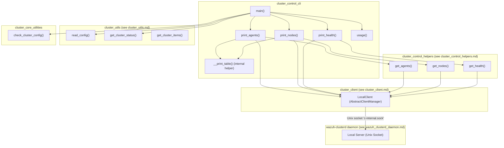
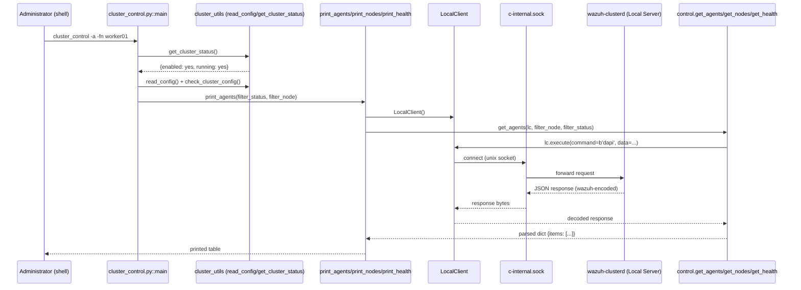
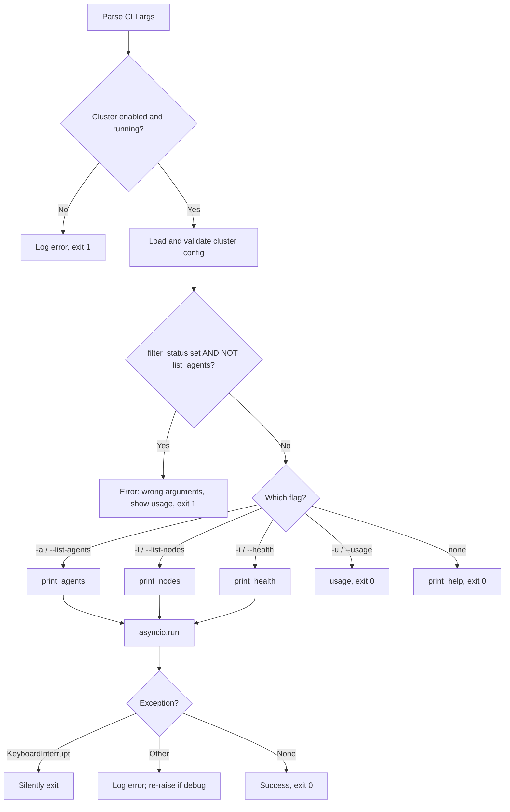

# Cluster Control CLI

## Introduction

The **Cluster Control CLI** (`framework/scripts/cluster_control.py`) is the command-line administration tool for the Wazuh cluster subsystem. It provides cluster administrators with a simple, human-readable interface to inspect the state of a Wazuh cluster without needing to query the REST API directly. Through this tool, operators can:

- List the nodes that belong to the cluster (`-l` / `--list-nodes`)
- List agents connected to the cluster, optionally filtered by node or connection status (`-a` / `--list-agents`)
- Check the overall cluster health and detailed per-node synchronization status (`-i` / `--health`)

This tool is a thin presentation-layer wrapper: it does not implement cluster logic itself. Instead, it uses the [`LocalClient`](cluster_local_client.md) to communicate with the local cluster daemon (`wazuh-clusterd`) over a Unix socket, and it delegates data retrieval to helper functions in [`framework/wazuh/core/cluster/control.py`](cluster_control_helpers.md). It is designed to be run directly from a shell on a manager node (`/var/ossec/bin/cluster_control`), typically by administrators or support/troubleshooting scripts.

---

## Purpose and Core Functionality

| Capability | CLI Flag | Underlying Helper | Description |
|---|---|---|---|
| List cluster nodes | `-l`, `--list-nodes` | `control.get_nodes` | Prints name, type, version, and address of each node |
| List connected agents | `-a`, `--list-agents` | `control.get_agents` | Prints id, name, ip, status, version and node name for agents, optionally filtered |
| Filter by node | `-fn`, `--filter-node` | (passed through) | Restricts node/agent listing or health check to specific node(s) |
| Filter by agent status | `-fs`, `--filter-agent-status` | (passed through, requires `-a`) | Restricts the agent listing to agents in a given connection status |
| Cluster health check | `-i`, `--health [more]` | `control.get_health` | Prints summarized (default) or detailed (`more`) synchronization status per node |
| Debug mode | `-d`, `--debug` | N/A | Enables verbose logging and re-raises exceptions instead of swallowing them |
| Usage help | `-u`, `--usage` | N/A | Prints usage examples |

Because the cluster daemon must actually be running for any of these commands to succeed, the tool first checks cluster status via `wazuh.core.cluster.utils.get_cluster_status()` and reads the cluster configuration via `wazuh.core.cluster.utils.read_config()`, aborting early with an error if the cluster is disabled or not running.

---

## Architecture

### Component Overview



### Relationship to Other Modules

- **[`cluster_client.md`](cluster_client.md)** — `LocalClient` (used here) extends `AbstractClientManager`, providing the asyncio-based connection lifecycle, request/response correlation, and keep-alive logic used to talk to the local cluster daemon.
- **[`cluster_control_helpers.md`](cluster_control_helpers.md)** — Contains `get_agents`, `get_nodes`, and `get_health`, the functions that build the DAPI/local-server requests and parse the JSON responses (including custom `WazuhJSONEncoder`/`as_wazuh_object` (de)serialization from [`cluster_common_protocol`](cluster_common_protocol.md)).
- **[`cluster_utils.md`](cluster_utils.md)** — Supplies `read_config()`, `get_cluster_status()`, and `get_cluster_items()`, used both directly by the CLI (to validate cluster status/config) and indirectly by `LocalClient`.
- **[`cluster_core_utilities.md`](cluster_core_utilities.md)** — `check_cluster_config()` validates the loaded cluster configuration before any command executes.
- **[`cluster_local_server.md`](cluster_local_server.md)** / **[`wazuh_clusterd_daemon.md`](wazuh_clusterd_daemon.md)** — The actual server-side process (`wazuh-clusterd`) that accepts the Unix-socket connection opened by `LocalClient` and executes the requested commands (`get_nodes`, `get_health`, or forwards a `dapi` request for agents).
- **[`cluster_api_controller.md`](cluster_api_controller.md)** — The sibling REST API surface (`api/api/controllers/cluster_controller.py`) exposes equivalent functionality (`get_cluster_nodes`, `get_healthcheck`, etc.) over HTTP; this CLI is the terminal/console equivalent used for direct administration without going through the API layer.
- **[`framework_core_utils.md`](framework_core_utils.md)** — `get_utc_strptime` (from `framework/wazuh/core/utils.py`) and `DECIMALS_DATE_FORMAT` (from `framework/wazuh/core/common.py`) are used in `print_health` to compute elapsed time between synchronization events.

---

## Component Details

### `main()`

Entry point registered as the `cluster_control` executable. Responsibilities:

1. Parses CLI arguments with `argparse` (`-d`, `-fn`, `-fs`, and a mutually exclusive group `-a`/`-l`/`-i`/`-u`).
2. Configures Python `logging` (DEBUG if `-d` else ERROR).
3. Verifies cluster is enabled and running via `get_cluster_status()`; exits with code `1` and an error message otherwise.
4. Loads and validates the cluster configuration (`read_config()` + `check_cluster_config()`).
5. Dispatches to the appropriate async print function based on parsed arguments (`print_agents`, `print_nodes`, or `print_health`), or prints usage/help.
6. Runs the selected coroutine via `asyncio.run(...)`.
7. Catches `KeyboardInterrupt` silently and other exceptions, logging them (and re-raising in debug mode).

### `print_agents(filter_status, filter_node)`

- Instantiates a `LocalClient`.
- Calls `control.get_agents(lc, filter_node=filter_node, filter_status=filter_status)`.
- Formats and prints a table with columns: `ID`, `Name`, `IP`, `Status`, `Version`, `Node name`.

### `print_nodes(filter_node)`

- Instantiates a `LocalClient`.
- Calls `control.get_nodes(lc, filter_node=filter_node)`.
- Formats and prints a table with columns: `Name`, `Type`, `Version`, `Address`.

### `print_health(config, more, filter_node)`

- If no explicit node filter is given, first resolves the full list of node names via `control.get_nodes`.
- Calls `control.get_health(lc, filter_node=filter_node)`.
- Builds a summary message (`msg1`) with one line per node showing last integrity check/sync timestamps, agent-info sync, agent-groups sync, and last keep-alive.
- If `more` is requested (`-i more`), builds a much more detailed message (`msg2`) breaking down, per non-master node:
  - Last keep-alive
  - Integrity check (start/end, duration, permission flag)
  - Integrity sync (start/end, duration, shared/missing/extra file counts)
  - Agents-info sync (start/end, duration, number of synced chunks, permission flag)
  - Agents-groups sync (start/end, duration, number of synced chunks)
  - Agents-groups full sync (start/end, duration, number of synced chunks)
- Uses the internal `calculate_seconds()` closure (built on `get_utc_strptime` and `DECIMALS_DATE_FORMAT`) to compute human-readable durations between two timestamps.

### `__print_table(data, headers, show_header)` (internal)

A small utility that pretty-prints tabular data with column widths automatically sized to the longest value in each column — used by both `print_agents` and `print_nodes`.

### `usage()`

Prints a static usage/help block describing common invocation patterns.

---

## Data Flow



---

## Process Flow (Argument Dispatch)



---

## Usage Examples

```bash
# List all nodes in the cluster
cluster_control -l

# List nodes filtered by name
cluster_control -l -fn worker01 worker02

# List all agents connected to the cluster
cluster_control -a

# List agents connected to a specific node
cluster_control -a -fn worker01

# List agents with a specific connection status
cluster_control -a -fs active

# Combine node and status filters
cluster_control -a -fn worker01 -fs active disconnected

# Basic cluster health summary
cluster_control -i

# Detailed cluster health information
cluster_control -i more

# Health for specific node(s) only
cluster_control -i -fn worker01

# Enable debug logging (also re-raises exceptions)
cluster_control -d -i
```

---

## Error Handling

- If the cluster is not enabled/running, the tool logs an error and exits with status `1` before attempting any network communication.
- If `-fs`/`--filter-agent-status` is supplied without `-a`/`--list-agents`, the tool considers this a usage error, prints the usage block, and exits with status `1`.
- Connection failures to the local server (e.g., socket not found, connection refused) surface as `WazuhInternalError` exceptions raised inside `LocalClient.start()`; these propagate up through `get_agents`/`get_nodes`/`get_health` and are caught by the generic exception handler in `main()`, which logs the error (and re-raises the full traceback only when `-d`/`--debug` is set).
- `KeyboardInterrupt` (Ctrl+C) is caught and ignored, allowing a clean exit.

---

## Related Documentation

- [cluster_client.md](cluster_client.md) — `AbstractClient` / `AbstractClientManager` base classes used by `LocalClient`.
- [cluster_local_client.md](cluster_local_client.md) — `LocalClient` and `LocalClientHandler` implementation details.
- [cluster_control_helpers.md](cluster_control_helpers.md) — `get_agents`, `get_nodes`, `get_health` implementations consumed by this CLI.
- [cluster_common_protocol.md](cluster_common_protocol.md) — `WazuhJSONEncoder`/`as_wazuh_object` serialization used across cluster communication.
- [cluster_utils.md](cluster_utils.md) — Cluster configuration and status utilities (`read_config`, `get_cluster_status`, `get_cluster_items`, `ClusterFilter`).
- [cluster_core_utilities.md](cluster_core_utilities.md) — `check_cluster_config` and other core cluster helper utilities.
- [cluster_local_server.md](cluster_local_server.md) — Server-side counterpart handling requests sent by `LocalClient`.
- [wazuh_clusterd_daemon.md](wazuh_clusterd_daemon.md) — The `wazuh-clusterd` daemon process that must be running for this CLI to function.
- [cluster_api_controller.md](cluster_api_controller.md) — REST API equivalent of the functionality exposed by this CLI.
- [cluster_high_level_api.md](cluster_high_level_api.md) — Higher-level `framework/wazuh/cluster.py` functions (`get_health_nodes`, `get_status_json`, etc.) used by the API layer, analogous to what this CLI does directly.
- [framework_core_utils.md](framework_core_utils.md) — `get_utc_strptime` and common date formatting constants used in health duration calculations.
