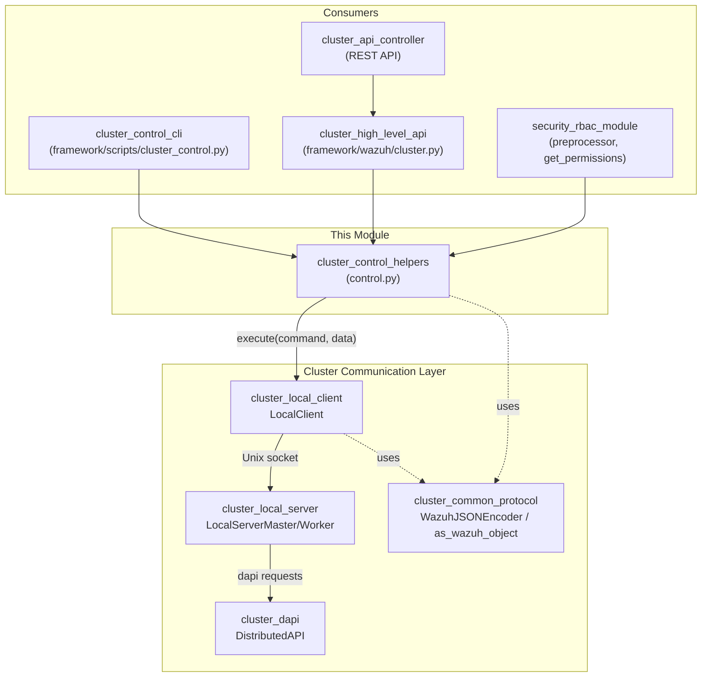
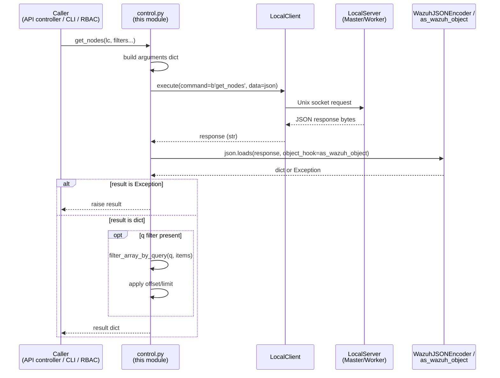
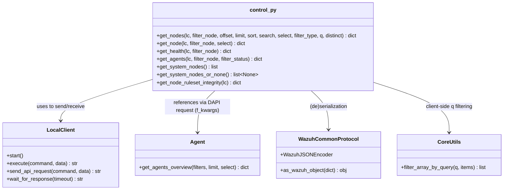
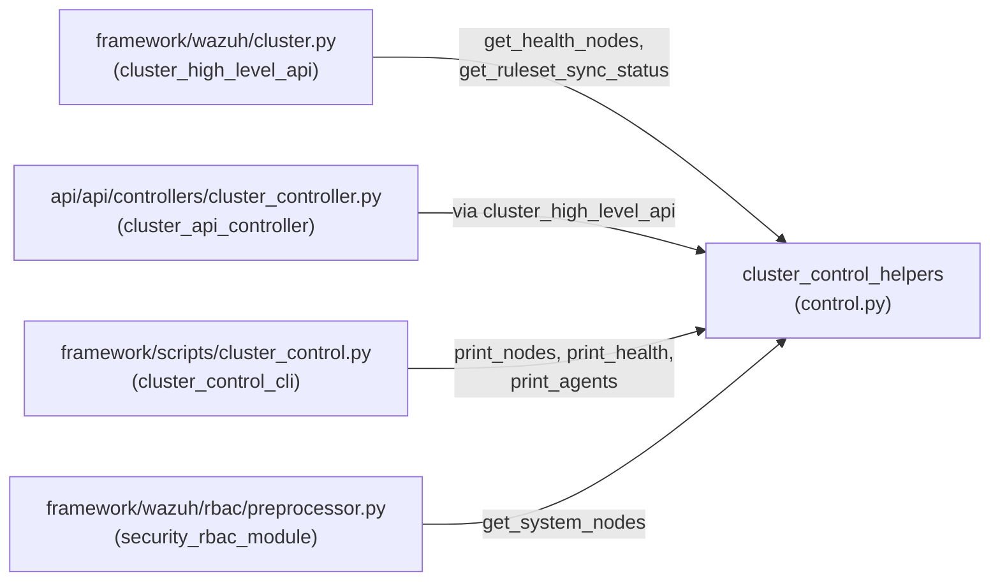

# Cluster Control Helpers

## Introduction

The **Cluster Control Helpers** module (`framework/wazuh/core/cluster/control.py`) is a thin, high-level facade that
exposes the most common *read-only, cluster-wide* queries used across the Wazuh API, CLI tools, and internal
services. It provides a small set of `async` functions — `get_nodes`, `get_node`, `get_health`, `get_agents`,
`get_system_nodes`, `get_system_nodes_or_none`, and `get_node_ruleset_integrity` — that hide the low-level details of
talking to the cluster's Local Server over a Unix socket.

Every function in this module follows the same pattern:

1. Build a JSON-serializable request payload.
2. Send it to the cluster **Local Server** through a [`LocalClient`](cluster_local_client.md) instance using the
   internal `dapi`/`get_nodes`/`get_health`/`get_hash` commands.
3. Deserialize the JSON response (using the shared [`WazuhJSONEncoder`/`as_wazuh_object`](cluster_common_protocol.md)
   machinery) back into Python objects, re-raising any exception that the cluster returned.
4. Apply any additional client-side post-processing (e.g., `q` filtering, default value filling) before returning
   the result to the caller.

Because of this uniform design, this module acts as the **single entry point** that higher layers (the DAPI/REST
controllers, the `cluster_control` CLI, and other framework code) use to query the state of the cluster without
needing to know anything about sockets, protocols, or serialization.

## Purpose & Responsibilities

| Responsibility | Description |
|---|---|
| **Node listing/filtering** | `get_nodes()` / `get_node()` retrieve basic metadata (name, type, IP, version) about one or all cluster nodes, supporting pagination, sorting, searching, field selection and query (`q`) filtering. |
| **Cluster health** | `get_health()` retrieves detailed synchronization/health information for the master and its workers. |
| **Agent-to-node mapping** | `get_agents()` retrieves the list of agents together with the cluster node they are currently connected to, normalizing missing fields (e.g., agents that never connected). |
| **Node discovery utility** | `get_system_nodes()` / `get_system_nodes_or_none()` are convenience wrappers used internally by RBAC/utility code that only need the list of node names. |
| **Ruleset integrity** | `get_node_ruleset_integrity()` requests the checksum/hash of the local node's custom ruleset, used for detecting configuration drift between nodes. |

This module does **not** implement any networking or serialization logic itself; it purely orchestrates calls to
[`LocalClient`](cluster_local_client.md) and translates the raw byte responses into rich Python data structures.

## Where This Module Fits

`cluster_control_helpers` sits between the **presentation/consumption layer** (REST API controllers, CLI scripts) and
the **cluster communication layer** (Local Client/Local Server, wire protocol). It never talks to remote nodes
directly — instead, it always goes through the master's (or worker's) own Local Server, which in turn may forward
requests through the cluster's internal `DistributedAPI`.

## Core Components

### `get_nodes(lc, filter_node=None, offset=0, limit=DATABASE_LIMIT, sort=None, search=None, select=None, filter_type='all', q='', distinct=False)`

Retrieves paginated, filterable information about cluster nodes.

* Sends the `get_nodes` command to the Local Server.
* When a `q` (query) filter is supplied, the function **disables server-side pagination** (requests everything with
  `offset=0`, `limit=DATABASE_LIMIT`), applies `filter_array_by_query` locally (see
  [`framework_core_utils`](framework_core_utils.md)::`utils.py`), and *then* re-applies the requested `offset`/`limit`
  on the filtered result. This is necessary because the query language operates on the full result set, not just a
  page of it.
* Raises any `Exception` object embedded in the deserialized response (see `as_wazuh_object` in
  [`cluster_common_protocol`](cluster_common_protocol.md)).

### `get_node(lc, filter_node=None, select=None)`

A convenience wrapper around `get_nodes()` for retrieving a **single** node's information. Internally it calls the
same `get_nodes` command with `filter_node` set to a single node and returns the first element of `items`, or an
empty dict if no data was found.

### `get_health(lc, filter_node=None)`

Sends the `get_health` command and returns detailed cluster health/synchronization data (per-node info plus
integrity/sync status). Used by both the `GET /cluster/healthcheck` API endpoint and the `cluster_control -i` CLI
option.

### `get_agents(lc, filter_node=None, filter_status=None)`

Retrieves the list of agents and the cluster node each is connected to:

* Builds a DAPI request that invokes `Agent.get_agents_overview` (see [`agent_module`](agent_module.md)) with
  `node_name` and `status` filters, requesting only the fields `id`, `ip`, `name`, `status`, `node_name`, `version`.
* Sends this request through the generic `dapi` command (rather than a dedicated cluster command), reusing the
  [`DistributedAPI`](cluster_dapi.md) execution path.
* Post-processes the result: any agent missing one of the requested fields (e.g., a `never_connected` agent has no
  `version`) is filled with the string `'unknown'` so that downstream consumers (CLI output, API responses) can rely
  on a consistent schema.

### `get_system_nodes()` / `get_system_nodes_or_none()`

Lightweight helpers that only need the **names** of all cluster nodes (e.g., used by the RBAC preprocessor when
resolving `node_type` resources). `get_system_nodes()` creates its own `LocalClient` and translates the
`WazuhInternalError(3012)` ("cluster not running") case into `WazuhError(3013)`. `get_system_nodes_or_none()` further
simplifies error handling for callers that just want a list or `None`.

> **Note:** the codebase currently defines `get_system_nodes_or_none()` twice with identical bodies; the second
> definition simply shadows the first at import time.

### `get_node_ruleset_integrity(lc)`

Sends the `get_hash` command to retrieve the checksum of the local node's custom ruleset content, used by the
[`rule_module`](rule_module.md) integration (`get_nodes_ruleset_sync_status` in the cluster API controller) to
detect configuration drift across the cluster.

## Data Flow

## Component Interaction Diagram

## Consumers of This Module

* **[`cluster_high_level_api`](cluster_high_level_api.md)** (`framework/wazuh/cluster.py`) wraps these helpers with
  additional business logic (e.g., `get_health_nodes`, `get_ruleset_sync_status`, `get_status_json`) before exposing
  them to the REST API layer.
* **[`cluster_api_controller`](cluster_api_controller.md)** (`api/api/controllers/cluster_controller.py`) exposes
  cluster information via REST endpoints such as `GET /cluster/nodes`, `GET /cluster/healthcheck`, and
  `GET /cluster/ruleset/synchronization`, ultimately relying on this module through the DAPI dispatch mechanism.
* **[`cluster_control_cli`](cluster_control_cli.md)** (`framework/scripts/cluster_control.py`) is a standalone CLI
  tool (`cluster_control`) that directly imports and calls `get_nodes`, `get_health`, and `get_agents` to print
  human-readable cluster status/agent tables.
* **[`security_rbac_module`](security_rbac_module.md)** relies on `get_system_nodes()` when resolving
  `node_type` resources during RBAC permission evaluation.

## Error Handling

All functions follow the same defensive pattern: because the wire protocol can serialize arbitrary Python exceptions
(via `WazuhJSONEncoder`/`as_wazuh_object`, documented in [`cluster_common_protocol`](cluster_common_protocol.md)),
every helper checks `isinstance(result, Exception)` immediately after deserialization and re-raises it. This means
callers can simply `try/except` around these functions using standard Wazuh exception types
(`WazuhError`, `WazuhInternalError`) without needing to know about the underlying transport.

`get_system_nodes()` additionally translates a specific internal error (`WazuhInternalError` code `3012`, meaning the
cluster daemon is not reachable) into a more user-facing `WazuhError(3013)`.

## Dependencies

| Dependency | Purpose | Documentation |
|---|---|---|
| `LocalClient` | Establishes the Unix-socket connection to the Local Server and sends/receives requests. | [`cluster_local_client`](cluster_local_client.md) |
| `WazuhJSONEncoder`, `as_wazuh_object` | Serialize requests / deserialize responses, including exception propagation. | [`cluster_common_protocol`](cluster_common_protocol.md) |
| `Agent.get_agents_overview` | Underlying query executed (via DAPI) to build the agent-to-node mapping in `get_agents`. | [`agent_module`](agent_module.md) |
| `filter_array_by_query` | Client-side query-language filtering used when `q` is supplied. | [`framework_core_utils`](framework_core_utils.md) |
| `common.DATABASE_LIMIT` | Default/maximum pagination limit constant. | [`framework_core_utils`](framework_core_utils.md) |
| `DistributedAPI` (indirectly, via the `dapi` command) | Executes the `Agent.get_agents_overview` function on the correct node. | [`cluster_dapi`](cluster_dapi.md) |

## Summary

`cluster_control_helpers` is a small but critical integration point: it standardizes how *any* part of Wazuh (REST
API, CLI, or internal RBAC code) queries live cluster state — nodes, health, agent distribution, and ruleset
integrity — without duplicating socket-handling or JSON (de)serialization logic. Its simplicity is intentional: all
the complexity of connection management, timeouts, and keepalives lives in [`cluster_local_client`](cluster_local_client.md),
while all the complexity of message framing and object serialization lives in
[`cluster_common_protocol`](cluster_common_protocol.md).
