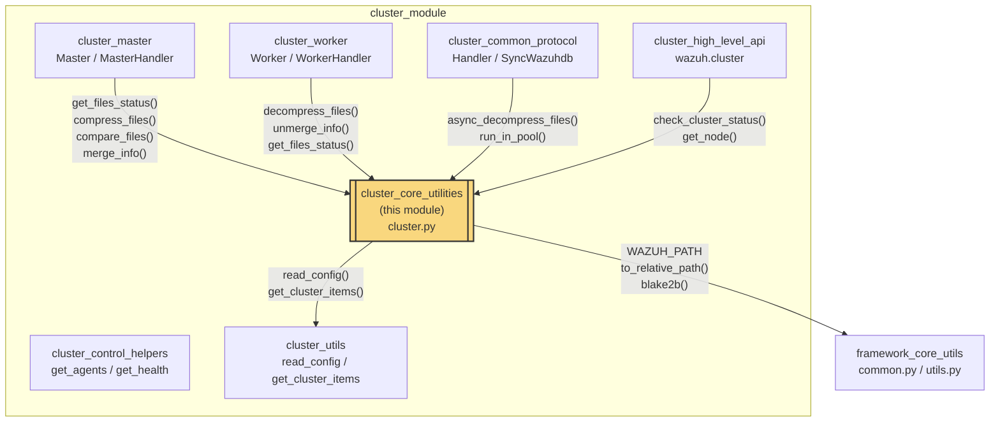
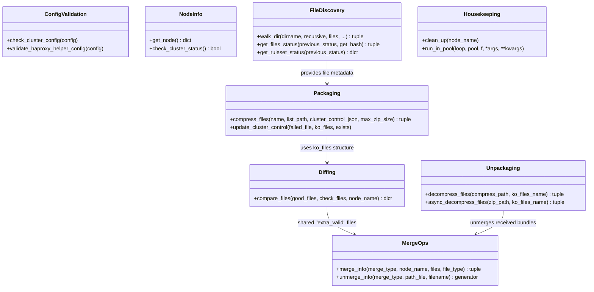
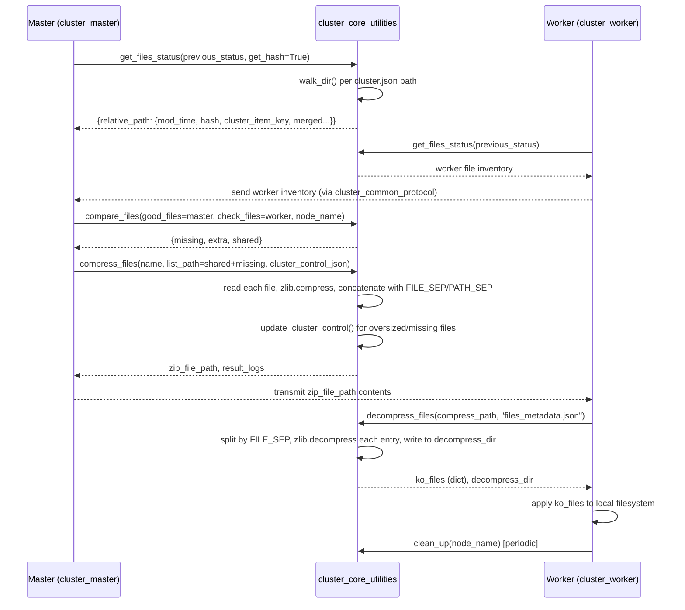
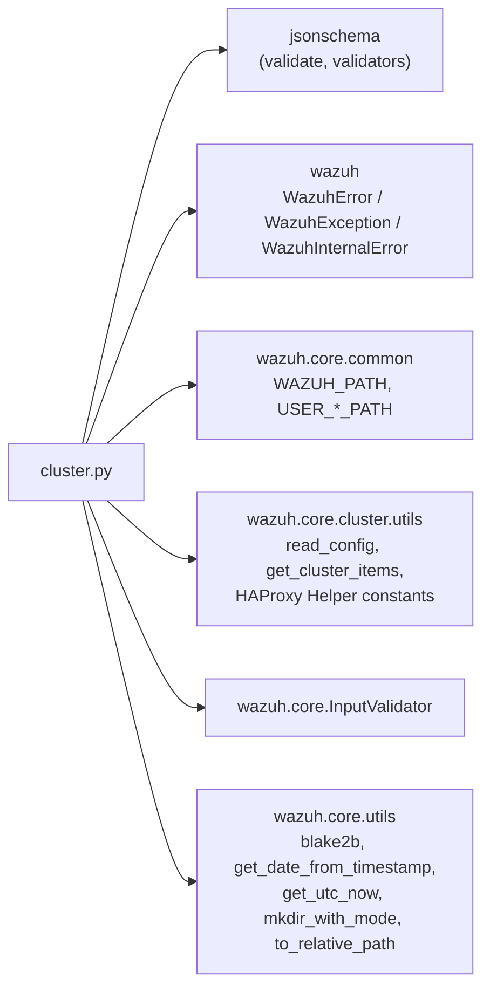

# Cluster Core Utilities

## Introduction

The **Cluster Core Utilities** module (`framework/wazuh/core/cluster/cluster.py`) provides the low-level file-management primitives that power Wazuh's master/worker cluster synchronization engine. It is responsible for **discovering which files need to be synchronized**, **compressing/packaging** them for network transfer, **decompressing/unpacking** them on the receiving end, **comparing** file inventories between nodes to compute deltas, and **merging/unmerging** groups of small files (e.g. agent-group files) into single transportable blobs.

This module does not open sockets or manage cluster membership itself — it is a pure utility layer consumed by the higher-level cluster orchestration components (`cluster_master`, `cluster_worker`, `cluster_common_protocol`). It also exposes cluster configuration validation helpers and generic node/status accessors used throughout the Cluster module family.

## Role in the System

Related documentation:
- [cluster_master.md](cluster_master.md) — consumes `compress_files`, `compare_files`, `merge_info` during master→worker integrity/synchronization rounds.
- [cluster_worker.md](cluster_worker.md) — consumes `decompress_files`, `unmerge_info` to apply files received from the master.
- [cluster_common_protocol.md](cluster_common_protocol.md) — generic `Handler`/`SyncWazuhdb` classes that invoke this module's compression helpers over the wire protocol.
- [cluster_utils.md](cluster_utils.md) — supplies cluster configuration (`read_config`) and per-directory sync settings (`get_cluster_items`) consumed by this module.
- [framework_core_utils.md](framework_core_utils.md) — supplies shared filesystem/path helpers (`common.WAZUH_PATH`, `to_relative_path`) and generic query/results utilities used across the whole framework.
- [cluster_high_level_api.md](cluster_high_level_api.md) — uses `get_node()`/`check_cluster_status()` for external API responses.

## Core Responsibilities

| Responsibility | Key Function(s) |
|---|---|
| Cluster configuration validation | `check_cluster_config`, `validate_haproxy_helper_config` |
| Node/status introspection | `get_node`, `check_cluster_status` |
| File discovery & change detection | `walk_dir`, `get_files_status`, `get_ruleset_status` |
| Packaging files for transfer | `compress_files` |
| Unpacking received files | `decompress_files`, `async_decompress_files` |
| Bridging changed-file bookkeeping | `update_cluster_control` |
| Diffing master vs. worker inventories | `compare_files` |
| Bundling many small files into one | `merge_info` |
| Splitting a merged file back into parts | `unmerge_info` |
| Temporary storage cleanup | `clean_up` |
| Offloading CPU-bound work | `run_in_pool` |

## Architecture

### Constants and Schemas

- `FILE_SEP` / `PATH_SEP` — binary separators used to delimit concatenated file entries inside a compressed blob (custom container format, not a standard archive format such as zip/tar).
- `MIN_PORT` / `MAX_PORT` — valid TCP port bounds used by `check_cluster_config`.
- `HAPROXY_HELPER_SCHEMA` — JSON Schema (via `jsonschema`) validating the optional HAProxy Helper configuration block (port, protocol, frequency, agent reconnection timers, imbalance tolerance, etc.).

## Data Flow: File Synchronization Round

## Data Flow: Merge / Unmerge (Extra-Valid Files)

Some directories (e.g., agent-groups) contain many small files that are more efficient to synchronize as a single bundle. `merge_info` packs them; `unmerge_info` reverses the operation on the receiving side.

```mermaid
flowchart LR
    A[Multiple small files<br/>in queue/merge_type/] --> B["merge_info(merge_type, node_name, files, file_type)"]
    B --> C["Header per file:<br/>'{size} {name} {mtime}'<br/>content bytes"]
    C --> D[Single .merged file<br/>queue/cluster/node_name/*.merged]
    D -->|sent over network| E[Worker receives .merged file]
    E --> F["unmerge_info(merge_type, path_file, filename)"]
    F --> G[Generator yields:<br/>relative_path, data, mtime]
    G --> H[Caller writes individual files<br/>to queue/merge_type/]
```

## Function Reference

### `check_cluster_config(config)`
Validates the `<cluster>` configuration block: key length/charset (32 alphanumeric chars), `node_type` in `{master, worker}`, port range, disallowed reserved IPs in the `nodes` list, and (via `validate_haproxy_helper_config`) the optional HAProxy Helper JSON Schema. Raises `WazuhError(3004)` on any violation.

### `get_node()`
Returns a small dict `{node, cluster, type}` built from `read_config()` (see [cluster_utils.md](cluster_utils.md)). Used by the high-level API (`wazuh.cluster.read_config_wrapper`) and CLI tools.

### `check_cluster_status()`
Returns whether clustering is enabled (`not read_config()['disabled']`).

### `walk_dir(...)`
Recursively (optionally) scans a directory relative to `common.WAZUH_PATH`, filtering out excluded files/extensions, and returns a dict of relative-path → metadata (`mod_time`, `cluster_item_key`, `merged` flag, optional BLAKE2b `hash`). Reuses `previous_status` to skip re-hashing unchanged files (mtime-based short-circuit) — an important performance optimization for large rule/decoder/list directories.

### `get_files_status(previous_status=None, get_hash=True)`
The main entry point for building a **complete synchronization inventory**. Iterates every directory declared in `cluster.json['files']` (via [cluster_utils.md](cluster_utils.md) `get_cluster_items()`), delegating to `walk_dir` for each, and aggregates results plus any debug/error logs. Both master and worker nodes call this to know what they currently have on disk.

### `get_ruleset_status(previous_status)`
A narrower variant restricted to user-defined ruleset directories (`USER_DECODERS_PATH`, `USER_RULES_PATH`, `USER_LISTS_PATH`), returning only path→hash pairs. Used by the ruleset synchronization/reload flow (see `rule_module_details.md` `RulesetReloadResponse`).

### `update_cluster_control(failed_file, ko_files, exists=True)`
Housekeeping helper invoked when a file could not be read/compressed or no longer exists. Removes it from the `missing` list, or moves it from `shared` to `extra` (if it no longer exists on the master) inside the `ko_files` dict structure used throughout the sync process.

### `compress_files(name, list_path, cluster_control_json=None, max_zip_size=None)`
Builds a **custom-format compressed container** (not a standard zip) at `queue/cluster/{name}/{name}-{timestamp}-{uuid}.zip`:
- Each file is individually zlib-compressed and framed as `{relative_path}{PATH_SEP}{compressed_bytes}{FILE_SEP}`.
- Files larger than `max_zip_size` (from `cluster.json['intervals']['communication']`) are skipped and reported via `update_cluster_control`.
- Once the cumulative size limit is reached, remaining files are also skipped.
- The final entry written is always `files_metadata.json` — the compressed JSON serialization of `cluster_control_json` (the `ko_files` dict), always appended regardless of size limits.
- Raises `WazuhError(3001)` on zlib/compression failures.

### `decompress_files(compress_path, ko_files_name="files_metadata.json")` / `async_decompress_files(...)`
Streams the custom container in 10 MiB windows, splitting on `FILE_SEP`, decompressing each entry with zlib, and writing it to a mirrored directory tree under `{compress_path}dir`. Finally loads and returns the embedded `files_metadata.json` as `ko_files`. The compressed file is always removed afterward (`finally` block), and partial directories are cleaned up on error. `async_decompress_files` is a thin async wrapper for use inside asyncio-based handlers (see [cluster_common_protocol.md](cluster_common_protocol.md)).

### `compare_files(good_files, check_files, node_name)`
Computes the classic **three-way diff** between a master's file inventory (`good_files`) and a worker's (`check_files`):
- **missing**: present on master, absent on worker.
- **extra**: present on worker, absent on master (and not classified as "extra_valid").
- **shared**: present on both but with differing BLAKE2b hash.

For directories flagged `extra_valid` in `cluster.json`, shared files are merged into a single bundle via `merge_info` before being added to the result (this legacy code path is largely superseded by simpler group-hash mechanisms elsewhere, but retained for compatibility).

### `clean_up(node_name="")`
Deletes all files/directories under `queue/cluster/{node_name}` (or all nodes if empty), preserving `c-internal.sock`. Used to purge stale temporary sync artifacts.

### `merge_info(merge_type, node_name, files=None, file_type="")`
Concatenates a set of files from `queue/{merge_type}/` into a single `.merged` file under `queue/cluster/{node_name}/`, each entry preceded by a text header `"{size} {filename} {mtime}\n"`.

### `unmerge_info(merge_type, path_file, filename)`
Generator that reverses `merge_info`: reads headers sequentially from a merged file and yields `(relative_path, data, mtime)` tuples without writing anything itself — the caller is responsible for persisting the individual files.

### `run_in_pool(loop, pool, f, *args, **kwargs)`
Small asyncio helper: if a `ProcessPoolExecutor` is supplied, runs `f` in a worker process and awaits the result; otherwise executes `f` synchronously in the current process. Used to offload CPU-heavy operations (compression/decompression/hashing) from the asyncio event loop so it doesn't block cluster heartbeats — see [cluster_master.md](cluster_master.md) and [cluster_worker.md](cluster_worker.md) for how the process pool is instantiated.

## Error Handling

| Exception | Raised When |
|---|---|
| `WazuhError(3004)` | Invalid cluster/HAProxy Helper configuration (`check_cluster_config`, `validate_haproxy_helper_config`) |
| `WazuhInternalError(3015)` | OS-level failure while walking a directory (`walk_dir`) |
| `WazuhError(3001)` | zlib compression/decompression failure or any exception while writing the metadata JSON (`compress_files`) |

All other transient errors (missing files, permission errors) are captured into `result_logs['debug']` / `result_logs['error']` dictionaries rather than raised, so that a single bad file does not abort an entire synchronization round.

## Dependencies

- **[cluster_utils.md](cluster_utils.md)**: `read_config()` (cluster.json config), `get_cluster_items()` (per-path sync rules, intervals, exclusions), and HAProxy Helper related constants (`HAPROXY_HELPER`, `HAPROXY_PORT`, etc.).
- **[framework_core_utils.md](framework_core_utils.md)**: `common.WAZUH_PATH` and related path constants, `to_relative_path`, plus generic hashing/date utilities from `wazuh.core.utils`.
- **`wazuh.core.InputValidator`**: name/length validation used for the cluster key.

## Consumers

- **[cluster_master.md](cluster_master.md)** (`Master`, `MasterHandler`): drives full synchronization cycles by calling `get_files_status`, `compare_files`, `compress_files`, and periodic `clean_up`.
- **[cluster_worker.md](cluster_worker.md)** (`Worker`, `WorkerHandler`): calls `get_files_status` to report local state and `decompress_files`/`unmerge_info` to apply files pushed from the master.
- **[cluster_common_protocol.md](cluster_common_protocol.md)** (`Handler`, `SyncWazuhdb`): generic protocol handler classes leverage `async_decompress_files` and `run_in_pool` when processing incoming file-sync payloads.
- **[cluster_high_level_api.md](cluster_high_level_api.md)** (`wazuh.cluster`): `read_config_wrapper` and status endpoints rely on `get_node`/`check_cluster_status`.
- **Scripts**: `framework/scripts/wazuh_clusterd.py` and `framework/scripts/cluster_control.py` indirectly depend on this module through the master/worker classes.

## Summary

`cluster.py` is the **file-synchronization toolbox** of the Wazuh clustering subsystem. It intentionally has no networking or asyncio-protocol knowledge of its own (aside from the small `run_in_pool`/`async_decompress_files` conveniences), keeping it easily testable and reusable by both the master and worker roles. Its custom lightweight container format (rather than standard zip/tar) is optimized for the specific goal of syncing many small, frequently-changing files (rules, decoders, CDB lists, agent groups) with minimal overhead across potentially many worker nodes.
