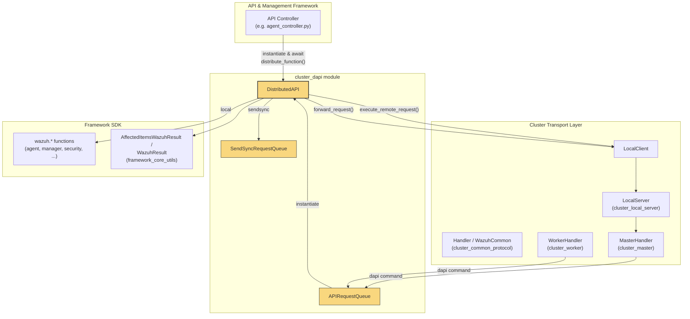
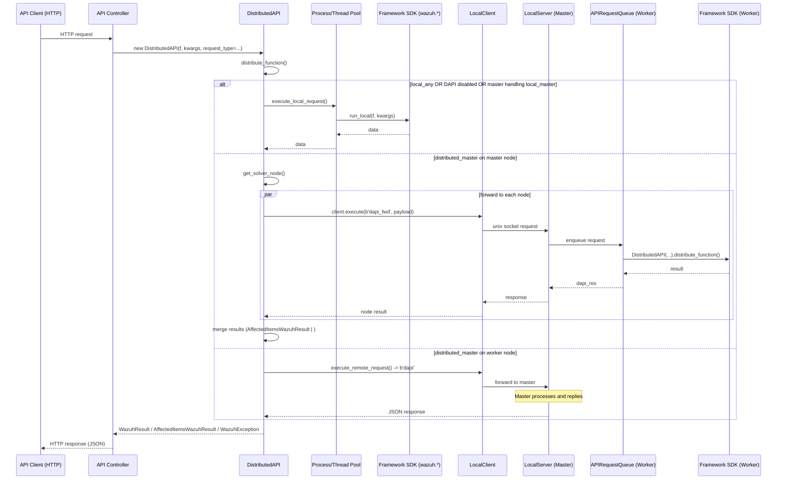
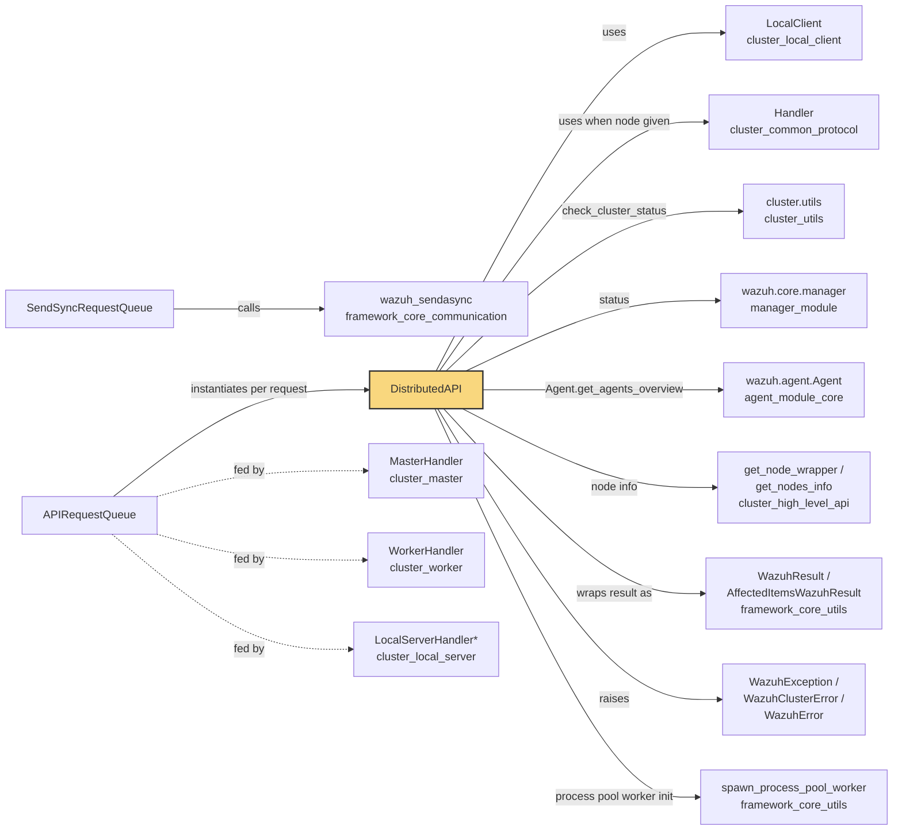
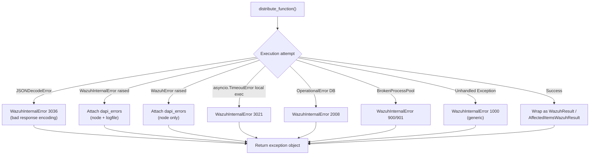

# cluster_dapi — Distributed API Execution Engine

## Introduction

The `cluster_dapi` module implements the **Distributed API (DAPI)** mechanism that powers Wazuh's ability to execute a single API call across an entire cluster of managers. It lives in `framework/wazuh/core/cluster/dapi/dapi.py` and provides the `DistributedAPI` class — the central orchestrator that decides *where* (locally, on the master, or on a remote worker) a given framework function must run, executes it, collects results (including partial failures), and merges them into a unified response.

This module is the runtime bridge between the [API_&_Management_Framework_(Python)](API_&_Management_Framework_(Python).md) HTTP layer (controllers such as `agent_controller`, `manager_controller`, etc.) and the low-level [cluster_common_protocol](cluster_common_protocol.md) / [cluster_client](cluster_client.md) / [cluster_local_client](cluster_local_client.md) transport layers. Every REST API call that Wazuh exposes is ultimately wrapped in a `DistributedAPI` instance before being dispatched.

In addition to `DistributedAPI`, the module defines two background queue processors — `APIRequestQueue` and `SendSyncRequestQueue` — that run inside the cluster master/worker daemons ([wazuh_clusterd_daemon](wazuh_clusterd_daemon.md)) to asynchronously service incoming DAPI and SendSync requests coming from other nodes.

---

## Purpose & Responsibilities

| Responsibility | Description |
|---|---|
| **Request routing** | Decide whether an API request should run locally, be forwarded to the master, or be forwarded to worker nodes, based on `request_type`, cluster topology, and whether the DAPI feature is enabled. |
| **Local execution** | Run the target framework function (e.g., `wazuh.agent.get_agents`) in a process pool / thread pool / synchronously, applying RBAC context, timeouts, and error handling. |
| **Remote execution** | Serialize the request (function reference + kwargs + context) and send it over the cluster socket protocol to another node, then deserialize the response. |
| **Broadcast / fan-out** | For `distributed_master` requests affecting multiple agents/nodes, resolve which node(s) hold the relevant agents (`get_solver_node`) and forward sub-requests to each concerned node in parallel, then merge (`AffectedItemsWazuhResult.__or__`) the partial results into one. |
| **Health/status guard** | Verify that required daemons (`wazuh-db`, `wazuh-remoted`, `wazuh-analysisd`, etc.) are running before executing a request (`check_wazuh_status`). |
| **Error normalization** | Convert internal exceptions, timeouts, and broken process pools into standard `WazuhException`/`WazuhInternalError` responses with contextual `dapi_errors` (which node failed, log file location). |
| **Async queue processing** | `APIRequestQueue` and `SendSyncRequestQueue` continuously pull serialized DAPI/SendSync requests from an `asyncio.Queue` (fed by the cluster socket handlers) and reply asynchronously — used on the receiving end of forwarded/remote requests. |

---

## Architecture Overview



### Key Design Points

- **`DistributedAPI` is stateless per-call**: a new instance is created for every API request (or every forwarded sub-request), carrying the target function `f`, its kwargs, RBAC permissions, and routing context.
- **Process/Thread pools** (`common.mp_pools`) are used to isolate CPU/IO-bound SDK calls from the asyncio event loop; a dedicated `authentication_pool` is created only on the master node for auth-related functions (`check_token`, `check_user_master`, etc.) and an `events_pool` for event ingestion functions.
- **Queues run forever** inside the cluster daemon event loop, decoupling the transport layer (which enqueues raw byte requests) from the execution layer (`DistributedAPI`).

---

## Component Reference

### `DistributedAPI`

The primary class of this module. It wraps a single API invocation and knows how to resolve, execute, and normalize its outcome.

**Constructor parameters (selected):**
- `f`: the framework SDK callable to execute (e.g. `wazuh.agent.restart_agents`).
- `f_kwargs`: dict of arguments for `f`.
- `node`: a cluster `Handler` (Master/Worker) to use for forwarding; defaults to the `local_client` module (creates a fresh `LocalClient`).
- `request_type`: one of `local_master`, `local_any`, `distributed_master` — determines routing logic.
- `broadcasting`: whether the request must be executed identically on all nodes.
- `rbac_permissions`, `current_user`: security context propagated via `contextvars` (see [framework_core_utils](framework_core_utils.md)::`common`).
- `api_timeout`: overrides the default request timeout from `api.yaml`.

**Key methods:**

| Method | Purpose |
|---|---|
| `distribute_function()` | Entry point. Decides among local execution, forwarding (master→worker fan-out), or remote execution (worker→master), and normalizes the final result into a `WazuhResult`/`AffectedItemsWazuhResult`/`WazuhException`. |
| `execute_local_request()` | Runs `f` in the current node using a process/thread pool with a timeout; handles `asyncio.TimeoutError`, `OperationalError` (DB), and `BrokenProcessPool`. |
| `execute_remote_request()` | Used by **worker** nodes for `master_only` requests: sends the serialized call to the master over the local cluster socket (`dapi` command) and awaits the JSON response. |
| `forward_request()` | Used by the **master** node for `distributed_master` requests: determines target worker nodes via `get_solver_node()`, forwards sub-requests in parallel (`asyncio.gather`), and merges results with `AffectedItemsWazuhResult.__or__`. |
| `get_solver_node()` | Maps requested `agent_id`/`agent_list`/`node_id` values to the cluster node(s) that own them, using `wazuh.agent.Agent.get_agents_overview`. |
| `check_wazuh_status()` | Raises `WazuhInternalError(1017)` if any basic daemon (`wazuh-db`, `wazuh-remoted`, etc.) is not running. |
| `get_error_info()` | Builds a `dapi_errors` dict `{node: {error, logfile}}` attached to exceptions for troubleshooting. |
| `run_local()` (static) | The actual function executed inside the worker process/thread; sets RBAC/broadcast/user contextvars before calling `f`. |

### `APIRequestQueue` (extends `WazuhRequestQueue`)

Background coroutine (`run()`) that:
1. Pulls a `"<node_name> <json_request>"` string from `self.request_queue`.
2. Reconstructs a `DistributedAPI` instance from the JSON payload.
3. Calls `distribute_function()` and sends the serialized result back over the originating `Handler` connection using `dapi_res` / `dapi_err` commands.

This is the receiving side of both `forward_request()` (master→worker `dapi_fwd`) and `execute_remote_request()` (worker→master `dapi`).

### `SendSyncRequestQueue` (extends `WazuhRequestQueue`)

Analogous background queue for **SendSync** requests (used for synchronous socket calls like sending commands directly to a daemon via `wazuh_sendsync`), replying with `sendsyn_res` / `sendsyn_err`.

### `WazuhRequestQueue` (base class)

Trivial wrapper around an `asyncio.Queue` plus a reference to the owning cluster `server` (Master or Worker instance), providing `add_request()` used by socket handlers to enqueue incoming raw byte payloads.

---

## Data Flow: End-to-End Request Lifecycle



---

## Request Routing Decision Table

`distribute_function()` chooses the execution path based on this logic:

| Condition | Path |
|---|---|
| DAPI disabled in `cluster.json`, OR cluster disabled (single-node), OR `request_type == 'local_any'` | **Local execution** |
| `request_type == 'local_master'` AND this node is the master | **Local execution** |
| `request_type == 'distributed_master'` AND request came `from_cluster` (already forwarded) | **Local execution** |
| `request_type == 'distributed_master'` AND this node is the master (not yet forwarded) | **Forward** to worker(s) via `forward_request()` |
| Everything else (worker node, `master_only` function) | **Remote execution** via `execute_remote_request()` (send to master) |

---

## Component Interaction Diagram



---

## Error Handling Model

`DistributedAPI` normalizes all failure modes into Wazuh's exception hierarchy so API controllers can render consistent HTTP error responses:



Notable behaviors:
- If `self.debug` is `True`, exceptions are **re-raised** instead of returned (used in unit tests / CLI tools).
- `check_wazuh_status()` is bypassed only for the `wazuh.core.manager.status` function itself (to avoid infinite recursion when checking daemon health).
- Failed items originating from the synthetic `'unknown'` node (a placeholder for agents whose owning node couldn't be resolved) are stripped from final `AffectedItemsWazuhResult.failed_items` after merging, unless `remove_denied_nodes` handling requires keeping RBAC-denied (`code 4000`) entries.

---

## Relationship to Sibling Cluster Modules

| Module | Relationship |
|---|---|
| [cluster_common_protocol](cluster_common_protocol.md) | Provides `Handler`, `WazuhCommon`, `Response`, `WazuhJSONEncoder`, `as_wazuh_object` — the wire protocol `DistributedAPI` uses to serialize/deserialize requests and that `APIRequestQueue`/`SendSyncRequestQueue` rely on for `send_string`/`send_request`. |
| [cluster_local_client](cluster_local_client.md) | `LocalClient` is the default transport `DistributedAPI` uses when no explicit `node` Handler is supplied (i.e., when called directly from the API process rather than from within the cluster daemon). |
| [cluster_local_server](cluster_local_server.md) | Hosts the Unix socket server that `LocalClient` connects to; its handlers enqueue incoming `dapi`/`dapi_fwd`/`sendasync` commands into `APIRequestQueue`/`SendSyncRequestQueue`. |
| [cluster_master](cluster_master.md) / [cluster_worker](cluster_worker.md) | `MasterHandler`/`WorkerHandler` implement the `dapi`, `dapi_fwd`, and `dapi_res`/`dapi_err` command handling that feeds `APIRequestQueue`, and are the `node` objects sometimes passed into `DistributedAPI`. |
| [cluster_high_level_api](cluster_high_level_api.md) | `get_node_wrapper()` and `get_nodes_info()` (from `wazuh.cluster`) are used by `DistributedAPI.get_error_info()` and `forward_request()` to resolve node identity and validate RBAC-visible nodes. |
| [cluster_utils](cluster_utils.md) | Supplies `get_cluster_items()` (cluster.json config) and `check_cluster_status()`, both consumed at module load time and inside `distribute_function()`. |
| [agent_module_core](agent_module_core.md) | `wazuh.agent.Agent.get_agents_overview` is used by `get_solver_node()` to map requested agents to their owning cluster node. |
| [framework_core_utils](framework_core_utils.md) | `AffectedItemsWazuhResult`/`WazuhResult` (response wrapping/merging) and `common` (contextvars for RBAC, current user, cluster nodes) are foundational dependencies. |
| [framework_core_communication](framework_core_communication.md) | `wazuh_sendasync` / `wazuh_sendsync` (used by `SendSyncRequestQueue`) live here, alongside socket/queue primitives shared across the framework. |
| [API_&_Management_Framework_(Python)](API_&_Management_Framework_(Python).md) | Top-level consumer: every controller function (`agent_controller`, `manager_controller`, `security_controller`, etc.) instantiates `DistributedAPI` to execute the underlying SDK call, whether the deployment is single-node or clustered. |

---

## Typical Usage Pattern (from an API Controller)

```python
from wazuh.core.cluster.dapi.dapi import DistributedAPI

dapi = DistributedAPI(
    f=wazuh.agent.restart_agents,
    f_kwargs={"agent_list": ["001", "002"]},
    request_type='distributed_master',
    is_async=False,
    wait_for_complete=False,
    logger=logger,
    rbac_permissions=request.context['token_info']['rbac_policies'],
    current_user=request.context['token_info']['sub'],
)
result = await dapi.distribute_function()
```

The controller does not need to know whether the cluster has 1 or 100 nodes, nor which node owns each requested agent — `DistributedAPI` transparently handles single-node execution, forwarding, and result aggregation.

---

## Summary

`cluster_dapi` is the **execution and routing brain** of Wazuh's distributed API. It decouples "what to run" (a framework SDK function) from "where to run it" (local process pool, remote worker, or fan-out across multiple workers), and provides the queue infrastructure (`APIRequestQueue`, `SendSyncRequestQueue`) that lets cluster daemons service these requests asynchronously. Its tight integration with the cluster transport (`Handler`, `LocalClient`, `LocalServer`) and the result-merging primitives (`AffectedItemsWazuhResult`) makes it possible for the REST API layer to remain agnostic of cluster topology.
