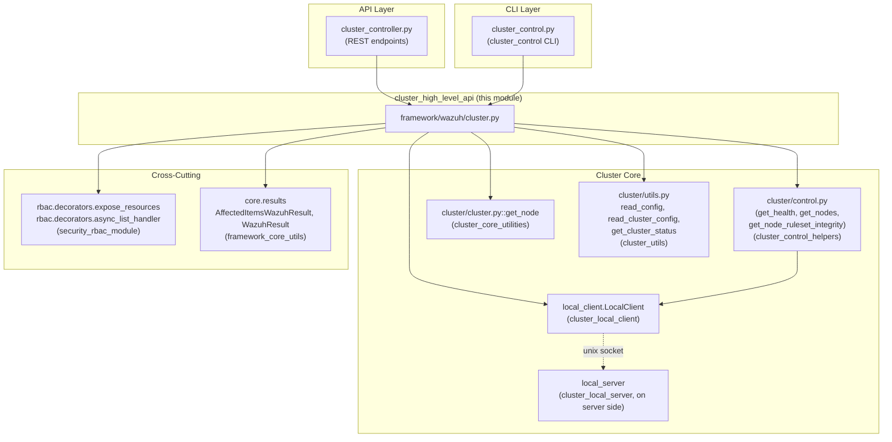
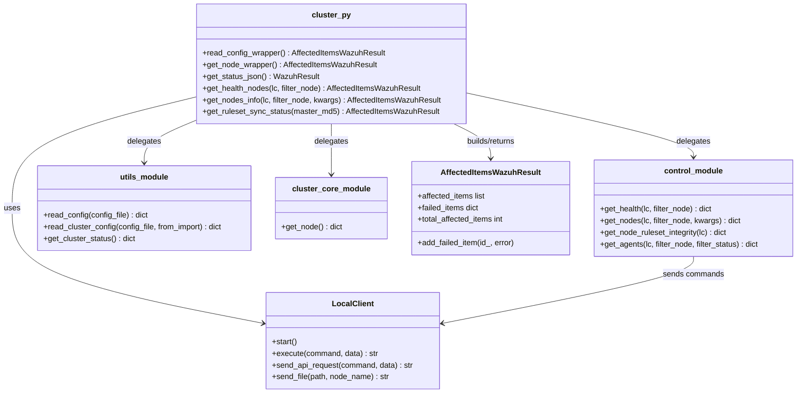
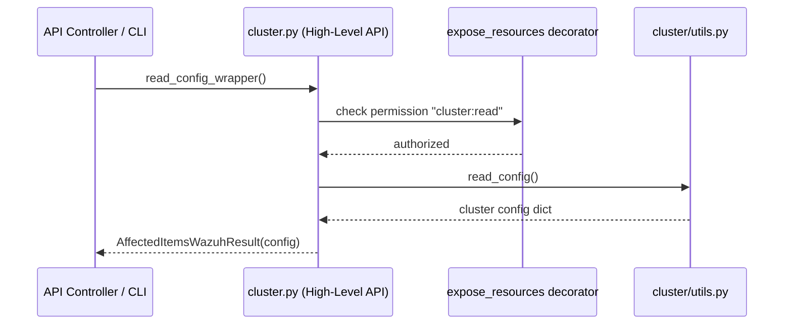
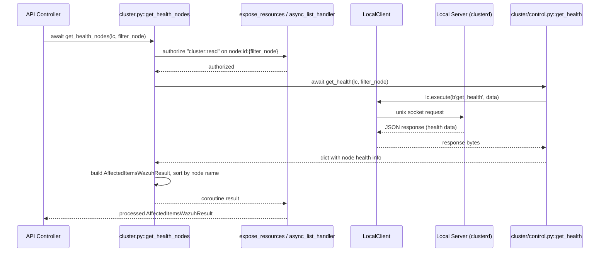
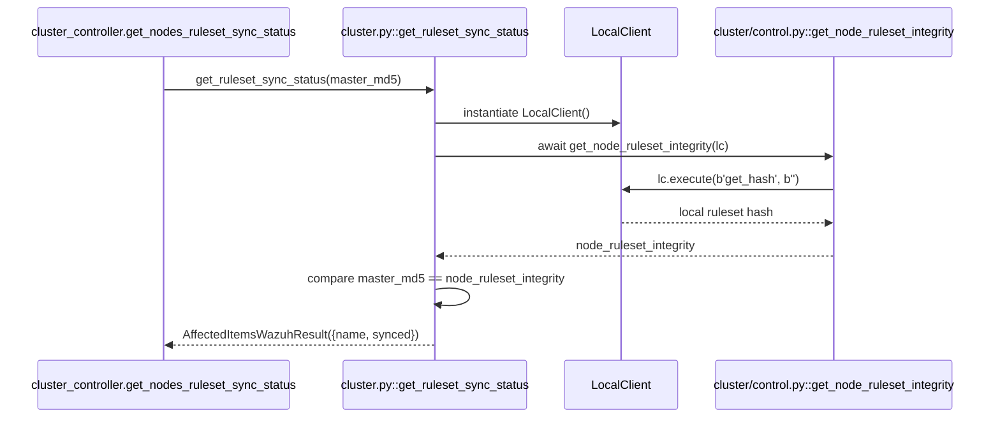
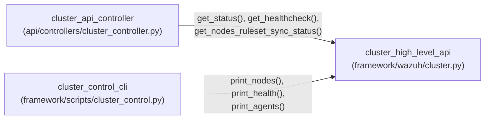

# Cluster High-Level API

## Introduction

The **Cluster High-Level API** module (`framework/wazuh/cluster.py`) is the primary Python-facing interface that the Wazuh API and other framework consumers use to interact with the Wazuh cluster subsystem. It exposes a small set of RBAC-protected, high-level functions that:

- Read the local node's cluster configuration.
- Report the overall cluster status (enabled/running).
- Query cluster health information for one or more nodes.
- Compare the local node's custom ruleset (rules/decoders/lists) integrity hash against the master's, to determine synchronization status.

This module acts as a **thin orchestration layer**: it does not implement cluster networking, node discovery, or health-check logic itself. Instead, it delegates to lower-level cluster core components (`framework/wazuh/core/cluster/*`) and wraps their results with the `AffectedItemsWazuhResult`/`WazuhResult` types used throughout the Wazuh framework, while enforcing RBAC authorization via decorators.

This module is a child of [cluster_module](cluster_module.md) and is consumed by the [cluster_api_controller](cluster_api_controller.md), which exposes it over the REST API, and by [cluster_control_cli](cluster_control_cli.md), a CLI tool for administrators.

---

## Purpose and Core Functionality

| Function | Purpose |
|---|---|
| `read_config_wrapper()` | Returns the raw cluster configuration (from `ossec.conf`) as read by the core cluster utilities. |
| `get_node_wrapper()` | Returns basic identity information about the current node (`node`, `cluster`, `type`). |
| `get_status_json()` | Returns whether clustering is enabled and whether the `wazuh-clusterd` daemon is running. |
| `get_health_nodes()` | Asynchronously retrieves detailed health-check information for one or more nodes, via the Local Client/Local Server protocol. |
| `get_nodes_info()` | Retrieves the list of registered cluster nodes, filtered and validated against the locally known node set. |
| `get_ruleset_sync_status()` | Compares the local node's ruleset MD5 checksum against a master-provided checksum to detect ruleset synchronization drift. |

All functions are decorated with `@expose_resources`, which enforces **RBAC** (Role-Based Access Control) checks (e.g., `cluster:read`, `cluster:status`) before allowing the function body to execute. Async functions additionally use `async_list_handler` (from [security_rbac_module_engine](security_rbac_module_engine.md)) as a post-processing hook to convert coroutine results into properly paginated/sorted `AffectedItemsWazuhResult` objects.

---

## Architecture

### Position in the System

### Internal Component Relationships

---

## Data Flow

### Synchronous Flow: `read_config_wrapper` / `get_status_json` / `get_node_wrapper`

These functions do not require cross-node communication; they read local configuration/state directly.

### Asynchronous Flow: `get_health_nodes`

This flow requires querying the local `wazuh-clusterd` daemon through the Unix-socket based Local Client/Local Server protocol (see [cluster_local_client](cluster_local_client.md) and [cluster_local_server](cluster_local_server.md)).

### Ruleset Synchronization Check: `get_ruleset_sync_status`

---

## Component Details

### `read_config_wrapper()`
Wraps `wazuh.core.cluster.utils.read_config()`, which reads and normalizes the `<cluster>` section of `ossec.conf`. Returns default values for missing fields, and raises `WazuhError` for malformed configuration (e.g. a non-numeric port). Errors are captured and reported through `AffectedItemsWazuhResult.add_failed_item`.

### `get_node_wrapper()`
Wraps `wazuh.core.cluster.cluster.get_node()`, returning the current node's identity (`node`, `cluster`, `type`), which is derived directly from the cluster configuration.

### `get_status_json()`
Wraps `wazuh.core.cluster.utils.get_cluster_status()`. It reports:
- `enabled`: whether the `<cluster>` block is enabled in `ossec.conf`.
- `running`: whether the `wazuh-clusterd` process is currently running (queried via `pyDaemonModule`, part of [framework_core_utils](framework_core_utils.md)).

This endpoint is exposed with `resources=['*:*:*']` and no post-processing function, since it returns a scalar status object rather than a filterable list.

### `get_health_nodes(lc, filter_node)`
An **async** function that queries cluster-wide health information via `wazuh.core.cluster.control.get_health()`. It requires a `LocalClient` instance (see [cluster_local_client](cluster_local_client.md)) to communicate with the local `wazuh-clusterd` process over a Unix domain socket. Results are sorted by node name and wrapped in an `AffectedItemsWazuhResult`. The `async_list_handler` post-processing function (from [security_rbac_module_engine](security_rbac_module_engine.md)) applies list-processing semantics (pagination/sorting/searching) to the coroutine's resolved value.

### `get_nodes_info(lc, filter_node, **kwargs)`
Fetches the list of currently registered nodes via `wazuh.core.cluster.control.get_nodes()`. It cross-references the requested `filter_node` values against `common.cluster_nodes` (a framework-wide cached set of known cluster node names) to detect and report non-existent nodes as failed items (`WazuhResourceNotFound`).

### `get_ruleset_sync_status(master_md5)`
Used by master nodes to verify whether each worker's custom ruleset (rules, decoders, CDB lists — see [rule_module](rule_module.md) and [cdb_list_module](cdb_list_module.md)) is synchronized. It creates a fresh `LocalClient()`, requests the local `get_hash` command (implemented server-side, likely in [cluster_master](cluster_master.md) or [cluster_worker](cluster_worker.md) handlers), and compares the resulting MD5 against a `master_md5` value supplied by the caller (typically aggregated across nodes by [cluster_api_controller](cluster_api_controller.md)).

---

## RBAC and Result Wrapping Conventions

All public functions in this module follow two consistent framework-wide patterns, both defined outside this module:

1. **RBAC enforcement** via `@expose_resources(actions=[...], resources=[...])`, decorators implemented in `framework/wazuh/rbac/decorators.py` (see [security_rbac_module_engine](security_rbac_module_engine.md)). This checks the caller's permissions against the specified action/resource pairs before invoking the wrapped function, and can inject `filter_node` values dynamically resolved from resource patterns (e.g., `node:id:{filter_node}`).

2. **Result wrapping** via `AffectedItemsWazuhResult` / `WazuhResult`, defined in `framework/wazuh/core/results.py` (see [framework_core_utils](framework_core_utils.md)). These provide consistent success/partial-success/failure messaging, sorting, and pagination behavior that the API layer ([cluster_api_controller](cluster_api_controller.md)) and CLI layer ([cluster_control_cli](cluster_control_cli.md)) rely on to render responses uniformly across the entire Wazuh API surface.

---

## Dependencies

| Dependency | Module | Role |
|---|---|---|
| `wazuh.core.cluster.local_client.LocalClient` | [cluster_local_client](cluster_local_client.md) | Unix-socket client used to communicate with the local `wazuh-clusterd` process for health/ruleset queries. |
| `wazuh.core.cluster.cluster.get_node` | [cluster_core_utilities](cluster_core_utilities.md) | Reads current node identity from cluster configuration. |
| `wazuh.core.cluster.control.get_health / get_nodes / get_node_ruleset_integrity` | [cluster_control_helpers](cluster_control_helpers.md) | Implements the actual request/response logic against the cluster daemon. |
| `wazuh.core.cluster.utils.read_cluster_config / read_config / get_cluster_status` | [cluster_utils](cluster_utils.md) | Reads and normalizes cluster configuration; queries daemon running status. |
| `wazuh.core.exception.WazuhError / WazuhResourceNotFound` | Wazuh core exceptions | Standard error types raised/caught for failed items. |
| `wazuh.core.results.AffectedItemsWazuhResult / WazuhResult` | [framework_core_utils](framework_core_utils.md) | Standard response envelope types used across the whole framework. |
| `wazuh.rbac.decorators.expose_resources / async_list_handler` | [security_rbac_module_engine](security_rbac_module_engine.md) | RBAC enforcement and async list post-processing. |

---

## Consumers

- **[cluster_api_controller](cluster_api_controller.md)**: Exposes these functions as REST endpoints (`GET /cluster/status`, `GET /cluster/healthcheck`, `GET /cluster/ruleset/synchronization`, etc.), handling HTTP request parsing and response formatting on top of the `AffectedItemsWazuhResult`/`WazuhResult` objects returned here.
- **[cluster_control_cli](cluster_control_cli.md)**: The `cluster_control` command-line tool (`framework/scripts/cluster_control.py`) calls into the same core functions (`get_health`, `get_nodes`, `get_agents`) — often directly via `framework/wazuh/core/cluster/control.py` rather than through this high-level wrapper — to print human-readable cluster status information.

---

## Related Documentation

- [cluster_module](cluster_module.md) — Parent module overview covering the entire Wazuh cluster subsystem (master/worker daemons, DAPI, HAProxy helper, etc.).
- [cluster_api_controller](cluster_api_controller.md) — REST API controller consuming this module.
- [cluster_control_cli](cluster_control_cli.md) — CLI tool consuming cluster core functions.
- [cluster_local_client](cluster_local_client.md) — Unix-socket client implementation used for communicating with `wazuh-clusterd`.
- [cluster_local_server](cluster_local_server.md) — Server-side handler for local client requests (master/worker variants).
- [cluster_control_helpers](cluster_control_helpers.md) — Implementation of `get_health`, `get_nodes`, `get_agents`, `get_node_ruleset_integrity`.
- [cluster_core_utilities](cluster_core_utilities.md) — Node identity and file-status utilities (`get_node`, `compress_files`, `get_files_status`).
- [cluster_utils](cluster_utils.md) — Cluster configuration reading and status utilities.
- [cluster_master](cluster_master.md) / [cluster_worker](cluster_worker.md) — Server-side daemons implementing the actual synchronization and command handling logic.
- [security_rbac_module_engine](security_rbac_module_engine.md) — RBAC decorators (`expose_resources`, `async_list_handler`) used to authorize and post-process these functions.
- [framework_core_utils](framework_core_utils.md) — `AffectedItemsWazuhResult`/`WazuhResult` and other cross-cutting framework utilities.
