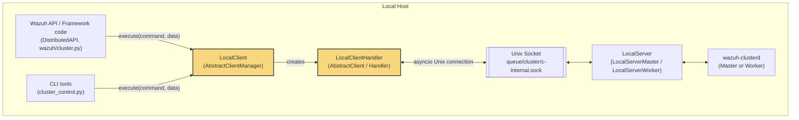
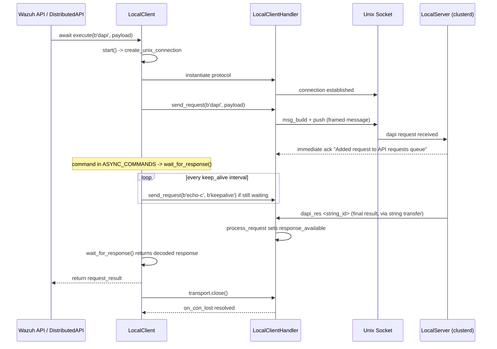
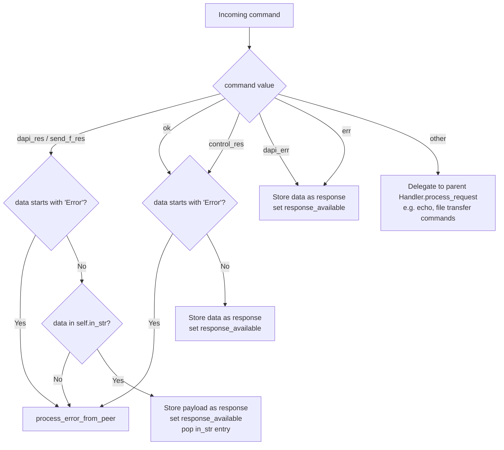

# Cluster Local Client Module

## Introduction

The **cluster_local_client** module implements the client-side counterpart of the Wazuh cluster's *local* communication channel. It provides the `LocalClient` and `LocalClientHandler` classes, which are used by any local process (mainly the Wazuh API and CLI tools such as `cluster_control`) to talk to the `wazuh-clusterd` process running on the same host, over a Unix domain socket (`queue/cluster/c-internal.sock`).

While the rest of the cluster subsystem (`cluster_client`, `cluster_master`, `cluster_worker`, `cluster_local_server`) deals with **inter-node** communication over TCP (master ↔ workers), the `cluster_local_client` module deals with **intra-node** communication: a local component asking the local `wazuh-clusterd` (through its `LocalServer`) to run a Distributed API (DAPI) request, forward a file, or fetch cluster status/health information, without needing to know which node in the cluster actually holds the requested resource.

This document explains the module's purpose, its internal architecture, how it fits into the broader cluster communication stack, and the request/response life cycle it implements.

## Purpose and Responsibilities

`LocalClient` is a lightweight, short-lived client used to:

- Send Distributed API (DAPI) requests from the Wazuh API/framework to the local `wazuh-clusterd` process, which then routes them to the appropriate node (master or worker) transparently.
- Send synchronous "send file"/"send sync" requests to the cluster daemon (e.g., pushing configuration files to be distributed).
- Query basic control/status endpoints exposed by the `LocalServer` (e.g., node list, cluster health) via the `dapi`/`control_res` protocol commands.

Typical callers include:
- `framework/wazuh/core/cluster/dapi/dapi.py` (`DistributedAPI`), which uses `LocalClient` to submit API requests that must be executed cluster-wide.
- `framework/wazuh/cluster.py` (high-level cluster API, e.g., `get_health_nodes`, `get_status_json`) — see [cluster_high_level_api](cluster_high_level_api.md).
- `framework/scripts/cluster_control.py` CLI tool — see [cluster_control_cli](cluster_control_cli.md).

## Architecture Overview

`LocalClient` and `LocalClientHandler` reuse the generic asyncio-based cluster communication framework defined in [cluster_client](cluster_client.md) (`AbstractClient`, `AbstractClientManager`) and [cluster_common_protocol](cluster_common_protocol.md) (`Handler`, message framing, encryption). The key structural difference versus a "real" cluster client (which connects master↔worker over TCP with Fernet encryption) is:

- The transport is a **Unix domain socket**, not TCP.
- No **Fernet** encryption key is used (`fernet_key=''`), since communication stays local to the host.
- No "hello" handshake is required; the local server assigns the client a random name.
- The connection is **short-lived**: a `LocalClient` instance connects, sends exactly one request (or a `send_file` operation), awaits the single response, and disconnects.

### Relationship to Sibling Modules

| Module | Role | Reference |
|---|---|---|
| `cluster_common_protocol` | Base `Handler` class: message framing, encryption, request/response bookkeeping | [cluster_common_protocol.md](cluster_common_protocol.md) |
| `cluster_client` | Base `AbstractClient` / `AbstractClientManager`: generic client connection lifecycle (used for worker→master TCP connections and reused here) | [cluster_client.md](cluster_client.md) |
| `cluster_local_server` | Server side that accepts connections from `LocalClient` instances and dispatches `dapi`, `dapi_fwd`, `get_nodes`, `get_health`, etc. | [cluster_local_server.md](cluster_local_server.md) |
| `cluster_dapi` | `DistributedAPI` class that uses `LocalClient` to submit API calls to be executed anywhere in the cluster | [cluster_dapi.md](cluster_dapi.md) |
| `cluster_high_level_api` | High level functions (`framework/wazuh/cluster.py`) consuming `LocalClient`/`LocalServer` indirectly | [cluster_high_level_api.md](cluster_high_level_api.md) |
| `cluster_control_cli` | CLI script printing cluster node/health/agent information, built on top of the high-level API | [cluster_control_cli.md](cluster_control_cli.md) |
| `cluster_utils` | Shared cluster utility functions such as `read_config()` and `get_cluster_items()` used to initialize `LocalClient` | [cluster_utils.md](cluster_utils.md) |

## Core Components

### `LocalClientHandler`

`LocalClientHandler` extends `AbstractClient` (from [cluster_client](cluster_client.md)) and represents the asyncio `Protocol` instance bound to the Unix socket connection. Its responsibilities:

- **`connection_made`**: Simply stores the `transport`. Unlike a worker connecting to a master, no `hello` handshake is sent, because the local server assigns a name automatically.
- **`process_request`**: Overrides the generic `Handler.process_request` to handle response-only commands sent back by the local server:
  - `dapi_res` / `send_f_res`: DAPI or "send file" response, retrieved from the `in_str` buffer (large string transfer mechanism inherited from `Handler`).
  - `ok`: Generic "sendsync" response.
  - `control_res`: Response to control commands (e.g., `get_nodes`, `get_health`).
  - `dapi_err`: An error occurred while the master processed a DAPI request forwarded from a worker.
  - `err`: Generic error response.
  - Any other command falls back to the parent class's `process_request` (echo, file transfer commands, etc., see [cluster_common_protocol](cluster_common_protocol.md)).
- **`process_error_from_peer`**: Because errors from the cluster are already JSON-encoded, this simply stores and signals the raw payload.
- **`connection_lost`**: Marks the `on_con_lost` future as completed, allowing `LocalClient.execute()` to proceed with cleanup.
- Uses an `asyncio.Event` (`response_available`) and a buffer (`response`) to communicate the received payload back to the coroutine that is awaiting the response (`LocalClient.wait_for_response`).

### `LocalClient`

`LocalClient` extends `AbstractClientManager` (from [cluster_client](cluster_client.md)) and orchestrates the full lifecycle of a single request:

- **Constructor**: Reads cluster configuration (`wazuh.core.cluster.utils.read_config()`) and cluster items (`get_cluster_items()`), disables SSL (`enable_ssl=False`), and doesn't use performance/concurrency test parameters (these exist only because the parent class is shared with real cluster clients).
- **`start()`**: Opens a Unix domain socket connection to `queue/cluster/c-internal.sock` using `loop.create_unix_connection`, instantiating a `LocalClientHandler`. Handles common failure modes by raising Wazuh-specific exceptions:
  - `ConnectionRefusedError` / `FileNotFoundError` → `WazuhInternalError(3012)` (clusterd not running / socket missing).
  - `MemoryError` → `WazuhInternalError(1119)`.
  - Any other exception → `WazuhInternalError(3009, ...)`.
- **`wait_for_response(timeout)`**: Waits for `protocol.response_available` to be set, but periodically (every `intervals.worker.keep_alive` seconds) sends an `echo-c` "keepalive" request to the local server so the connection isn't dropped due to inactivity while a long-running distributed operation (e.g., a DAPI call across multiple nodes) is in progress. Raises `WazuhInternalError(3020)` on timeout.
- **`send_api_request(command, data)`**: Sends the request via `Handler.send_request` (inherited machinery) and decides how to interpret the reply:
  - If the immediate reply says `'There are no connected worker nodes'`, returns an empty dict (in dict-serialized form, since this is later JSON-processed by the DAPI layer).
  - If the command is asynchronous (`dapi`, `dapi_fwd`, `send_file`, `sendasync`) or the immediate reply is `'Sent request to master node'`, it waits for the actual delayed response via `wait_for_response()`, using the `communication.timeout_dapi_request` cluster interval as timeout.
  - Otherwise, returns the immediate result directly.
- **`execute(command, data)`**: Public entry point — opens the connection (`start()`), sends the request (`send_api_request()`), and ensures cleanup (`transport.close()` + await `on_con_lost`) in a `finally` block, regardless of success or failure.
- **`send_file(path, node_name=None)`**: Convenience method to send a `send_file` command with `"<path> <node_name>"` as payload — used to push files (e.g., configuration) to a specific node through the master.

## Data Flow

### Sequence: A Typical DAPI Request

### Command Handling Flow (inside `LocalClientHandler.process_request`)

## Key Design Points

- **Statelessness / short lifetime**: Each `LocalClient` instance is meant for a single request-response cycle (`execute()`), unlike `Worker`/`Master` handlers which maintain long-lived persistent connections. This simplifies error handling and resource cleanup.
- **No encryption**: Since traffic never leaves the local machine (Unix socket), Fernet encryption (used for master↔worker TCP traffic, see [cluster_common_protocol](cluster_common_protocol.md)) is disabled by passing an empty `fernet_key`.
- **Reuse of large-message machinery**: Because DAPI responses (e.g., full inventory listings) can exceed the single-message chunk size, `LocalClientHandler` relies on the string-transfer protocol (`new_str`/`str_upd`, `send_string`) inherited from `Handler`, and on the `in_str` buffer to reassemble responses before signalling `response_available`.
- **Keepalive during long waits**: `wait_for_response` proactively issues `echo-c` keepalives so that a slow/distributed DAPI call (spanning multiple cluster nodes) doesn't cause the local server to time out and drop the connection.
- **Uniform error mapping**: Connection issues are translated into specific `WazuhInternalError` codes (3009, 3012, 1119, 3020) that the API layer can present meaningfully to end users.

## Usage Context in the System

`LocalClient` is the entry point used whenever code running on a Wazuh manager node needs to reach the cluster subsystem without directly knowing cluster topology. It abstracts away whether the current node is a `master` or `worker`:

- If running on a **worker**, a `dapi` request sent to the local server is automatically forwarded (`dapi_fwd`) to the master node's cluster connection and the response routed back — see [cluster_worker](cluster_worker.md) and [cluster_master](cluster_master.md).
- If running on the **master**, the request may be queued directly for local processing or forwarded to a worker node depending on the target agent/resource — see [cluster_local_server](cluster_local_server.md) (`LocalServerHandlerMaster.process_request`).

This makes `LocalClient` a foundational piece for the API's cluster-transparency guarantee: any API call (agent management, configuration, statistics, etc. — see modules like [agent_module](agent_module.md), [manager_module](manager_module.md)) can be executed regardless of which physical node holds the required data, by routing through the local `wazuh-clusterd` daemon using this client.

## Related Documentation

- [cluster_client.md](cluster_client.md) — Base client classes (`AbstractClient`, `AbstractClientManager`) reused here.
- [cluster_common_protocol.md](cluster_common_protocol.md) — Shared `Handler` protocol implementation: message framing, encryption, file/string transfer.
- [cluster_local_server.md](cluster_local_server.md) — Server-side counterpart accepting `LocalClient` connections.
- [cluster_dapi.md](cluster_dapi.md) — Distributed API layer that is the primary consumer of `LocalClient`.
- [cluster_high_level_api.md](cluster_high_level_api.md) — Higher-level cluster status/health functions built on top of this communication path.
- [cluster_control_cli.md](cluster_control_cli.md) — CLI tool consuming the cluster API stack.
- [cluster_utils.md](cluster_utils.md) — Configuration/utility helpers used during `LocalClient` initialization.
