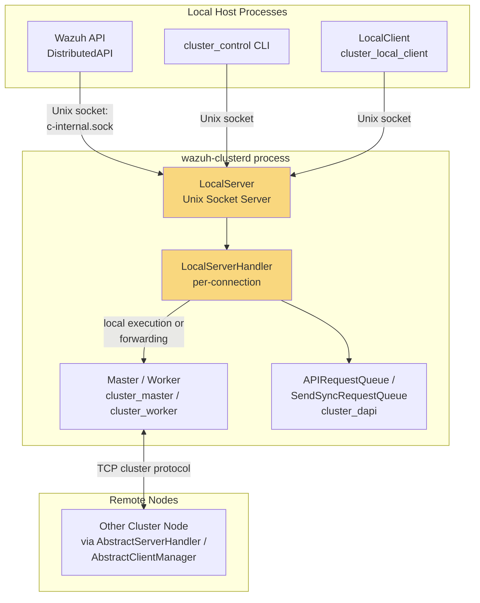
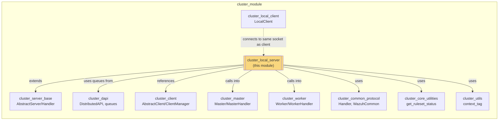
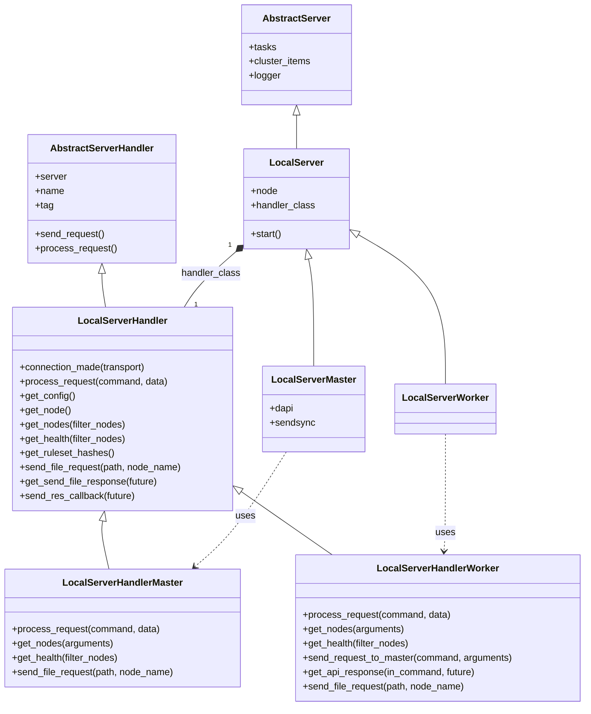
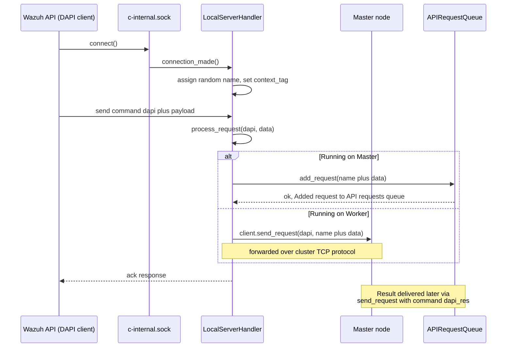
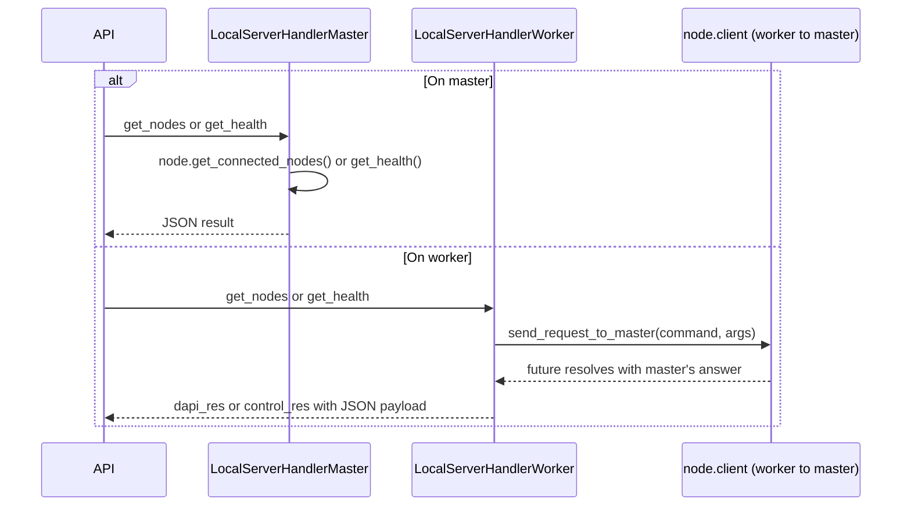
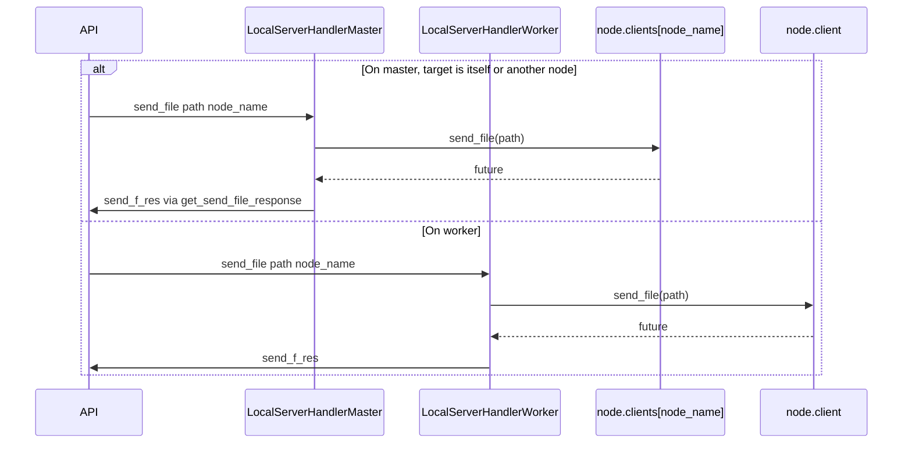
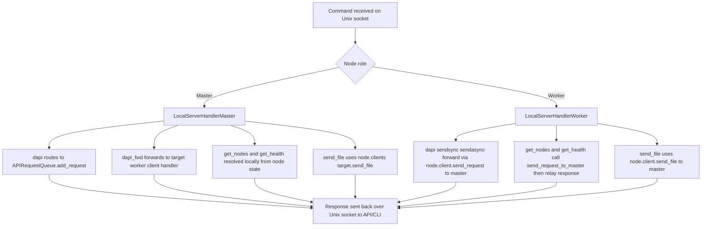

# Cluster Local Server

## Introduction

The **Cluster Local Server** module (`framework/wazuh/core/cluster/local_server.py`) implements the Unix-socket server that the Wazuh Cluster daemon (`wazuh-clusterd`) exposes locally on every node — master or worker — so that other local Wazuh processes (mainly the **Wazuh API**) can talk to the cluster subsystem without needing to know whether they are running on a master or a worker node.

It is the "front door" of the cluster from the point of view of the local host: the API's Distributed API (DAPI) layer, the `cluster_control` CLI, and other local components connect to a Unix Domain Socket (`queue/cluster/c-internal.sock`) and issue simple text commands (`dapi`, `get_nodes`, `get_health`, `send_file`, `get_config`, `get_hash`, ...). The Local Server module receives these commands, executes them locally when possible (on the master) or transparently forwards them to the master through the cluster's internal TCP protocol (on a worker), and returns the result back to the local caller.

This module is a thin adaptation layer on top of the generic server/handler abstractions defined in [cluster_server_base](cluster_server_base.md) and reuses the DAPI request queues defined in [cluster_dapi](cluster_dapi.md). It complements — but must not be confused with — [cluster_local_client](cluster_local_client.md), which implements the *client* side of the same Unix socket (used by short-lived CLI tools such as `cluster_control`).

## Role in the System



The Local Server never talks to remote nodes directly. Instead:
- On the **master**, it queues DAPI requests (via [cluster_dapi](cluster_dapi.md)) and can directly query cluster-wide state (nodes, health) because the master node object holds the full picture of the cluster.
- On a **worker**, it forwards almost everything to the master through the worker's client connection (`AbstractClientManager`, see [cluster_client](cluster_client.md) and [cluster_worker](cluster_worker.md)), because a worker does not have global visibility of the cluster.

## Module Position in the Cluster Package



## Core Components

| Component | Extends | Runs on | Purpose |
|---|---|---|---|
| `LocalServerHandler` | `server.AbstractServerHandler` | Both | Base per-connection handler shared by master and worker; implements common commands (`get_config`, `get_hash`) and declares abstract hooks (`get_nodes`, `get_health`, `send_file_request`). |
| `LocalServer` | `server.AbstractServer` | Both | Base Unix-socket server; creates the asyncio Unix server bound to `c-internal.sock`. |
| `LocalServerHandlerMaster` | `LocalServerHandler` | Master | Handles `dapi` and `dapi_fwd` locally, resolves `get_nodes`/`get_health` directly, and sends files straight to the target worker client. |
| `LocalServerMaster` | `LocalServer` | Master | Instantiates `LocalServerHandlerMaster`, owns the `APIRequestQueue` and `SendSyncRequestQueue` (from [cluster_dapi](cluster_dapi.md)) as background tasks. |
| `LocalServerHandlerWorker` | `LocalServerHandler` | Worker | Forwards `dapi`, `sendsync`, `sendasync`, `get_nodes`, `get_health`, and `send_file` requests to the master through the worker's outbound client connection. |
| `LocalServerWorker` | `LocalServer` | Worker | Instantiates `LocalServerHandlerWorker`; has no DAPI queues of its own (all API requests transit through the master). |

## Class Diagram



## Startup Sequence

`LocalServerMaster`/`LocalServerWorker` are instantiated by the entry point script `wazuh_clusterd.py` (see [wazuh_clusterd_daemon](wazuh_clusterd_daemon.md)) once the corresponding `Master`/`Worker` object (see [cluster_master](cluster_master.md) and [cluster_worker](cluster_worker.md)) is created; the `LocalServer.start()` coroutine is scheduled alongside the node's own TCP server/client task.

```mermaid
sequenceDiagram
    participant Main as wazuh_clusterd.py
    participant Node as Master / Worker
    participant LS as LocalServerMaster / LocalServerWorker
    participant Loop as asyncio event loop

    Main->>Node: create Master or Worker
    Main->>LS: create LocalServer with node
    Node->>LS: node.local_server = LS
    Main->>Loop: asyncio.gather(node.start(), LS.start())
    LS->>Loop: create_unix_server bound to c-internal.sock
    Loop-->>LS: server bound and listening
    LS->>Loop: os.chmod(socket, 0o660)
    LS->>Loop: tasks.append(serve_forever)
    Note over LS: On master, also schedules<br/>dapi.run and sendsync.run tasks
```

## Request Processing Flow

Every accepted connection is handled by a new `LocalServerHandler*` instance whose `connection_made()` registers it in `server.clients` and assigns a random per-connection name used to correlate asynchronous replies (mirroring the reply routing used by the DAPI queues in [cluster_dapi](cluster_dapi.md)).



### get_nodes and get_health



### send_file

Used by the API to push configuration/manager files into the cluster (e.g., agent group files):



## Command Reference

| Command (bytes) | Handled in | Behavior |
|---|---|---|
| `get_config` | `LocalServerHandler` (base) | Returns the active cluster JSON configuration from `self.server.configuration`. |
| `get_hash` | `LocalServerHandler` (base) | Returns local ruleset paths and checksums via `cluster.get_ruleset_status()` (see [cluster_core_utilities](cluster_core_utilities.md)). |
| `send_file` | `LocalServerHandler` (base dispatch) → `send_file_request()` (overridden) | Sends a local file to a given cluster node; master sends directly, worker forwards to master. |
| `dapi` | Master/Worker override | Master enqueues to `APIRequestQueue`; worker forwards through its client connection to the master. |
| `dapi_fwd` | `LocalServerHandlerMaster` only | Forwards a DAPI request that already targets a specific `node_name` to that worker's client handler. |
| `sendsync` | `LocalServerHandlerWorker` only | Synchronous request forwarded to the master; no immediate ack payload (returns `None, None`). |
| `sendasync` | `LocalServerHandlerWorker` only | Asynchronous variant of `sendsync`, returns an immediate ack. |
| `get_nodes` | Master/Worker override | Master resolves locally via `node.get_connected_nodes()`; worker forwards to master. |
| `get_health` | Master/Worker override | Master resolves locally via `node.get_health()`; worker forwards to master. |
| *(anything else)* | `server.AbstractServerHandler.process_request` | Falls back to generic cluster protocol commands (handshake, ping, etc.) defined in [cluster_server_base](cluster_server_base.md). |

## Master vs. Worker Behavior Summary



## Error Handling

- If a worker's outbound connection to the master (`self.server.node.client`) is not yet established, `WazuhClusterError(3023)` is raised for any request that must be forwarded (`dapi`, `sendsync`, `get_nodes`, `get_health`, `send_file`).
- If a master receives `dapi_fwd` for a `node_name` that is not currently connected, `WazuhClusterError(3022)` is raised.
- Exceptions from fire-and-forget tasks (e.g., `log_exceptions`, `send_res_callback`) are logged rather than propagated, to avoid crashing the asyncio event loop that also serves other connections.

## Relationship to Other Cluster Components

- **[cluster_server_base](cluster_server_base.md)** — Supplies the generic `AbstractServer`/`AbstractServerHandler` base classes (connection lifecycle, protocol framing, handshake) that `LocalServer`/`LocalServerHandler` extend.
- **[cluster_dapi](cluster_dapi.md)** — `LocalServerMaster` owns and drives the `APIRequestQueue` and `SendSyncRequestQueue` background tasks that actually execute Distributed API requests and route sync messages between nodes.
- **[cluster_master](cluster_master.md)** / **[cluster_worker](cluster_worker.md)** — The `node` reference held by every `LocalServer` instance is a `Master` or `Worker` object; `get_nodes`, `get_health`, and `send_file` delegate to methods exposed by those classes.
- **[cluster_client](cluster_client.md)** — On worker nodes, forwarding relies on the `AbstractClientManager`'s `client.send_request`/`send_file` methods to reach the master over the cluster TCP protocol.
- **[cluster_local_client](cluster_local_client.md)** — Implements the counterpart *client* side of the same Unix socket protocol; short-lived tools like `cluster_control` use it to talk to this Local Server.
- **[cluster_core_utilities](cluster_core_utilities.md)** — Provides `get_ruleset_status()`, used to answer the `get_hash` command.
- **[cluster_utils](cluster_utils.md)** — Supplies the `context_tag` context variable used for structured per-connection logging.
- **[cluster_high_level_api](cluster_high_level_api.md)** and the **[cluster_api_controller](cluster_api_controller.md)** — Consume this Local Server indirectly: API endpoints for cluster status, node health, and configuration ultimately issue requests that traverse this socket.

## Key Design Notes

1. **Uniform API surface across roles** — Callers (the Wazuh API, `cluster_control`) issue the exact same commands regardless of whether the underlying node is a master or a worker; the role-specific subclasses hide the topology difference.
2. **Non-blocking forwarding** — All forwarding to the master or to peer nodes is implemented with `asyncio.create_task` plus `add_done_callback`, so a single local server can service many concurrent local clients without blocking on cluster round-trips.
3. **Unix Domain Socket isolation** — The server binds exclusively to `queue/cluster/c-internal.sock` with restrictive permissions (`0o660`), keeping this control-plane channel local to the host and inaccessible from the network.
4. **uvloop integration** — The event loop policy is set to `uvloop` for lower-latency asyncio operations, consistent with the rest of the cluster's asyncio-based transports (see [cluster_common_protocol](cluster_common_protocol.md)).
