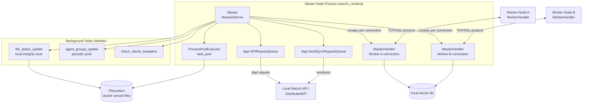
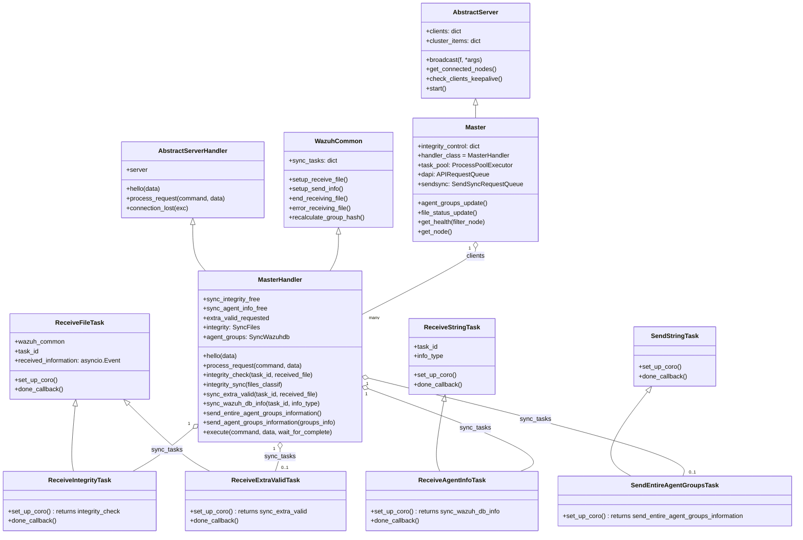
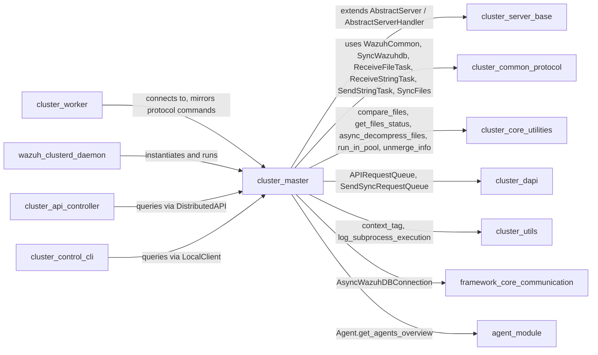
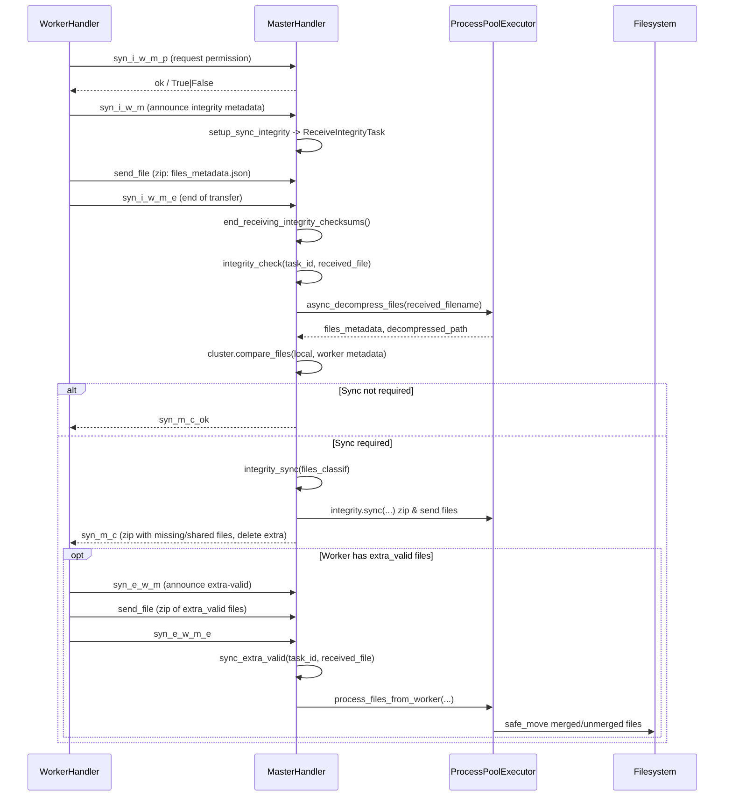
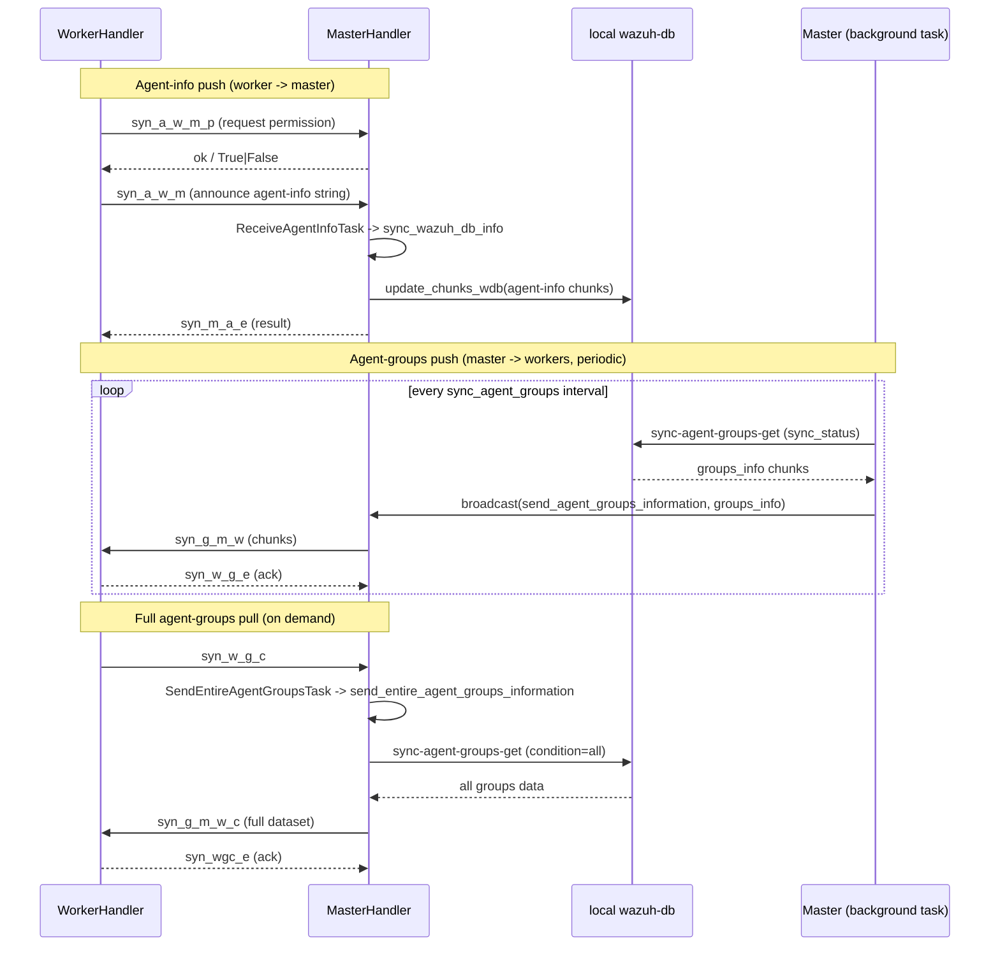
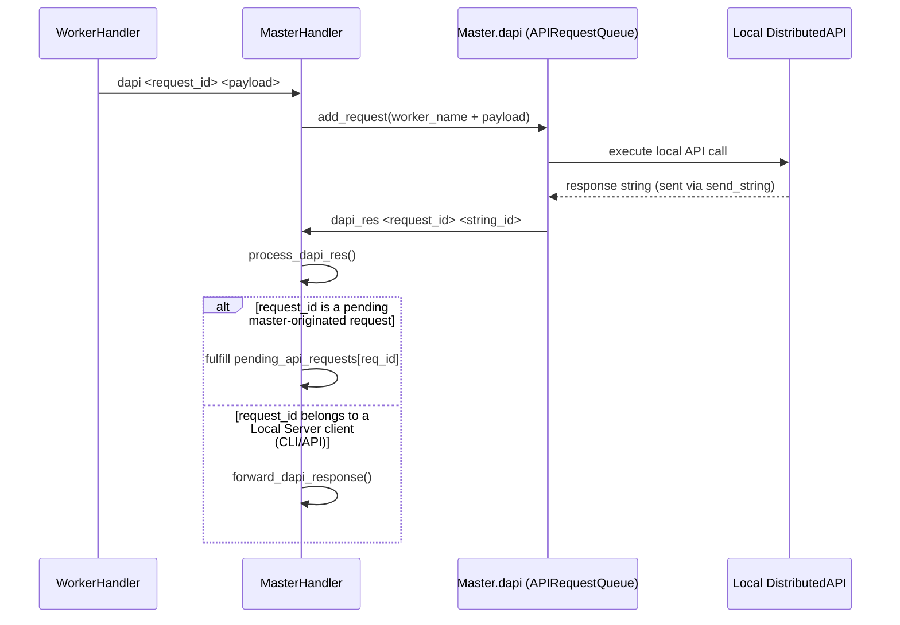

# Cluster Master Module

## Introduction

The **cluster_master** module implements the **master-side orchestration logic** of the Wazuh cluster. It is the counterpart of [cluster_worker](cluster_worker.md): while worker nodes push local integrity metadata, agent information and agent-group changes up to the master, the `Master` and `MasterHandler` classes defined in `framework/wazuh/core/cluster/master.py` are responsible for **receiving, validating, comparing and redistributing** that information across the whole cluster.

This module is the central authority of a Wazuh cluster deployment: it decides which files a worker is missing, outdated or has extra, keeps the ground-truth of agent-group assignments, and multiplexes Distributed API (DAPI) and Send-Sync requests coming from workers so they can be executed against the local manager or forwarded to other cluster members.

It builds directly on the generic networking/protocol abstractions provided by [cluster_server_base](cluster_server_base.md) (`AbstractServer` / `AbstractServerHandler`) and [cluster_common_protocol](cluster_common_protocol.md) (`WazuhCommon`, `SyncWazuhdb`, `ReceiveFileTask`, `ReceiveStringTask`, `SendStringTask`), and it is exercised at runtime by the [wazuh_clusterd_daemon](wazuh_clusterd_daemon.md) entry point when the node is configured as a master. Distributed requests and sync-queue processing rely on [cluster_dapi](cluster_dapi.md), and low level file/zip comparison utilities come from [cluster_core_utilities](cluster_core_utilities.md).

## Responsibilities

- Accept and track worker connections (`MasterHandler` instances, one per connected worker).
- Run a periodic **local integrity scan** (`Master.file_status_update`) to keep an up-to-date map of local file checksums (`integrity_control`).
- Handle **Integrity Check** requests from workers: compare the worker's file metadata against the master's local metadata and classify differences into `missing`, `shared`, `extra` and `extra_valid` files.
- Run **Integrity Sync**: package and send the files a worker needs (via zip transfer) and, when necessary, receive `extra_valid` files back from the worker to update the master's own extra/merged files (e.g. client keys metadata, group files).
- Synchronize **Agent-info** (`agent-info` chunked JSON data) pushed by workers into local `wazuh-db`.
- Synchronize **Agent-groups** data bidirectionally:
  - Periodically push incremental agent-group changes to all workers (`Master.agent_groups_update`).
  - Serve full agent-group snapshots to a worker on demand (`send_entire_agent_groups_information`).
- Multiplex and dispatch **DAPI** (`dapi`/`dapi_res`/`dapi_fwd`) and **SendSync** requests between workers, the local manager, and other workers.
- Expose cluster **health** and **node discovery** information (`get_health`, `get_nodes`, `to_dict`) consumed by the API ([cluster_api_controller](cluster_api_controller.md)) and CLI ([cluster_control_cli](cluster_control_cli.md)).
- Track per-worker keepalive and forcibly disconnect stale workers.

## Core Components

| Component | Type | Purpose |
|---|---|---|
| `Master` | class (extends `AbstractServer`) | The cluster server itself. Owns the client dictionary, the local integrity map, the process pool used for CPU-bound sync work, and the periodic background tasks. |
| `MasterHandler` | class (extends `AbstractServerHandler`, `WazuhCommon`) | Per-worker connection handler. Implements the master-side protocol: command dispatch, integrity check/sync, agent-info sync, agent-groups push/pull, DAPI/SendSync forwarding. |
| `ReceiveIntegrityTask` | class (extends `ReceiveFileTask`) | Asyncio task that waits for a worker's integrity metadata zip and hands it to `MasterHandler.integrity_check`. |
| `ReceiveExtraValidTask` | class (extends `ReceiveFileTask`) | Asyncio task that waits for `extra_valid` files sent by the worker after an integrity sync, then processes them via `MasterHandler.sync_extra_valid`. |
| `ReceiveAgentInfoTask` | class (extends `ReceiveStringTask`) | Asyncio task that waits for a chunked JSON string of agent info sent by the worker, then calls `MasterHandler.sync_wazuh_db_info`. |
| `SendEntireAgentGroupsTask` | class (extends `SendStringTask`) | Asyncio task triggered when a worker requests the master's complete agent-groups dataset (`syn_w_g_c` command). |

## Architecture

## Class Relationships

## Dependencies

## Protocol / Command Flow

`MasterHandler.process_request` is the single dispatch point for every command a worker sends over the wire. The table below summarizes the master-side commands implemented in this module (commands not listed fall back to `AbstractServerHandler`/`Handler` base processing).

| Command (from worker) | Handler method | Purpose |
|---|---|---|
| `syn_i_w_m_p`, `syn_a_w_m_p` | `get_permission` | Worker asks whether it may start an Integrity or Agent-info sync (mutual exclusion via `sync_integrity_free` / `sync_agent_info_free`). |
| `syn_i_w_m`, `syn_e_w_m`, `syn_a_w_m` | `setup_sync_integrity` | Worker announces it is about to send Integrity metadata, Extra-valid files, or Agent-info; a receive task is created. |
| `syn_w_g_c` | `setup_send_info` | Worker requests the entire agent-groups dataset; triggers `SendEntireAgentGroupsTask`. |
| `syn_i_w_m_e`, `syn_e_w_m_e` | `end_receiving_integrity_checksums` | Marks the end of a file transfer for Integrity check / extra-valid sync. |
| `syn_i_w_m_r` | `process_sync_error_from_worker` | Worker reports an error during Integrity sync; releases the integrity lock. |
| `syn_w_g_e`, `syn_wgc_e` | inline in `process_request` | Marks completion of an agent-groups push (incremental / full). |
| `syn_w_g_err`, `syn_wgc_err` | inline in `process_request` | Worker reports an error while receiving agent-groups data. |
| `dapi` | inline in `process_request` | Enqueue a Distributed API request into `Master.dapi` (`APIRequestQueue`). |
| `dapi_res` | `process_dapi_res` | Deliver a DAPI response back to the pending API request or forward it to a Local Server client. |
| `get_nodes` | `get_nodes` | Return connected-node metadata (used by `GET /cluster/nodes`). |
| `get_health` | `get_health` | Return cluster healthcheck information. |
| `sendsync` | inline in `process_request` | Enqueue a Send-Sync request into `Master.sendsync`. |

## Sequence: Integrity Check & Sync

## Sequence: Agent-Info & Agent-Groups Synchronization

## Sequence: DAPI / SendSync Request Forwarding

## Key Design Aspects

### Mutual-exclusion locks for synchronization
`MasterHandler` maintains two lock-like flags to serialize costly operations per worker:
- `sync_integrity_free = [bool, timestamp]` — guards Integrity Check/Sync. The timestamp allows automatic self-recovery: if the lock stays `False` longer than `cluster_items['intervals']['master']['max_locked_integrity_time']`, it is force-released to avoid permanent deadlock (see `get_permission`).
- `sync_agent_info_free` — guards Agent-info synchronization.

### File classification and transfer
Integrity comparison (delegated to `cluster.compare_files` in [cluster_core_utilities](cluster_core_utilities.md)) produces four buckets: `missing`, `shared`, `extra`, `extra_valid`. Only `missing` and `shared` files are zipped and sent directly to the worker; `extra` files are listed for deletion on the worker; `extra_valid` files require the worker to send its version back to the master so it can decide how to merge them (handled by `process_files_from_worker`, executed in the `ProcessPoolExecutor` to avoid blocking the event loop).

### Process pool for CPU-bound work
`Master.task_pool` (a `ProcessPoolExecutor`) offloads expensive, blocking operations — file hashing (`get_files_status`), zip decompression (`async_decompress_files`), and extra-valid file processing (`process_files_from_worker`) — outside of the asyncio event loop. If `/dev/shm` is inaccessible, the master gracefully degrades by disabling the pool (`self.task_pool = None`).

### Background periodic tasks
Two long-running coroutines are appended to `Master.tasks` and run for the master's whole lifetime:
- `file_status_update`: recalculates local file integrity metadata on a fixed interval (`recalculate_integrity`).
- `agent_groups_update`: waits an initial `agent_group_start_delay` (to let workers reconnect after a restart), then periodically retrieves incremental agent-group changes from `wazuh-db` and broadcasts them to all connected workers.

### Healthcheck & node discovery
`Master.to_dict()` / `MasterHandler.to_dict()` compose the payload consumed by `GET /cluster/healthcheck` and `GET /cluster/nodes` (implemented in [cluster_api_controller](cluster_api_controller.md) and [cluster_high_level_api](cluster_high_level_api.md)) as well as by the `cluster_control -i` CLI ([cluster_control_cli](cluster_control_cli.md)) through [cluster_control_helpers](cluster_control_helpers.md).

## Relationship to Other Cluster Modules

- **[cluster_worker](cluster_worker.md)**: symmetrical counterpart running on worker nodes; drives the same protocol commands from the client side (`WorkerHandler`).
- **[cluster_server_base](cluster_server_base.md)**: supplies `AbstractServer`/`AbstractServerHandler`, the generic asyncio TCP server/connection-handler machinery that `Master`/`MasterHandler` extend.
- **[cluster_common_protocol](cluster_common_protocol.md)**: supplies the wire-protocol primitives (`Handler`, `WazuhCommon`, `SyncWazuhdb`, `SyncFiles`, `ReceiveFileTask`, `ReceiveStringTask`, `SendStringTask`, encryption/serialization helpers).
- **[cluster_core_utilities](cluster_core_utilities.md)**: file comparison, compression/decompression and merge/unmerge helper functions used during Integrity sync.
- **[cluster_dapi](cluster_dapi.md)**: `APIRequestQueue` and `SendSyncRequestQueue`, which the master uses to process `dapi`/`sendsync` requests coming from workers.
- **[cluster_utils](cluster_utils.md)**: logging filters (`ClusterFilter`) and misc helpers (`process_spawn_sleep`, `raise_if_exc`).
- **[cluster_local_server](cluster_local_server.md)**: the Local Server used by the CLI/API to talk to the master process on the same host; the master forwards DAPI responses to Local Server clients when needed (`process_dapi_res`).
- **[wazuh_clusterd_daemon](wazuh_clusterd_daemon.md)**: process entry point that instantiates `Master` (when `node_type == master`) and calls `Master.start()`.
- **[cluster_api_controller](cluster_api_controller.md)** / **[cluster_control_cli](cluster_control_cli.md)**: consumers of the health/node information exposed by this module.
- **[agent_module](agent_module.md)**: `Agent.get_agents_overview` is used in `get_health` to report the number of active agents per node.
- **[framework_core_communication](framework_core_communication.md)**: `AsyncWazuhDBConnection`, used to read/write agent-info and agent-groups data from/to local `wazuh-db`.

## Notable Implementation Details

- Every synchronization task (`ReceiveIntegrityTask`, `ReceiveExtraValidTask`, `ReceiveAgentInfoTask`, `SendEntireAgentGroupsTask`) follows the same lightweight pattern: a subclass only needs to provide `set_up_coro()` (which coroutine to run) and optionally override `done_callback()` to release the relevant lock/flag once the underlying asyncio task finishes.
- `client.keys` is a protected file: `process_files_from_worker` explicitly raises `WazuhClusterError(3007)` if a worker attempts to send a `client.keys` update, since it must only exist authoritatively on the master.
- `MasterHandler.execute()` mirrors the API used by the Local Server clients, allowing DAPI requests to be routed uniformly whether they originate locally or need to be forwarded to another worker (`dapi_fwd`).
- On `connection_lost`, all pending sync tasks for that worker are cancelled and residual cluster files for that worker are cleaned up via `cluster.clean_up`.
