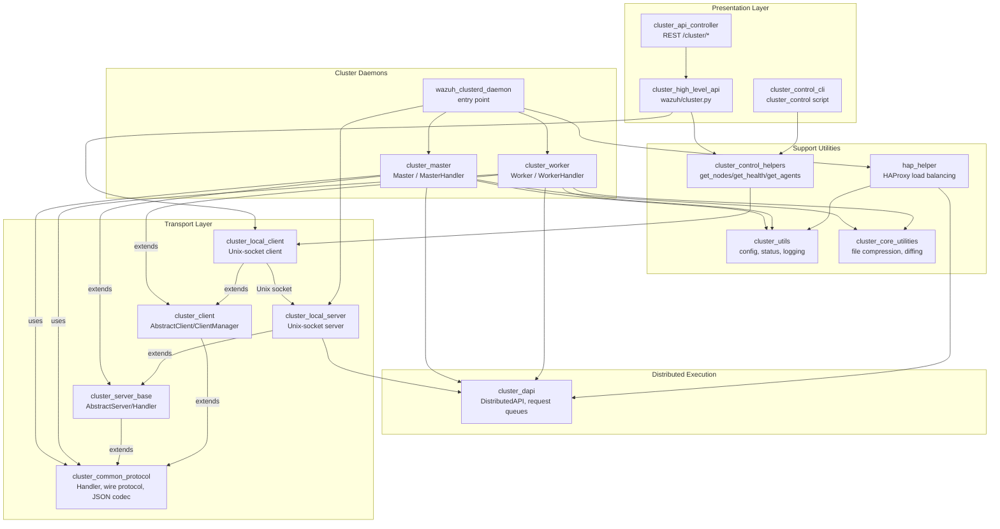
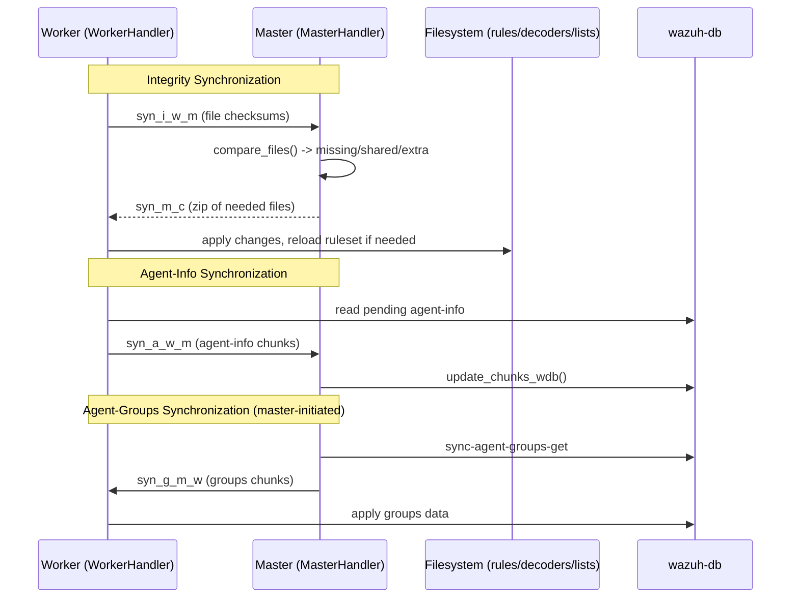

# Cluster Module

## 1. Introduction and Purpose

The **Cluster Module** (`framework/wazuh/core/cluster`) implements Wazuh's high-availability, horizontally-scalable clustering subsystem. It allows multiple Wazuh manager nodes — one **master** and one or more **workers** — to operate as a single logical unit while transparently distributing agent connections, synchronizing configuration and data, and routing API requests to the correct node regardless of where the requested resource physically resides.

The module is responsible for:

- **Node topology and communication**: establishing and maintaining encrypted TCP connections between the master and every worker (`cluster_client`, `cluster_server_base`, `cluster_common_protocol`), and a local Unix-socket channel used by the API/CLI to talk to the local `wazuh-clusterd` daemon (`cluster_local_client`, `cluster_local_server`).
- **State synchronization**: keeping rulesets, decoders, CDB lists, agent-groups, and agent-info consistent across all nodes (`cluster_master`, `cluster_worker`, `cluster_core_utilities`).
- **Distributed API (DAPI) execution**: transparently routing, broadcasting, and aggregating API calls across the cluster so that REST clients don't need to know cluster topology (`cluster_dapi`).
- **Cluster administration surfaces**: a REST API controller (`cluster_api_controller`), a CLI tool (`cluster_control_cli`), and a high-level Python API (`cluster_high_level_api`) for inspecting cluster health, nodes, and configuration.
- **Load balancing integration**: an optional HAProxy Helper (`hap_helper`) that automatically rebalances agent connections across manager nodes.
- **Daemon lifecycle**: the `wazuh-clusterd` entry-point process (`wazuh_clusterd_daemon`) that bootstraps the master or worker role based on configuration.

This module underpins cluster-transparency across the rest of the Wazuh framework: functions in modules like `agent_module`, `manager_module`, `rule_module`, and `security_rbac_module` are executed identically whether Wazuh runs standalone or as a cluster, thanks to the DAPI routing layer.

## 2. Architecture

### 2.1 High-Level Component Map



### 2.2 Master/Worker Synchronization Flow



### 2.3 Distributed API Request Routing

```mermaid
flowchart TD
    A["API Controller<br/>(e.g. agent_controller, cluster_controller)"] --> B["DistributedAPI.distribute_function()"]
    B --> C{request_type}
    C -->|local_any / local_master on master| D["Execute locally<br/>(process/thread pool)"]
    C -->|distributed_master, already forwarded| D
    C -->|distributed_master, on master, not yet forwarded| E["forward_request()<br/>resolve target node(s) via get_solver_node()"]
    C -->|other (worker, master_only)| F["execute_remote_request()<br/>send to master via LocalClient"]
    E --> G["Fan-out to worker(s)<br/>merge AffectedItemsWazuhResult"]
    F --> H["APIRequestQueue on master<br/>executes and replies"]
    D --> I["Return WazuhResult /<br/>AffectedItemsWazuhResult"]
    G --> I
    H --> I
```

## 3. Core Components

| Sub-module | Responsibility | Documentation |
|---|---|---|
| **cluster_api_controller** | REST `/cluster/*` HTTP endpoints (nodes, health, config, restart, stats, logs) | Delegates to `cluster_high_level_api` and `manager_module`/`stats_module` via `DistributedAPI` |
| **cluster_control_cli** | `cluster_control` CLI for listing nodes/agents and cluster health | Uses `cluster_control_helpers` via `LocalClient` |
| **cluster_high_level_api** | High-level cluster status/health/config Python API (`framework/wazuh/cluster.py`) | RBAC-protected wrapper around `cluster_control_helpers` and `cluster_core_utilities` |
| **cluster_client** | Base client connection lifecycle (`AbstractClient`, `AbstractClientManager`) | Extended by `cluster_worker` (Worker↔Master) |
| **cluster_server_base** | Base server connection lifecycle (`AbstractServer`, `AbstractServerHandler`) | Extended by `cluster_master` and `cluster_local_server` |
| **cluster_common_protocol** | Wire protocol, message framing/encryption, file/string transfer, JSON (de)serialization (`Handler`, `WazuhCommon`, `SyncWazuhdb`) | Shared foundation for all networked components |
| **cluster_master** | Master-node orchestration: integrity/agent-info/agent-groups sync, DAPI dispatch | `Master`, `MasterHandler` |
| **cluster_worker** | Worker-node counterpart driving the same sync protocol | `Worker`, `WorkerHandler` |
| **cluster_local_server / cluster_local_client** | Unix-socket bridge between local processes (API/CLI) and `wazuh-clusterd` | Master/Worker variants |
| **cluster_dapi** | Distributed API execution engine: local/remote/broadcast routing, result merging | `DistributedAPI`, `APIRequestQueue`, `SendSyncRequestQueue` |
| **cluster_control_helpers** | Low-level node/health/agent query functions used by API and CLI | `get_nodes`, `get_health`, `get_agents` |
| **cluster_core_utilities** | File status, compression/decompression, merge/unmerge, config validation | `compress_files`, `get_files_status`, `compare_files` |
| **cluster_utils** | Configuration parsing, daemon status, logging filters, restart signaling | `ClusterFilter`, `read_config`, `manager_restart` |
| **hap_helper** | Optional HAProxy-based agent load balancer | `HAPHelper`, `Proxy`/`ProxyAPI`, `WazuhAgent`/`WazuhDAPI` |
| **wazuh_clusterd_daemon** | `wazuh-clusterd` process entry point (master/worker bootstrap) | `main`, `master_main`, `worker_main` |

## 4. References to Core Component Documentation

- [cluster_api_controller.md](cluster_api_controller.md) — REST API surface for cluster administration
- [cluster_control_cli.md](cluster_control_cli.md) — `cluster_control` command-line tool
- [cluster_high_level_api.md](cluster_high_level_api.md) — High-level Python cluster API (`framework/wazuh/cluster.py`)
- [cluster_client.md](cluster_client.md) — Base client connection abstractions
- [cluster_core_utilities.md](cluster_core_utilities.md) — File synchronization toolbox
- [cluster_common_protocol.md](cluster_common_protocol.md) — Wire protocol and shared handler base
- [cluster_control_helpers.md](cluster_control_helpers.md) — Node/health/agent query helpers
- [cluster_dapi.md](cluster_dapi.md) — Distributed API execution engine
- [hap_helper.md](hap_helper.md) — HAProxy Helper load balancer
- [cluster_local_client.md](cluster_local_client.md) — Local Unix-socket client
- [cluster_local_server.md](cluster_local_server.md) — Local Unix-socket server
- [cluster_master.md](cluster_master.md) — Master node orchestration
- [cluster_server_base.md](cluster_server_base.md) — Base server connection abstractions
- [cluster_utils.md](cluster_utils.md) — Configuration, status, and logging utilities
- [cluster_worker.md](cluster_worker.md) — Worker node implementation
- [wazuh_clusterd_daemon.md](wazuh_clusterd_daemon.md) — `wazuh-clusterd` daemon entry point