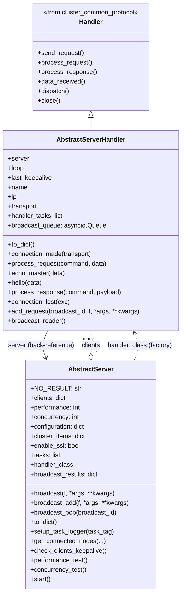
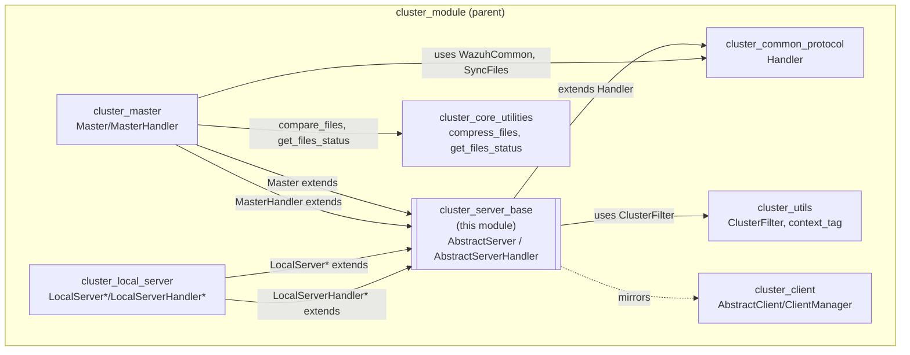
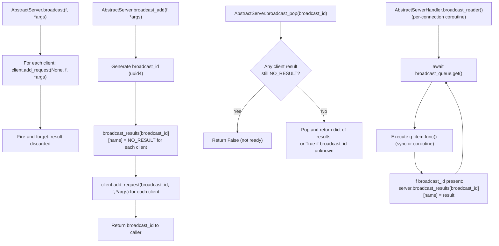
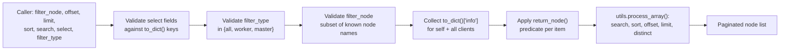

# Cluster Server Base

## Introduction

The **Cluster Server Base** module (`framework/wazuh/core/cluster/server.py`) provides the **generic, protocol-agnostic server abstractions** used by every Wazuh cluster component that needs to *accept incoming connections*. It defines two cooperating classes:

- **`AbstractServer`** – an asyncio TCP/SSL server that accepts multiple simultaneous connections, tracks connected peers (`clients`), runs a set of long-lived background tasks (keep-alive checking, performance/concurrency test loops), and exposes generic "broadcast" primitives to run a function against every connected client and collect the results.
- **`AbstractServerHandler`** – an asyncio `Protocol` (subclassing the shared [`Handler`](cluster_common_protocol.md) class) that represents **one accepted connection**. It implements the server side of the initial `hello` handshake, keep-alive tracking via `echo-c`/`ok-m`, connection teardown logic, and a per-connection broadcast queue used to run functions requested by the server.

Neither class implements any cluster-specific business logic (no integrity sync, no agent-info sync, no DAPI routing). They are pure **transport/lifecycle** building blocks, subclassed by the modules that actually need to *listen* for connections:

- [`cluster_master`](cluster_master.md) — `Master` (extends `AbstractServer`) and `MasterHandler` (extends `AbstractServerHandler` + `WazuhCommon`) implement the master node's TCP server that workers connect to.
- [`cluster_local_server`](cluster_local_server.md) — `LocalServer`/`LocalServerMaster`/`LocalServerWorker` (extend `AbstractServer`) and `LocalServerHandler` and its subclasses (extend `AbstractServerHandler`) implement the Unix-socket server used by the local Wazuh API and CLI tools.

This module is the **server half** of the client/server pair defined for the Wazuh cluster protocol; its counterpart is [`cluster_client`](cluster_client.md) (`AbstractClient` / `AbstractClientManager`), which is extended by [`cluster_worker`](cluster_worker.md) to implement the outgoing (worker-to-master) side of the same protocol. Both halves build directly on the wire-format, encryption and request/response machinery implemented in [`cluster_common_protocol`](cluster_common_protocol.md) (`Handler`).

## Purpose and Core Functionality

| Responsibility | Component | Description |
|---|---|---|
| Accept TCP/SSL connections | `AbstractServer.start` | Creates an `asyncio` server bound to `configuration['bind_addr']:configuration['port']`, optionally wrapped in SSL, and instantiates `handler_class` for each new connection. |
| Per-connection protocol handshake | `AbstractServerHandler.connection_made` / `hello` | Records the peer's IP, waits for the `hello` command to learn the client's declared name, and registers it in `server.clients`. |
| Keep-alive tracking | `AbstractServerHandler.echo_master`, `AbstractServer.check_clients_keepalive` | Updates `last_keepalive` on each `echo-c` request; a background task periodically disconnects clients that have not sent a keep-alive recently enough. |
| Connection teardown | `AbstractServerHandler.connection_lost` | Removes the client from `server.clients`, cancels any handler-specific asyncio tasks, and logs the reason for disconnection. |
| Per-handler broadcast queue | `AbstractServerHandler.add_request` / `broadcast_reader` | FIFO queue of functions to be executed against this specific connection, consumed by an always-running coroutine started right after `hello`. |
| Server-wide broadcast | `AbstractServer.broadcast`, `broadcast_add`, `broadcast_pop` | Push the same function call to every connected client's queue; `broadcast_add`/`broadcast_pop` additionally track completion and collect per-client results keyed by a generated broadcast ID. |
| Node discovery | `AbstractServer.get_connected_nodes` | Returns paginated/filtered/sorted metadata about all connected nodes (including the server itself), reused directly by [`cluster_master.get_nodes`](cluster_master.md) and surfaced through the [`cluster_api_controller`](cluster_api_controller.md). |
| Development/perf testing helpers | `AbstractServer.performance_test`, `concurrency_test` | Non-production coroutines used to benchmark the underlying transport with large payloads or many concurrent requests. |
| Task-scoped logging | `AbstractServer.setup_task_logger` | Creates a child logger tagged with a [`ClusterFilter`](cluster_utils.md) so log lines can be attributed to a specific background task. |

## Architecture

### Class Relationships



### Where This Module Fits



Related documentation:
- [cluster_module.md](cluster_module.md) — top-level cluster module overview.
- [cluster_common_protocol.md](cluster_common_protocol.md) — `Handler`, the shared base class extended by `AbstractServerHandler`; defines the wire format, encryption, chunked file/string transfer and request/response correlation used by every handler built on top of this module.
- [cluster_client.md](cluster_client.md) — `AbstractClient`/`AbstractClientManager`, the *client-side* mirror of this module's abstractions, used by nodes that dial out instead of listening.
- [cluster_master.md](cluster_master.md) — `Master`/`MasterHandler`, the primary consumer of this module; implements the master node's TCP server using `AbstractServer`/`AbstractServerHandler` as its base classes.
- [cluster_local_server.md](cluster_local_server.md) — `LocalServer`/`LocalServerHandler` and their master/worker variants, the Unix-socket server used by the local API/CLI, also built directly on this module.
- [cluster_utils.md](cluster_utils.md) — `ClusterFilter`/`context_tag`, used by `setup_task_logger` and throughout `AbstractServerHandler` for structured, per-connection logging.
- [cluster_worker.md](cluster_worker.md) — Connects to a `Master`/`MasterHandler` pair built on this module; understanding the server side here clarifies the protocol the worker speaks.
- [cluster_api_controller.md](cluster_api_controller.md) — REST endpoints (e.g., node listing, healthcheck) that ultimately surface data produced by `AbstractServer.get_connected_nodes`.

## Core Components

| Component | Type | Purpose |
|---|---|---|
| `AbstractServer` | class | Owns the asyncio TCP/SSL server socket, the dictionary of connected `clients`, the list of background `tasks`, and the broadcast infrastructure (`broadcast`, `broadcast_add`, `broadcast_pop`). Subclassed by [`Master`](cluster_master.md) and [`LocalServer`](cluster_local_server.md). |
| `AbstractServerHandler` | class (extends `Handler`) | Represents a single accepted connection. Implements the server-side handshake (`hello`), keep-alive (`echo_master`), connection teardown (`connection_lost`), and the per-connection broadcast queue consumer (`broadcast_reader`). Subclassed by [`MasterHandler`](cluster_master.md) and [`LocalServerHandler`](cluster_local_server.md) (via `WazuhCommon` mixing for the former). |

## Data Flow: Connection Lifecycle

```mermaid
sequenceDiagram
    participant Peer as Incoming Peer<br/>(WorkerHandler / LocalClient)
    participant Loop as asyncio event loop
    participant Srv as AbstractServer
    participant H as AbstractServerHandler

    Srv->>Loop: loop.create_server(handler_class factory, host, port, ssl?)
    Peer->>Loop: TCP/SSL connect
    Loop->>H: instantiate handler_class(server=Srv, loop, fernet_key, cluster_items)
    Loop->>H: connection_made(transport)
    H->>H: record ip, transport
    Peer->>H: send_request(b'hello', name)
    H->>H: hello(data)
    alt name already connected or equals own node_name
        H-->>Peer: WazuhClusterError raised
    else
        H->>Srv: server.clients[name] = self
        H->>H: handler_tasks.append(broadcast_reader task)
        H-->>Peer: ok, "Client <name> added"
    end

    loop periodic keep-alive
        Peer->>H: send_request(b'echo-c', data)
        H->>H: echo_master(data) -> update last_keepalive
        H-->>Peer: ok-m, data
    end

    Srv->>Srv: check_clients_keepalive() (background task)
    alt keep-alive too old
        Srv->>H: transport.close()
    end

    Peer-->>H: connection lost / closed
    H->>H: connection_lost(exc)
    H->>Srv: del server.clients[name]
    H->>H: cancel handler_tasks
```

## Data Flow: Broadcast Mechanism

`AbstractServer` provides three related primitives to run a function against every connected `AbstractServerHandler`. They differ in whether the caller needs to know the outcome.



`broadcast` is used when the caller does not need per-node acknowledgement (e.g., fire-and-forget notifications). `broadcast_add`/`broadcast_pop` are used when the caller must wait for and inspect each node's result — the caller is responsible for polling `broadcast_pop` until it returns something other than `False`, and must call it exactly once to avoid leaking entries in `broadcast_results`.

## Node Discovery: `get_connected_nodes`

`AbstractServer.get_connected_nodes` implements the generic filtering/sorting/pagination logic shared by the cluster's node-listing API. It treats the server itself (`self`) and every connected `AbstractServerHandler` (`self.clients.values()`) uniformly by calling `to_dict()['info']` on each.



This method is called directly by `Master.get_nodes` (see [`cluster_master`](cluster_master.md)) and, through the Distributed API layer, ultimately backs the `GET /cluster/nodes` endpoint exposed by the [`cluster_api_controller`](cluster_api_controller.md).

## Command Reference (Base Protocol)

`AbstractServerHandler.process_request`/`process_response` extend the generic commands already defined in [`Handler`](cluster_common_protocol.md) with two server-specific ones. Subclasses (`MasterHandler`, `LocalServerHandler`) add many more commands on top of this base set.

| Command | Direction | Handler method | Purpose |
|---|---|---|---|
| `hello` | client → server (request) | `AbstractServerHandler.hello` | Register the connecting peer's declared name in `server.clients`; rejects duplicate names or a name colliding with the server's own `node_name`. |
| `echo-c` | client → server (request) | `AbstractServerHandler.echo_master` | Keep-alive ping; updates `last_keepalive` and echoes back the payload with result code `ok-m`. |
| `ok-c` | server → client (response) | `AbstractServerHandler.process_response` | Generic "successful response from client" wrapper for any request the server sent to the client. |
| *(anything else)* | either | Falls back to `Handler.process_request` / `process_response` | Generic commands such as `echo`, `new_file`, `file_upd`, `file_end`, `new_str`, `str_upd`, `cancel_task`, `dapi_err`, `ok`, `err` (see [cluster_common_protocol](cluster_common_protocol.md)). |

## Startup Sequence

```mermaid
sequenceDiagram
    participant Owner as Master / LocalServer subclass
    participant Srv as AbstractServer.start()
    participant Loop as asyncio event loop

    Owner->>Srv: await start()
    Srv->>Srv: context_tag.set(self.tag)
    Srv->>Srv: set uvloop event loop policy
    Srv->>Srv: loop.set_exception_handler(asyncio_exception_handler)
    alt enable_ssl
        Srv->>Srv: build ssl_context from sslmanager.cert/key
    end
    Srv->>Loop: loop.create_server(handler_factory, bind_addr, port, ssl=ssl_context)
    Loop-->>Srv: server object (or OSError -> KeyboardInterrupt)
    Srv->>Srv: tasks.append(server.serve_forever)
    Srv->>Loop: asyncio.gather(*[t() for t in self.tasks])
    Note over Srv,Loop: tasks always includes check_clients_keepalive();\nsubclasses append their own periodic tasks\n(e.g. file_status_update, agent_groups_update in Master)
```

`self.tasks` is a list of coroutine *functions* (not yet awaited) gathered together at the end of `start()`. `AbstractServer.__init__` seeds this list with `[self.check_clients_keepalive]`; subclasses such as `Master` (see [`cluster_master`](cluster_master.md)) and `LocalServerMaster`/`LocalServerWorker` (see [`cluster_local_server`](cluster_local_server.md)) extend this list with their own periodic background work before `start()` is invoked by the [`wazuh_clusterd_daemon`](wazuh_clusterd_daemon.md) entry point.

## Key Design Aspects

### Handshake-gated feature activation
No handler is considered a usable "client" until `hello` succeeds: only then is it added to `server.clients` and does it start its `broadcast_reader` background task. This means `broadcast`/`broadcast_add` will never accidentally target a half-connected peer, and `get_connected_nodes` will never list a node that has not completed the handshake.

### Self-healing keep-alive
`check_clients_keepalive` (run as one of `AbstractServer.tasks`) proactively closes the transport of any client whose `last_keepalive` is older than `cluster_items['intervals']['master']['max_allowed_time_without_keepalive']`. This guarantees stale TCP connections (e.g., after a network partition) are eventually cleaned up even if the OS-level socket never reports an error.

### Broadcast result bookkeeping is opt-in
`broadcast` (fire-and-forget) intentionally does not track completion to avoid unbounded growth of `broadcast_results` for high-frequency notifications. `broadcast_add`/`broadcast_pop` exist specifically for the cases where the caller needs to correlate a request with per-node answers (used, for example, by [`cluster_master`](cluster_master.md) style synchronization flows that must wait for every worker to acknowledge).

### Symmetry with `cluster_client`
`AbstractServer`/`AbstractServerHandler` intentionally mirror the shape of `AbstractClientManager`/`AbstractClient` in [`cluster_client`](cluster_client.md): both pairs separate "connection lifecycle owner" (`Abstract*Manager`/`AbstractServer`) from "single connection protocol implementation" (`Abstract*`/`AbstractServerHandler`), and both delegate all wire-level concerns to the shared [`Handler`](cluster_common_protocol.md) base class. This symmetry is what allows [`cluster_master`](cluster_master.md) and [`cluster_worker`](cluster_worker.md) to implement matching sets of commands without duplicating transport code.

### No cluster business logic
This module deliberately contains zero references to integrity checks, agent-info, agent-groups, or DAPI/SendSync queues — those all live in [`cluster_master`](cluster_master.md) (server-side business logic) and [`cluster_local_server`](cluster_local_server.md) (local Unix-socket business logic). Keeping this separation makes it possible to reuse the exact same `AbstractServer`/`AbstractServerHandler` pair for two very different servers (the inter-node TCP cluster protocol and the local Unix-socket API bridge) without any code duplication.

## Relationship to Other Cluster Components

- **[cluster_common_protocol](cluster_common_protocol.md)** — Supplies the `Handler` base class that `AbstractServerHandler` extends for message framing, encryption, and request/response correlation; also supplies `WazuhCommon` and `SyncTask`/`SyncFiles`/`SyncWazuhdb` used by concrete handlers built on top of this module (e.g., `MasterHandler`).
- **[cluster_client](cluster_client.md)** — The client-side mirror of this module; a `Worker`'s `WorkerHandler` (extending `AbstractClient`) connects to a `Master`'s `MasterHandler` (extending `AbstractServerHandler`) to form a complete client/server pair.
- **[cluster_master](cluster_master.md)** — `Master` extends `AbstractServer` to implement the inter-node TCP cluster server; `MasterHandler` extends `AbstractServerHandler` (mixed with `WazuhCommon`) to implement per-worker integrity/agent-info/agent-groups/DAPI synchronization logic.
- **[cluster_local_server](cluster_local_server.md)** — `LocalServer`/`LocalServerMaster`/`LocalServerWorker` extend `AbstractServer` to implement the Unix-socket server; `LocalServerHandler` and its master/worker subclasses extend `AbstractServerHandler` to bridge local API/CLI requests into the cluster.
- **[cluster_utils](cluster_utils.md)** — Provides `ClusterFilter` and the `context_tag` context variable consumed by `setup_task_logger` and throughout `AbstractServerHandler` for structured, per-connection/per-task logging.
- **[cluster_dapi](cluster_dapi.md)** — Although this module has no direct dependency on the DAPI queues, `AbstractServerHandler.add_request`/`broadcast_reader` provide the generic per-connection work-queue mechanism that `MasterHandler` and `LocalServerHandlerMaster` build upon when routing Distributed API and Send-Sync requests.
- **[wazuh_clusterd_daemon](wazuh_clusterd_daemon.md)** — The entry-point script that ultimately constructs a `Master`/`Worker` (and its associated `LocalServer`) and calls `AbstractServer.start()` (transitively, via subclass `start()`s) inside the asyncio event loop.
- **[cluster_api_controller](cluster_api_controller.md)** — REST endpoints such as node listing and cluster healthcheck are served with data produced by `AbstractServer.get_connected_nodes` and the `to_dict()` methods defined by concrete subclasses.
- **[agent_module](agent_module.md)** — Indirectly related: `Master.get_health` (built on top of this module's `AbstractServer`) enriches per-node health data with active agent counts by querying `Agent.get_agents_overview`.

## Summary

`cluster_server_base` is a small but foundational module: it has no cluster-specific behavior of its own, yet every server-role component in the Wazuh cluster (the master's inter-node TCP listener and the per-node local Unix-socket bridge) is built directly on its two classes. Its main value is providing a uniform, well-tested connection lifecycle (`hello` handshake → keep-alive tracking → graceful/faulty teardown) and a generic broadcast/query mechanism (`broadcast*`, `get_connected_nodes`) that concrete servers reuse instead of reimplementing.
