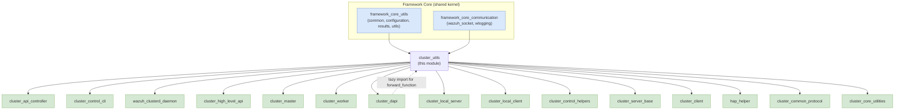
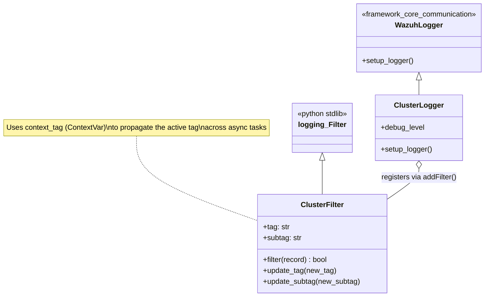
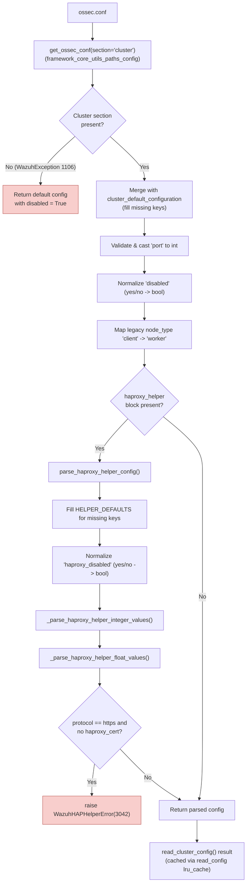
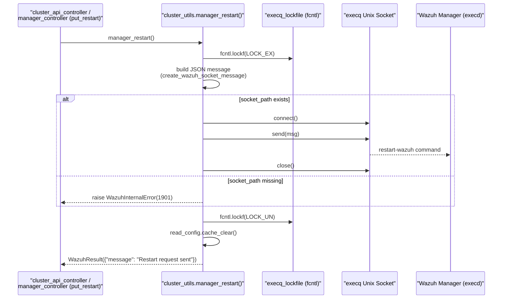
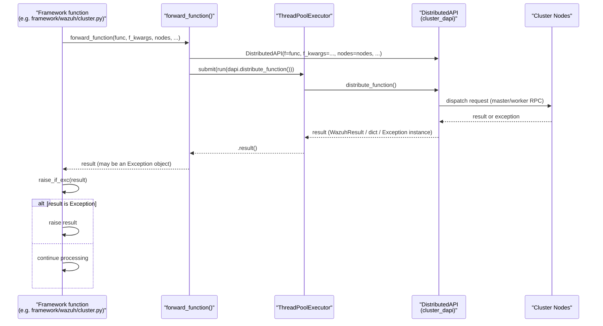
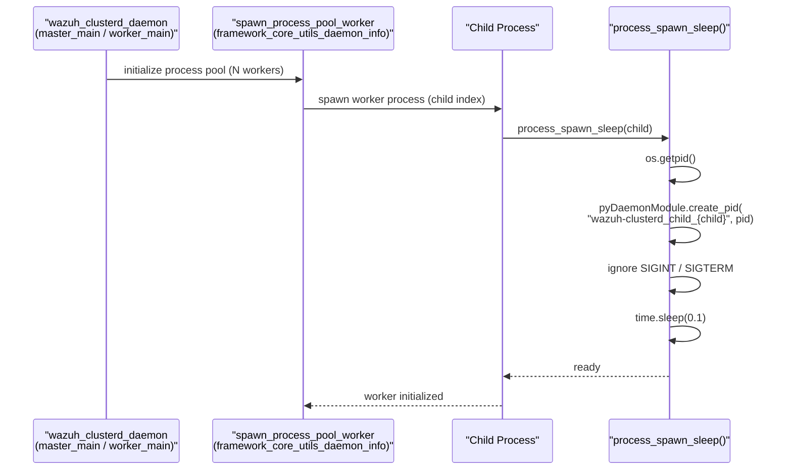
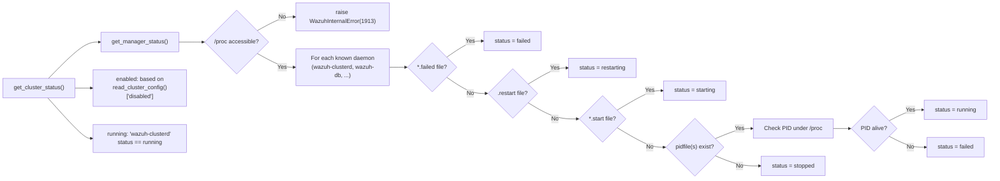
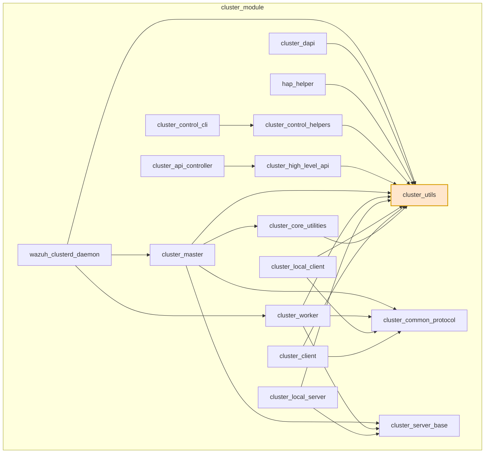

# Cluster Utils Module

## Introduction

The **Cluster Utils** module (`framework/wazuh/core/cluster/utils.py`) is the foundational utility layer of the Wazuh **Cluster** subsystem. It does not implement cluster networking or business logic itself; instead, it provides the **cross-cutting services** that every other cluster component relies on:

- Reading, validating and normalizing the cluster configuration (`<cluster>` block of `ossec.conf`), including the embedded **HAProxy Helper** configuration.
- Reporting the **status** of the manager daemons and the cluster as a whole (used by both the CLI and the REST API).
- Sending the **restart** signal to the Wazuh manager through the `execq` socket.
- Providing a structured **logging filter** (`ClusterFilter`) and **logger** (`ClusterLogger`) used by every cluster daemon/process to tag log lines with contextual information (node, subtag).
- Offering low-level helpers used during the daemon bootstrap process (`process_spawn_sleep`) and during distributed request handling (`forward_function`, `raise_if_exc`).
- Loading the static `cluster.json` metadata file (`get_cluster_items`) that describes which files must be synchronized between nodes and their permissions.

Because almost every cluster component (master, worker, local server/client, DAPI, CLI tools, the `wazuh-clusterd` daemon, and the HAProxy Helper) depends on at least one of these utilities, this module acts as the **shared kernel** of the cluster codebase, analogous to how [`framework_core_utils`](framework_core_utils.md) and [`framework_core_communication`](framework_core_communication.md) serve the rest of the framework.

This document describes the module's responsibilities, its internal architecture, and how it integrates with the other cluster components documented separately (see the **References** section).

---

## Module Responsibilities

| Area | Key Functions / Classes | Purpose |
|---|---|---|
| Configuration parsing | `read_cluster_config`, `read_config`, `parse_haproxy_helper_config`, `_parse_haproxy_helper_integer_values`, `_parse_haproxy_helper_float_values` | Read the `<cluster>` section from `ossec.conf`, apply defaults, validate types, and parse the nested HAProxy Helper configuration. |
| Static metadata | `get_cluster_items` | Load `cluster.json`, which lists synchronizable files and their filesystem permissions. |
| Status reporting | `get_manager_status`, `get_cluster_status`, `running_in_master_node` | Determine daemon/process status by inspecting `/proc` and PID files; expose overall cluster enabled/running status. |
| Manager control | `manager_restart` | Send a `restart-wazuh` command to the manager via a Unix socket (`execq`), guarded by a file lock. |
| Logging | `ClusterFilter`, `ClusterLogger`, `log_subprocess_execution`, `context_tag` | Inject cluster-specific context (tag/subtag) into log records; aggregate log messages produced in subprocesses. |
| Daemon bootstrap | `process_spawn_sleep` | Force each worker process spawned by the cluster's process pool to create its own PID file before starting real work. |
| Distributed execution | `forward_function`, `raise_if_exc` | Bridge synchronous cluster code with the asynchronous `DistributedAPI` (DAPI) execution model, and safely re-raise exceptions returned by concurrent/distributed calls. |

---

## Architecture & Dependencies

`cluster_utils` sits between the generic framework utilities and the cluster-specific components. It has no dependency on cluster networking code except for a **lazy, function-local import** of `DistributedAPI` inside `forward_function` (to avoid circular imports), and it is imported by virtually every other cluster submodule.

**Key observations:**

- `cluster_utils` depends on generic framework utilities documented in [`framework_core_utils`](framework_core_utils.md) (`common`, `configuration.get_ossec_conf`, `results.WazuhResult`, `utils.temporary_cache`) and [`framework_core_communication`](framework_core_communication.md) (`wazuh_socket.create_wazuh_socket_message`, `wlogging.WazuhLogger`).
- It has a **single reverse dependency** on [`cluster_dapi`](cluster_dapi.md): the `forward_function` helper imports `DistributedAPI` lazily at call time to avoid a circular import, since `cluster_dapi` itself uses `raise_if_exc` and `ClusterFilter`-based logging.
- Every other cluster component — [`cluster_master`](cluster_master.md), [`cluster_worker`](cluster_worker.md), [`cluster_local_server`](cluster_local_server.md), [`cluster_local_client`](cluster_local_client.md), [`cluster_client`](cluster_client.md), [`cluster_server_base`](cluster_server_base.md), [`cluster_core_utilities`](cluster_core_utilities.md), [`cluster_common_protocol`](cluster_common_protocol.md), [`cluster_control_helpers`](cluster_control_helpers.md), [`hap_helper`](hap_helper.md), the [`wazuh_clusterd_daemon`](wazuh_clusterd_daemon.md), the [`cluster_control_cli`](cluster_control_cli.md), the [`cluster_api_controller`](cluster_api_controller.md), and [`cluster_high_level_api`](cluster_high_level_api.md) — imports functions from this module directly (mostly `raise_if_exc`, `read_config`/`read_cluster_config`, `ClusterFilter`, and `get_cluster_items`).

---

## Component Diagram: Logging Classes

`ClusterFilter` and `ClusterLogger` extend the generic logging infrastructure from [`framework_core_communication`](framework_core_communication.md) (`WazuhLogger`, documented under `framework_core_communication_logging`) to add cluster-specific context.

- `ClusterFilter.filter()` reads the `context_tag` `ContextVar` to dynamically resolve the current tag (falling back to the filter's static `tag` if unset) and stamps every `LogRecord` with `.tag` and `.subtag` attributes, which the cluster log formatter uses to produce structured log lines like `[Cluster] [Master] ...`.
- `ClusterLogger` is instantiated by the [`wazuh_clusterd_daemon`](wazuh_clusterd_daemon.md) entry point, registers a default `ClusterFilter(tag='Cluster', subtag='Main')`, and adjusts the log level according to the `debug_level` parameter passed on daemon startup.
- Components such as [`cluster_master`](cluster_master.md), [`cluster_worker`](cluster_worker.md), [`cluster_local_server`](cluster_local_server.md), and [`cluster_local_client`](cluster_local_client.md) update the filter's tag/subtag via `update_tag`/`update_subtag` as execution moves between different phases (e.g., "Integrity check", "Agent-info sync").

---

## Data Flow: Cluster Configuration Parsing

- `read_cluster_config` is the single source of truth for cluster configuration; `read_config` wraps it with `@lru_cache()` so repeated calls (e.g., from the API layer) avoid re-parsing XML.
- The parsed configuration, including the `haproxy_helper` sub-dictionary, is consumed by [`hap_helper`](hap_helper.md) (`HAPHelper`, `Proxy`, `ProxyAPI`) to configure load-balancing behavior, and by [`cluster_master`](cluster_master.md) / [`cluster_worker`](cluster_worker.md) to determine node role, name, and networking parameters.
- `manager_restart()` calls `read_config.cache_clear()` after issuing a restart request so that a subsequent read picks up any configuration changes applied before the restart.

---

## Sequence: Manager Restart Flow

This function is invoked indirectly through the [`cluster_high_level_api`](cluster_high_level_api.md) (`read_config_wrapper`, related helpers) and directly from the [`cluster_api_controller`](cluster_api_controller.md) `put_restart` endpoint when restarting a specific node, mirroring the equivalent single-node behavior documented in the `manager_module`.

---

## Sequence: Distributed Execution & Exception Propagation

`forward_function` and `raise_if_exc` work together to let synchronous code (e.g., CLI tools, framework functions) safely call into the asynchronous [`cluster_dapi`](cluster_dapi.md) machinery and handle failures uniformly.

`raise_if_exc` is deliberately simple — it checks `isinstance(result, Exception)` and re-raises — but it is used pervasively across the cluster codebase (in [`cluster_master`](cluster_master.md), [`cluster_worker`](cluster_worker.md), [`cluster_control_helpers`](cluster_control_helpers.md), [`cluster_dapi`](cluster_dapi.md), and [`cluster_high_level_api`](cluster_high_level_api.md)) as the standard pattern for converting "exception-as-value" results (common in gathered/concurrent execution) back into raised exceptions that the API/CLI error-handling layers understand.

---

## Sequence: Daemon Process Pool Bootstrap

`process_spawn_sleep` guarantees that each subprocess in the cluster's process pool (used for CPU-bound tasks such as file compression/decompression during integrity sync, see [`cluster_core_utilities`](cluster_core_utilities.md)) creates a distinguishable PID file and does not immediately race to handle work before its own identity is registered. It relies on `pyDaemonModule.create_pid`, documented under [`framework_core_utils`](framework_core_utils.md) (`framework_core_utils_daemon_info`).

---

## Status Reporting

`get_manager_status` (decorated with `@temporary_cache()` from [`framework_core_utils`](framework_core_utils.md)) is the shared implementation behind:

- The `manager_module`'s daemon-stats endpoints (`get_daemon_stats`, `get_status`).
- The cluster-specific `get_status_node` / `get_status` endpoints in [`cluster_api_controller`](cluster_api_controller.md), via [`cluster_high_level_api`](cluster_high_level_api.md) (`get_status_json`).
- `get_cluster_status()`, which is also invoked by the [`cluster_control_cli`](cluster_control_cli.md) (`cluster_control` script) to print human-readable cluster health.

---

## Public API Summary

| Symbol | Type | Consumed By |
|---|---|---|
| `read_cluster_config` / `read_config` | function | [`cluster_high_level_api`](cluster_high_level_api.md), [`cluster_master`](cluster_master.md), [`cluster_worker`](cluster_worker.md), [`hap_helper`](hap_helper.md), [`wazuh_clusterd_daemon`](wazuh_clusterd_daemon.md) |
| `parse_haproxy_helper_config` | function | [`hap_helper`](hap_helper.md) (indirectly, via `read_cluster_config`) |
| `get_cluster_items` | function | [`cluster_core_utilities`](cluster_core_utilities.md) (`compress_files`, `get_files_status`), [`cluster_master`](cluster_master.md), [`cluster_worker`](cluster_worker.md) |
| `get_manager_status` | function | `manager_module`, [`cluster_api_controller`](cluster_api_controller.md), [`cluster_high_level_api`](cluster_high_level_api.md) |
| `get_cluster_status` | function | [`cluster_control_cli`](cluster_control_cli.md), [`cluster_api_controller`](cluster_api_controller.md) |
| `manager_restart` | function | `manager_module`, [`cluster_api_controller`](cluster_api_controller.md) |
| `running_in_master_node` | function | API request-routing logic (`only_master_endpoint` in `api_core_infrastructure_request_utils`) |
| `ClusterFilter` | class | [`wazuh_clusterd_daemon`](wazuh_clusterd_daemon.md), [`cluster_master`](cluster_master.md), [`cluster_worker`](cluster_worker.md), [`cluster_local_server`](cluster_local_server.md), [`cluster_local_client`](cluster_local_client.md), [`cluster_client`](cluster_client.md) |
| `ClusterLogger` | class | [`wazuh_clusterd_daemon`](wazuh_clusterd_daemon.md) |
| `log_subprocess_execution` | function | [`cluster_core_utilities`](cluster_core_utilities.md), [`cluster_master`](cluster_master.md) (integrity sync subprocess results) |
| `process_spawn_sleep` | function | [`wazuh_clusterd_daemon`](wazuh_clusterd_daemon.md) (process pool initialization) |
| `forward_function` | function | Framework-level functions needing to reach the master node (e.g. `framework/wazuh/cluster.py` in [`cluster_high_level_api`](cluster_high_level_api.md)) |
| `raise_if_exc` | function | [`cluster_dapi`](cluster_dapi.md), [`cluster_master`](cluster_master.md), [`cluster_worker`](cluster_worker.md), [`cluster_control_helpers`](cluster_control_helpers.md), [`cluster_high_level_api`](cluster_high_level_api.md) |
| `context_tag` | `ContextVar` | `ClusterFilter`, async cluster tasks that need to tag their logs per-request |

---

## Relationship to the Rest of the Cluster Module

The diagram below situates `cluster_utils` within the full `cluster_module` tree (see the top-level [`cluster_module`](cluster_module.md) documentation, if present, for the complete picture):

---

## Summary

`cluster_utils` provides small, well-tested, dependency-light building blocks — configuration parsing, status inspection, restart signaling, structured logging, subprocess bootstrap, and exception normalization — that are reused throughout the entire Wazuh cluster subsystem. Because of its central role, changes to this module (particularly to `read_cluster_config`, `raise_if_exc`, or `ClusterFilter`) have wide-reaching effects and should be coordinated with the consuming modules referenced above:

- [`cluster_master`](cluster_master.md)
- [`cluster_worker`](cluster_worker.md)
- [`cluster_dapi`](cluster_dapi.md)
- [`cluster_high_level_api`](cluster_high_level_api.md)
- [`cluster_api_controller`](cluster_api_controller.md)
- [`cluster_control_cli`](cluster_control_cli.md)
- [`wazuh_clusterd_daemon`](wazuh_clusterd_daemon.md)
- [`hap_helper`](hap_helper.md)
- [`cluster_local_server`](cluster_local_server.md)
- [`cluster_local_client`](cluster_local_client.md)
- [`cluster_client`](cluster_client.md)
- [`cluster_server_base`](cluster_server_base.md)
- [`cluster_core_utilities`](cluster_core_utilities.md)
- [`cluster_common_protocol`](cluster_common_protocol.md)
- [`cluster_control_helpers`](cluster_control_helpers.md)
- [`framework_core_utils`](framework_core_utils.md)
- [`framework_core_communication`](framework_core_communication.md)
