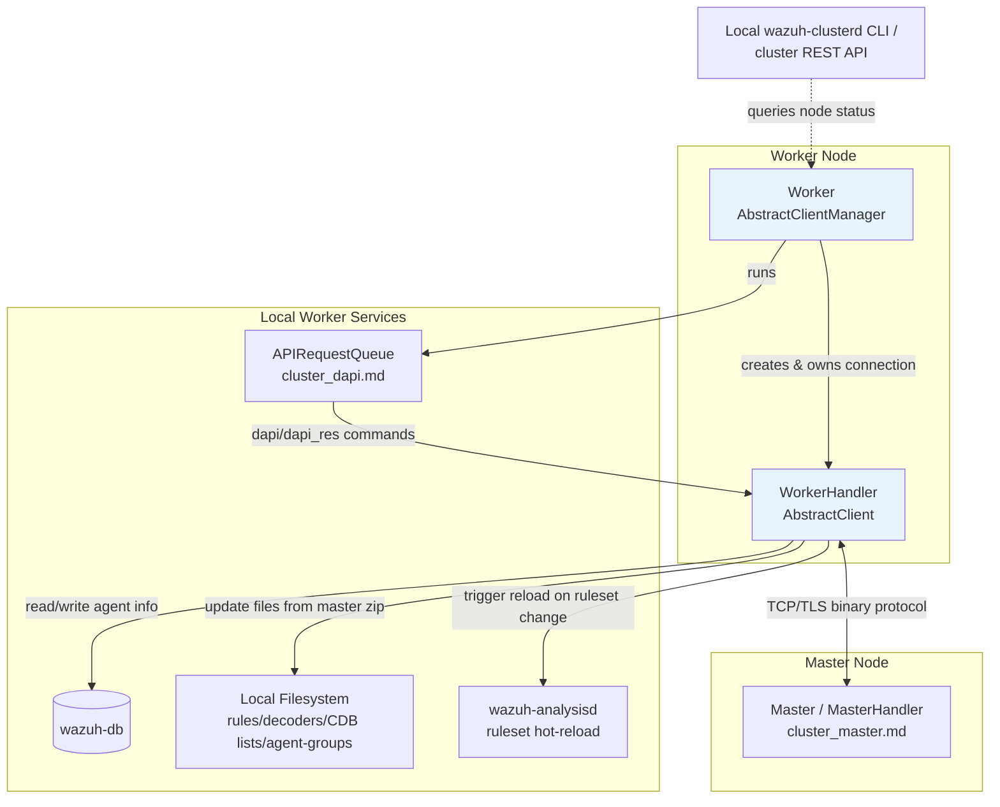
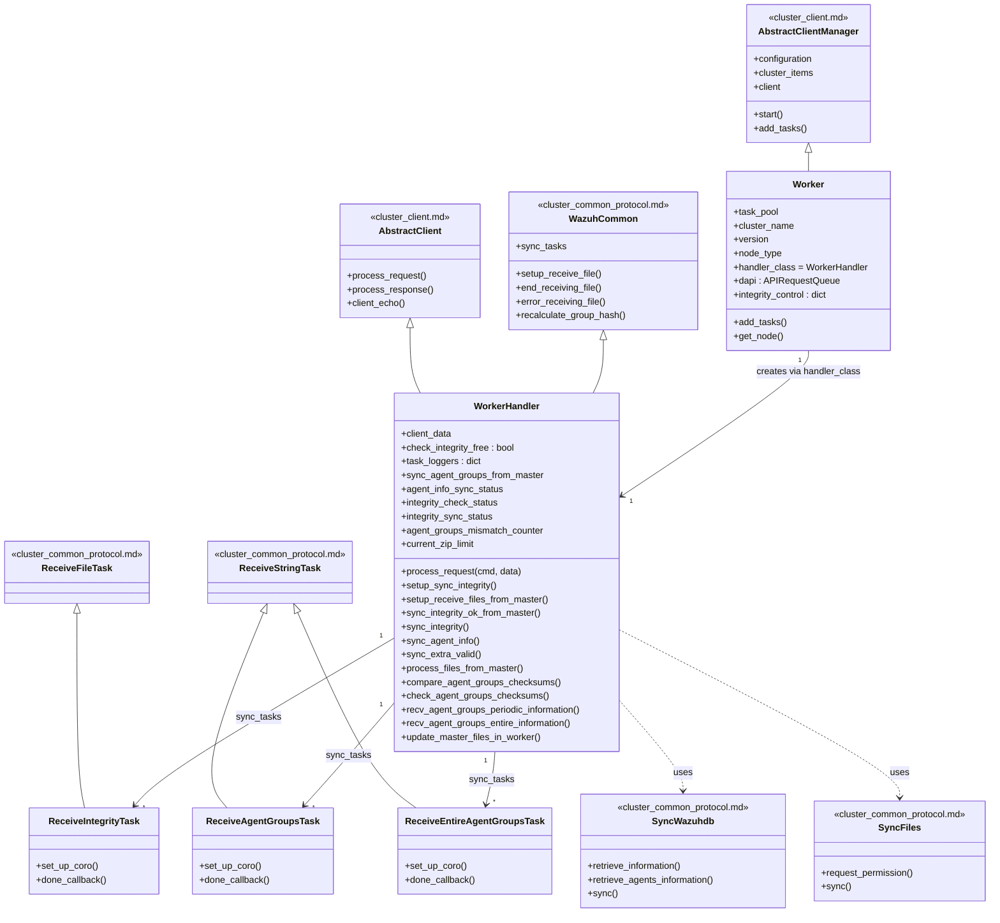
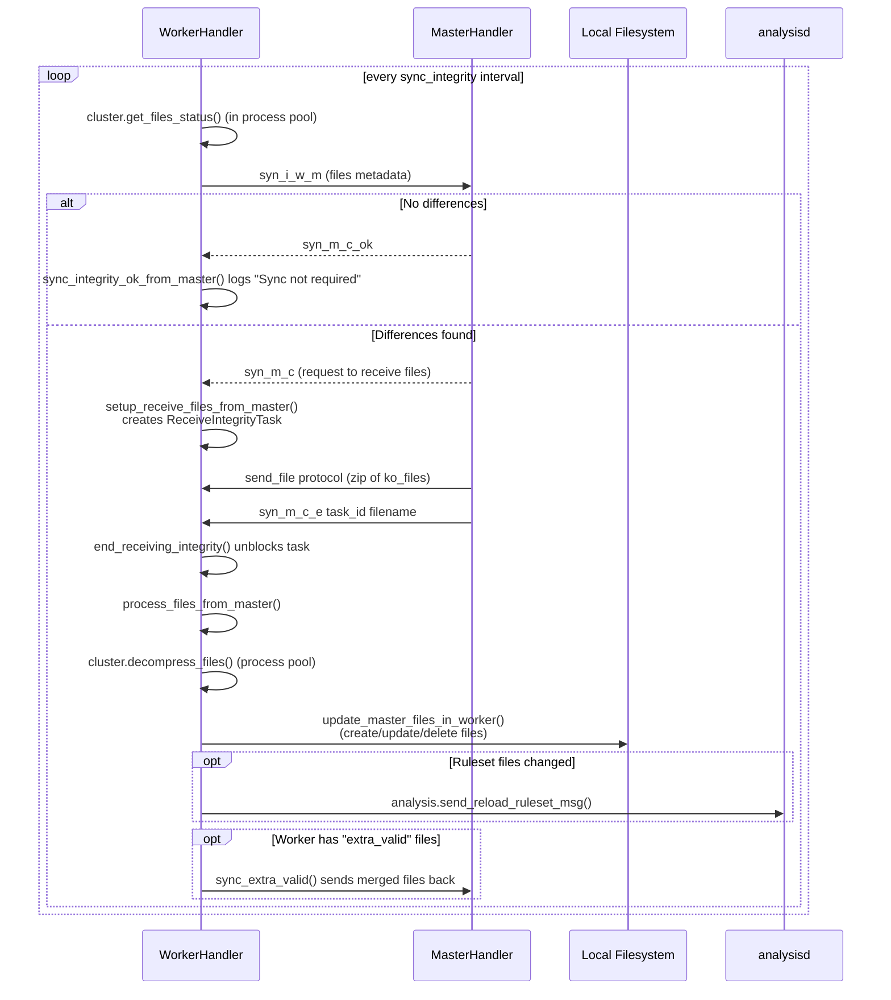
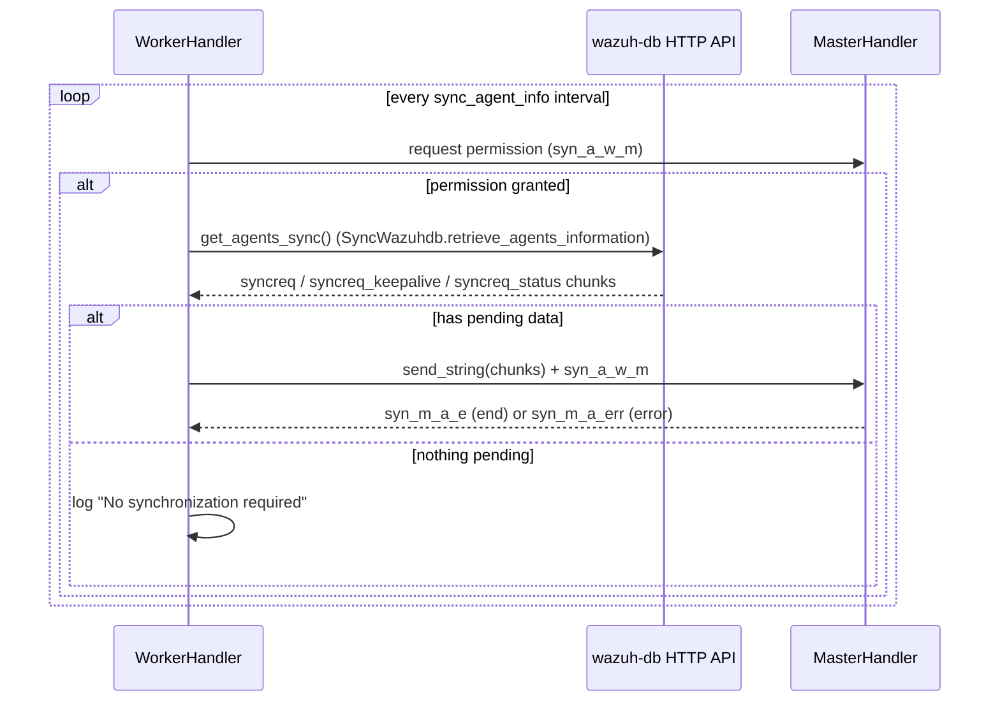
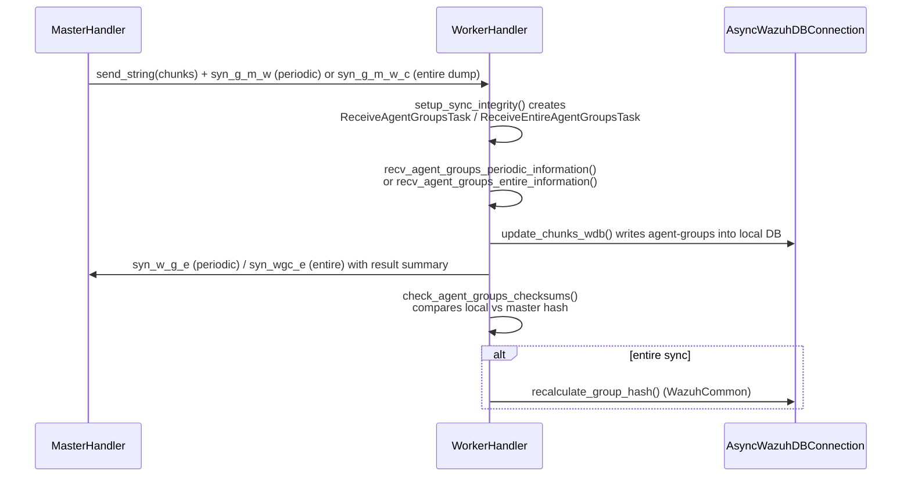
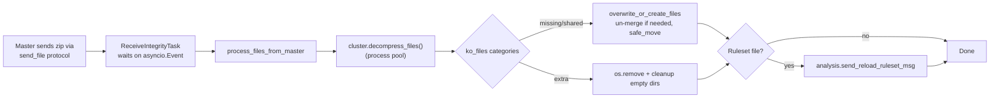

# Cluster Worker Module

## Introduction

The **cluster_worker** module (`framework/wazuh/core/cluster/worker.py`) implements the worker-side logic of the Wazuh cluster protocol. In a Wazuh cluster, a single **master** node coordinates several **worker** nodes: agents connect to workers, but the master owns the canonical configuration (rulesets, decoders, CDB lists, agent groups, etc.) and holds the authoritative Wazuh database of agents. Worker nodes must keep their local files and databases synchronized with the master, forward agent information upstream, and relay Distributed API (DAPI) requests.

This module provides:

- **`WorkerHandler`** – the per-connection protocol handler that implements every command a worker can receive from the master, plus the coroutines that drive the periodic synchronization loops (Integrity sync, Agent-info sync, Agent-groups sync).
- **`Worker`** – the top-level manager that owns the persistent connection to the master, instantiates `WorkerHandler`, and schedules the recurring background tasks.
- **Task classes** (`ReceiveIntegrityTask`, `ReceiveAgentGroupsTask`, `ReceiveEntireAgentGroupsTask`) – lightweight `asyncio` task wrappers that track a single file/string transfer coming from the master and invoke the appropriate processing coroutine once the transfer completes.

It is the direct counterpart of the [cluster_master](cluster_master.md) module, and both depend heavily on shared building blocks documented in [cluster_common_protocol](cluster_common_protocol.md), [cluster_client](cluster_client.md), and [cluster_core_utilities](cluster_core_utilities.md).

## Role in the Overall System

The `wazuh_clusterd` daemon (see `wazuh_clusterd_daemon` module) instantiates a `Worker` object when the local node is configured with `node_type: worker`. From that point, `Worker.start()` (inherited from `AbstractClientManager`, see [cluster_client](cluster_client.md)) keeps a persistent connection open to the master, automatically reconnecting on failure.

## Architecture

### Component Responsibilities

| Component | Responsibility |
|---|---|
| `Worker` | Cluster manager subclass; configures `handler_class=WorkerHandler`, sets up the `APIRequestQueue` (DAPI) and schedules the always-running coroutines (`sync_integrity`, `sync_agent_info`, `dapi.run`). |
| `WorkerHandler` | Protocol handler bound to the TCP connection with the master. Dispatches every command the master can send (`syn_m_c_ok`, `syn_m_c`, `syn_m_c_e`, `syn_m_c_r`, `syn_g_m_w`, `syn_g_m_w_c`, `syn_m_a_e`, `syn_m_a_err`, `dapi_res`, `sendsyn_res`, `sendsyn_err`, `dapi`). Implements the three synchronization loops and file-merging logic. |
| `ReceiveIntegrityTask` | Waits for the master to fully transmit the Integrity zip file, then calls `process_files_from_master`. |
| `ReceiveAgentGroupsTask` / `ReceiveEntireAgentGroupsTask` | Wait for the master to finish sending agent-groups JSON chunks (periodic vs. full/entire dump) and invoke the corresponding `recv_agent_groups_*_information` coroutine. |

## Synchronization Processes

The worker runs **three independent, concurrent synchronization loops**, all started as background asyncio tasks from `Worker.add_tasks()` (Integrity, Agent-info) and driven by the master for Agent-groups (workers only *receive* agent-groups pushed by the master, they don't initiate that sync).

### 1. Integrity Synchronization (files: rules, decoders, CDB lists, etc.)

Key details:

- `check_integrity_free` acts as a mutex: a new Integrity check is not started while a previous synchronization is still being processed (`ReceiveIntegrityTask.done_callback` frees it).
- `cluster.get_files_status` and `cluster.decompress_files` run in the shared process pool (`self.server.task_pool`, see [cluster_core_utilities](cluster_core_utilities.md)) to avoid blocking the event loop.
- `update_master_files_in_worker` handles 3 file categories: `shared`/`missing` (create or overwrite locally, un-merging `merged` files first) and `extra` (delete locally, and clean up now-empty subdirectories per `cluster.json` rules).
- If any updated/removed file is a ruleset file (`analysis.is_ruleset_file`), the module notifies `wazuh-analysisd` to hot-reload it via `analysis.send_reload_ruleset_msg` (see [engine_module](engine_module.md) / `framework/wazuh/core/analysis.py`).
- Any exception during the process is serialized (`WazuhJSONEncoder`) and reported back to the master via `syn_i_w_m_r` so the master can clean up its state.

### 2. Agent-Info Synchronization

This synchronization pushes local agent keepalive/status/info changes from the worker's `wazuh-db` up to the master's global database, using the generic `SyncWazuhdb` helper from [cluster_common_protocol](cluster_common_protocol.md).

### 3. Agent-Groups Synchronization (master-initiated)

Unlike the other two loops, agent-groups sync is **pushed by the master**. The worker only reacts:

`check_agent_groups_checksums` implements a **self-healing mechanism**: if the local database hash mismatches the master's hash `agent_groups_mismatch_limit` times in a row, the worker proactively requests a full re-sync (`syn_w_g_c`), resetting the mismatch counter afterward.

## Command Dispatch (`WorkerHandler.process_request`)

| Command (bytes) | Meaning | Handler method |
|---|---|---|
| `syn_m_c_ok` | Master confirms no Integrity differences | `sync_integrity_ok_from_master` |
| `syn_m_c` | Master will send Integrity files | `setup_receive_files_from_master` |
| `syn_m_c_e` | Master finished sending Integrity zip | `end_receiving_integrity` |
| `syn_m_c_r` | Master reports error sending Integrity zip | `error_receiving_integrity` |
| `syn_g_m_w` | Master sends periodic agent-groups chunks | `setup_sync_integrity` → `ReceiveAgentGroupsTask` |
| `syn_g_m_w_c` | Master sends entire (full) agent-groups dump | `setup_sync_integrity` → `ReceiveEntireAgentGroupsTask` |
| `syn_m_a_e` | Master confirms agent-info sync completion | inline via `c_common.end_sending_agent_information` |
| `syn_m_a_err` | Master reports agent-info sync error | inline via `c_common.error_receiving_agent_information` |
| `dapi_res` | DAPI response forwarded from master | forwards to local API client |
| `sendsyn_res` / `sendsyn_err` | SendSync response/error forwarded | forwards to local API client |
| `dapi` | New DAPI request from local API to be run on master | `self.server.dapi.add_request` |
| *(others)* | Delegated to base classes | `AbstractClient.process_request` / `Handler.process_request` |

## Data Flow: File Update Pipeline

## Key Design Points

- **Process pool offloading**: CPU/IO heavy operations (`get_files_status`, `decompress_files`, `update_master_files_in_worker`) run via `cluster.run_in_pool` on `self.server.task_pool` to keep the asyncio event loop responsive. See [cluster_core_utilities](cluster_core_utilities.md).
- **Per-task loggers**: `WorkerHandler.task_loggers` maps synchronization names (`'Agent-info sync'`, `'Agent-groups recv'`, `'Agent-groups recv full'`, `'Integrity check'`, `'Integrity sync'`) to dedicated loggers created via `setup_task_logger`, so every log line is tagged with both the worker name and the sync process.
- **Error propagation**: All synchronization coroutines catch exceptions, serialize them with `WazuhJSONEncoder` (see [cluster_common_protocol](cluster_common_protocol.md)), and notify the master (`syn_i_w_m_r`) so cluster state stays consistent even after failures.
- **Temporary directory management**: On connection, `WorkerHandler.connection_result` creates `queue/cluster/<node_name>` for staging received files; on disconnect, `cluster.clean_up` removes leftovers.
- **Checksum mismatch backoff**: The agent-groups mismatch counter/limit pattern avoids requesting a full re-sync on every single transient mismatch, only doing so after `agent_groups_mismatch_limit` consecutive failures.

## Dependencies

| Module | Usage |
|---|---|
| [cluster_client](cluster_client.md) | Base classes `AbstractClient` / `AbstractClientManager` providing the connection lifecycle, reconnection loop, and generic request/response protocol. |
| [cluster_common_protocol](cluster_common_protocol.md) | `WazuhCommon` mixin, `ReceiveFileTask`/`ReceiveStringTask` base classes, `SyncWazuhdb`, `SyncFiles`, `WazuhJSONEncoder`, `as_wazuh_object`. |
| [cluster_core_utilities](cluster_core_utilities.md) | `compress_files`/`get_files_status`, `decompress_files`, `merge_info`/`unmerge_info`, `run_in_pool`, `clean_up`. |
| [cluster_dapi](cluster_dapi.md) | `APIRequestQueue` used by `Worker` to relay Distributed API requests to/from the master. |
| [cluster_utils](cluster_utils.md) | `log_subprocess_execution` helper for logging results produced inside the process pool. |
| `framework/wazuh/core/analysis.py` (part of [engine_module](engine_module.md)) | `is_ruleset_file` and `send_reload_ruleset_msg` used to hot-reload the Wazuh engine ruleset when relevant files change. |
| `framework/wazuh/core/wdb.py` (`AsyncWazuhDBConnection`, part of [framework_core_communication](framework_core_communication.md)) | Used for checksum comparison queries (`sync-agent-groups-get`) and group-hash recalculation. |
| `framework/wazuh/core/utils.py` (part of [framework_core_utils](framework_core_utils.md)) | `safe_move`, `get_utc_now`, `mkdir_with_mode`. |

## Relationship with the Master

The `cluster_worker` module is the mirror image of [cluster_master](cluster_master.md): the master pushes Integrity diffs and agent-groups chunks and pulls agent-info via the same command names (prefixed `syn_*`) that `WorkerHandler` implements here. Both modules share the base synchronization primitives from [cluster_common_protocol](cluster_common_protocol.md), ensuring symmetric encode/decode and error-handling semantics on both ends of the connection.

## Related CLI / Entry Points

- `wazuh_clusterd_daemon` (`framework/scripts/wazuh_clusterd.py`) — the daemon entry point that instantiates `Worker` (via `worker_main`) when the node's `node_type` is `worker`.
- `cluster_control_cli` (`framework/scripts/cluster_control.py`) — administrative CLI that queries cluster/node status, which for workers is exposed through `Worker.get_node()`.
