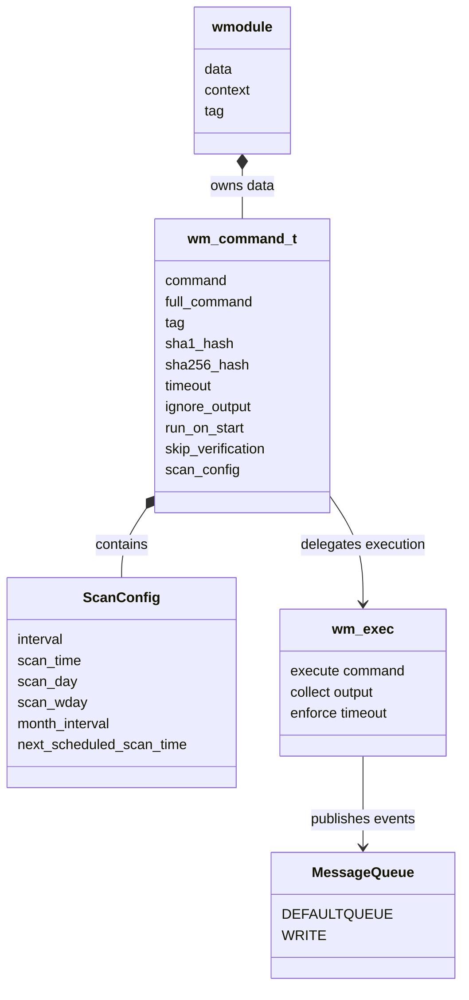
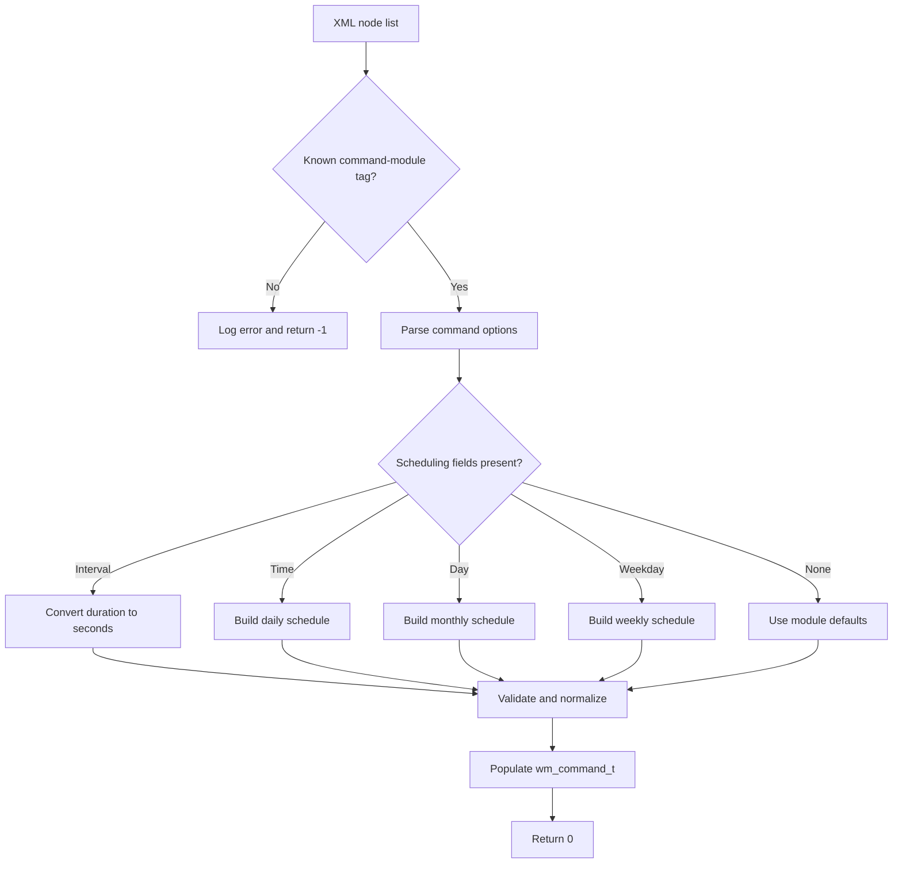
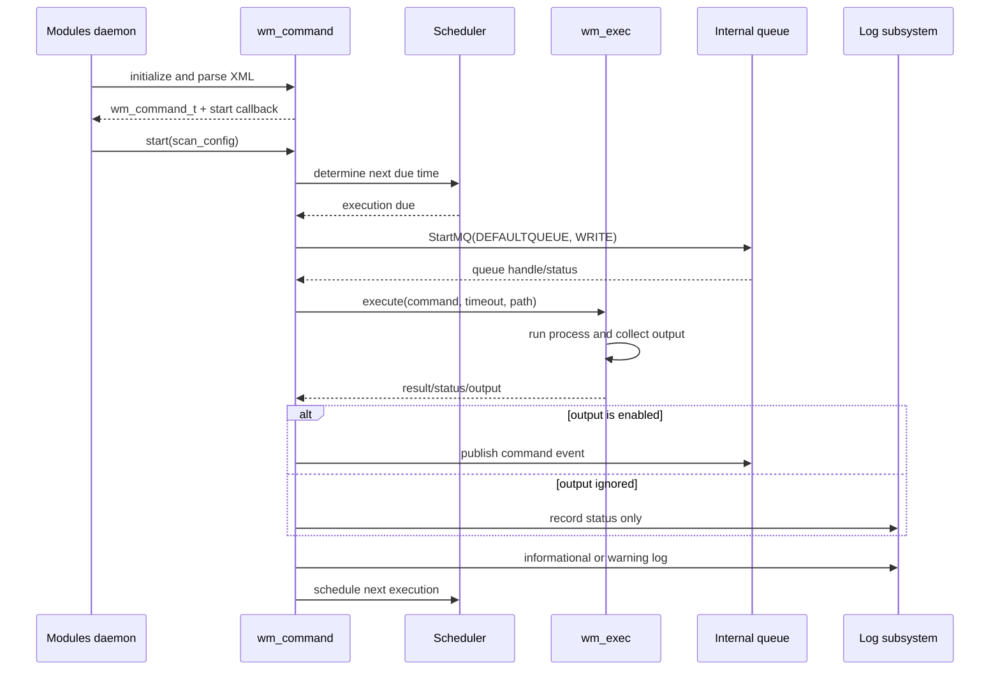
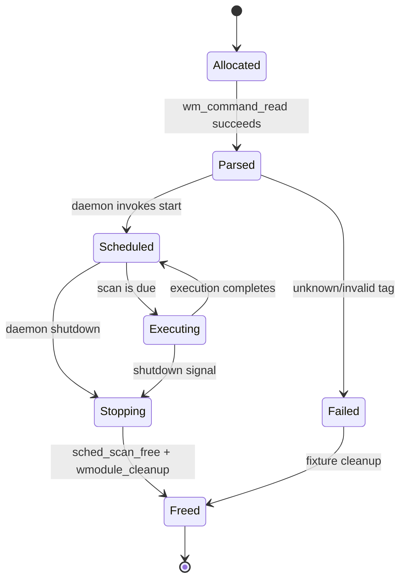

# Command module

The Wazuh command module (`wm_command`) periodically executes a configured shell command and publishes its output through the manager’s internal message queue. It is a plug-in of the Wazuh modules daemon, with configuration parsing, schedule calculation, process execution, output handling, and lifecycle cleanup separated across the module framework and shared services.

The supplied test coverage verifies configuration validation and scheduling for the module, plus the execution path that starts the module queue and invokes `wm_exec`. Native implementation details not present in the supplied source are described at the architectural level indicated by the module tree.

## Responsibilities

- Parse and validate the `<command>` module configuration.
- Store command metadata and execution options in `wm_command_t`.
- Convert interval- and calendar-based settings into a shared scheduling configuration.
- Execute the command when a scan is due.
- Optionally suppress command output, enforce a timeout, and verify command/package hashes according to configuration.
- Send generated events to the Wazuh modules message queue.
- Release module-owned strings, hashes, scheduling state, and wrapper objects during shutdown.

## Position in the Wazuh system

The command module is hosted by the Wazuh modules daemon alongside other system-management integrations. The daemon owns module discovery and lifecycle management; the module owns command-specific state and delegates generic scheduling and process execution to shared components.

```mermaid
flowchart LR
    C[Wazuh configuration XML] --> W[Wazuh modules daemon]
    W --> R[wm_command_read]
    R --> S[wm_command_t]
    S --> SC[Shared scheduling subsystem]
    SC --> L[wm_command start callback]
    L --> E[wm_exec]
    E --> Q[StartMQ(DEFAULTQUEUE, WRITE)]
    Q --> M[Internal Wazuh message queue]
    M --> D[Analysis / manager consumers]

    W --> X[Module shutdown]
    X --> F[wmodule_cleanup]
    F --> S
```

The command module is part of the system-management process-integration family documented in [wazuh_modules_core_system_management_process_integrations.md](wazuh_modules_core_system_management_process_integrations.md). Shared scheduling behavior is covered in [shared_lib_system_utils_config_scheduling.md](shared_lib_system_utils_config_scheduling.md), while queue semantics are related to [test_mq_op.md](test_mq_op.md).

## Component architecture

### Module wrapper

`wmodule` is the framework-level container. The command module places a `wm_command_t` instance in `wmodule.data`, registers a start callback, and exposes a cleanup path. The test fixture confirms that the module is allocated as a zeroed `wmodule` and populated by `wm_command_read`.

### Command state

`wm_command_t` is the command-specific state object. The tested cleanup path shows that it owns at least:

- `command`: the executable command or command string;
- `full_command`: the expanded or complete command representation;
- `tag`: the event/module tag;
- `sha1_hash` and `sha256_hash`: expected verification digests;
- `scan_config`: scheduling state consumed by the start callback.

The state also represents options parsed from XML, including `disabled`, `ignore_output`, `run_on_start`, `timeout`, and `skip_verification`.

### Scheduling

The module reuses the scheduling model used by other Wazuh modules. It supports:

- fixed intervals such as `10s`, `10m`, and `1d`;
- a time of day via `<time>`;
- a calendar day via `<day>` and a monthly schedule;
- a weekday via `<wday>` and a weekly schedule.

Calendar settings normalize the interval to the required unit. The tests verify the following normalized values:

| Configuration | Resulting scheduling state |
| --- | --- |
| `<interval>10s</interval>` | `interval = 10`, no day or weekday |
| `<time>10:53</time>` | default daily interval (`WM_DEF_INTERVAL`), `scan_time = "10:53"` |
| `<time>12:05</time><day>1</day>` | `scan_day = 1`, `interval = 1`, `month_interval = true`, `scan_time = "12:05"` |
| `<time>10:59</time><wday>Tuesday</wday>` | `scan_wday = 2`, `interval = 604800`, `scan_time = "10:59"` |

When a calendar schedule is supplied without a matching interval unit, the parser emits a warning and normalizes the interval: one month (`1M`), one week (`1w`), or one day (`1d`) as appropriate.

### Execution and delivery

When the schedule becomes due, the start callback delegates execution to `wm_exec`. The execution test expects the callback to:

1. open the default internal queue for writing;
2. invoke `wm_exec` with the configured command, timeout, and path-related arguments;
3. continue according to the scheduling loop;
4. log informational or warning messages using the module tag.

The test sets `wm_max_eps = 1`, so command execution participates in the daemon’s event-rate limiting. `wm_exec` is mocked in unit tests; the real process and output handling belong to the Wazuh module execution infrastructure.



## Configuration flow

`wm_command_read` receives an XML node list and a destination `wmodule`. The parser rejects unknown tags. The test explicitly expects `<fake>` to fail with `No such tag 'fake' at module 'command'.` Valid command configuration is accepted even when duplicate scheduling-related fields occur in the fixture; the effective parsed value is the one established by the parser’s normal XML traversal and validation rules.



Important configuration concepts:

| Field | Purpose |
| --- | --- |
| `disabled` | Enables or disables the module. |
| `tag` | Identifies emitted messages and log records. |
| `command` | Command to execute. |
| `interval` | Fixed execution period, expressed with a duration suffix. |
| `time` | Time-of-day execution point. |
| `day` | Day of month for monthly execution. |
| `wday` | Day of week for weekly execution. |
| `timeout` | Maximum permitted execution time. |
| `ignore_output` | Controls whether command output is forwarded. |
| `run_on_start` | Controls whether execution occurs immediately at module startup. |
| `verify_sha1` / `verify_sha256` | Expected command-related integrity digests. |
| `skip_verification` | Disables configured digest verification when enabled. |

The exact accepted values and defaults should remain aligned with `wm_command_read` and the shared module configuration conventions. See the broader [wazuh_modules_core_system_management.md](wazuh_modules_core_system_management.md) documentation for daemon-level module registration and configuration context.

## Runtime process flow



The supplied execution test drives the callback through multiple loop iterations by controlling the `FOREVER` wrapper. It verifies queue startup, execution delegation, and logging expectations without starting a real process.

## Lifecycle and cleanup



The test cleanup sequence is significant:

1. release `scan_config` with `sched_scan_free` for execution tests;
2. free command hashes and command strings;
3. free the command state object;
4. free the module tag and `wmodule` wrapper;
5. clear the XML representation used by the parser.

This ownership model means changes to `wm_command_t` must update `wmodule_cleanup` and any test teardown that manually releases `scan_config`.

## Error handling and observability

- Unknown XML tags are rejected and logged as module configuration errors.
- Invalid or incompatible calendar intervals are normalized with warnings.
- Queue startup and command execution are independently observable in the execution path.
- Informational and warning logs use the configured module tag.
- Process failures, timeout outcomes, and output policy are delegated to the execution layer; callers should inspect the returned execution status before publishing output.

## Testing guide

The current test file is organized into two groups:

- `tests_with_startup`: exercises the runtime start callback with mocked queue, execution, logging, and loop primitives.
- `tests_without_startup`: exercises XML parsing and schedule construction without launching module startup.

The tests cover:

- unknown-tag rejection;
- fixed-second interval parsing;
- daily, monthly, and weekly schedule normalization;
- execution callback integration with `StartMQ` and `wm_exec`;
- cleanup of schedule and module-owned memory.

For adjacent behavior, consult [task_manager_module.md](task_manager_module.md) for another module using daemon task infrastructure and [os_execd.md](os_execd.md) for the lower-level command execution daemon. These modules are related operationally but are not substitutes for `wm_command`: the command module schedules configured commands, while `os-execd` provides execution facilities and active-response-style command handling.

## Maintenance notes

- Keep XML tag validation synchronized with the command module schema and update the unknown-tag test when tags are intentionally added.
- Preserve duration-unit normalization for calendar schedules; consumers rely on seconds for weekly and daily intervals and a month flag for monthly schedules.
- Treat `scan_config` as owned state and free it exactly once.
- Changes to queue delivery should be validated against the internal queue contract documented by the message-queue tests.
- Changes to execution arguments should update both the `wm_exec` integration test expectations and the process-integration documentation.
