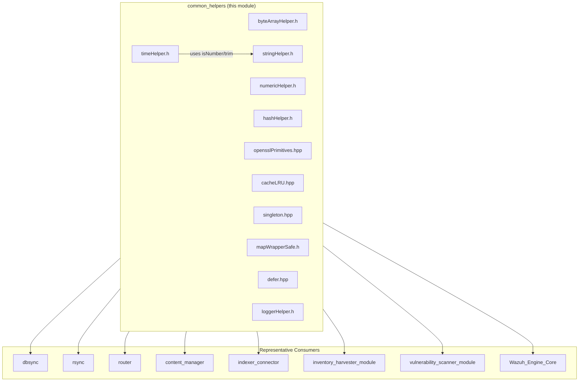
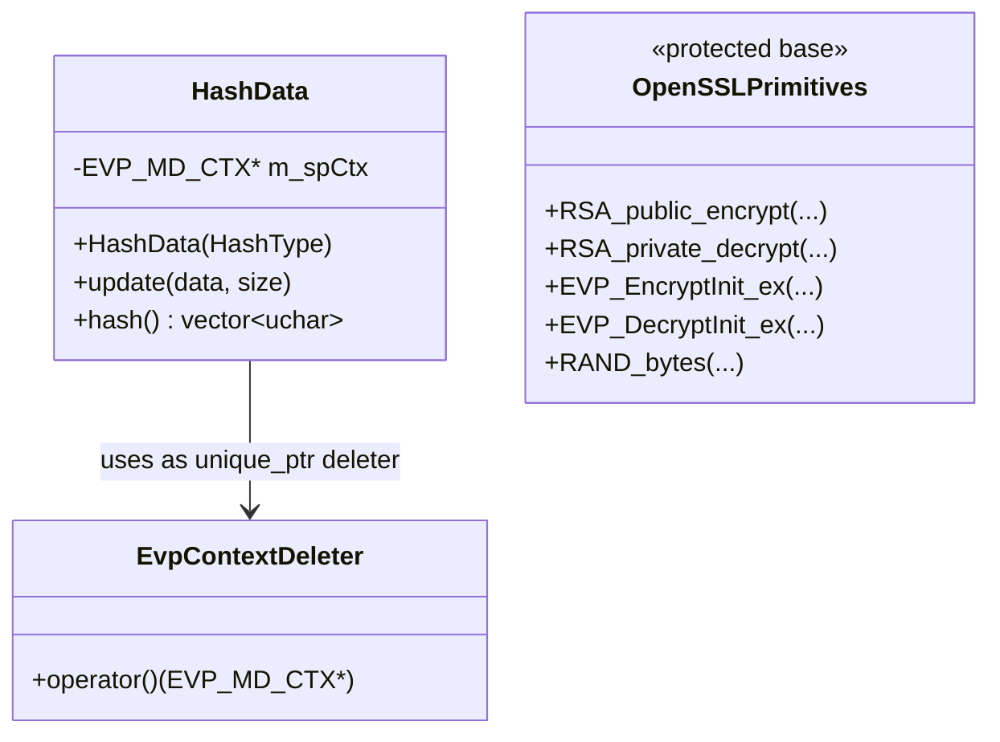

# Common Helpers

## Introduction

The **Common Helpers** module is a collection of small, header-only C++ utility
components located under `src/shared_modules/utils/`. These headers provide
generic, low-level primitives that are reused across many Wazuh components —
from the native daemons (`src/*`) to the shared modules (`content_manager`,
`dbsync`, `rsync`, `router`, `indexer_connector`) and the vulnerability /
inventory harvester modules.

Unlike most other sub-modules of `shared_utils` (which group related
functionality behind classes/interfaces, e.g. socket wrappers or RocksDB
wrappers), `common_helpers` is a **toolbox of independent, stateless (or
minimally-stateful) utilities**. Each header can be included individually and
has no hard dependency on the others (with the minor exception of
`timeHelper.h`, which relies on `stringHelper.h` for numeric-string checks).

Because of this independence, the module is documented as a single reference
rather than being split into further sub-modules — splitting these unrelated,
single-purpose headers would not add architectural clarity.

### Core Components

| Header | Component(s) | Purpose |
|---|---|---|
| `byteArrayHelper.h` | `toInt32BE`, `toInt32LE` | Convert raw byte buffers to 32-bit integers (big/little endian). |
| `numericHelper.h` | `floatToDoubleRound` | Round a `float` to a given precision and return it as a `double`. |
| `stringHelper.h` | `asciiToHex`, `splitNullTerminatedStrings`, (+ many other string utilities) | String manipulation: trimming, splitting, case conversion, hex encoding, numeric parsing. |
| `timeHelper.h` | `getCurrentISO8601`, `getCurrentTimestamp`, `getSecondsFromEpoch`, `rawTimestampToISO8601`, `tm` | Date/time formatting and conversion (ISO 8601, epoch seconds, timestamps). |
| `hashHelper.h` | `HashData`, `EvpContextDeleter` | SHA1/SHA256 hashing of buffers and files via OpenSSL's EVP API. |
| `opensslPrimitives.hpp` | `OpenSSLPrimitives` | Thin, mockable wrapper around OpenSSL RSA/AES/EVP primitives (used as a base class for testable crypto code). |
| `cacheLRU.hpp` | `LRUCache` | Generic templated Least-Recently-Used cache with fixed capacity. |
| `singleton.hpp` | `Singleton` | CRTP-style template providing a thread-safe, lazily-initialized singleton instance. |
| `mapWrapperSafe.h` | `MapWrapperSafe` | Mutex-protected wrapper around `std::map` for thread-safe access. |
| `defer.hpp` | `Defer`, `deferFunc` | RAII-style "defer" utility (Go-like `defer`) that runs a callable when a scope exits. |
| `loggerHelper.h` | `Logger`, `SourceFile`, `assignLogFunction`, `deassignLogFunction` | Lightweight, pluggable logging facade used by C++ modules to emit log messages through a globally-assigned callback. |

## Architecture Overview

`common_helpers` sits at the bottom of the `shared_utils` dependency stack:
almost every other C++ sub-module in the codebase (native daemons, shared
modules, wazuh_modules, and the engine) depends transitively on one or more
of these headers.



### Relationship to sibling `shared_utils` sub-modules

`common_helpers` is one of several leaf documentation files that together
cover `src/shared_modules/utils/`. Related sibling documentation:

- `sync_primitives.md` – locking/waiting primitives (`ExclusiveLocking`, `ConditionSync`, `PromiseFactory`).
- `smart_pointers_raii.md` – custom deleters and RAII wrappers (`CJsonSmartDeleter`, `UniqueFD`, etc.).
- `design_patterns.md` – `Builder`, `Observer`, `Subscriber`, `Provider`, `RoundRobinSelector`.
- `socket_networking.md` – socket client/server/wrapper utilities.
- `file_os_helpers.md` – filesystem and OS-primitive helpers.
- `json_utilities.md` – JSON streaming parser, file I/O, and reflection helpers.
- `threading_dispatch_queues.md` – dispatcher and thread-safe queue implementations.
- `rocksdb_wrapper.md` / `sqlite_wrapper.md` – database-specific wrappers.
- `compression_archive.md` – archive/compression helpers (zlib, xz, tar).

These sub-modules occasionally use `common_helpers` internally (for example,
many wrappers call `stringHelper.h` functions or `loggerHelper.h` macros), but
`common_helpers` itself has no dependency on them, reinforcing its role as the
foundational utility layer.

## Functional Areas

### 1. Byte / Numeric Data Conversion

**Files:** `byteArrayHelper.h`, `numericHelper.h`

These are minimal, branch-free helpers used when parsing binary protocols or
normalizing numeric values:

- `Utils::toInt32BE(const uint8_t*)` / `Utils::toInt32LE(const uint8_t*)` —
  interpret 4 raw bytes as a signed 32-bit integer in big-endian or
  little-endian order. Commonly used when decoding binary message headers
  (e.g., RocksDB queue records, network protocol framing).
- `Utils::floatToDoubleRound(float, int precision)` — formats a `float`
  through a `std::stringstream` with fixed precision and re-parses it as a
  `double`, effectively rounding a float value to `precision` decimal places
  while avoiding floating-point representation artifacts. Used in
  inventory/hardware modules for normalizing sensor readings (CPU MHz, memory
  usage percentages, etc.).

### 2. String Manipulation

**File:** `stringHelper.h`

The largest and most heavily used helper file. In addition to the two
components flagged as core (`asciiToHex`, `splitNullTerminatedStrings`), it
provides a broad set of static, header-only string utilities under the
`Utils` namespace:

- Trimming: `leftTrim`, `rightTrim`, `trim`, `trimSpaces`, `trimRepeated`.
- Splitting/joining: `split`, `splitIndex`, `splitToNumbers`,
  `splitMapKeyValue`, `splitMaintainerField`, `splitNullTerminatedStrings`
  (splits a buffer of consecutive NUL-terminated C strings, as returned by
  certain OS APIs, into a `std::vector<std::string>`).
- Case conversion: `toUpperCase`, `toLowerCase`, `toSentenceCase`,
  `haveUpperCaseCharacters`.
- Predicates: `startsWith`, `endsWith`, `isNumber`,
  `isAlphaNumericWithSpecialCharacters`.
- Encoding: `asciiToHex` (converts a vector of bytes into its hexadecimal
  string representation, with a fast `stringstream`-based path and a
  `snprintf`-based fallback).
- Parsing helpers: `parseStrToBool`, `parseStrToTime` (supports suffixes `w`,
  `d`, `h`, `m`, `s`), `padString`.
- Regex helpers: `findRegexInString`.
- ISO-8859-1 → UTF-8 conversion: `ISO8859ToUTF8`.
- C++17-only overloads operating on `std::string_view` for zero-copy
  splitting/checking (`splitView`, `startsWith`, `toLowerCaseView`, `isNumber`).

`stringHelper.h` is a dependency of `timeHelper.h` (for `isNumber` used when
parsing numeric timestamp strings).

### 3. Time & Date Formatting

**File:** `timeHelper.h`

Provides consistent timestamp formatting across the codebase, always
expressing time relative to UTC unless explicitly requested otherwise:

- `getCurrentTimestamp()` / `getTimestamp(time_t, bool utc)` — human-readable
  `YYYY/MM/DD hh:mm:ss` format.
- `getCompactTimestamp()` — compact `YYYYMMDDhhmmss` format (useful for
  filenames, e.g., backup files).
- `getCurrentISO8601()` / `timestampToISO8601()` / `rawTimestampToISO8601<T>()`
  — ISO 8601 formatting (`%FT%T.mmmZ`). The templated
  `rawTimestampToISO8601` overload (C++17) accepts `uint32_t`, `double`,
  `std::string`, or `std::string_view` epoch timestamps and normalizes them
  to ISO 8601, handling fractional seconds.
- `getSecondsFromEpoch()` — current UNIX time in seconds.
- A Windows-only shim reimplements POSIX `gmtime_r` / `localtime_r` on top of
  `gmtime_s` / `localtime_s` so the rest of the header is portable.

This header is widely used by the syscollector, inventory harvester, and
vulnerability scanner modules to timestamp events consistently in the format
expected by the indexer.

### 4. Hashing & Cryptographic Primitives

**Files:** `hashHelper.h`, `opensslPrimitives.hpp`



- **`HashData`** wraps OpenSSL's `EVP_MD_CTX` lifecycle behind RAII. It
  supports `HashType::Sha1` and `HashType::Sha256`, exposes `update()` for
  streaming data, and `hash()` to finalize and retrieve the digest. A free
  function `hashFile(filepath)` reads a file in 4 KB chunks and returns its
  digest — used for file-integrity checks (FIM, package/DB hashing).
- **`EvpContextDeleter`** is the custom deleter used by the internal
  `std::unique_ptr<EVP_MD_CTX, EvpContextDeleter>` to guarantee
  `EVP_MD_CTX_destroy` is always called.
- **`OpenSSLPrimitives`** is a protected base class exposing thin, virtual
  member wrappers around raw OpenSSL C API calls (RSA encrypt/decrypt, AES
  256-CBC EVP cipher operations, key loading from PEM, `RAND_bytes`, error
  string retrieval). Higher-level crypto/keystore code (e.g.
  `src/shared_modules/keystore`) derives from this class so that unit tests
  can mock the OpenSSL calls without touching real cryptographic primitives.

### 5. Caching, Thread-Safe Containers & Design-Pattern Primitives

**Files:** `cacheLRU.hpp`, `mapWrapperSafe.h`, `singleton.hpp`, `defer.hpp`

- **`LRUCache<KeyType, ValueType>`** — a fixed-capacity Least-Recently-Used
  cache backed by a `std::map` (for O(log n) lookup) and a `std::list` (to
  track recency order). Supports `insertKey`, `getValue` (returns
  `std::optional<ValueType>`), `isFull`, `isHit`, and `forEach` for
  iterating cache contents. Used, for example, by the vulnerability scanner's
  `OsDataCache` / `RemediationDataCache` to avoid redundant lookups.
- **`MapWrapperSafe<Key, Value>`** — a minimal mutex-guarded `std::map`
  wrapper exposing `insert`, `operator[]`, and `erase`, all internally
  synchronized with a `std::mutex`. Provides a simple thread-safe key/value
  store without requiring callers to manage their own locking.
- **`Singleton<T>`** — a CRTP base template exposing a static `instance()`
  method that lazily constructs a function-local static `T` (thread-safe
  under C++11's guaranteed static-initialization semantics). Copy
  construction/assignment are disabled. Used throughout the engine and
  shared modules wherever a process-wide unique instance is required (e.g.
  `SingletonLocator` strategy classes).
- **`Defer<F>` / `deferFunc(F)`** — implements a Go-style `defer` via RAII:
  the templated `Defer` object stores a callable and invokes it in its
  destructor. The `DEFER(...)` / `DEFER_STATIC(...)` macros generate a
  uniquely-named local variable so callers can write
  `DEFER([&]{ cleanup(); });` to guarantee cleanup on scope exit (including
  early returns and exceptions), avoiding repetitive `try/finally`-style
  boilerplate that C++ lacks natively.


### 6. Logging Facade

**File:** `loggerHelper.h`

Provides a decoupled logging mechanism so that header-only / library code
(which should not depend on any specific logging backend) can still emit
structured log messages:

- A single global `std::function` (`GLOBAL_LOG_FUNCTION`) is registered once
  per process via `Log::assignLogFunction(...)`, typically by the daemon's
  `main()` at startup, wiring the helper to the concrete logging
  implementation (e.g., syslog, file logger, or the C `_mtinfo`/`_mtdebug1`
  family via `logging_helper.c`).
  `Log::deassignLogFunction()` reverses this (mainly used in tests).
- `Log::Logger` exposes static methods (`info`, `warning`, `debug`,
  `debugVerbose`, `error`) that forward a tag, source location
  (`SourceFile { file, line, func }`), and a `printf`-style format string +
  varargs to the globally-assigned function, but only if one has been
  assigned (no-op otherwise — safe for use in library code with no logger
  configured).
- Convenience macros `logInfo`, `logWarn`, `logDebug1`, `logDebug2`,
  `logError` automatically capture the call site via the `LogEndl` macro
  (`__FILE__`, `__LINE__`, `__func__`), so callers simply write:

  ```cpp
  logInfo("MyTag", "Processed %d items", count);
  ```

This pattern decouples nearly all C++ shared-module code (dbsync, rsync,
router, content_manager, inventory harvester, vulnerability scanner, engine)
from a specific logging implementation while still allowing rich, leveled,
tagged log output.

## Design Notes

- **Header-only, `static` functions:** Almost every helper function is
  declared `static` inside its header to avoid ODR violations when the
  header is included in multiple translation units, with
  `#pragma GCC diagnostic ignored "-Wunused-function"` suppressing warnings
  for helpers not used by every consumer.
- **No cross-module state:** With the exception of the process-wide
  `GLOBAL_LOG_FUNCTION` in `loggerHelper.h`, none of these helpers hold
  global mutable state; instances (`HashData`, `LRUCache`, `MapWrapperSafe`)
  are owned by the calling code.
- **C++17 conditional compilation:** `stringHelper.h` and `timeHelper.h`
  provide additional `std::string_view`-based overloads guarded by
  `#if __cplusplus >= 201703L`, allowing zero-copy operations on platforms
  compiled with a C++17-or-newer standard while remaining backward
  compatible with C++11/14 builds.

## How to Use This Module

Because each header is self-contained, consumers simply include the specific
header(s) they need:

```cpp
#include "stringHelper.h"
#include "timeHelper.h"
#include "hashHelper.h"

auto trimmed = Utils::trim(rawInput);
auto iso8601 = Utils::getCurrentISO8601();
auto digest  = Utils::hashFile("/path/to/file");
```

No linking against a dedicated library is required beyond OpenSSL (for
`hashHelper.h` / `opensslPrimitives.hpp`) since all logic lives in the
headers.

## Related Documentation

- Parent module: `shared_utils.md` (overview of `src/shared_modules/utils/`)
- Grandparent module: `Shared_Modules_Infrastructure_(C++).md`
- Sibling utility docs: `sync_primitives.md`, `smart_pointers_raii.md`,
  `design_patterns.md`, `socket_networking.md`, `file_os_helpers.md`,
  `json_utilities.md`, `threading_dispatch_queues.md`,
  `rocksdb_wrapper.md`, `sqlite_wrapper.md`, `compression_archive.md`
- Major consumers: `dbsync.md`, `rsync.md`, `router.md`, `content_manager.md`,
  `indexer_connector.md`, `inventory_harvester_module.md`,
  `vulnerability_scanner_module.md`
