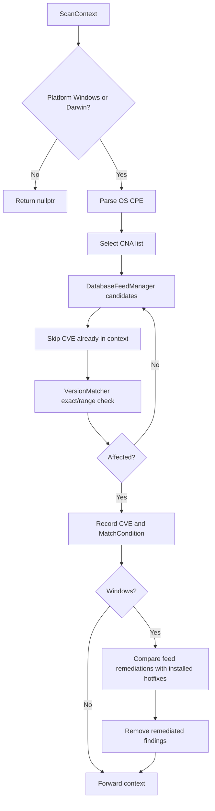

# OS vulnerability scanner

`TOsScanner` is a chain-of-responsibility handler that evaluates an agent's operating-system version against vulnerability-feed candidates. It supports Windows and Darwin explicitly, records matches in `ScanContext`, and forwards the context to the next handler.

## Responsibilities

- Query installed Windows hotfixes through `SocketDBWrapper`.
- Parse the agent OS CPE with `ScannerHelper`.
- Request candidates from `DatabaseFeedManager`, using the configured CNA priority list or the default `nvd` CNA.
- Compare exact versions or lower/upper version ranges through `VersionMatcher`.
- Record the CVE, match condition, and CNA detection source in the scan context.
- Remove Windows findings whose remediation hotfix is already installed.

## Matching behavior

For each candidate, an existing CVE is preserved because a higher-priority CNA may already have detected it. An exact candidate version requires equality and an affected status. A ranged candidate requires the installed version to be at least the lower bound and either below `lessThan` or below/equal to `lessThanOrEqual`. If no version matches, `defaultStatus` can still mark the CVE as affected.

The scanner uses the DPKG version representation for OS comparisons. Windows remediation is an additional post-filter: a finding is discarded when any feed remediation update matches an installed hotfix.

## Error and chain behavior

Unsupported platforms return `nullptr`. Wazuh DB-specific failures are translated to `WdbDataException`; other candidate failures are logged and scanning continues. After a supported scan, the handler invokes the base handler with the updated context.

## Core type

The implementation is templated over the feed manager, scan context, global data, and DB wrapper, which makes the handler testable while exposing `using OsScanner = TOsScanner<>` for production use.

Source: `src/wazuh_modules/vulnerability_scanner/src/scanOrchestrator/osScanner.hpp`.
