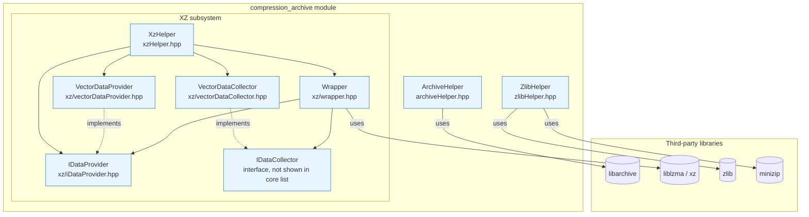
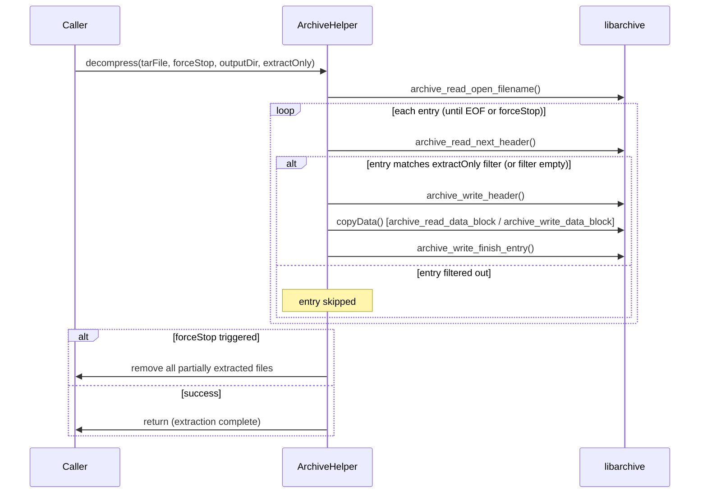
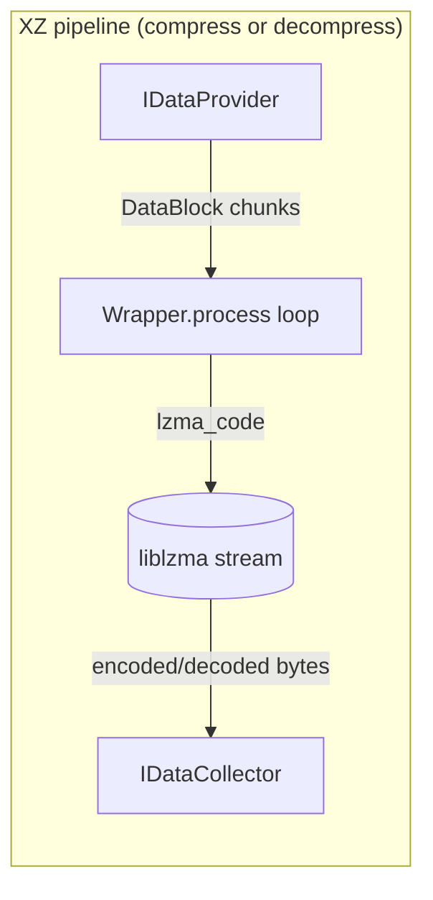
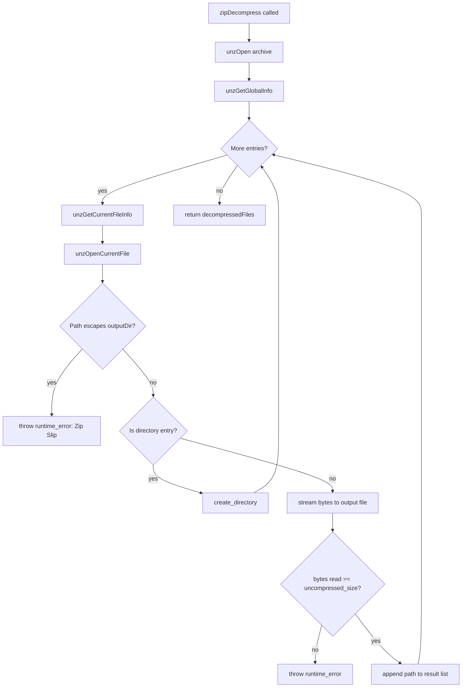
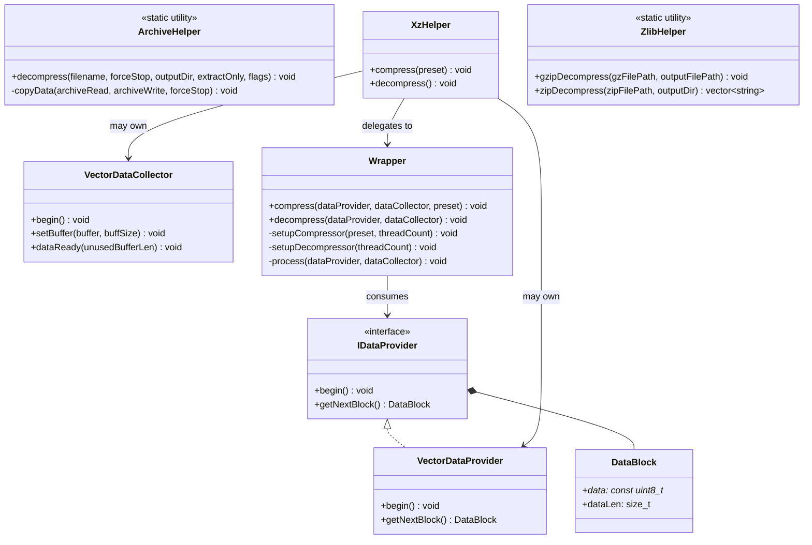

# Compression & Archive Utilities

## 1. Purpose

The **Compression & Archive** module is a small, self-contained group of C++ header-only (and header+cpp) utilities living under `src/shared_modules/utils/`. It provides the Wazuh codebase with a uniform, exception-safe API for:

- **Extracting TAR archives** (`ArchiveHelper`, built on top of `libarchive`).
- **Compressing / decompressing data streams with XZ (LZMA2)** — a small pluggable pipeline made of a `Wrapper` (the actual compressor/decompressor engine), `IDataProvider`/`IDataCollector` abstractions, and ready-to-use vector-based implementations (`VectorDataProvider`, `VectorDataCollector`). A convenience façade, `XzHelper`, wires these pieces together for the most common file/vector/string combinations.
- **Decompressing GZIP and ZIP files** (`ZlibHelper`, built on top of `zlib` and `minizip`).

These utilities are consumed throughout the Wazuh agent/manager/engine codebase whenever compressed payloads need to be produced or consumed, most notably:
- Content/CTI update packages (`shared_modules/content_manager`) that download and unpack `.tar`/`.xz` bundles.
- WPK (Wazuh Package) agent-upgrade artifacts that are signed, compressed and later decompressed (`wazuh_modules/agent_upgrade`, `src/os_crypto/signature`, `wodles/agent-upgrade`).
- Router/indexer connector snapshot handling and other subsystems that need generic archive/compression primitives.

Because the module only exposes stateless static helpers and small composable classes, it has **no runtime state of its own** and can be safely used from any component without additional initialization.

This module is part of the broader [`shared_utils`](shared_utils.md) family inside the **Shared Modules Infrastructure (C++)** area of the codebase, sitting alongside sibling utility groups such as `sync_primitives`, `smart_pointers_raii`, `design_patterns`, `socket_networking`, `file_os_helpers`, `json_utilities`, `threading_dispatch_queues`, `rocksdb_wrapper`, `sqlite_wrapper`, and `common_helpers`.

## 2. Architecture Overview

The module is organized around three independent but conceptually parallel compression/decompression "engines", each wrapping a different third-party library:



### Design rationale

| Concern | Approach |
|---|---|
| Memory safety with C-style library handles | RAII wrappers (`std::unique_ptr` + custom `Deleter`) around `libarchive`'s `archive`/`archive_entry` structs and `zlib`'s `gzFile`/`minizip`'s `unzFile`. |
| Decoupling compression algorithm from I/O source/sink | The XZ subsystem uses the **Strategy** pattern: `Wrapper` only knows how to drive `liblzma`; the actual bytes come from/go to pluggable `IDataProvider`/`IDataCollector` implementations. |
| Ergonomics for common cases | `XzHelper` offers convenience constructors for every combination of `{file, vector, string}` sources and `{file, vector}` destinations, hiding the provider/collector wiring from callers. |
| Cancellation support | `ArchiveHelper::decompress` accepts an `std::atomic<bool>& forceStop` so long-running extractions (e.g., large CTI snapshots) can be aborted cooperatively, cleaning up any partially-written files. |
| Security | `ZlibHelper::zipDecompress` guards against Zip-Slip path-traversal attacks by validating that every extracted path stays under the requested output directory. |

## 3. Component Reference

### 3.1 `ArchiveHelper` — TAR extraction (`archiveHelper.hpp`)

`ArchiveHelper` is a **non-instantiable utility class** (deleted copy/move constructors) exposing a single static method:

```cpp
static void decompress(const std::string& filename,
                        const std::atomic<bool>& forceStop = false,
                        const std::string& outputDir = "",
                        const std::vector<std::string>& extractOnly = {},
                        int flags = 0);
```

Key behaviors:
- Wraps `libarchive`'s read/write-to-disk API using two smart pointers, `ArchiveReadPtr` and `ArchiveWritePtr`, whose custom `Deleter` template calls both the library's "close" and "free" functions in sequence, guaranteeing clean-up even when exceptions are thrown mid-extraction.
- Supports **selective extraction**: if `extractOnly` is non-empty, only archive entries whose resolved output path contains one of the given substrings are written to disk; otherwise every entry is extracted.
- Supports **cooperative cancellation**: the extraction loop and the internal `copyData` block-copy loop both check `forceStop`. If cancellation is detected, all files written so far (tracked in `content`) are removed via `std::filesystem::remove_all`, leaving no partial artifacts behind.
- Raises `std::runtime_error` with the `libarchive` error string on any unexpected read/write failure.



### 3.2 XZ Compression Subsystem

This subsystem implements a small **provider/collector pipeline** so that the LZMA engine (`Wrapper`) never needs to know whether its input comes from a file, a vector, or a string, nor whether its output goes to a file or a vector.

#### `IDataProvider` (`xz/iDataProvider.hpp`)
Abstract interface with:
- `struct DataBlock { const uint8_t* data; size_t dataLen; }` — a simple non-owning view over a chunk of input bytes.
- `virtual void begin()` — reset internal iteration state.
- `virtual DataBlock getNextBlock()` — return the next chunk of data; a `dataLen == 0` signals end-of-input.

#### `VectorDataProvider` (`xz/vectorDataProvider.hpp`)
Simplest possible provider implementation: holds a reference to an existing `std::vector<uint8_t>` and returns its *entire* contents as a single `DataBlock` the first time `getNextBlock()` is called after `begin()`; subsequent calls return an empty block.

#### `VectorDataCollector` (`xz/vectorDataCollector.hpp`)
Counterpart collector that accumulates output data into a caller-supplied `std::vector<uint8_t>&`:
- `setBuffer()` grows the vector by a configurable chunk size (`DEFAULT_BUFFER_SIZE = 8192` bytes by default) and hands back a pointer into the vector's storage for the library to fill.
- `dataReady(unusedBufferLen)` shrinks the vector back down to the actually-used size once the library reports how much of the buffer was left unused.

*(The sibling `IDataCollector`, `FileDataProvider`, `FileDataCollector`, and `StringDataProvider` classes — referenced by `Wrapper` and `XzHelper` respectively — live in the same `xz/` directory but were not selected as core components of this module; they follow the exact same interface contracts described above.)*

#### `Wrapper` (`xz/wrapper.hpp`)
The actual compression engine, wrapping `liblzma`'s streaming API (`lzma_stream`):
- Configurable for **single-thread or multi-thread** operation via a constructor parameter (`threadCount`, default `1`). When more than one thread is requested (or `0`, meaning "use all available CPU threads"), it configures `lzma_mt` options and uses the multi-threaded encoder/decoder (`lzma_stream_encoder_mt` / `lzma_stream_decoder_mt`); otherwise it falls back to the simpler single-thread APIs (`lzma_easy_encoder` / `lzma_stream_decoder`).
- `compress(dataProvider, dataCollector, compressionPreset)` — drives the provider/collector loop while encoding. `compressionPreset` ranges 0–9 (default `PRESET_9_MAX_COMPRESSION = 9`), trading speed for compression ratio.
- `decompress(dataProvider, dataCollector)` — same loop, but decoding.
- Internally, the private `process()` method implements the classic `lzma_code()` pump loop: refill the input buffer from the provider when empty, flush the output buffer to the collector when full, and finish once `LZMA_STREAM_END` is returned. Any other `lzma_ret` value is treated as a fatal error and raises `std::runtime_error`.
- The destructor always calls `lzma_end(&m_strm)` to release library-internal memory.



#### `XzHelper` (`xzHelper.hpp`)
Convenience façade that removes the need for callers to manually instantiate providers/collectors. It offers overloaded constructors for the six most common combinations of source/destination types:

| Source | Destination |
|---|---|
| file path | file path |
| file path | `std::vector<uint8_t>&` |
| `std::vector<uint8_t>` | file path |
| `std::vector<uint8_t>` | `std::vector<uint8_t>&` |
| `std::string` | file path |
| `std::string` | `std::vector<uint8_t>&` |

Each constructor internally builds the matching `IDataProvider`/`IDataCollector` pair (e.g. `FileDataProvider`, `StringDataProvider`, `VectorDataCollector`, etc.) and stores them as `unique_ptr`s. The two public methods simply forward to an internally-created `Xz::Wrapper`:

```cpp
void compress(uint32_t compressionPreset = Xz::DEFAULT_COMPRESSION_PRESET);
void decompress();
```

This is the class most other Wazuh modules should use directly rather than wiring up the lower-level `Wrapper`/provider/collector classes themselves.

### 3.3 `ZlibHelper` — GZIP & ZIP decompression (`zlibHelper.hpp`)

`ZlibHelper` is another non-instantiable static utility class (private constructor/destructor, deleted copy/move) exposing two independent static methods:

```cpp
static void gzipDecompress(const std::filesystem::path& gzFilePath,
                            const std::filesystem::path& outputFilePath);

static std::vector<std::string> zipDecompress(const std::filesystem::path& zipFilePath,
                                               const std::filesystem::path& outputDir);
```

- **`gzipDecompress`**: validates the `.gz` extension, opens the file with `gzopen` (RAII-managed via `ZFilePtr`/`CustomDeleter`), and streams it in `GZ_BUF_LEN` (16 KB) chunks into the destination file using `gzread`/`std::ofstream::write`.
- **`zipDecompress`**: opens the archive with `unzOpen` (RAII-managed via `UnzFilePtr`), iterates every entry with `unzGetGlobalInfo`/`unzGoToNextFile`, and for each entry:
  1. Reads its metadata via `unzGetCurrentFileInfo`.
  2. Computes the normalized output path and **rejects any path that would escape `outputDir`** (Zip-Slip protection) by verifying the resolved path still starts with the output directory.
  3. Creates directories as needed, or streams file content in `ZIP_BUF_LEN` (64 KB) chunks via `unzReadCurrentFile`.
  4. Verifies the total bytes read against the entry's reported `uncompressed_size`, raising `std::runtime_error` on mismatch.
  5. Returns the list of all successfully extracted file paths.



## 4. How the Pieces Relate



- `ArchiveHelper` and `ZlibHelper` are **fully self-contained** static utilities — no shared state with the XZ subsystem.
- The XZ subsystem follows a clean **Provider → Wrapper → Collector** pipeline, letting `Wrapper` remain agnostic of I/O concerns. `VectorDataProvider`/`VectorDataCollector` are the in-memory implementations included in this module's core components; file- and string-based counterparts live alongside them in the same `xz/` directory and are wired up transparently by `XzHelper`.
- All three engines throw `std::runtime_error` on failure, giving callers a single, consistent exception type to handle regardless of which compression format is in use.

## 5. Usage Examples (conceptual)

```cpp
// 1. Extract a TAR bundle, allowing cooperative cancellation
std::atomic<bool> stopFlag{false};
Utils::ArchiveHelper::decompress("/tmp/update.tar", stopFlag, "/var/ossec/tmp/update");

// 2. Compress a string payload into an in-memory XZ buffer
std::vector<uint8_t> compressed;
Utils::XzHelper xz("raw payload content", compressed);
xz.compress(); // uses preset 9 by default

// 3. Decompress a GZIP WPK/CTI file
Utils::ZlibHelper::gzipDecompress("/tmp/package.wpk.gz", "/tmp/package.wpk");

// 4. Safely unpack a ZIP archive
auto files = Utils::ZlibHelper::zipDecompress("/tmp/bundle.zip", "/tmp/bundle_out");
```

## 6. Related Modules

- [`shared_utils.md`](shared_utils.md) — parent grouping of all generic C++ utilities in `src/shared_modules/utils/`, including this module's siblings.
- `sync_primitives.md` — synchronization helpers (`ExclusiveLocking`, `BusyWaiting`, `ConditionSync`, `PromiseFactory`) often used alongside long-running decompression tasks.
- `smart_pointers_raii.md` — additional RAII smart-pointer/deleter helpers (`CJsonSmartDeleter`, `UniqueFD`, etc.) that follow the same custom-deleter pattern used by `ArchiveHelper` and `ZlibHelper`.
- `file_os_helpers.md` — filesystem and OS-primitive helpers frequently used together with archive extraction (e.g., resolving output paths, home directories).
- `content_manager.md` — a primary consumer of this module: downloads CTI/content bundles and uses `ArchiveHelper`/`XzHelper` to unpack them (see `content_manager_components` and `content_manager_orchestration`).
- `agent_upgrade_upgrades.md` / `agent_upgrade_com.md` — WPK packaging/unpacking flows that rely on compression and signature verification, conceptually related to (though not directly dependent on) this module's decompression primitives.
