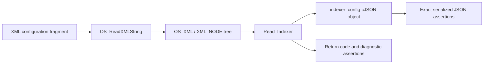
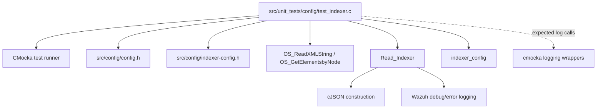
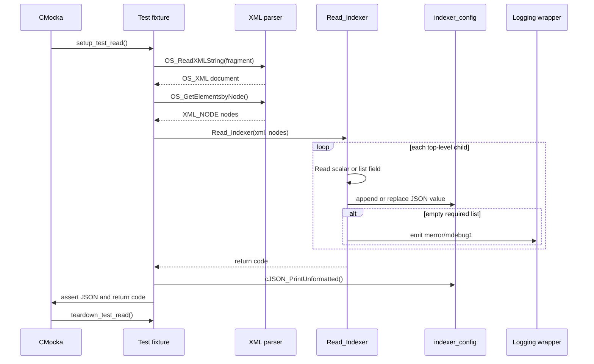
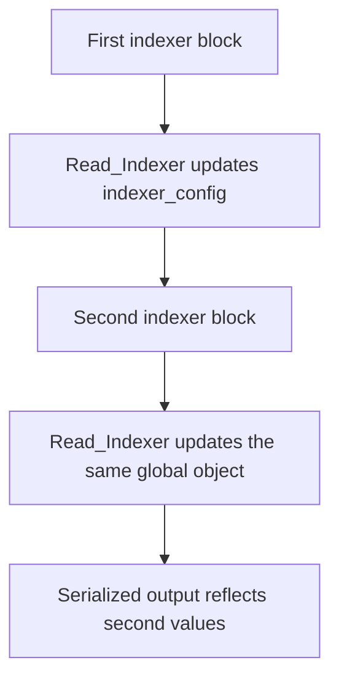
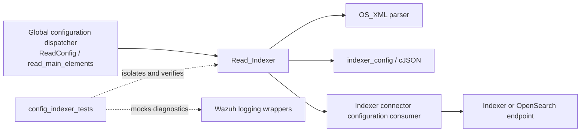

# `config_indexer_tests`

`config_indexer_tests` is a CMocka unit-test suite for Wazuh's native indexer configuration reader, `Read_Indexer`. The suite feeds XML fragments directly to the parser and verifies both its return code and the exact JSON stored in the global `indexer_config` object.

The tests cover the indexer enablement flag, one or more indexer hosts, SSL certificate authorities, client certificate and key values, empty input, duplicate blocks, repeated configuration, and empty required lists. They do not connect to an indexer or exercise TLS; those concerns belong to the indexer connector implementations documented in [indexer_connector.md](indexer_connector.md) and [engine_indexerconnector.md](engine_indexerconnector.md).

## Purpose and scope

The source file is [`src/unit_tests/config/test_indexer.c`](src/unit_tests/config/test_indexer.c). It isolates configuration parsing at the XML-to-JSON boundary:



The suite establishes the contract used by the broader native configuration dispatcher. The dispatcher and top-level XML loading flow are documented in [Global_Config_Core.md](Global_Config_Core.md); this module focuses only on the `<indexer>` reader after XML has already been made available as an `OS_XML` tree.

## Configuration model under test

The parser produces a JSON object with the following shape when all fields are present:

```json
{
  "enabled": "yes",
  "hosts": ["http://10.2.20.2:9200", "https://10.2.20.42:9200"],
  "ssl": {
    "certificate_authorities": ["/var/ossec/", "/var/ossec_cert/"],
    "certificate": "cert",
    "key": "key_example"
  }
}
```

The tested XML-to-JSON mapping is:

| XML element | JSON location | Cardinality | Behavior covered |
|---|---|---:|---|
| `<enabled>` | `enabled` | scalar | Preserved as a string; repeated values resolve to the later value. |
| `<hosts><host>` | `hosts[]` | one or more expected | A single host is valid; an empty `<hosts>` list returns `OS_MISVALUE`. |
| `<ssl>` | `ssl` | optional object | Created when SSL children are encountered. |
| `<certificate_authorities><ca>` | `ssl.certificate_authorities[]` | one or more expected when present | Empty list logs an error but does not make `Read_Indexer` fail in this suite. |
| `<certificate>` | `ssl.certificate` | scalar | Empty values are retained. |
| `<key>` | `ssl.key` | scalar | Empty values are retained. |

The exact production declarations and implementation are included through [`src/config/indexer-config.h`](src/config/indexer-config.h) and the corresponding `Read_Indexer` implementation. The test source includes the header directly rather than going through `ReadConfig()`.

## Test harness architecture



The module has three layers:

1. **Harness and lifecycle** — `main`, `setup_test_read`, `teardown_test_read`, and the `CMUnitTest` array.
2. **XML fixture construction** — `string_to_xml_node` converts a fragment into an `OS_XML` document and obtains its root-level nodes.
3. **Parser contract tests** — the nine registered tests invoke `Read_Indexer`, inspect the return value, and compare compact JSON output using `cJSON_PrintUnformatted`.

## Components

### `test_structure`

The fixture stores the parsed XML state:

| Member | Role |
|---|---|
| `OS_XML xml` | XML parser/document state owned by the test. |
| `XML_NODE nodes` | Root-level node list passed to `Read_Indexer`. |

The type is declared in the test source and is not a production configuration structure.

### `string_to_xml_node`

This helper calls `OS_ReadXMLString` with the supplied fragment and then calls `OS_GetElementsbyNode` to obtain the node list. It deliberately avoids file I/O, so each test can express only the `<indexer>` children relevant to the reader.

### `setup_test_read`

Before each test, the fixture resets the global `indexer_config` pointer to `NULL`, allocates a zeroed `test_structure`, and stores it in CMocka's state pointer. Resetting the global is important because the production reader writes to shared state rather than returning a JSON object directly.

### `teardown_test_read`

After each test, teardown clears the XML node tree, clears the XML document, frees the fixture, and deletes `indexer_config` if the reader created it. This makes every test independent and prevents parser output from leaking into later cases.

### `main`

`main` registers nine tests with `cmocka_unit_test_setup_teardown` and executes them using `cmocka_run_group_tests`. There is no group-level setup or teardown; lifecycle is intentionally per test.

## Test cases and behavioral contract

| Test | Scenario | Expected result |
|---|---|---|
| `test_read_full_configuration` | Two hosts, two certificate authorities, certificate, and key. | Return `0`; complete JSON object is produced. |
| `test_read_duplicate_configuration` | The complete configuration is repeated with identical values. | Return `0`; output contains one effective configuration, not duplicated top-level objects or arrays. |
| `test_read_multiple_configuration` | Two complete configurations with different values. | Return `0`; values from the second configuration replace the first values. |
| `test_read_empty_configuration` | No XML children. | Return `0`; output is `{}` and an `mdebug1` message reports an empty `indexer` configuration. |
| `test_read_empty_field_configuration` | Valid configuration with an empty `<key>`. | Return `0`; `"key":""` is retained. |
| `test_read_field_host_0_entries_configuration_fail` | `<hosts>` has no `<host>` entries. | Return `OS_MISVALUE`; an `merror` is expected; partial output contains only `enabled`. |
| `test_read_field_host_1_entries_configuration` | `<hosts>` contains one host. | Return `0`; one-element `hosts` array is produced. |
| `test_read_field_certificate_authorities_0_entries_configuration_fail` | SSL CA container has no `<ca>` entries. | Return `0`; an `merror` is expected; `ssl` remains present but empty. |
| `test_read_field_certificate_authorities_1_entries_configuration` | SSL CA container contains one CA. | Return `0`; one-element CA array is produced. |

The name `..._fail` for certificate-authority emptiness refers to the expected diagnostic, not to a nonzero parser return. This asymmetry is an important compatibility behavior captured by the suite.

## Parsing and output flow



For repeated configurations, the observed rule is last effective configuration wins:



The duplicate test separately confirms that repeating identical blocks does not create duplicate effective configuration data. Together, the two tests document replacement/normalization behavior for repeated top-level fields.

## Dependencies and system relationships



At runtime, the native configuration dispatcher can route an indexer section to `Read_Indexer`; the resulting JSON configuration is later consumed by an indexer connector. This test suite stops before network selection, authentication, certificate loading, or request transmission. See [indexer_connector.md](indexer_connector.md) for the shared connector layer and [engine_indexerconnector.md](engine_indexerconnector.md) for the Wazuh Engine connector implementation.

The suite also relies on common native infrastructure:

- `config.h` supplies XML and configuration helpers.
- `indexer-config.h` declares the production reader and global output.
- CMocka supplies test registration, state handling, assertions, and expected-call checking.
- cJSON supplies compact serialization and cleanup of the parser result.
- Wazuh XML and logging wrappers provide deterministic test boundaries; no external indexer is required.

## Process flow by outcome

```mermaid
flowchart TD
    START[Create XML fragment] --> EMPTY{No children?}
    EMPTY -->|yes| EMPTYOK[Return 0; config = {}\nlog debug]
    EMPTY -->|no| HOSTS[Read enabled and hosts]
    HOSTS --> HOSTLIST{hosts list empty?}
    HOSTLIST -->|yes| HOSTERR[Return OS_MISVALUE\nlog error; keep partial config]
    HOSTLIST -->|no| SSL[Read optional SSL object]
    SSL --> CA{CA container present and empty?}
    CA -->|yes| CAWARN[Log error; retain empty ssl object]
    CA -->|no| VALUES[Read CA, certificate, and key values]
    CAWARN --> VALUES
    VALUES --> DONE[Return 0; serialize effective JSON]
```

## Maintenance guidance

- Keep the global reset in `setup_test_read` and the `cJSON_Delete` cleanup in teardown. Changes to `indexer_config` ownership can otherwise make tests order-dependent.
- When changing the XML schema, update both the exact JSON assertions and the test matrix. The compact JSON comparisons intentionally detect field omission, ordering changes in arrays, and replacement semantics.
- Preserve the distinction between fatal empty hosts and nonfatal empty certificate authorities unless the production contract is intentionally changed.
- Add tests for new SSL fields, invalid scalar values, unknown child tags, malformed XML, or allocation failures if those behaviors become part of `Read_Indexer`'s supported contract.
- These are parser tests, not connector integration tests. Endpoint reachability, TLS handshakes, certificate validation, retries, and server selection should be tested in the connector modules.

## References

- [`src/unit_tests/config/test_indexer.c`](src/unit_tests/config/test_indexer.c) — source for this suite.
- [`src/config/indexer-config.h`](src/config/indexer-config.h) — production indexer configuration declarations.
- [Global_Config_Core.md](Global_Config_Core.md) — top-level native configuration dispatch and XML loading.
- [indexer_connector.md](indexer_connector.md) — shared indexer connector layer.
- [engine_indexerconnector.md](engine_indexerconnector.md) — Wazuh Engine indexer connector.
- [Configuration_Data_Structures_(C_Headers).md](Configuration_Data_Structures_(C_Headers).md) — native configuration structure family.
