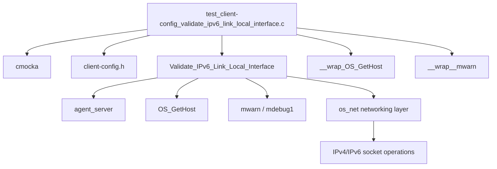
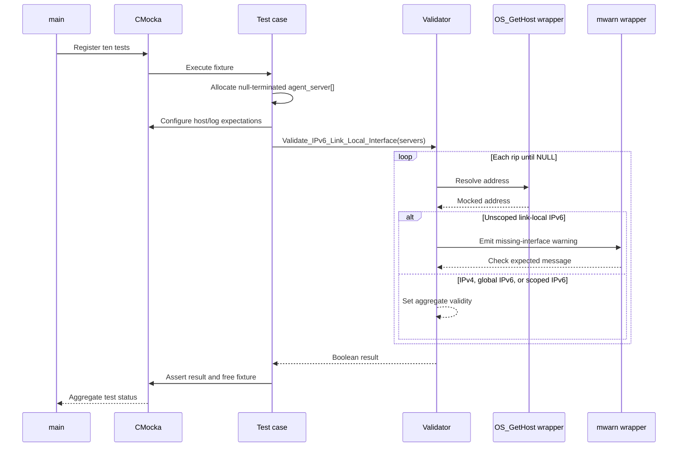

# `config_validate_ipv6_link_local_interface_tests`

This module is a CMocka unit-test suite for the client configuration validator `Validate_IPv6_Link_Local_Interface`. It verifies that configured manager addresses can be used with Wazuh networking code, with special handling for IPv6 link-local addresses that require a scope/interface index.

## Purpose and scope

The test file is located at [`src/unit_tests/config/test_client-config_validate_ipv6_link_local_interface.c`](src/unit_tests/config/test_client-config_validate_ipv6_link_local_interface.c). It constructs null-terminated `agent_server` arrays, stubs hostname resolution, invokes the production validator, and asserts the Boolean result and—where relevant—the warning emitted for a link-local address without an interface.

The suite does not open sockets or resolve DNS. Those concerns belong to the shared networking layer documented in [os_net.md](os_net.md); this suite isolates the configuration decision made before connection establishment.

## System context

`Validate_IPv6_Link_Local_Interface` runs during client/agent configuration processing. Each `agent_server` entry supplies an address (`rip`) and, optionally, `network_interface`. Later connection code passes the interface index to IPv6 socket operations so the kernel can resolve a link-local scope. The validator prevents a configuration containing only unusable link-local endpoints from being accepted.

```mermaid
flowchart LR
    CFG[Client configuration] --> SERVERS[agent_server[]]
    SERVERS --> VALIDATE[Validate_IPv6_Link_Local_Interface]
    VALIDATE -->|valid configuration| CONNECT[Client connection path]
    CONNECT --> NET[Shared networking / OS_ConnectTCP or UDP]
    VALIDATE -->|missing scope| WARN[mwarn diagnostic]
    NET --> SOCKET[IPv4/IPv6 socket]
```

Related data structures and client configuration parsing are defined by the configuration-data-structure layer; see [Client_Config.md](Client_Config.md) when available and [headers.md](headers.md) for shared header organization.

## Components

### Test entry point: `main`

`main` declares ten `CMUnitTest` entries and passes them to `cmocka_run_group_tests`. There is no group setup or teardown. Each test owns its allocated server array and releases it before returning.

### Fixture shape: `agent_server`

The fixture uses a dynamically allocated, null-terminated array:

| Field | Role in this module |
|---|---|
| `rip` | Hostname, IPv4/IPv6 literal, or a hostname/IP form containing `/`. `NULL` terminates the array. |
| `network_interface` | Positive IPv6 scope/interface index. Zero means no interface was configured. |
| `port`, `protocol`, retry fields | Not exercised by this validator suite. |

The tests allocate two or three elements, populate `rip`, and explicitly set the final `rip` to `NULL`. This mirrors the production loop condition `for (...; servers[i].rip; ...)`.

### Production function under test

`Validate_IPv6_Link_Local_Interface` performs the following operations for each server entry:

1. If `rip` contains `/`, it treats the suffix as the address; otherwise it calls `OS_GetHost(rip, 3)`.
2. If resolution returns `NULL` or an empty string, it logs a debug message, marks the entry as tolerated, and continues.
3. If the resolved value contains `:`, it is treated as IPv6.
4. An IPv6 value is accepted when it is not link-local, or when it is link-local and `network_interface > 0`.
5. A link-local IPv6 value with no positive interface emits `No network interface index provided to use %s link-local IPv6 address.` and does not set the success flag for that entry.
6. IPv4 values are accepted.
7. The function returns the accumulated Boolean flag.

The implementation is therefore an aggregate validity check, not a strict “every entry must pass” check. A tolerated unresolved entry or any valid IPv4/global IPv6 entry can leave the result `true`; a list made entirely of link-local IPv6 entries without interfaces returns `false`.

```mermaid
flowchart TD
    S[Next agent_server entry] --> R{rip contains /?}
    R -->|yes| SUFFIX[Use suffix after /]
    R -->|no| RESOLVE[OS_GetHost(rip, 3)]
    SUFFIX --> EMPTY{NULL or empty?}
    RESOLVE --> EMPTY
    EMPTY -->|yes| DBG[Debug log; continue; ret=true]
    EMPTY -->|no| FAMILY{Address contains ':'?}
    FAMILY -->|no| V4[IPv4; ret=true]
    FAMILY -->|yes| LL{IPv6 link-local prefix?}
    LL -->|no| V6[Global/other IPv6; ret=true]
    LL -->|yes| IFACE{network_interface > 0?}
    IFACE -->|yes| SCOPED[Scoped link-local; ret=true]
    IFACE -->|no| MWARN[Warning; ret unchanged]
    DBG --> MORE{More entries?}
    V4 --> MORE
    V6 --> MORE
    SCOPED --> MORE
    MWARN --> MORE
    MORE -->|yes| S
    MORE -->|no| OUT[Return ret]
```

## Test matrix

| Test | Input | Expected result | Important assertion |
|---|---|---:|---|
| `..._ipv4` | One IPv4 address | `true` | `OS_GetHost` receives the literal. |
| `..._ipv6_no_link_local` | One non-link-local IPv6 address | `true` | IPv6 does not require an interface. |
| `..._ipv6_one_link_local_no_interface` | One `FE80...` address, interface `0` | `false` | One exact `mwarn` message is expected. |
| `..._ipv6_one_link_local_with_interface` | One `FE80...` address, interface `1` | `true` | Scoped link-local address is accepted. |
| `..._multi_ipv4` | Two IPv4 addresses | `true` | Resolution is expected once per entry. |
| `..._multi_ipv4_ipv6` | IPv4 followed by unscoped link-local IPv6 | `true` | Warning is expected, but the earlier valid IPv4 keeps the aggregate result true. |
| `..._multi_ipv6_ipv4` | Unscoped link-local IPv6 followed by IPv4 | `true` | Warning is expected, then IPv4 establishes validity. |
| `..._multi_ipv6_ipv6_no_interface` | Two unscoped link-local IPv6 addresses | `false` | Two warnings are expected. |
| `..._multi_ipv6_ipv6_interface` | One unscoped and one scoped link-local IPv6 | `true` | One warning is expected; the scoped entry makes the aggregate result true. |
| `..._multi_ipv6_ipv6_all_interface` | Two scoped link-local IPv6 addresses | `true` | No warning is expected. |

The suite uses `expect_string` and `will_return` for `__wrap_OS_GetHost`, ensuring that every address is resolved through the mocked networking boundary. Warning checks use the debug wrapper `__wrap__mwarn`, so the tests verify observable diagnostics without writing logs.

## Dependency and interaction architecture



The test itself depends on two wrapper families:

- `src/unit_tests/wrappers/wazuh/os_net/os_net_wrappers.h` supplies the mocked host-resolution boundary.
- `src/unit_tests/wrappers/wazuh/shared/debug_op_wrappers.h` supplies mocked logging expectations.

These wrappers are test doubles, not production collaborators. The production networking path is described in [os_net.md](os_net.md), while logging primitives are covered by [shared_lib_logging.md](shared_lib_logging.md).

## Test execution flow



## Behavioral notes for maintainers

- Link-local detection is based on the production prefix comparison, while the tests use canonical-looking uppercase `FE80` literals. Do not change test literals casually without checking the implementation’s prefix rules.
- The test name `ipv6_no_link_local` means “IPv6 that is not link-local,” not “no IPv6 address.”
- Mixed-address cases intentionally document aggregate semantics. A warning does not necessarily make the overall result false.
- The tests do not cover the `hostname/ip` slash form, failed resolution, or empty resolution result even though the production function handles them. Those are candidate additions if configuration parsing changes.
- The fixture allocates memory with Wazuh allocation helpers and frees address strings and the array explicitly. New cases should preserve that ownership pattern.

## References

- [os_net.md](os_net.md) — shared network connection and address-handling layer.
- [shared_lib_logging.md](shared_lib_logging.md) — shared logging primitives used by configuration code.
- [data_provider_network.md](data_provider_network.md) — runtime network-interface data providers; relevant to understanding interface indices, but not directly called by this validator.
- [`src/unit_tests/config/test_client-config_validate_ipv6_link_local_interface.c`](src/unit_tests/config/test_client-config_validate_ipv6_link_local_interface.c) — test source.

