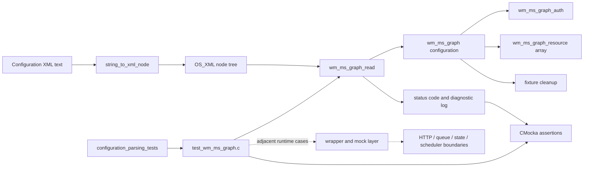
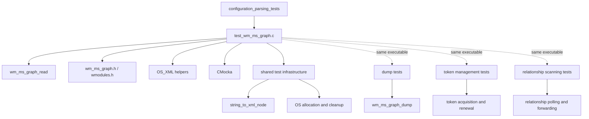
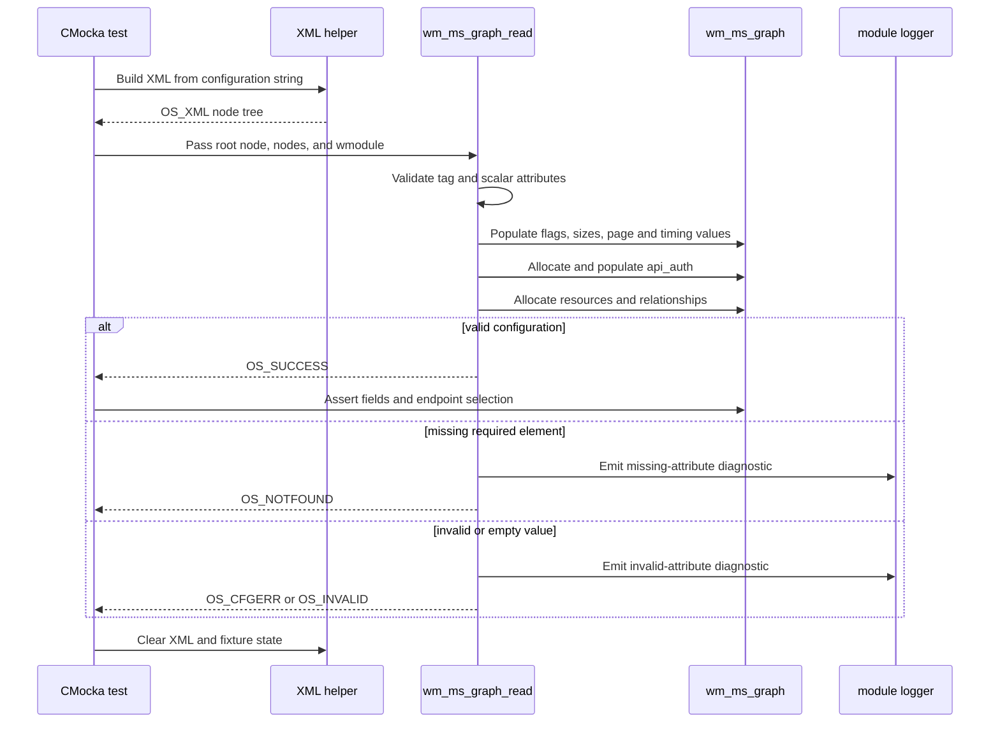
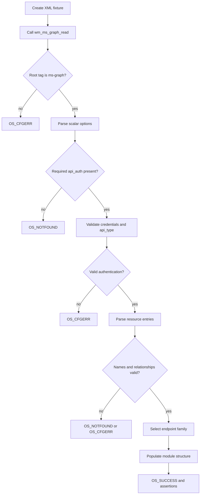
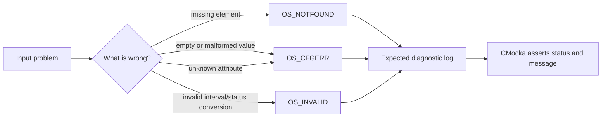
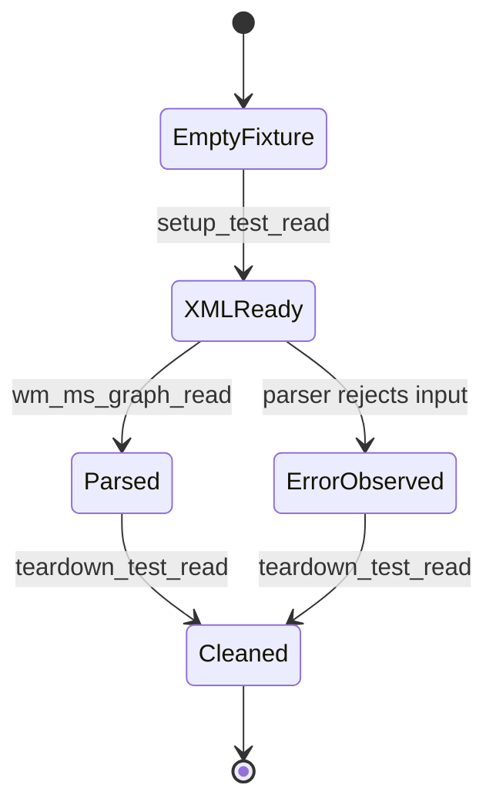

# Configuration parsing tests

## Introduction

`configuration_parsing_tests` is the configuration-focused portion of the Microsoft Graph (`ms-graph`) module unit tests. It verifies that the module converts its XML configuration into the internal `wm_ms_graph` data structures, rejects malformed or incomplete input with the expected status, and selects the correct Microsoft Graph endpoints for each supported API type.

The tests exercise `wm_ms_graph_read()` directly. They use CMocka assertions and the shared XML test helpers; external HTTP, queue, scheduler, and state-storage behavior belongs to neighboring test groups and is only relevant to the surrounding test binary.

Related documentation:

- [Microsoft Graph module](wazuh_modules_core_cloud_integrations_ms_graph.md) — production behavior and configuration semantics.
- [Microsoft Graph test infrastructure](wm_ms_graph_tests_test_infrastructure.md) — fixtures, wrappers, mocks, and test execution context.

## Scope and source location

The module is represented by the `wm_ms_graph_tests` branch of the unit-test tree and is implemented in:

`src/unit_tests/wazuh_modules/ms_graph/test_wm_ms_graph.c`

The supplied module tree names the following parsing cases:

| Area | Cases represented in the module tree |
| --- | --- |
| Basic input | `test_empty_module`, `test_bad_tag`, `test_enabled_no` |
| Required API authentication | `test_missing_api_auth`, `test_empty_api_auth` |
| Authentication fields | `test_missing_client_id`, `test_missing_tenant_id`, `test_missing_secret_value`, `test_missing_api_type`, `test_empty_api_type` |
| Resources | `test_missing_resource`, `test_empty_resource`, `test_missing_name`, `test_empty_name`, `test_missing_relationship`, `test_empty_relationship` |
| Valid configurations | `test_normal_config`, `test_normal_config_api_type_gcc`, `test_normal_config_api_type_dod` |
| Scalar options | `test_disabled_only_future_events`, `test_disabled_run_on_start`, `test_value_curl_max_size` |

The source file also contains additional invalid-value and runtime tests (for example, token renewal, pagination, state bookmarks, and log forwarding). Those tests are part of the same executable but are outside this module’s narrow parsing responsibility. The source’s `tests_without_startup` group is therefore broader than the parsing list shown by the module tree.

## Architecture



The test compiles the production implementation into the test translation unit by including `wm_ms_graph.c`. This makes parser behavior observable without starting the modules daemon. The fixture owns the XML tree and `wmodule` allocation; teardown clears both and releases module-owned data.

## Component relationships



Parsing tests depend directly on the module’s configuration structures and XML helpers. They do not require a live Microsoft Graph endpoint, a Wazuh queue, or persisted module state. The dump, token, and scanning groups validate the structures produced here from their respective runtime perspectives.

## Configuration model under test

The parser accepts an `ms-graph` XML element containing scalar options, one authentication block, and one or more resources:

```xml
<ms-graph>
  <enabled>yes</enabled>
  <only_future_events>no</only_future_events>
  <curl_max_size>1M</curl_max_size>
  <page_size>100</page_size>
  <time_delay>10</time_delay>
  <run_on_start>yes</run_on_start>
  <version>v1.0</version>
  <api_auth>
    <client_id>client</client_id>
    <tenant_id>tenant</tenant_id>
    <secret_value>secret</secret_value>
    <api_type>global</api_type>
  </api_auth>
  <resource>
    <name>security</name>
    <relationship>alerts_v2</relationship>
  </resource>
</ms-graph>
```

The fields are validated as follows:

| Configuration area | Accepted behavior | Rejection coverage |
| --- | --- | --- |
| Module tag | Must be `ms-graph`; valid XML is converted before parsing | Unknown/bad tag returns `OS_CFGERR` and logs an invalid-attribute message |
| `enabled` | `yes` and `no`; `no` is a valid disabled configuration | Invalid values return `OS_CFGERR` |
| `only_future_events` | Boolean `yes`/`no` | Invalid values return `OS_CFGERR` |
| `curl_max_size` | Size syntax such as `1M` or `4k`; values are converted to bytes | Invalid and negative values are rejected; the parser enforces its minimum-size rule |
| `page_size`, `time_delay` | Numeric module options retained in the configuration | Invalid values are rejected by the parser tests in the source |
| `run_on_start` | Boolean `yes`/`no` | Invalid values return `OS_CFGERR` |
| `version` | Graph API version such as `v1.0` | Invalid values return `OS_CFGERR` |
| `api_auth` | Required and non-empty | Missing sections return `OS_NOTFOUND`; empty sections return `OS_CFGERR` |
| Authentication children | `client_id`, `tenant_id`, `secret_value`, and supported `api_type` | Missing children return `OS_NOTFOUND`; empty or invalid values return `OS_CFGERR` |
| `resource` | At least one resource with a name and relationship(s) | Missing/empty resource data and unknown child attributes are rejected |

Supported API types are `global`, `gcc-high`, and `dod`. The valid-configuration tests verify endpoint selection in the authentication structure:

| API type | Login endpoint family | Query endpoint family |
| --- | --- | --- |
| `global` | `login.microsoftonline.com` | `graph.microsoft.com` |
| `gcc-high` | `login.microsoftonline.us` | `graph.microsoft.us` |
| `dod` | `login.microsoftonline.us` | `dod-graph.microsoft.us` |

## Parsing data flow



## Process flows

### Valid configuration



### Invalid input classification



The distinction is important for maintainers: a missing required node is not treated the same way as a present node with invalid content. The tests assert both return status and, for the error paths, the diagnostic text emitted by the parser.

## Test fixture lifecycle

`setup_test_read` initializes the per-test `test_structure`, creates an XML node tree from the test string, and prepares the module wrapper. `teardown_test_read` clears the XML representation, frees the parser node list, and cleans up the `wmodule` data. Startup-oriented tests use `setup_conf` and `teardown_conf`, which additionally prepare the module configuration used by runtime tests.



This isolation prevents allocations from one malformed configuration from affecting later cases. It also lets the same executable run parsing tests without initializing queues, HTTP clients, or scheduler threads.

## Expected outcomes and maintenance guidance

- Preserve the status-code contract: missing nodes use `OS_NOTFOUND`, invalid values and attributes use `OS_CFGERR`, and invalid interval conversion uses `OS_INVALID` where asserted by the source.
- When adding a required configuration field, add both a missing-field case and an empty/invalid-value case when those conditions have distinct parser behavior.
- Keep endpoint-selection cases for every supported `api_type`; endpoint changes are externally visible even when the XML schema is unchanged.
- Keep resource tests for multiple resources and multiple relationships because allocation and nesting errors can be hidden by a single-resource fixture.
- Update the expected diagnostic strings when parser wording intentionally changes; these tests treat logs as part of the observable error contract.
- If a change affects token renewal, pagination, bookmark persistence, or MQ delivery, update the neighboring runtime groups and consult the [test infrastructure documentation](wm_ms_graph_tests_test_infrastructure.md), rather than expanding this parsing-focused module unnecessarily.

## References

- [Production Microsoft Graph integration](wazuh_modules_core_cloud_integrations_ms_graph.md)
- [Microsoft Graph test infrastructure](wm_ms_graph_tests_test_infrastructure.md)
- [Wazuh modules core](wazuh_modules_core.md)
- [Shared configuration and scheduling test helpers](test_schedule_scan.md)
