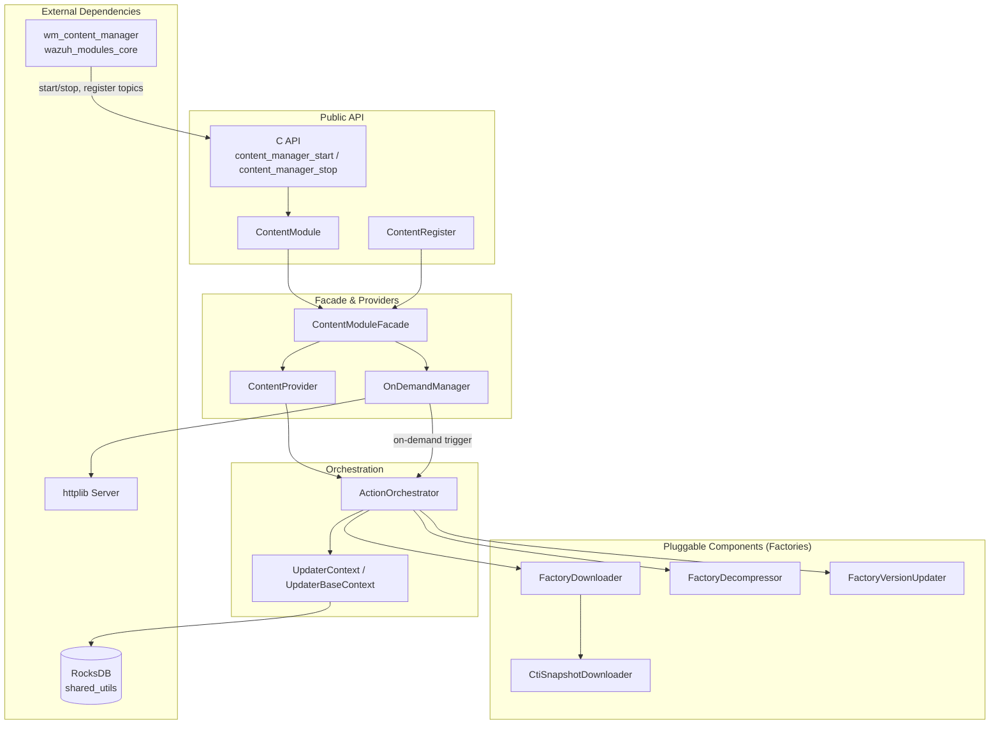
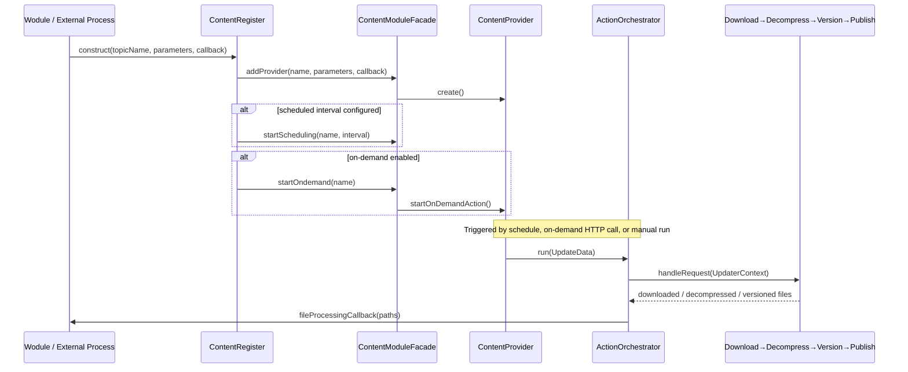

# Content Manager Module

## 1. Purpose

The **Content Manager** is a C++ shared module of the Wazuh platform responsible for **fetching, decompressing,
versioning and publishing external content** (e.g., CTI vulnerability feeds, MITRE data, rule/decoder bundles) that
other Wazuh components need to keep up to date.

It is used by native daemons (through the `wm_content_manager` wodule, see
[Wazuh Modules Daemon](wazuh_modules_core.md)) and by other services that need periodic or on-demand content
synchronization. The module abstracts away *where* the content comes from (a REST API, a CTI snapshot/offset feed, a
local file, or an offline package) and *how* it changes over time (raw content vs. versioned/incremental content),
persisting its progress (offsets, hashes) in a local RocksDB database (see [Shared Utilities](shared_utils.md) for the
underlying `RocksDBWrapper`).

Typical use cases:
- Downloading and applying incremental CTI updates identified by an offset.
- Downloading a full CTI snapshot when no incremental history exists or when incremental processing fails.
- Serving on-demand HTTP endpoints so other local processes can trigger an update immediately.
- Scheduling periodic background updates for a named "topic" (content type).

## 2. Architecture Overview

The module exposes a small public C++/C API (`ContentModule`, `ContentRegister`, and the C bindings in
`contentModule.cpp`) that is implemented internally by a **Facade** (`ContentModuleFacade`) which owns a collection of
**Providers** (`ContentProvider`), one per registered content "topic". Each provider drives an **Action Orchestrator**
that builds and executes a **chain of responsibility** of pluggable steps (download → decompress → version-update →
publish), created through a set of **Factories**. An **On-Demand Manager** exposes an embedded HTTP server so external
processes can trigger updates for any registered topic without waiting for the schedule.

### Request / Update flow

## 3. Sub-modules

The module's core components are grouped into four cohesive areas, each documented in detail in its own file:

| Sub-module | Responsibility | Documentation |
|---|---|---|
| **Public API & Lifecycle** | Public-facing `ContentModule`/`ContentRegister` classes and the C ABI (`content_manager_start`/`stop`) used by native wodules to embed the module. | [content_manager_public_api.md](content_manager_public_api.md) |
| **Facade & Providers** | `ContentModuleFacade` (singleton orchestration hub), `ContentProvider` (per-topic action wrapper) and `OnDemandManager` (embedded HTTP server for manual triggers). | [content_manager_facade.md](content_manager_facade.md) |
| **Update Orchestration** | `ActionOrchestrator` and its `UpdateData`/`UpdaterContext`/`UpdaterBaseContext` data structures that drive the download → decompress → version-update chain and persist state to RocksDB. | [content_manager_orchestration.md](content_manager_orchestration.md) |
| **Pluggable Components (Factories)** | `FactoryDownloader`, `FactoryDecompressor`, `FactoryVersionUpdater` and the `CtiSnapshotDownloader` step, which together implement the strategy/factory pattern for supporting multiple content sources, compression formats and versioning schemes. | [content_manager_components.md](content_manager_components.md) |

## 4. Relationship to Other Modules

- **[Shared Utilities](shared_utils.md)**: provides low-level building blocks reused throughout Content Manager,
  including `RocksDBWrapper`/`TRocksDBWrapper` (persistent offset/hash storage), `AbstractHandler`/chain-of-responsibility
  utilities, `Singleton`, `ConditionSync`, and compression helpers (`XzHelper`, `ZlibHelper`, `ArchiveHelper`) that back
  the decompressor factory.
- **[Wazuh Modules Daemon](wazuh_modules_core.md)**: the `wm_content_manager` wodule (`wm_content_manager.c/.h`) is the
  primary native consumer; it starts/stops the module and forwards its logging through the callback passed to
  `ContentModule::start`.
- **[Router](router.md)**: published content is typically forwarded to other Wazuh components through the Router
  shared module's provider/subscriber mechanism.
- **[Indexer Connector](indexer_connector.md)** and **[RSync](rsync.md)**: sibling shared modules that, like Content
  Manager, rely on the same `shared_utils` primitives and are commonly used together in inventory/vulnerability
  pipelines (see [Advanced Security Modules](vulnerability_scanner_module.md)).

## 5. Key Design Patterns

- **Singleton**: `ContentModuleFacade` and `OnDemandManager` are singletons (via the shared `Singleton<T>` utility) to
  guarantee a single coordination point per process.
- **Facade**: `ContentModuleFacade` hides provider bookkeeping, scheduling and on-demand endpoint wiring behind a
  simple `start`/`stop`/`addProvider`/`removeProvider` interface used by `ContentModule`/`ContentRegister`.
- **Chain of Responsibility**: Each update run builds a chain of `AbstractHandler<std::shared_ptr<UpdaterContext>>`
  steps (download, decompress, version-update) executed in sequence, allowing new steps/strategies to be added without
  modifying the orchestrator.
- **Factory**: `FactoryDownloader`, `FactoryDecompressor` and `FactoryVersionUpdater` select the concrete
  implementation to instantiate based on configuration (`contentSource`, `compressionType`, `versionedContent`).
- **Strategy**: The interchangeable downloader/decompressor/version-updater implementations behave as strategies
  plugged into the orchestration chain.
