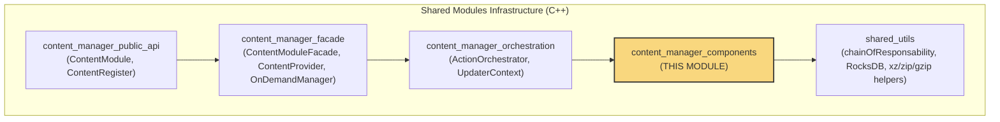
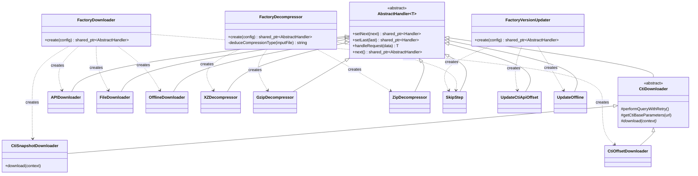
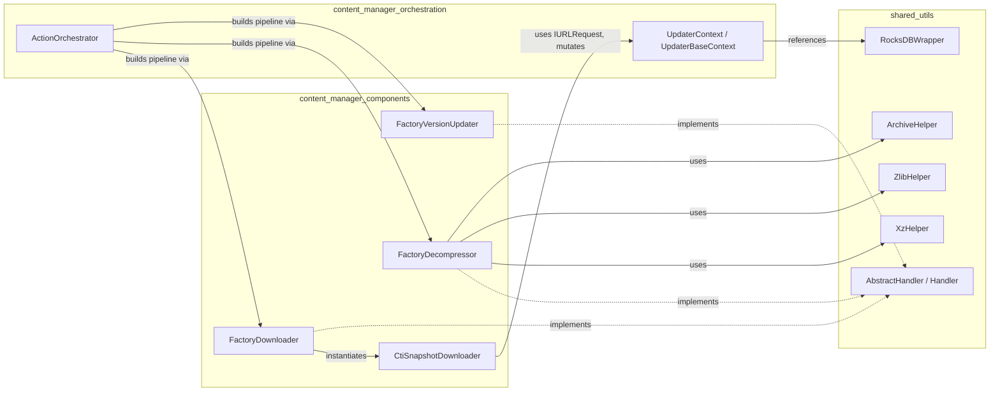
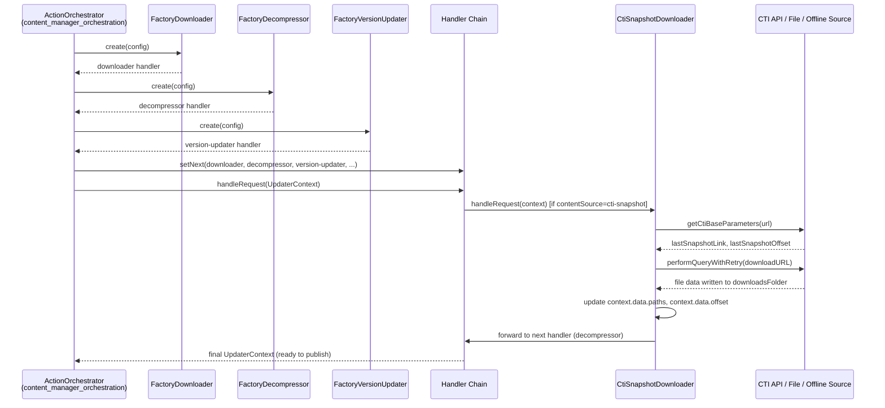
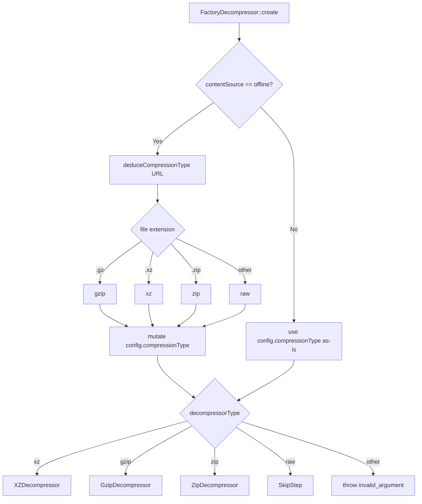
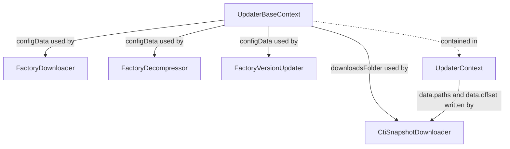

# Content Manager Components

## Introduction

The **Content Manager Components** module provides the pluggable, strategy-driven building blocks used by the Wazuh **Content Manager** to download, decompress, and version-update external content (CTI feeds, vulnerability databases, offline packages, etc.). It exposes three **factory classes** — `FactoryDownloader`, `FactoryDecompressor`, and `FactoryVersionUpdater` — that instantiate the correct concrete strategy at runtime based on JSON configuration, plus a concrete downloader implementation, `CtiSnapshotDownloader`, used to retrieve full content snapshots from the Wazuh CTI (Cyber Threat Intelligence) API.

These components are consumed by the [Content Manager Orchestration](content_manager_orchestration.md) layer, which builds a **Chain of Responsibility** pipeline (download → decompress → version-update → publish) for each content update run. This module sits below the orchestration layer and above the [Shared Utils](shared_utils.md) primitives (chain-of-responsibility base classes, RocksDB wrapper, compression helpers) that it relies on.

This documentation covers:
1. Purpose and responsibilities of each component
2. Architecture and how components plug into the Content Manager pipeline
3. Data flow and interaction diagrams
4. Relationships to other Content Manager and Shared Modules documentation

---

## Module Position in the System

The Content Manager is part of the **Shared Modules Infrastructure (C++)** family. The diagram below shows where `content_manager_components` sits relative to its sibling modules.

See also: [content_manager_public_api](content_manager_public_api.md), [content_manager_facade](content_manager_facade.md), [content_manager_orchestration](content_manager_orchestration.md), [shared_utils](shared_utils.md).

---

## Core Components

| Component | File | Responsibility |
|---|---|---|
| `FactoryDownloader` | `factoryDownloader.hpp` | Selects and instantiates the concrete downloader (API, CTI-offset, CTI-snapshot, file, offline) based on `contentSource`. |
| `FactoryDecompressor` | `factoryDecompressor.hpp` | Selects and instantiates the concrete decompressor (xz, gzip, zip, raw/skip) based on `compressionType`, with auto-deduction for offline sources. |
| `FactoryVersionUpdater` | `factoryVersionUpdater.hpp` | Selects and instantiates the concrete version-updater (cti-api, offline, or no-op) based on `versionedContent`. |
| `CtiSnapshotDownloader` | `CtiSnapshotDownloader.hpp` | Concrete `CtiDownloader` implementation that fetches a full content snapshot from the CTI API. |

All factories produce objects that implement `AbstractHandler<std::shared_ptr<UpdaterContext>>` (from [shared_utils](shared_utils.md)'s Chain of Responsibility pattern), allowing them to be chained together transparently by the orchestration layer.

---

## Architecture

### Class/Component Relationships

### Dependency Diagram

---

## Component Details

### 1. `FactoryDownloader`

**Purpose:** Given the `contentSource` field of the run configuration, creates the appropriate downloader handler:

| `contentSource` value | Concrete class created |
|---|---|
| `api` | `APIDownloader` |
| `cti-offset` | `CtiOffsetDownloader` |
| `cti-snapshot` | `CtiSnapshotDownloader` |
| `file` | `FileDownloader` |
| `offline` | `OfflineDownloader` |

All downloaders use the singleton `HTTPRequest::instance()` (except `FileDownloader`, which reads from the local filesystem). An invalid `contentSource` value throws `std::invalid_argument`.

### 2. `FactoryDecompressor`

**Purpose:** Given the `compressionType` field, creates the appropriate decompressor handler:

| `compressionType` value | Concrete class created |
|---|---|
| `xz` | `XZDecompressor` |
| `gzip` | `GzipDecompressor` |
| `zip` | `ZipDecompressor` |
| `raw` | `SkipStep` (no-op) |

**Special behavior:** When `contentSource == "offline"`, the compression type is **auto-deduced** from the URL's file extension (`.gz` → gzip, `.xz` → xz, `.zip` → zip, otherwise raw) via the private `deduceCompressionType()` helper, and the `config` JSON is mutated in place to reflect the deduced type.

### 3. `FactoryVersionUpdater`

**Purpose:** Given the `versionedContent` field, creates the appropriate version-updater handler:

| `versionedContent` value | Concrete class created |
|---|---|
| `cti-api` | `UpdateCtiApiOffset` |
| `offline` | `UpdateOffline` |
| `false` | `SkipStep` (no-op, content is not versioned) |

An unrecognized value throws `std::invalid_argument`.

### 4. `CtiSnapshotDownloader`

**Purpose:** Concrete downloader (extending the abstract `CtiDownloader` base) that retrieves a **full content snapshot** from the CTI API, used typically for the first synchronization or full re-sync scenarios (as opposed to `CtiOffsetDownloader`, which fetches incremental changes).

**Behavior:**
1. Reads the CTI base `url` from `context.spUpdaterBaseContext->configData`.
2. Calls `getCtiBaseParameters(baseURL)` (inherited from `CtiDownloader`) to retrieve consistency metadata, including `lastSnapshotLink` and `lastSnapshotOffset`.
3. Throws `std::runtime_error` if snapshot metadata is missing.
4. Computes the output file path inside `context.spUpdaterBaseContext->downloadsFolder`.
5. Performs the HTTP download with retry logic (`performQueryWithRetry`), and on success:
   - Appends the downloaded file path to `context.data["paths"]`.
   - Sets `context.data["offset"]` to the new snapshot offset.
   - Updates `context.currentOffset`.

---

## Data Flow

### Content Update Pipeline (Chain of Responsibility)

### Decompression Type Resolution Flow

---

## Interaction with UpdaterContext

All factory-created handlers, and `CtiSnapshotDownloader` specifically, operate on a shared `UpdaterContext` object (defined in `content_manager_orchestration`'s `updaterContext.hpp`):

- **`UpdaterBaseContext`**: Holds run-scoped, immutable-ish configuration: `configData` (JSON config used by all factories), `downloadsFolder`, `contentsFolder`, `outputFolder`, RocksDB handle, stop-condition, and the file-processing callback.
- **`UpdaterContext`**: Holds per-run mutable state: `data` (JSON payload eventually published, including `paths`, `offset`, `stageStatus`) and `currentOffset`.

For full details on `UpdaterContext`/`UpdaterBaseContext` and how the pipeline is assembled and executed, see [content_manager_orchestration](content_manager_orchestration.md).

---

## Design Patterns Used

- **Factory Method**: Each `Factory*` class encapsulates object-creation logic keyed off configuration strings, decoupling the orchestrator from concrete downloader/decompressor/updater classes.
- **Chain of Responsibility**: All created objects implement `AbstractHandler<std::shared_ptr<UpdaterContext>>` (see [shared_utils → design_patterns](shared_utils.md)), allowing the orchestrator to link them into a single processing pipeline and invoke `handleRequest()` once.
- **Template Method** (inherited): `CtiSnapshotDownloader` overrides only the `download()` step of the `CtiDownloader` base class, reusing shared retry/query logic (`performQueryWithRetry`, `getCtiBaseParameters`) common to all CTI-based downloaders (e.g., `CtiOffsetDownloader`).

---

## Error Handling

| Component | Failure Condition | Behavior |
|---|---|---|
| `FactoryDownloader` | Unknown `contentSource` | Throws `std::invalid_argument` |
| `FactoryDecompressor` | Unknown `compressionType` | Throws `std::invalid_argument` |
| `FactoryVersionUpdater` | Unknown `versionedContent` | Throws `std::invalid_argument` |
| `CtiSnapshotDownloader` | Missing `lastSnapshotLink`/`lastSnapshotOffset` in CTI metadata | Throws `std::runtime_error` |

These exceptions propagate up to the orchestration layer, which is responsible for logging and reporting failure status (see `content_manager_orchestration`'s `ActionOrchestrator`).

---

## Related Documentation

- [content_manager_public_api](content_manager_public_api.md) — Public `ContentModule`/`ContentRegister` API that clients use to register and start content update tasks.
- [content_manager_facade](content_manager_facade.md) — Facade layer (`ContentModuleFacade`, `ContentProvider`, `OnDemandManager`) that drives scheduled/on-demand content updates.
- [content_manager_orchestration](content_manager_orchestration.md) — Builds and executes the Chain of Responsibility pipeline using the factories documented here, and owns `UpdaterContext`/`UpdaterBaseContext`.
- [shared_utils](shared_utils.md) — Provides `AbstractHandler`/`Handler` (chain-of-responsibility base), `RocksDBWrapper`, and compression helpers (`XzHelper`, `ZlibHelper`, `ArchiveHelper`) consumed by these components.
