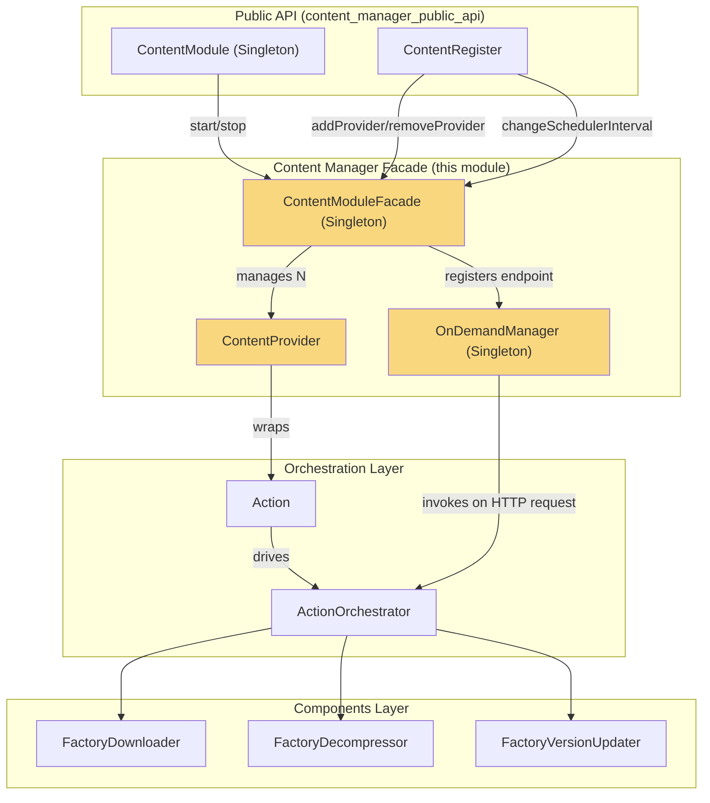
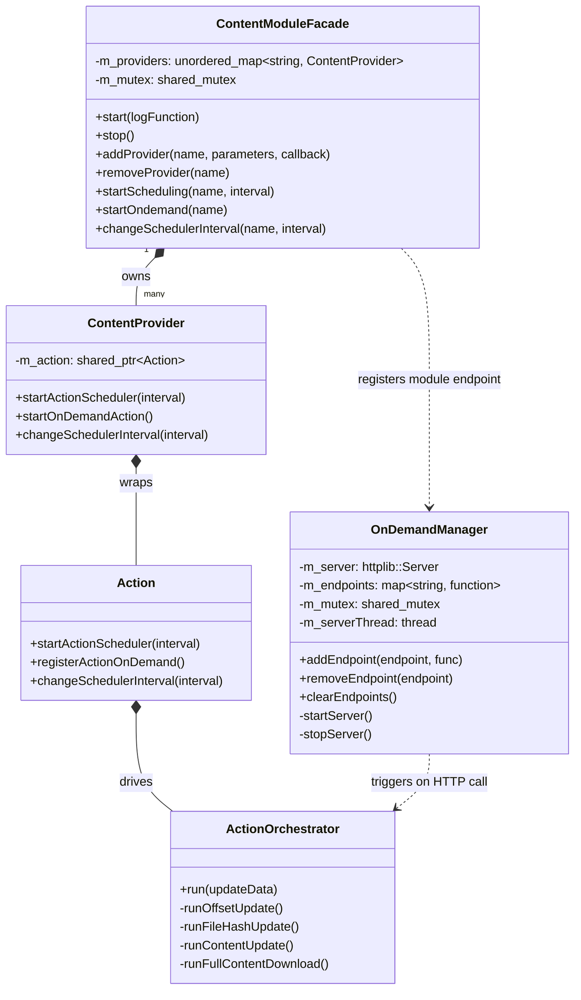
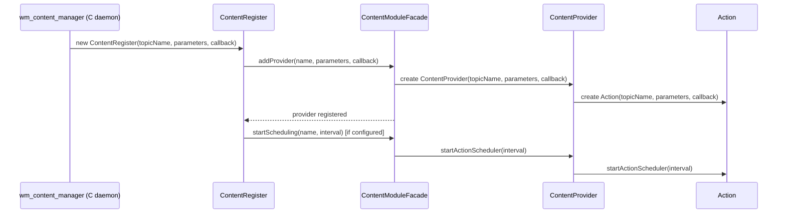
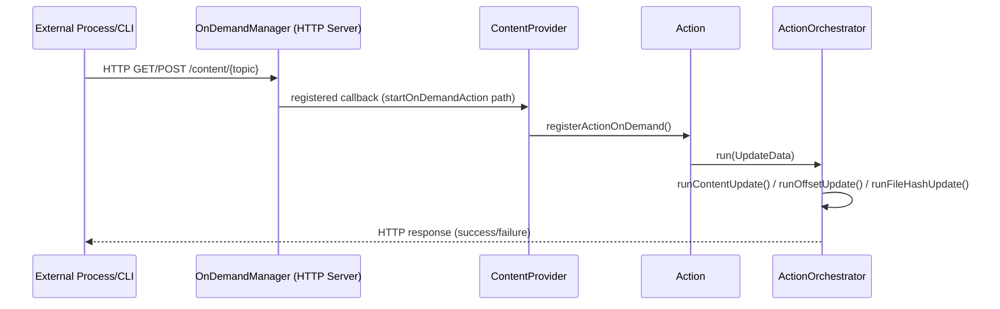
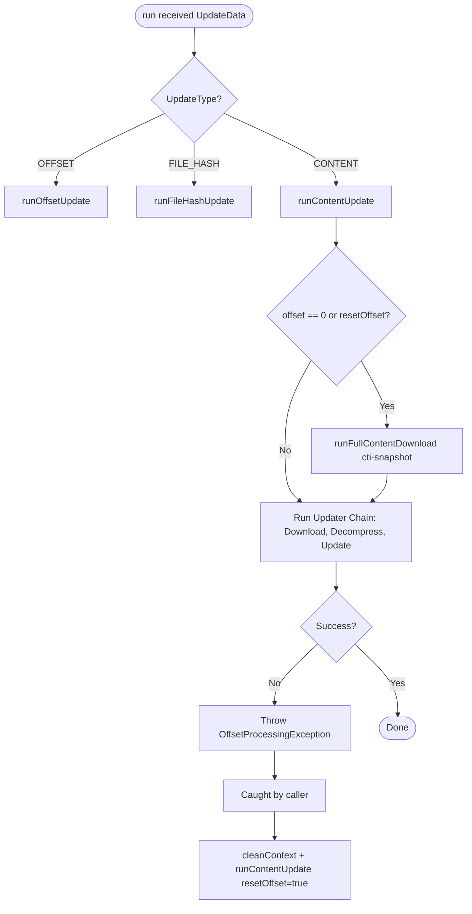
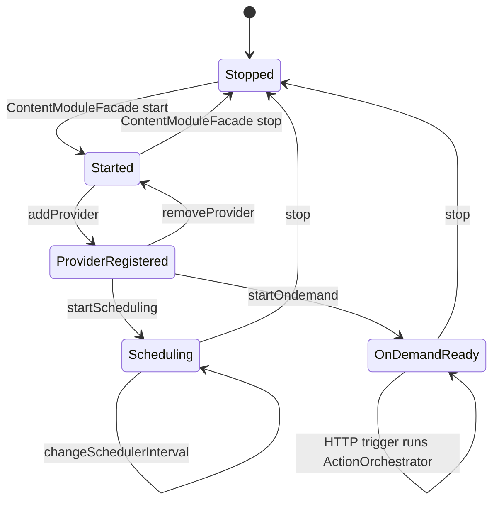

# Content Manager Facade

## Introduction

The **Content Manager Facade** is the internal orchestration and control layer of the Wazuh **Content Manager** shared module (C++). It sits between the module's stable public API (`ContentModule` / `ContentRegister`, documented in [content_manager_public_api.md](content_manager_public_api.md)) and the deeper business logic that performs the actual content update workflow (documented in [content_manager_orchestration.md](content_manager_orchestration.md) and [content_manager_components.md](content_manager_components.md)).

This module implements the classic **Facade** and **Singleton** design patterns to:

- Provide a single, simplified entry point (`ContentModuleFacade`) for managing multiple content *providers* (e.g., CTI vulnerability feeds, hardcoded updaters, and other content sources) without exposing the complexity of the underlying orchestration chain.
- Encapsulate the lifecycle of each content provider (`ContentProvider`), which wraps an `Action` object responsible for scheduling and executing content updates.
- Expose an embedded HTTP server (`OnDemandManager`) that allows other Wazuh processes/daemons to trigger on-demand content updates via REST calls, independent of the periodic scheduler.

It is a critical piece of infrastructure used by daemons such as `wazuh-modulesd` (via `wm_content_manager`) to keep vulnerability databases, CTI snapshots, and other externally sourced datasets synchronized.

---

## Table of Contents

1. [Purpose and Responsibilities](#purpose-and-responsibilities)
2. [Architecture Overview](#architecture-overview)
3. [Core Components](#core-components)
4. [Component Relationships](#component-relationships)
5. [Data & Control Flow](#data--control-flow)
6. [On-Demand HTTP Server](#on-demand-http-server)
7. [Lifecycle Sequence](#lifecycle-sequence)
8. [Concurrency Considerations](#concurrency-considerations)
9. [Integration with the Rest of the System](#integration-with-the-rest-of-the-system)
10. [Related Documentation](#related-documentation)

---

## Purpose and Responsibilities

The facade layer exists to decouple the **public content manager API** from the **internal update orchestration machinery**. Its main responsibilities are:

| Responsibility | Component |
|---|---|
| Track and manage a registry of active content providers (by name) | `ContentModuleFacade` |
| Create/destroy providers, forwarding parameters to the orchestration layer | `ContentModuleFacade` → `ContentProvider` |
| Wrap a single `Action` (scheduler + orchestrator) per content topic | `ContentProvider` |
| Start/stop/modify periodic scheduling for a provider | `ContentProvider`, `ContentModuleFacade` |
| Trigger provider actions synchronously via HTTP (on-demand) | `OnDemandManager` |
| Manage the lifecycle of the embedded HTTP server (start when first endpoint is added, stop when the last is removed) | `OnDemandManager` |

This module purposefully contains **no business logic** for downloading, decompressing, or applying content — that logic lives in `ActionOrchestrator` and the various `Factory*` components (see [content_manager_orchestration.md](content_manager_orchestration.md) and [content_manager_components.md](content_manager_components.md)). The facade's job is purely to **manage the set of active providers and route calls** to the correct orchestration objects.

---

## Architecture Overview

---

## Core Components

### `ContentModuleFacade`
*File: `src/shared_modules/content_manager/src/contentModuleFacade.hpp`*

A `Singleton<ContentModuleFacade>` that is the **central registry of content providers**. Responsibilities:

- `start(logFunction)` — Registers the module's HTTP endpoint (`CONTENT_MODULE_ENDPOINT_NAME = "content"`) with the `OnDemandManager` and wires up logging.
- `stop()` — Clears all registered providers and unregisters HTTP endpoints, effectively shutting the module down cleanly.
- `addProvider(name, parameters, fileProcessingCallback)` — Instantiates a new `ContentProvider` for a topic and stores it in an internal map (`m_providers`), keyed by name.
- `removeProvider(name)` — Destroys a provider and removes it from the map.
- `startScheduling(name, interval)` / `startOndemand(name)` / `changeSchedulerInterval(name, interval)` — Delegates scheduling operations to the specific `ContentProvider` instance.

Thread safety is provided via a `std::shared_mutex` (`m_mutex`), allowing concurrent reads (lookups) while serializing writes (add/remove provider).

### `ContentProvider`
*File: `src/shared_modules/content_manager/src/contentProvider.hpp`*

A lightweight wrapper class representing **a single content topic's update capability**. It owns a `std::shared_ptr<Action>` and exposes:

- `startActionScheduler(interval)` — Begins periodic execution of the update logic.
- `startOnDemandAction()` — Registers the action for on-demand (HTTP-triggered) execution via `OnDemandManager`.
- `changeSchedulerInterval(interval)` — Dynamically adjusts the polling frequency.

Internally, `ContentProvider` constructs an `Action` object (from `content_manager_orchestration`) passing the topic name, JSON configuration parameters, and a `FileProcessingCallback`. The `Action` object, in turn, owns an `ActionOrchestrator` that executes the actual update pipeline (see [content_manager_orchestration.md](content_manager_orchestration.md)).

### `OnDemandManager`
*File: `src/shared_modules/content_manager/src/onDemandManager.hpp`*

A `Singleton<OnDemandManager>` that manages an embedded HTTP server (`httplib::Server`) allowing external processes to trigger content updates synchronously via REST calls. Responsibilities:

- `addEndpoint(endpoint, func)` — Registers a callback for a specific HTTP path. Starts the server automatically if this is the first endpoint.
- `removeEndpoint(endpoint)` — Unregisters a callback. Stops the server automatically once no endpoints remain.
- `clearEndpoints()` — Removes all endpoints and stops the server (used during shutdown).
- `startServer()` / `stopServer()` (private) — Manage the lifecycle of the background server thread (`m_serverThread`).

A `std::shared_mutex` (`m_mutex`) protects the `m_endpoints` map from concurrent access between the HTTP thread and the caller thread(s).

### `ActionOrchestrator` (context)
*File: `src/shared_modules/content_manager/src/actionOrchestrator.hpp`* — documented in detail in [content_manager_orchestration.md](content_manager_orchestration.md).

Although technically part of the orchestration layer rather than the facade itself, `ActionOrchestrator` is included here because it's the direct target invoked by `ContentProvider`/`Action` and by `OnDemandManager` HTTP callbacks. It defines:

- `UpdateType` enum: `CONTENT`, `OFFSET`, `FILE_HASH` — determines which kind of update operation to run.
- `UpdateData` struct: encapsulates parameters for an update request (offset value, file hash, or reset flag), with static factory methods (`createContentUpdateData`, `createOffsetUpdateData`, `createHashUpdateData`) enforcing validation.
- `run(updateData)` — Dispatches to `runOffsetUpdate`, `runFileHashUpdate`, or `runContentUpdate` based on `UpdateType`. Automatically falls back to a full snapshot download (`runFullContentDownload`) if offset-based processing fails (`OffsetProcessingException`).

---

## Component Relationships

---

## Data & Control Flow

### Provider Registration Flow

### On-Demand Update Flow

### Update Type Decision Flow (inside `ActionOrchestrator::run`)

---

## On-Demand HTTP Server

The `OnDemandManager` embeds a lightweight HTTP server (using the `cpp-httplib` library) that lazily starts only when at least one endpoint is registered, and stops automatically once the last endpoint is removed. This avoids consuming resources (threads/ports) when no on-demand functionality is required.

Key behavioral notes:

- Thread pool size is controlled by `CPPHTTPLIB_THREAD_POOL_COUNT` (default: 2).
- The module registers itself under the shared endpoint name `"content"` (`CONTENT_MODULE_ENDPOINT_NAME`), and individual providers can be addressed by name/topic within that path.
- Server start/stop is guarded by `m_runningTrigger` (atomic bool) and executed on a dedicated `m_serverThread`.
- All endpoint map mutations are protected by `m_mutex` (shared/exclusive locking) to allow safe concurrent HTTP request handling.

---

## Lifecycle Sequence

---

## Concurrency Considerations

| Component | Synchronization Mechanism | Notes |
|---|---|---|
| `ContentModuleFacade` | `std::shared_mutex m_mutex` | Multiple concurrent scheduling/status queries allowed; add/remove provider requires exclusive lock. |
| `OnDemandManager` | `std::shared_mutex m_mutex` + `std::atomic<bool> m_runningTrigger` | Endpoint map access is synchronized; server start/stop state uses an atomic flag to avoid races between HTTP thread and management thread. |
| `ActionOrchestrator` | Relies on `ConditionSync` (`stopActionCondition`) passed from `Action` | Used to interrupt long-running orchestration stages gracefully (e.g., during shutdown). |

Both `ContentModuleFacade` and `OnDemandManager` are `Singleton`s (see the `design_patterns` group under [shared_utils.md](shared_utils.md) for the generic `Singleton` template used across Wazuh's shared utilities), ensuring there is exactly one registry and one embedded HTTP server per process.

---

## Integration with the Rest of the System

- **Upstream callers**: The public API layer (`ContentModule`, `ContentRegister` — see [content_manager_public_api.md](content_manager_public_api.md)) is the only intended consumer of `ContentModuleFacade`. C daemons such as `wazuh-modulesd`'s `wm_content_manager` module call into this API via `content_manager_start` / `content_manager_stop` (C-linkage wrappers defined in `contentModule.cpp`).
- **Downstream dependencies**: `ContentProvider` and `ActionOrchestrator` depend on the orchestration layer (`content_manager_orchestration`) which in turn uses component factories (`content_manager_components`) for downloading, decompressing, and applying content updates (CTI snapshots, offset-based deltas, etc.).
- **Persistence**: The orchestration layer persists state (current offset, downloaded file hash) via RocksDB (see the `rocksdb_wrapper` group under [shared_utils.md](shared_utils.md)), which `ActionOrchestrator` reads/writes directly through `spRocksDB`.
- **Consumers of updated content**: Modules such as the [vulnerability_scanner_module.md](vulnerability_scanner_module.md) and [engine_geo.md](engine_geo.md) rely on content kept up to date by this facade (e.g., CTI vulnerability feeds, GeoIP databases).

---

## Related Documentation

- [content_manager_public_api.md](content_manager_public_api.md) — The stable, externally-facing API (`ContentModule`, `ContentRegister`) that wraps this facade.
- [content_manager_orchestration.md](content_manager_orchestration.md) — Detailed documentation of `Action`, `ActionOrchestrator`, and `UpdaterContext`.
- [content_manager_components.md](content_manager_components.md) — Downloader, decompressor, and version-updater factory components used by the orchestration layer.
- [shared_utils.md](shared_utils.md) — Common utilities (`Singleton`, RocksDB wrappers, threading/dispatch primitives) used throughout this module.
- [vulnerability_scanner_module.md](vulnerability_scanner_module.md) — A key consumer of content kept current by this module (vulnerability feed data).
- [engine_geo.md](engine_geo.md) — Another consumer relying on content updates (GeoIP database management).
