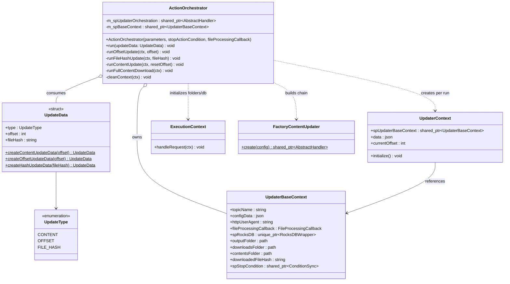
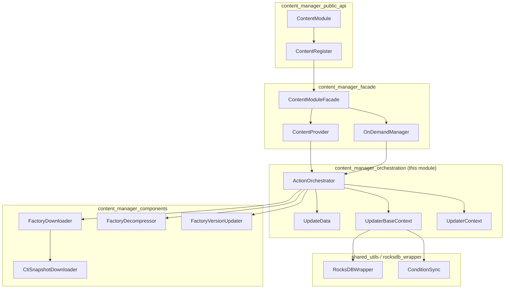
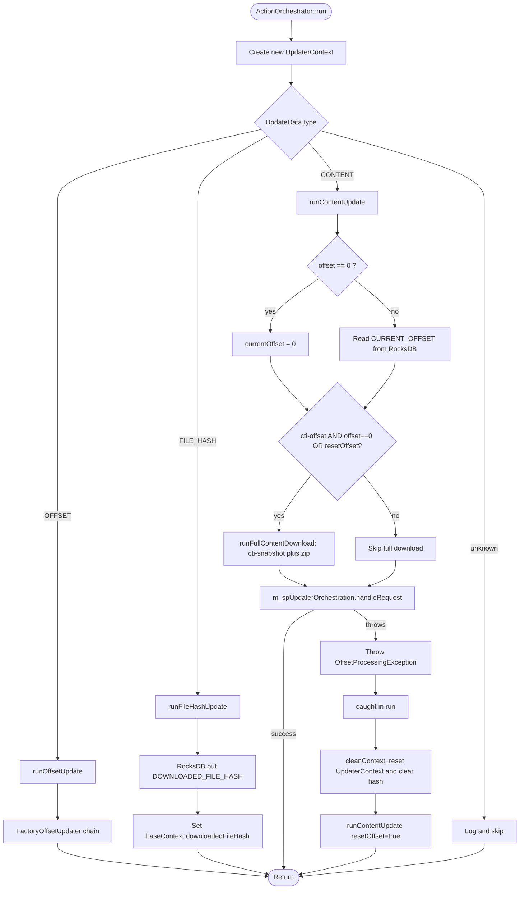
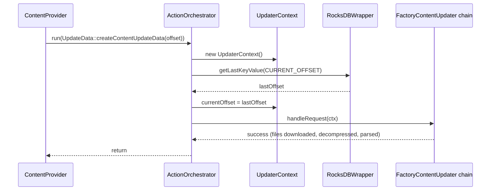
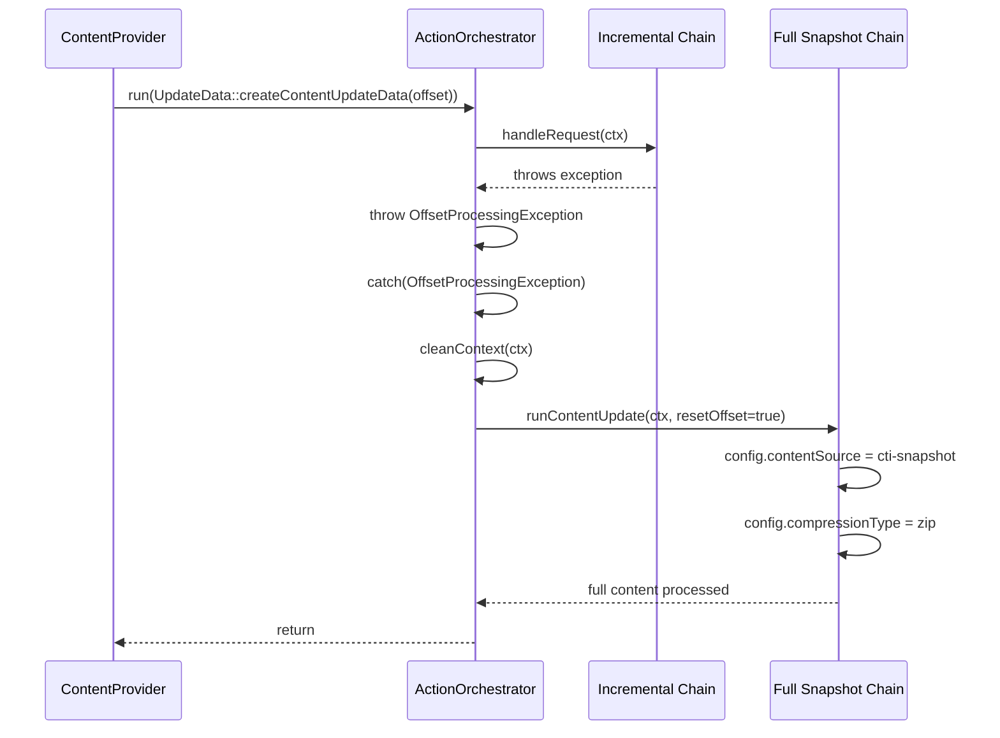

# Content Manager Orchestration

## Introduction

The **Content Manager Orchestration** module is the coordination core of Wazuh's Content Manager subsystem (`src/shared_modules/content_manager`). It is responsible for driving the sequence of steps required to keep a piece of remote content (CTI feeds, vulnerability databases, offline packages, etc.) synchronized on disk: deciding *what* needs to be updated (a full snapshot, an incremental offset, or just a stored hash), building the appropriate processing chain (download → decompress → parse/update), and persisting progress so that subsequent runs can resume where they left off.

This module contains two tightly-coupled components:

- **`ActionOrchestrator`** (and its nested `UpdateData` helper) – the decision-making engine that receives an update request and runs the correct sequence of handlers, including automatic fallback to a full content download when incremental processing fails.
- **`UpdaterBaseContext` / `UpdaterContext`** – the context objects that carry configuration, state (RocksDB handle, folders, stop condition) and per-run data (downloaded file paths, current offset) through the processing chain.

It sits between the [Content Manager Facade](content_manager_facade.md) (which owns providers and schedules work) and the [Content Manager Components](content_manager_components.md) (which implement the individual download/decompress/version-update steps). It is an internal implementation detail of the [Content Manager Public API](content_manager_public_api.md), which is the entry point used by native daemons such as `wm_content_manager` (see [Wazuh Modules Daemon](Wazuh_Modules_Daemon_(C).md)).

## Purpose and Core Functionality

The orchestrator answers three questions every time a content update is requested:

1. **What kind of update is this?** – content refresh, offset bookkeeping, or file-hash bookkeeping (modeled by `ActionOrchestrator::UpdateType` and constructed via `UpdateData::createContentUpdateData`, `createOffsetUpdateData`, `createHashUpdateData`).
2. **What is the current state?** – read from the embedded RocksDB instance (`UpdaterBaseContext::spRocksDB`) to know the last processed offset and downloaded file hash.
3. **What processing chain should run?** – built once at construction time via `FactoryContentUpdater` (which in turn composes `FactoryDownloader`, `FactoryDecompressor`, and `FactoryVersionUpdater` from [content_manager_components](content_manager_components.md)) based on the `configData` supplied for the topic.

If an incremental (`cti-offset`) update fails mid-chain, `ActionOrchestrator::run()` catches an `OffsetProcessingException` and automatically retries the topic using a **full snapshot download** (`cti-snapshot` content source), guaranteeing eventual consistency without manual intervention.

## Architecture

### Component Relationships

### Position in the Content Manager Subsystem

## Data Structures

### `UpdateData`

An immutable value object describing a single orchestration request. It cannot be constructed directly; instead, one of three static factory methods must be used, each validating its input and tagging the resulting struct with the correct `UpdateType`:

| Factory Method | Purpose | Validation |
|---|---|---|
| `createContentUpdateData(offset)` | Triggers a content refresh. `offset == 0` signals "reset and re-download everything". | None (any int accepted) |
| `createOffsetUpdateData(offset)` | Persists a new offset value into RocksDB without downloading content. | Throws `std::invalid_argument` if `offset < 0` |
| `createHashUpdateData(fileHash)` | Persists a new downloaded-file hash into RocksDB. | Throws `std::invalid_argument` if `fileHash` is empty |

### `UpdaterBaseContext`

Created once per `ActionOrchestrator` instance (i.e., once per content topic) and shared across all runs. Holds:

- Topic identity (`topicName`) and its configuration (`configData`, e.g. `contentSource`, `compressionType`, `versionedContent`, `url`).
- The **RocksDB** handle (`spRocksDB`) used to persist `CURRENT_OFFSET` and `DOWNLOADED_FILE_HASH` columns (see [rocksdb_wrapper](rocksdb_wrapper.md)).
- Filesystem paths for downloads (`downloadsFolder`) and processed contents (`contentsFolder`).
- A `ConditionSync` (`spStopCondition`) used for cooperative cancellation/graceful shutdown, and a `FileProcessingCallback` invoked once files are ready.

### `UpdaterContext`

A lightweight, **per-run** object (re-created for every `ActionOrchestrator::run()` invocation) that flows through the chain-of-responsibility handlers built by `FactoryContentUpdater`. It carries:

- A back-reference to the shared `UpdaterBaseContext`.
- `data`: a JSON document accumulating file paths, stage statuses, and the offset associated with this run — this is the payload ultimately published to subscribers via the [router](router.md) module.
- `currentOffset`: the offset being processed in this run.

## Orchestration Flow

### `run()` Decision Logic

### Sequence: Successful Incremental Update

### Sequence: Fallback to Full Snapshot on Failure

## Error Handling Strategy

| Exception | Raised When | Handling |
|---|---|---|
| `std::invalid_argument` | Bad constructor arguments to `UpdateData` factories, or unknown `contentSource`/`compressionType`/`versionedContent` in the factories from [content_manager_components](content_manager_components.md). | Propagated to the caller (`ActionOrchestrator` construction fails). |
| `OffsetProcessingException` | Any exception raised while running the incremental content chain (`m_spUpdaterOrchestration->handleRequest`). | Caught inside `run()`; context is cleaned and a **full snapshot download** is forced. |
| `SnapshotProcessingException` | Raised during `runFullContentDownload` when even the fallback snapshot fails. | Logged as a warning and re-thrown to the top-level `run()` caller. |
| Other `std::exception` | Any unexpected failure. | Context cleaned; wrapped and re-thrown as `std::runtime_error` with context. |

## Integration Points

- **Upstream callers**: [`ContentModuleFacade`](content_manager_facade.md) and its `ContentProvider`/`OnDemandManager` collaborators instantiate one `ActionOrchestrator` per registered topic (see `ContentModuleFacade::addProvider`) and invoke `run()` either on a schedule (`startScheduling`) or on demand (`startOndemand`).
- **Downstream collaborators**: The processing chain returned by `FactoryContentUpdater` is composed of handlers created by [`FactoryDownloader`](content_manager_components.md), [`FactoryDecompressor`](content_manager_components.md), and [`FactoryVersionUpdater`](content_manager_components.md), all operating on the shared `UpdaterContext`.
- **Persistent state**: `UpdaterBaseContext::spRocksDB` uses [`RocksDBWrapper`](rocksdb_wrapper.md) from the shared utilities to durably store the `CURRENT_OFFSET` and `DOWNLOADED_FILE_HASH` columns across process restarts.
- **Cancellation**: `UpdaterBaseContext::spStopCondition` is a [`ConditionSync`](sync_primitives.md) instance shared with the facade, allowing an in-flight orchestration to be interrupted during module shutdown.
- **Public entry point**: The whole chain is ultimately exposed to native C daemons through [`content_manager_public_api`](content_manager_public_api.md) (`ContentModule`, `ContentRegister`, `content_manager_start`/`content_manager_stop`), which is consumed by [`wm_content_manager` in the Wazuh Modules Daemon](Wazuh_Modules_Daemon_(C).md).

## Key Design Notes

- **Chain built once, run many times**: The processing chain (`m_spUpdaterOrchestration`) is constructed a single time in the `ActionOrchestrator` constructor based on the topic's static configuration. Each call to `run()` only creates a fresh, lightweight `UpdaterContext`, minimizing per-run overhead.
- **Self-healing incremental updates**: By catching `OffsetProcessingException` and automatically re-running with `cti-snapshot`, the orchestrator removes the need for external retry/recovery logic when incremental feeds become corrupted or out of sync.
- **Separation of state vs. data**: `UpdaterBaseContext` (long-lived, topic-scoped) is cleanly separated from `UpdaterContext` (short-lived, run-scoped), which simplifies reasoning about thread-safety and makes `cleanContext()` a cheap, well-defined reset operation.
- **Update type as intent**: The `UpdateType` enum (`CONTENT`, `OFFSET`, `FILE_HASH`) decouples "what changed" from "how it's processed", allowing external callers (e.g., REST/CLI tools) to directly manipulate bookkeeping data without triggering a full content pipeline run.

## Related Documentation

- [content_manager_public_api.md](content_manager_public_api.md) – Top-level `ContentModule`/`ContentRegister` API and C bindings (`content_manager_start`/`stop`).
- [content_manager_facade.md](content_manager_facade.md) – `ContentModuleFacade`, `ContentProvider`, and `OnDemandManager` that own and schedule `ActionOrchestrator` instances.
- [content_manager_components.md](content_manager_components.md) – Factories (`FactoryDownloader`, `FactoryDecompressor`, `FactoryVersionUpdater`) and `CtiSnapshotDownloader` used to build the processing chain.
- [rocksdb_wrapper.md](rocksdb_wrapper.md) – Persistent key/value storage used for offset and hash bookkeeping.
- [sync_primitives.md](sync_primitives.md) – `ConditionSync` and related synchronization utilities used for graceful shutdown.
- [router.md](router.md) – Downstream consumer of the processed content data published after a successful orchestration run.
- [Wazuh_Modules_Daemon_(C).md](Wazuh_Modules_Daemon_(C).md) – Native daemon (`wm_content_manager`) that embeds the Content Manager as a module.
