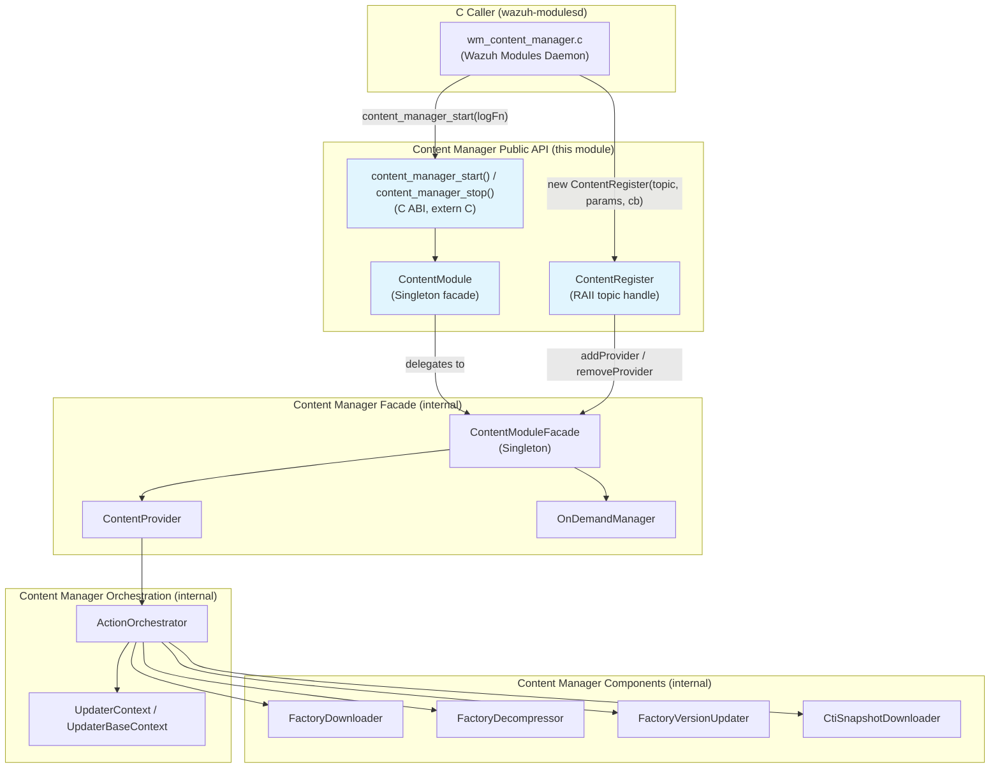
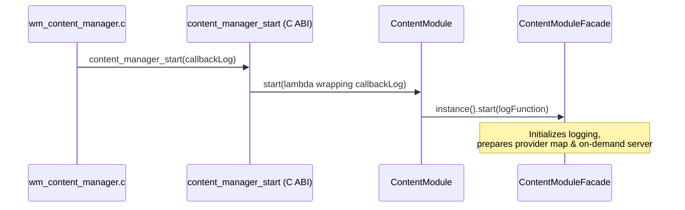
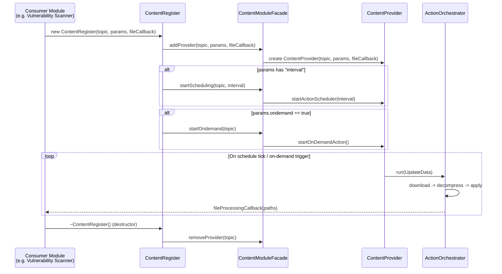
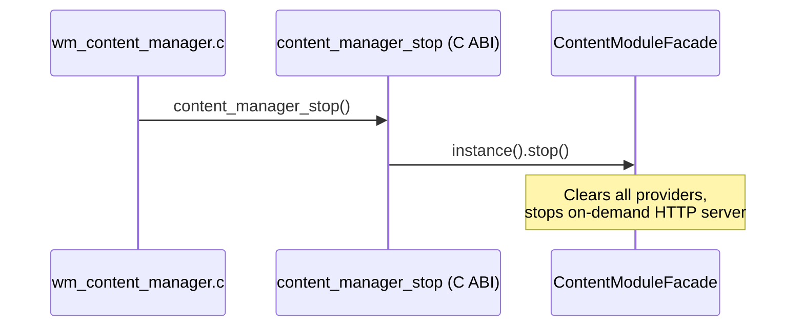

# Content Manager — Public API

## Introduction

The **Content Manager Public API** is the outward-facing surface of Wazuh's *Content Manager* shared module — a C++ component embedded in daemons (primarily `wazuh-modulesd` via the `wm_content_manager` wodule) that is responsible for downloading, decompressing, and applying externally-hosted content updates (e.g. CTI threat-intel feeds, vulnerability databases, rulesets) on a schedule or on-demand. This document covers the three symbols that make up the module's public contract:

- `ContentModule` — a process-wide singleton facade used to **start/stop** the entire Content Manager subsystem.
- `ContentRegister` — an RAII object used by client code (typically a wodule) to **register a named content "topic"** (e.g. `"vulnerability-feed"`) with its own scheduling and on-demand configuration.
- `content_manager_start` / `content_manager_stop` — the **C ABI** entry points that expose the C++ singleton to C-only callers (the wodules daemon core is written in C).

This is a thin, stable public API intentionally decoupled from the internal orchestration machinery (providers, action orchestrators, downloaders, decompressors) which live in the [Content Manager Facade](content_manager_facade.md), [Content Manager Orchestration](content_manager_orchestration.md), and [Content Manager Components](content_manager_components.md) sibling modules.

## Purpose and Scope

Client code (C or C++) that wants "some content kept up to date automatically" only needs to know about the types documented here. Internally, every operation is delegated to the `ContentModuleFacade` singleton, which owns the map of active providers, the scheduler, and the on-demand HTTP server. The public API's job is to:

1. Provide a **single lifecycle entry point** (`ContentModule::start` / `stop`, and their C wrappers) so the whole subsystem can be started once per process and stopped cleanly on shutdown.
2. Provide a **registration handle** (`ContentRegister`) so each content "topic" can be added/removed independently, with its own interval and on-demand toggle, while sharing the underlying facade infrastructure (thread pool, RocksDB persistence, on-demand server).
3. Isolate consumers (native daemons written in C, such as `wazuh_modules/wm_content_manager.c`) from C++ ABI details via a small set of `extern "C"` functions.

## Architecture Overview



### Component Relationships

| Component | Role | Delegates To |
|---|---|---|
| `content_manager_start` / `content_manager_stop` | C ABI wrappers | `ContentModule::start` / `stop` |
| `ContentModule` | Process-wide lifecycle singleton | `ContentModuleFacade::instance()` |
| `ContentRegister` | Per-topic registration RAII handle | `ContentModuleFacade::addProvider/removeProvider/startScheduling/startOndemand` |

See [Content Manager Facade](content_manager_facade.md) for the `ContentModuleFacade`, `ContentProvider`, and `OnDemandManager` implementation details, and [Content Manager Orchestration](content_manager_orchestration.md) for how a scheduled/on-demand trigger becomes an actual download-decompress-apply pipeline.

## Core Components

### `ContentModule` (singleton facade)

```cpp
class ContentModule final : public Singleton<ContentModule>
{
public:
    void start(const std::function<void(int, const std::string&, const std::string&,
                                         int, const std::string&, const std::string&,
                                         va_list)>& logFunction);
    void stop();
};
```

- Inherits from the generic `Singleton<T>` pattern (see [Shared Utils — design_patterns](shared_utils.md)).
- `start()` receives a **logging callback** with a `printf`/`va_list`-style signature so the module can log through whichever host logging system integrates it (Wazuh's `_mtinfo`/`_mtwarn` family). It forwards the call to `ContentModuleFacade::instance().start(logFunction)`.
- `stop()` forwards to `ContentModuleFacade::instance().stop()`, which clears all registered providers and shuts down the on-demand HTTP server.
- Because it is a singleton, `start`/`stop` are meant to be called exactly once per process lifecycle (typically from the wodule's `main`/`start` and `destroy` handlers).

### `ContentRegister` (topic registration handle)

```cpp
class ContentRegister final
{
public:
    explicit ContentRegister(std::string topicName,
                              const nlohmann::json& parameters,
                              FileProcessingCallback fileProcessingCallback);
    ~ContentRegister();
    void changeSchedulerInterval(size_t newInterval);
};
```

- Constructing a `ContentRegister` **registers a new content provider** under `topicName` with the facade (`ContentModuleFacade::addProvider`).
- `parameters` (a `nlohmann::json` object) configures the underlying `ActionOrchestrator`/`UpdaterBaseContext` (content source, compression type, output folder, versioning, etc. — see [Content Manager Orchestration](content_manager_orchestration.md)) and controls two orthogonal behaviors:
  - If `parameters["interval"]` is present, `startScheduling(name, interval)` is invoked, spinning up a periodic timer that triggers a `CONTENT` update.
  - If `parameters["ondemand"] == true`, `startOndemand(name)` registers an HTTP endpoint (via `OnDemandManager`) so external callers can trigger updates on request (used by tools such as the Wazuh API/manager to force a refresh).
- `fileProcessingCallback` is a user-supplied function invoked once new content files are ready on disk — this is how a consumer (e.g. Vulnerability Scanner, Inventory Harvester) actually consumes the fetched content instead of the Content Manager acting on it directly.
- Destruction (RAII) calls `ContentModuleFacade::instance().removeProvider(m_name)`, unregistering the scheduler and on-demand endpoint for that topic, making it safe to tie the object's lifetime to the owning wodule/module instance.
- `changeSchedulerInterval()` allows runtime reconfiguration (e.g. reacting to a configuration reload) without destroying/recreating the registration.

### C ABI: `content_manager_start` / `content_manager_stop`

```cpp
extern "C" {
    void content_manager_start(full_log_fnc_t callbackLog);
    void content_manager_stop();
}
```

- Defined in `contentModule.cpp`, guarded by `#ifdef __cplusplus extern "C" { ... }`.
- `content_manager_start` adapts the C function-pointer type `full_log_fnc_t` (used throughout Wazuh's C codebase, see [Wazuh Modules Daemon (C)](Wazuh_Modules_Daemon_(C).md)) into the `std::function` signature expected by `ContentModule::start`, wrapping it in a lambda that forwards to the C callback with `.c_str()` conversions.
- `content_manager_stop` simply calls `ContentModuleFacade::instance().stop()` (equivalently `ContentModule::stop()`).
- These two functions are the **only symbols** a pure-C caller (e.g. `wazuh_modules/wm_content_manager.c`) needs to link against; they are excluded from coverage (`LCOV_EXCL_START/STOP`) since they are trivial glue code.

## Data / Control Flow

### Startup Sequence



### Topic Registration and Update Trigger



### Shutdown Sequence



## Usage Pattern (Typical Integration)

1. During daemon/module initialization, call `content_manager_start(logFunction)` (C) or `ContentModule::instance().start(logFunction)` (C++) exactly once.
2. For each independent content feed the module needs, construct a `ContentRegister` with:
   - a unique `topicName`,
   - a `parameters` JSON object describing source/compression/interval/ondemand/output settings,
   - a `fileProcessingCallback` that ingests the resulting files.
3. Keep the `ContentRegister` instance alive for as long as the topic should remain active; destroying it unregisters the topic.
4. On daemon shutdown, call `content_manager_stop()` (C) or `ContentModule::instance().stop()` (C++).

## Dependencies and Related Modules

- **[Content Manager Facade](content_manager_facade.md)** — implements `ContentModuleFacade`, `ContentProvider`, and `OnDemandManager`, the classes that this public API delegates to.
- **[Content Manager Orchestration](content_manager_orchestration.md)** — implements `ActionOrchestrator` and `UpdaterContext`/`UpdaterBaseContext`, which perform the actual download → decompress → version-update pipeline once a topic's provider is triggered.
- **[Content Manager Components](content_manager_components.md)** — implements the concrete `FactoryDownloader`, `FactoryDecompressor`, `FactoryVersionUpdater`, and `CtiSnapshotDownloader` building blocks used by the orchestrator.
- **[Shared Utils](shared_utils.md)** — provides the generic `Singleton<T>` pattern used by `ContentModule` and `ContentModuleFacade`, plus RocksDB wrapper utilities used for persisting offsets/hashes.
- **[Wazuh Modules Daemon (C)](Wazuh_Modules_Daemon_(C).md)** — hosts `wm_content_manager.c`/`wm_content_manager.h`, the primary C consumer of this public API within `wazuh-modulesd`.
- **[Advanced Security Modules (C++ Inventory & Vulnerability)](Advanced_Security_Modules_(C++_Inventory_&_Vulnerability).md)** — the Vulnerability Scanner and Inventory Harvester modules are typical consumers that register content topics (e.g. CVE feeds) via `ContentRegister` and process delivered files through their own pipelines.

## Design Notes

- **Facade + Singleton pattern**: `ContentModule` intentionally hides `ContentModuleFacade` from external callers, keeping the public header (`contentManager.hpp`) minimal and stable even as internal orchestration logic evolves.
- **RAII for lifecycle safety**: `ContentRegister`'s constructor/destructor pairing with `addProvider`/`removeProvider` ensures that a topic's resources (scheduler thread, on-demand endpoint) are automatically cleaned up if the owning object goes out of scope, reducing the risk of dangling schedulers after a module is disabled.
- **C/C++ interop boundary**: Because most Wazuh native daemons (agent/manager core) are C, `content_manager_start`/`content_manager_stop` exist purely to cross the language boundary safely, converting the C `full_log_fnc_t` callback into a `std::function` used across the C++ codebase.
- **Decoupled scheduling vs. on-demand triggers**: A single `ContentRegister` can enable both an interval-based scheduler and an HTTP on-demand endpoint simultaneously, since these are independent flags in the `parameters` JSON.
