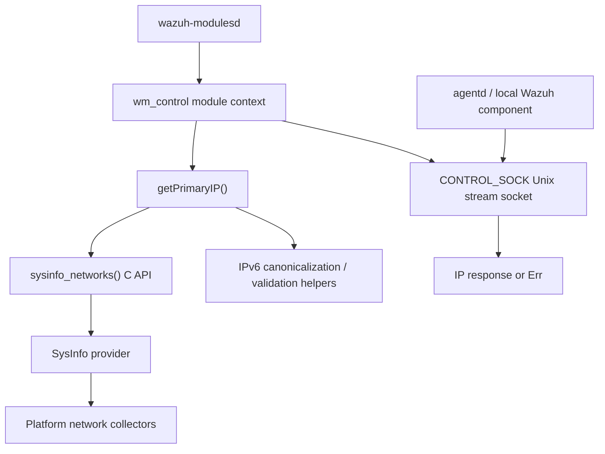
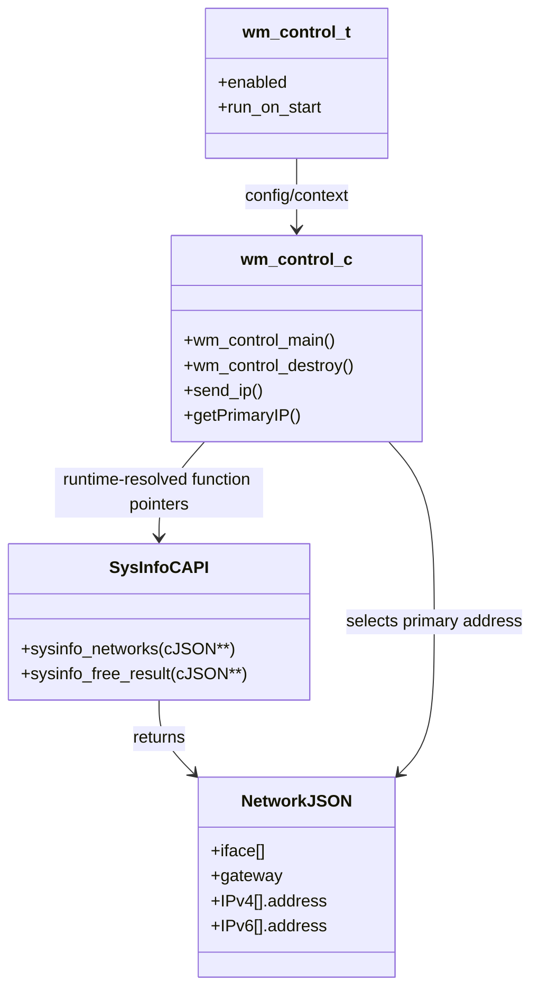
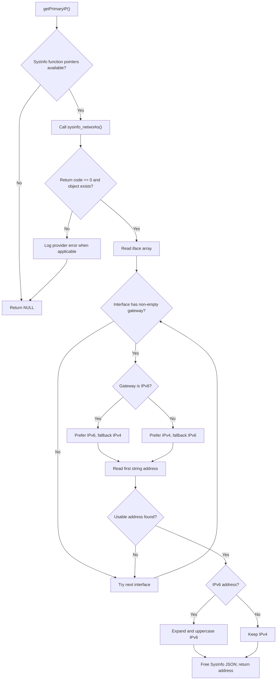
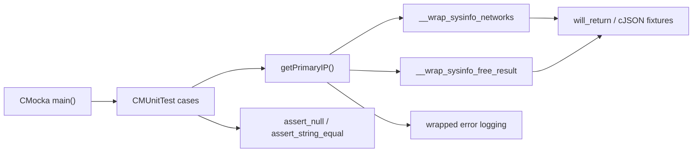

# Control Module (`wm_control`)

The control module is a small, local service hosted by `wazuh-modulesd`. It answers requests for the host's primary network address through a Unix domain socket. The address is derived from the network interface that has a configured gateway, using the shared SysInfo C API. This makes agent components independent of platform-specific interface enumeration and IPv6 formatting.

The module is part of the System Management family. Its daemon registration and common lifecycle are described in [wazuh_modules_core_lifecycle.md](wazuh_modules_core_lifecycle.md), while the sibling socket service and its request protocol are described in [wazuh_modules_core_system_management_socket_services.md](wazuh_modules_core_system_management_socket_services.md).

## Scope and position

Production sources:

- `src/wazuh_modules/wm_control.c` — module entry point, socket loop, dynamic SysInfo loading, and `getPrimaryIP()`.
- `src/wazuh_modules/wm_control.h` — `wm_control_t` configuration and module context declarations.

The module runs inside `wazuh-modulesd`; it is not a standalone network collector. It delegates network discovery to the SysInfo provider, whose C façade is documented in [data_provider_sysinfo_core_capi.md](data_provider_sysinfo_core_capi.md), and whose platform implementations are documented in [data_provider_sysinfo_core.md](data_provider_sysinfo_core.md).



## Responsibilities

`wm_control` has four focused responsibilities:

1. Register a long-lived module instance with `wazuh-modulesd`.
2. Bind and service the local control Unix socket.
3. Resolve the primary address by inspecting SysInfo network JSON.
4. Release the dynamically loaded SysInfo library during teardown.

It does not collect interfaces itself, persist inventory, or forward events to `analysisd`. Those concerns belong to the SysInfo/data-provider and Syscollector modules; see [data_provider_network.md](data_provider_network.md) and [syscollector_module_native_daemon.md](syscollector_module_native_daemon.md) where applicable.

## Components and relationships



The production implementation resolves `sysinfo_networks` and `sysinfo_free_result` dynamically. If either function is unavailable, resolution fails safely instead of making the module depend on a link-time SysInfo symbol.

### Primary-IP selection

`getPrimaryIP()` expects a network object containing an `iface` array. It scans interfaces in order and selects the first interface with a non-empty string `gateway`:

1. A gateway containing `:` is treated as IPv6; otherwise it is treated as IPv4.
2. The matching address array (`IPv6` or `IPv4`) is preferred.
3. If the preferred family is absent or has no usable address, the other family is tried.
4. The first string-valued `address` is returned.
5. IPv6 output is expanded to canonical uppercase hexadecimal form. IPv4 output is returned as an IPv4 string.

The function returns `NULL` for missing provider functions, provider errors, malformed or missing JSON, missing gateways, absent address arrays, invalid address types, and empty gateways. The caller owns a successful result and must free it with the project allocator.



## Socket service flow

The socket request is a trigger rather than a query language: the server receives bytes, but does not interpret their contents. Each request causes a fresh primary-IP lookup and receives either the address or `Err`.

```mermaid
sequenceDiagram
    participant Caller as "Local caller"
    participant Socket as "CONTROL_SOCK"
    participant Control as "wm_control"
    participant Provider as "sysinfo_networks"
    participant Free as "sysinfo_free_result"

    Caller->>Socket: connect()
    Caller->>Socket: send trigger bytes
    Socket->>Control: accept() / receive request
    Control->>Provider: request network JSON
    Provider-->>Control: cJSON object + status
    Control->>Control: select gateway interface and address
    Control->>Free: release network JSON
    alt address found
        Control-->>Socket: IP string
        Socket-->>Caller: IP string
    else lookup failed
        Control-->>Socket: Err
        Socket-->>Caller: Err
    end
    Control->>Control: close peer; continue serving
```

The server is iterative and services one accepted connection at a time. Socket creation, permissions, Unix-domain send/receive, and retry behavior are shared Wazuh infrastructure; see [wazuh_modules_core_system_management_socket_services.md](wazuh_modules_core_system_management_socket_services.md) instead of duplicating those implementation details here.

## Error handling and resource ownership

The observable failure policy is intentionally conservative:

- Missing dynamic symbols cause a null result.
- A non-zero SysInfo status is logged and produces a failed lookup.
- Invalid JSON shape or value types are ignored rather than coerced.
- A successful lookup returns newly allocated memory owned by the caller.
- The SysInfo result is released after each lookup.
- Module destruction unloads the dynamic SysInfo library when it was loaded.

This behavior prevents malformed inventory data from being sent as an apparently valid address. It also explains why the test suite checks both null results and explicit cleanup expectations.

## Test architecture

The core test file is `src/unit_tests/wazuh_modules/control/test_wm_control.c`. It uses CMocka and the shared SysInfo wrappers to replace the dynamically resolved provider functions. The tests exercise `getPrimaryIP()` directly, so socket I/O and daemon scheduling are outside this unit-test boundary.



### Covered scenarios

The fixture matrix covers:

- missing `sysinfo_networks` or free-result function pointers;
- provider failure and null provider output;
- missing `iface`, non-array `iface`, and an empty interface array;
- absent, non-string, or whitespace-only gateways;
- IPv4 gateway with IPv4 address;
- IPv4 gateway with IPv6 fallback;
- IPv6 gateway with IPv6 address;
- IPv6 gateway with IPv4 fallback;
- missing address arrays and invalid address types;
- multiple addresses, confirming the first address wins;
- IPv6 expansion to canonical uppercase notation.

Representative expected results are:

| Input condition | Result |
|---|---|
| `gateway = "192.168.1.1"`, first IPv4 address `192.168.1.10` | `192.168.1.10` |
| IPv4 gateway, only IPv6 address available | Expanded IPv6 address |
| `gateway = "fe80::"`, IPv6 address available | Expanded uppercase IPv6 address |
| Valid gateway but no address arrays | `NULL` |
| Multiple addresses in preferred array | First address |
| Provider error | `NULL` and error log |

The test runner registers every case with `cmocka_run_group_tests`. Each test scripts provider return values and owns cleanup of fixture JSON and successful IP strings. This is consistent with the general wrapper-based testing model described in [test_infrastructure.md](test_infrastructure.md).

## Integration notes for maintainers

Changes to network JSON shape should be made in coordination with [data_provider_sysinfo_core_capi.md](data_provider_sysinfo_core_capi.md) and the platform provider pages. If primary-IP selection changes, update both address-family fallback tests and malformed-input tests. If a new dynamic provider symbol is introduced, add its wrapper and failure-path coverage.

The control module should remain a narrow adapter: module lifecycle and socket mechanics belong to the System Management socket-service layer, while interface discovery and platform behavior belong to the SysInfo provider. This separation keeps agent consumers stable across Linux, Windows, and other supported platforms.
