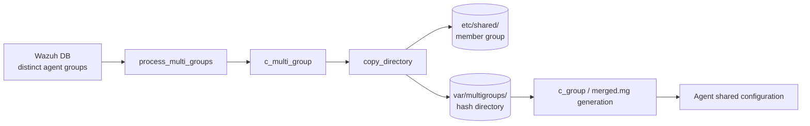
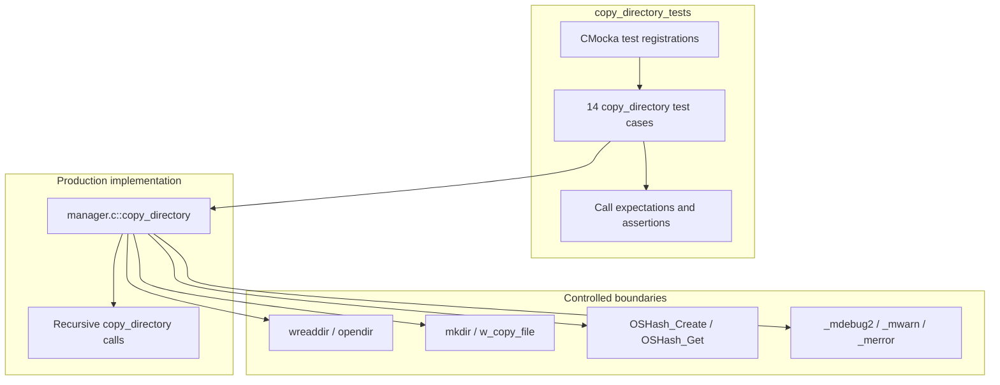
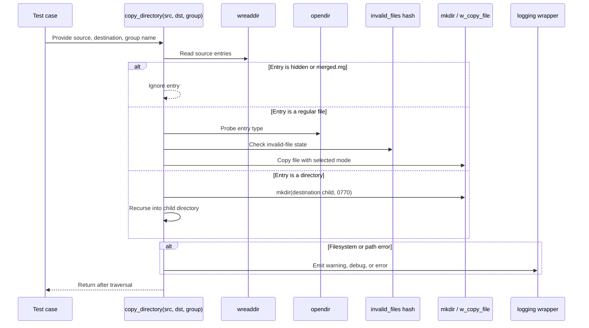
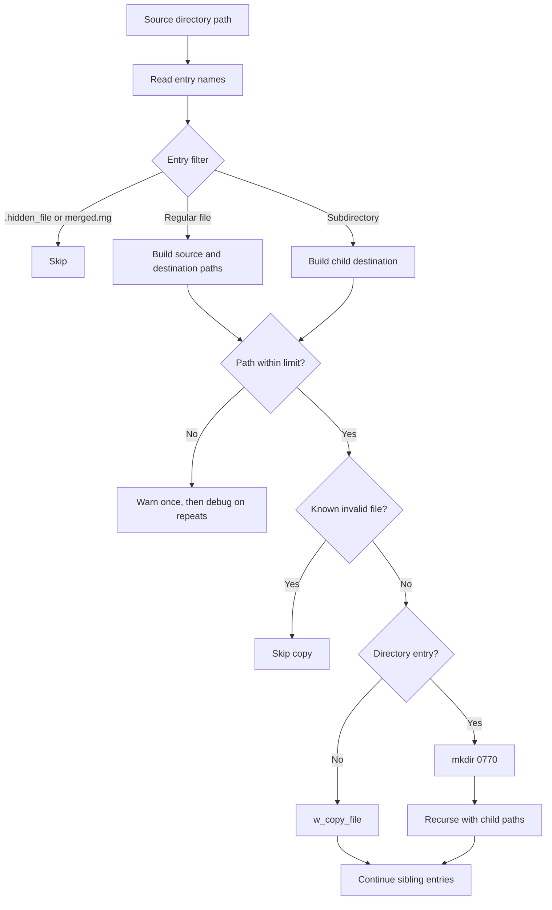
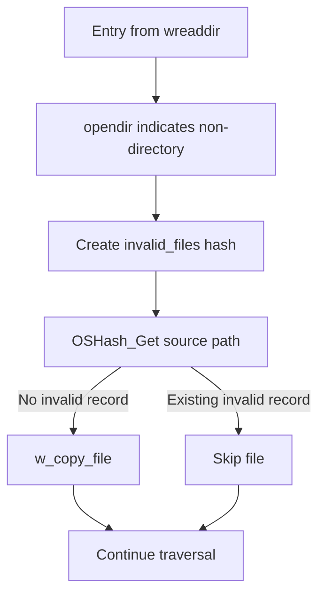
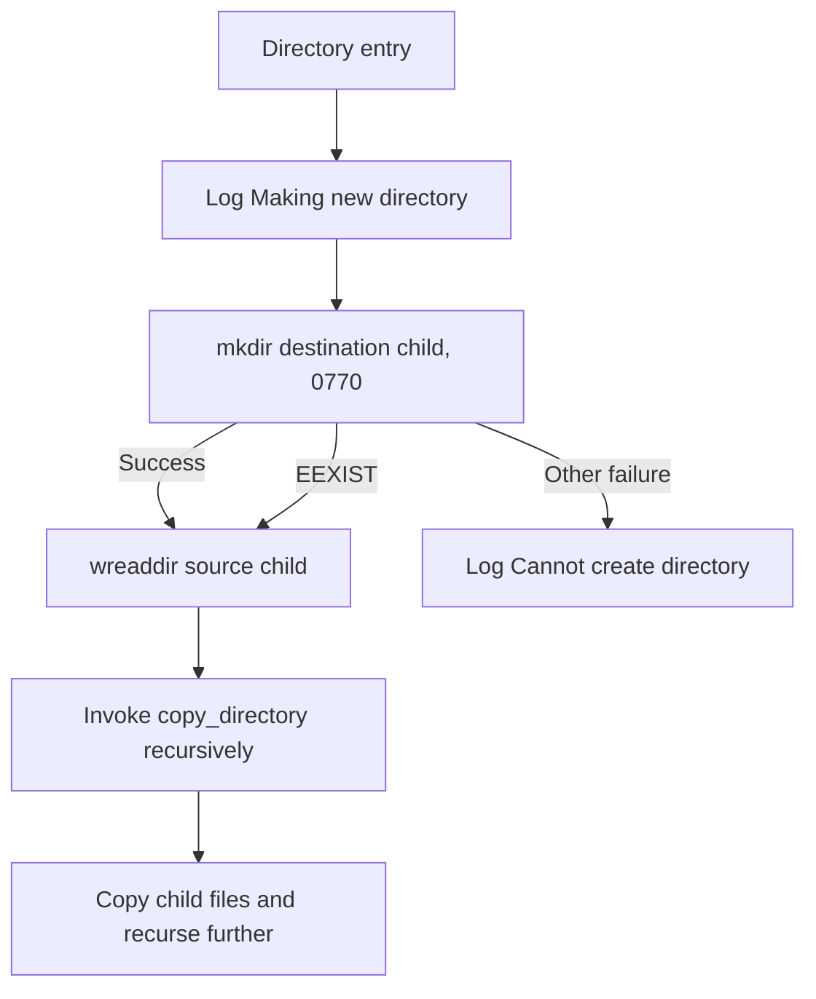

# `copy_directory_tests`

## Introduction

`copy_directory_tests` documents the CMocka tests for `copy_directory()`, the recursive file-copy helper used by Wazuh Remoted when assembling a multigroup directory. The tests validate directory traversal, file filtering, destination creation, copy-mode selection, invalid-file handling, path-length protection, and filesystem error reporting.

The tests are part of [`src/unit_tests/remoted/test_manager.c`](src/unit_tests/remoted/test_manager.c). They exercise the production implementation included from `src/remoted/manager.c`; the surrounding remoted design is documented in [Remoted Group Management](remoted_group_management.md), while wrapper and fixture conventions are described in [Remoted manager test infrastructure](test_manager_remoted_test_infrastructure.md).

## Scope and system position

During multigroup generation, Remoted combines the shared files of several agent groups. `copy_directory()` copies one source group directory into a temporary multigroup directory, preserving nested structure. The caller later uses the copied content to create or refresh `merged.mg`.



The test module is deliberately narrower than the production group-management module. It does not re-document multigroup discovery, checksum comparison, or merged-file construction; see [Remoted Group Management](remoted_group_management.md) for those workflows.

## Architecture and dependencies

The test compiles the implementation into the test translation unit and replaces external effects with wrappers. This gives each test deterministic directory listings, file types, hash contents, return values, and log messages.



### Main dependencies

| Dependency | Role in the tests |
| --- | --- |
| `manager.c::copy_directory` | Function under test; recursively traverses source entries and writes to the destination. |
| `wreaddir` | Supplies a synthetic list of entry names for each directory. A `NULL` result models an unavailable or deleted source directory. |
| `opendir` | Distinguishes regular files from directories in the mocked scenarios. |
| `mkdir` | Verifies creation of destination subdirectories with mode `0770` and exercises failure/EEXIST branches. |
| `w_copy_file` | Verifies source path, destination path, copy mode, and silent-operation flag. |
| `OSHash_Create`, `OSHash_Get` | Models the invalid-file tracking table used during traversal. |
| Logging wrappers | Verify warning, debug, and error behavior without writing real logs. |

The complete wrapper inventory and fixture lifecycle are maintained in [Remoted manager test infrastructure](test_manager_remoted_test_infrastructure.md). Related merge and validation tests are documented in [C group tests](c_group_tests.md) and [C files tests](c_files_tests.md).

## Component interaction



The tests assert interactions rather than relying on real files. Consequently, an unexpected call—such as attempting to copy a hidden entry—fails the test and documents the intended filtering contract.

## Data flow and path handling



Path-length tests cover both independently constructed paths:

- Source overflow logs `Source path too long '<path>/test-file'`.
- Destination overflow logs `Destination path too long '<path>/test-file'`.
- The first overflow is a warning; once `reported_path_size_exceeded` is set, subsequent overflows are debug messages to avoid log flooding.

## Process flows

### Regular file



Ordinary files use copy mode `0x63` in the test expectations. `agent.conf` is handled specially and uses mode `0x61`. Both calls set the silent flag to `1`.

### Nested directory



An existing destination directory is allowed to proceed to recursive traversal. Other `mkdir` failures produce an error containing the path, `strerror()` text, and errno value.

## Test inventory

| Test | Scenario and expected contract |
| --- | --- |
| `test_copy_directory_files_null` | Source listing is unavailable; logs that the group folder was deleted. |
| `test_copy_directory_hidden_file` | Ignores a hidden entry without copying it. |
| `test_copy_directory_merged_file` | Ignores the generated `merged.mg` file. |
| `test_copy_directory_source_path_too_long_warning` | Reports the first source-path overflow at warning level. |
| `test_copy_directory_source_path_too_long_debug` | Reports a repeated source-path overflow at debug level. |
| `test_copy_directory_destination_path_too_long_warning` | Reports the first destination-path overflow at warning level. |
| `test_copy_directory_destination_path_too_long_debug` | Reports a repeated destination-path overflow at debug level. |
| `test_copy_directory_invalid_file` | Skips a file already present in the invalid-file hash. |
| `test_copy_directory_agent_conf_file` | Copies `agent.conf` using its special mode `0x61`. |
| `test_copy_directory_valid_file` | Copies an ordinary file to the matching destination using mode `0x63`. |
| `test_copy_directory_valid_file_subfolder_file` | Copies a root file and a file in a newly created subdirectory. |
| `test_copy_directory_mkdir_fail` | Reports a non-EEXIST directory-creation failure. |
| `test_copy_directory_mkdir_exist` | Continues into a destination directory when `mkdir` reports EEXIST, then handles source-read failure. |
| `test_copy_directory_file_subfolder_file` | Processes multiple root entries, recursively copying nested content and continuing with later siblings. |

The source registration also contains `test_c_multi_group_call_copy_directory`, which verifies that the higher-level `c_multi_group()` workflow invokes this helper. That integration scenario belongs to [C group tests](c_group_tests.md); this page focuses on the direct `copy_directory_*` cases.

## Observable contracts and failure behavior

### Filtering

- Dot-prefixed entries are ignored.
- `merged.mg` is ignored because it is generated output, not source content.
- Regular files are copied only when they are not already tracked as invalid.
- Directories are traversed recursively.

### Destination creation

- New child directories are created with permissions `0770`.
- `EEXIST` is treated as an already-present destination and does not prevent recursion.
- Other `mkdir` failures are logged with the destination path and errno context.

### Missing source directories

When `wreaddir()` returns `NULL`, the helper logs:

```text
Could not open directory '<source>'. Group folder was deleted.
```

The test does not require a copy operation after this condition.

### Test isolation

Tests that alter `reported_path_size_exceeded` reset it after invocation. Hashes and allocated synthetic directory-entry arrays are released by the test or its fixture. This is important because `copy_directory()` is white-box tested inside the same translation unit as other manager tests and shares production globals.

## Maintenance guidance

When changing `copy_directory()`:

1. Preserve the explicit filtering tests for hidden files and `merged.mg`.
2. Update path-overflow expectations if the warning/debug policy or message changes.
3. Keep regular-file and `agent.conf` copy modes covered separately.
4. Add a focused test for any new filesystem branch, especially recursive errors and partial-copy behavior.
5. Keep wrapper calls deterministic; real filesystem access is outside this unit’s scope.

For broader impacts on multigroup assembly, consult [Remoted Group Management](remoted_group_management.md). For changes to CMocka setup, wrapper ownership, or global cleanup, consult [Remoted manager test infrastructure](test_manager_remoted_test_infrastructure.md).
