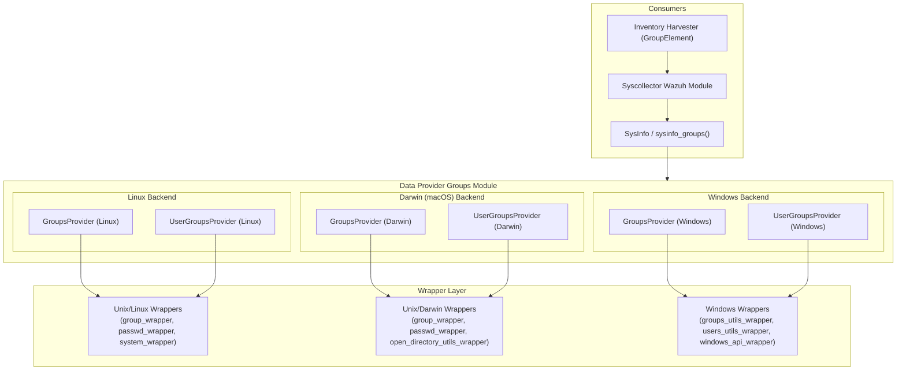
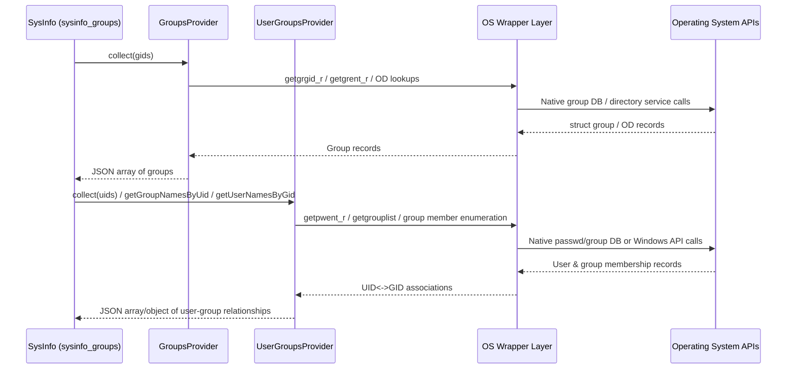

# Data Provider Groups Module

## Introduction and Purpose

The **Data Provider Groups** module is a cross-platform C++ component of the Wazuh **System Information Data Provider** (`src/data_provider`). Its sole responsibility is to collect **operating system group information** — group names, GIDs, group membership, and the mapping between users and groups — and expose this data as normalized JSON structures.

This module is a building block used by higher-level inventory and system-information collection features (such as `SysInfo`, the Syscollector wazuh module, and the Inventory Harvester) to populate the "groups" and "user-group relationship" facts about a monitored host. Because Wazuh agents run on Linux, macOS (Darwin), and Windows, the module is implemented with **one specialized backend per operating system**, all exposing a very similar C++ interface (`GroupsProvider` / `UserGroupsProvider`), which allows the rest of the data provider codebase to remain platform-agnostic.

Key responsibilities:
- Enumerate all groups on the system, or filter by a specific set of GIDs.
- Enumerate group memberships for a specific set of users (UIDs), or for all users.
- Provide efficient two-way lookups: "which users belong to this group" and "which groups does this user belong to."
- Abstract away platform-specific APIs (POSIX `getgrent`/`getpwent` family on Linux, Open Directory APIs on macOS, and the Windows Local Group/User Management APIs) behind small, testable wrapper interfaces.

## Architecture Overview

The module follows a **Provider + Wrapper** pattern consistently across all three platforms:

- A `GroupsProvider` class collects plain group data (name, GID).
- A `UserGroupsProvider` class collects the user↔group relationship (which groups a user belongs to, and which users belong to a group).
- Each provider depends on one or more **wrapper interfaces** (e.g., `IGroupWrapperLinux`, `IPasswdWrapperLinux`, `ISystemWrapper` on Linux; `IGroupWrapperDarwin`, `IPasswdWrapperDarwin`, `IODUtilsWrapper` on macOS; `IGroupsHelper`, `IUsersHelper`, `IWindowsApiWrapper` on Windows) that isolate direct OS/library calls. This design enables dependency injection of mocked wrappers for unit testing and keeps the providers themselves free of platform library details.
- All providers return data as `nlohmann::json` objects/arrays, keeping the output format consistent regardless of platform, which simplifies consumption by the rest of the data provider (see [SysInfo_Provider](SysInfo_Provider.md)).

## Platform Backends (Sub-modules)

The module is split by target operating system. Each sub-module documents its providers, data structures, and the wrapper dependencies used to talk to the underlying OS APIs.

| Sub-module | Platform | Documentation |
|---|---|---|
| Linux Groups & User-Groups Providers | Linux | [data_provider_groups_linux.md](data_provider_groups_linux.md) |
| Darwin (macOS) Groups & User-Groups Providers | macOS | [data_provider_groups_darwin.md](data_provider_groups_darwin.md) |
| Windows Groups & User-Groups Providers | Windows | [data_provider_groups_windows.md](data_provider_groups_windows.md) |

### High-level functionality of each sub-module

- **[Linux backend](data_provider_groups_linux.md)**: Uses the reentrant POSIX group/passwd APIs (`getgrgid_r`, `getgrent_r`, `getpwent_r`, `getgrouplist`) through the `IGroupWrapperLinux`, `IPasswdWrapperLinux`, and `ISystemWrapper` interfaces to enumerate groups, resolve group membership for users, and build bidirectional UID↔GID name mappings.
- **[Darwin backend](data_provider_groups_darwin.md)**: Uses BSD group/passwd calls in combination with macOS Open Directory utilities (`IODUtilsWrapper`) to account for directory-service-backed groups (e.g., LDAP/AD-integrated groups) in addition to local `/etc/group` entries.
- **[Windows backend](data_provider_groups_windows.md)**: Uses the Windows Local Group Management APIs (via `IGroupsHelper`, `IUsersHelper`, and `IWindowsApiWrapper`) to enumerate local groups and local users, and to compute group memberships since Windows does not expose a POSIX-style GID model natively.

## Data Flow

## Relationship to Other Modules

This module is one of several extended-source providers inside the broader **System Information Data Provider** component. Related sibling modules (not detailed here, but part of the same parent component) include:

- **[SysInfo_Provider](SysInfo_Provider.md)** — the top-level `SysInfo` facade that aggregates groups, users, hardware, network, OS, packages, and ports information (see `sysinfo_groups` in `sysInfo.cpp`) into the unified inventory payload consumed by Syscollector.
- **[data_provider_users](data_provider_users.md)** — collects user account information (`UsersProvider`, `LoggedInUsersProvider`, `ShadowProvider`, `SudoersProvider`), complementary to this module's group data.
- **[data_provider_wrappers_unix](data_provider_wrappers_unix.md)** and **[data_provider_wrappers_windows](data_provider_wrappers_windows.md)** — the shared low-level OS API wrapper implementations (`GroupWrapperLinux`, `PasswdWrapperLinux`, `GroupWrapperDarwin`, `PasswdWrapperDarwin`, `ODUtilsWrapper`, `GroupsHelper`, `UsersHelper`, `WindowsApiWrapper`, etc.) that back the platform-specific providers documented in this module's sub-modules.
- **[data_provider_sysinfo_core](data_provider_sysinfo_core.md)** — platform-specific glue code (`sysInfoLinux.cpp`, `sysInfoMac.cpp`, `sysInfoWin.cpp`) that invokes these providers as part of building the full system inventory snapshot.

For consumers further up the stack, see also:
- **inventory_harvester_module** (`GroupElement`) in the Advanced Security Modules component, which indexes group inventory data produced ultimately from this module into the Wazuh indexer.
- **syscollector_module_native_daemon**, the C daemon that periodically triggers `SysInfo` collection (including groups) and forwards deltas to the manager.
