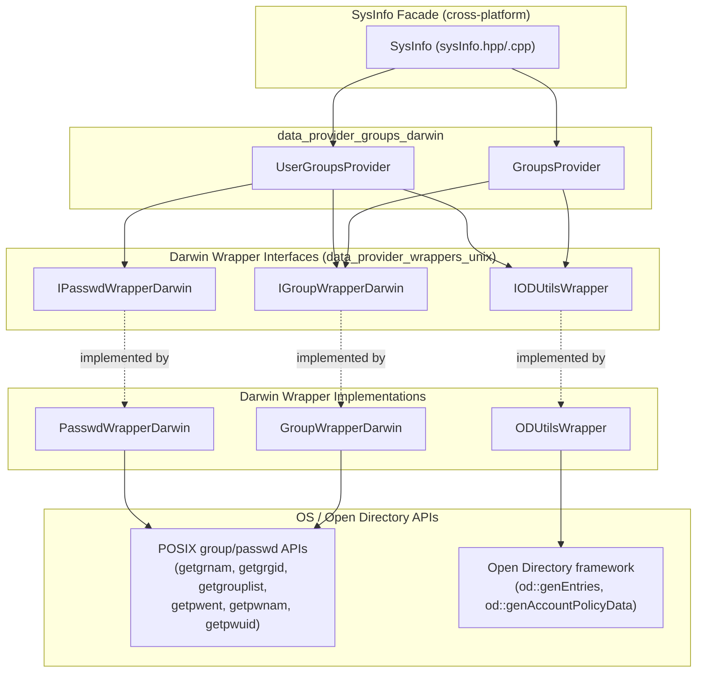
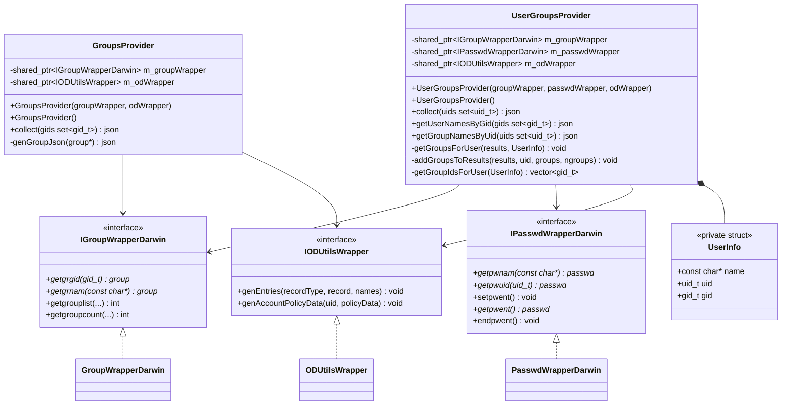
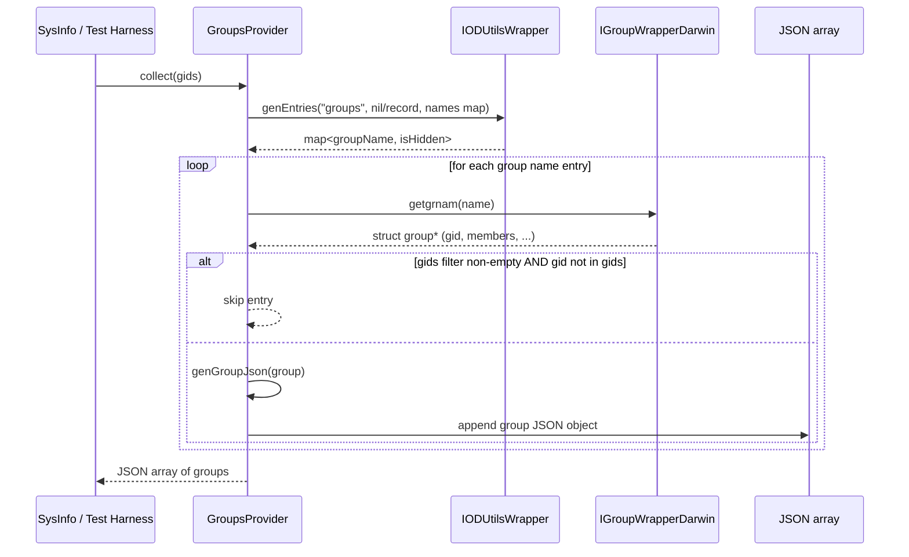
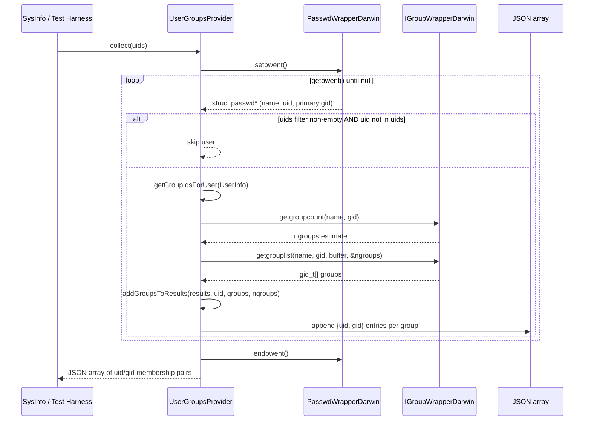
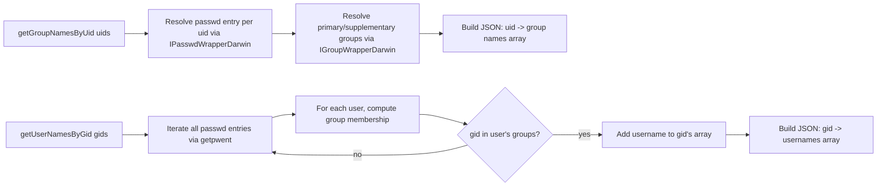
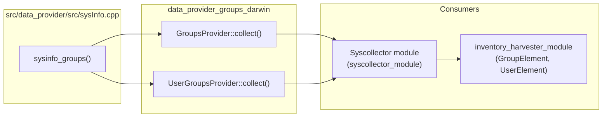

# Data Provider Groups (Darwin)

## Introduction

The **`data_provider_groups_darwin`** module is a platform-specific implementation within Wazuh's System Information Data Provider (`SysInfo`) subsystem. It is responsible for collecting **macOS/Darwin group and user-group membership information** used to populate host inventory data (System Information / FIM / Syscollector-style group inventories).

It provides two focused providers:

- **`GroupsProvider`** — enumerates system groups (`/etc/group` + Open Directory records) and returns them as JSON.
- **`UserGroupsProvider`** — resolves group memberships for users (UID ↔ GID relationships), including reverse lookups (group name by UID, and usernames by GID).

Both providers depend on Darwin-specific OS abstraction wrappers (`IGroupWrapperDarwin`, `IPasswdWrapperDarwin`, `IODUtilsWrapper`) that isolate direct POSIX/Open Directory API calls, enabling unit testing via dependency injection.

This module is one of three OS-specific sibling implementations of the same conceptual "groups" feature; see also:
- [data_provider_groups_linux.md](data_provider_groups_linux.md) (Linux equivalent)
- `data_provider_groups_windows` (Windows equivalent, sibling module, not yet documented separately)

It is a leaf/child module of [data_provider_groups.md](data_provider_groups.md), which itself belongs to the broader [System_Information_Data_Provider_(C++)](System_Information_Data_Provider_(C++).md) module tree, alongside [data_provider_users.md](data_provider_users.md), [data_provider_wrappers_unix.md](data_provider_wrappers_unix.md), and [data_provider_sysinfo_core.md](data_provider_sysinfo_core.md).

---

## Module Purpose & Core Functionality

| Responsibility | Component |
|---|---|
| Enumerate all (or filtered) system groups on macOS | `GroupsProvider` |
| Build JSON representation of a single group entry | `GroupsProvider::genGroupJson` |
| Resolve group memberships per-user (UID → list of GIDs/groups) | `UserGroupsProvider` |
| Resolve group name(s) for given UID(s) | `UserGroupsProvider::getGroupNamesByUid` |
| Resolve username(s) for given GID(s) | `UserGroupsProvider::getUserNamesByGid` |

Both providers consume **Darwin OS wrappers** rather than calling POSIX APIs (`getgrgid`, `getgrnam`, `getpwent`, `getgrouplist`, etc.) or Open Directory APIs directly. This wrapper-based design (Dependency Inversion) allows:

1. Swapping real implementations (`GroupWrapperDarwin`, `PasswdWrapperDarwin`, `ODUtilsWrapper`) with mocks in unit tests.
2. Sharing common interface contracts (`IGroupWrapperDarwin`, `IPasswdWrapperDarwin`, `IODUtilsWrapper`) across the `groups` and `users` Darwin providers.
3. Isolating macOS-specific concerns (Open Directory integration for hidden/synthetic accounts) from the cross-platform `SysInfo` facade.

---

## Architecture Overview

---

## Component Relationships

---

## Data Flow

### GroupsProvider::collect() Flow

### UserGroupsProvider::collect() Flow

### Reverse Lookup Flows

---

## Design Patterns

- **Dependency Injection / Strategy** — `GroupsProvider` and `UserGroupsProvider` accept wrapper interfaces via constructor injection, defaulting to concrete OS implementations (`GroupWrapperDarwin`, `PasswdWrapperDarwin`, `ODUtilsWrapper`) when not supplied. This is the same pattern used across all `data_provider` OS-specific submodules (see [data_provider_wrappers_unix.md](data_provider_wrappers_unix.md) and [data_provider_wrappers_windows.md](data_provider_wrappers_windows.md)).
- **Interface Segregation** — Separate narrow interfaces (`IGroupWrapperDarwin`, `IPasswdWrapperDarwin`, `IODUtilsWrapper`) instead of one monolithic OS wrapper, mirroring the equivalent Linux wrappers (`IGroupWrapperLinux`, `IPasswdWrapperLinux`, `ISystemWrapper`).
- **Facade over Open Directory** — `IODUtilsWrapper`/`ODUtilsWrapper` hides macOS Open Directory framework complexity (`od::genEntries`, `od::genAccountPolicyData`) behind a simple JSON-populating interface, needed because macOS group/user enumeration must merge classic `/etc/group` data with Open Directory-managed (including hidden) accounts — a concern absent on Linux.

---

## Comparison with Sibling Platform Implementations

| Aspect | Darwin (`groups_darwin.hpp`) | Linux (`groups_linux.hpp`) |
|---|---|---|
| Group source | `/etc/group` + Open Directory (`IODUtilsWrapper::genEntries`) | `/etc/group` via `getgrent`/`IGroupWrapperLinux` only |
| Extra system wrapper | `IODUtilsWrapper` (Open Directory) | `ISystemWrapper` (general system calls) |
| Passwd wrapper | `IPasswdWrapperDarwin` | `IPasswdWrapperLinux` |
| Hidden accounts handling | Yes, via Open Directory `isHidden` flag | No dedicated concept |
| Public interface | `GroupsProvider::collect`, `UserGroupsProvider::{collect, getUserNamesByGid, getGroupNamesByUid}` | Same method signatures — interface parity maintained across platforms |

This mirrored interface design allows the platform-agnostic [data_provider_sysinfo_core.md](data_provider_sysinfo_core.md) (`sysInfo.cpp`, `sysinfo_groups`) to invoke either implementation transparently at compile time based on the target OS.

---

## Integration with the Broader System

The JSON produced by `GroupsProvider` and `UserGroupsProvider` feeds into:
- **`sysinfo_groups`** in `src/data_provider/src/sysInfo.cpp` (part of [data_provider_sysinfo_core.md](data_provider_sysinfo_core.md)), which normalizes the platform-specific output into the common `SysInfo` group inventory schema.
- Downstream inventory/harvesting pipelines such as **`GroupElement`** and **`UserElement`** in the [inventory_harvester_module](Advanced_Security_Modules_(C++_Inventory_&_Vulnerability).md), which index group/user data for the Wazuh indexer.

---

## Key API Reference

### `GroupsProvider`

| Method | Description |
|---|---|
| `GroupsProvider()` | Default constructor; instantiates default `GroupWrapperDarwin` and `ODUtilsWrapper`. |
| `GroupsProvider(groupWrapper, odWrapper)` | Constructor for dependency injection (used in unit tests). |
| `collect(const std::set<gid_t>& gids = {})` | Returns a JSON array of groups. If `gids` is empty, returns all groups; otherwise filters to the given GIDs. |
| `genGroupJson(const struct group*)` *(private)* | Converts a single `struct group*` into a JSON object (name, gid, members). |

### `UserGroupsProvider`

| Method | Description |
|---|---|
| `UserGroupsProvider()` | Default constructor; instantiates default `GroupWrapperDarwin`, `PasswdWrapperDarwin`, and `ODUtilsWrapper`. |
| `UserGroupsProvider(groupWrapper, passwdWrapper, odWrapper)` | Constructor for dependency injection. |
| `collect(const std::set<uid_t>& uids = {})` | Returns a JSON array of UID↔GID membership records, optionally filtered by `uids`. |
| `getUserNamesByGid(const std::set<gid_t>& gids)` | Returns a JSON object mapping each GID to an array of associated usernames. |
| `getGroupNamesByUid(const std::set<uid_t>& uids)` | Returns a JSON object mapping each UID to an array of associated group names. |
| `getGroupsForUser(results, UserInfo)` *(private)* | Resolves and appends all groups for a single user into `results`. |
| `getGroupIdsForUser(UserInfo)` *(private)* | Calls `getgroupcount`/`getgrouplist` to retrieve a user's GIDs (bounded by `EXPECTED_GROUPS_MAX`). |
| `addGroupsToResults(results, uid, groups, ngroups)` *(private)* | Serializes a UID and its resolved GID array into JSON entries. |

---

## Related Documentation

- [data_provider_groups.md](data_provider_groups.md) — Parent module aggregating all OS-specific groups providers.
- [data_provider_groups_linux.md](data_provider_groups_linux.md) — Linux sibling implementation.
- [data_provider_wrappers_unix.md](data_provider_wrappers_unix.md) — Shared Unix/Darwin/Linux OS wrapper interfaces and implementations.
- [data_provider_users.md](data_provider_users.md) — Related user-focused providers (`UsersProvider`, `LoggedInUsersProvider`, `ShadowProvider`, `SudoersProvider`) for Darwin/Linux/Windows.
- [data_provider_sysinfo_core.md](data_provider_sysinfo_core.md) — Cross-platform `SysInfo` facade (`sysInfo.cpp`) that dispatches to this module's providers via `sysinfo_groups`.
- [System_Information_Data_Provider_(C++).md](System_Information_Data_Provider_(C++).md) — Top-level module overview for the entire data provider subsystem.
