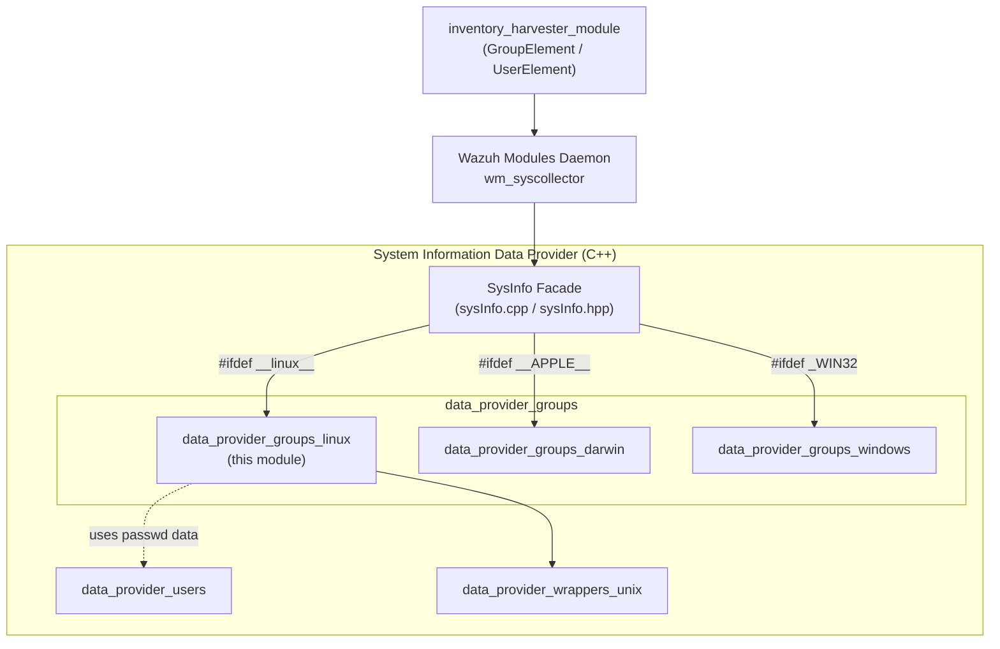
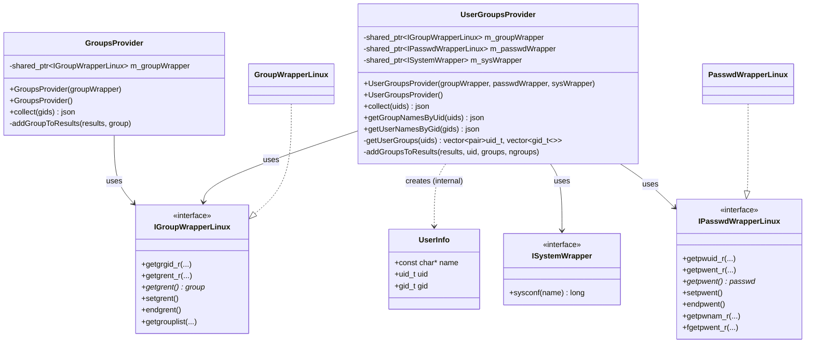
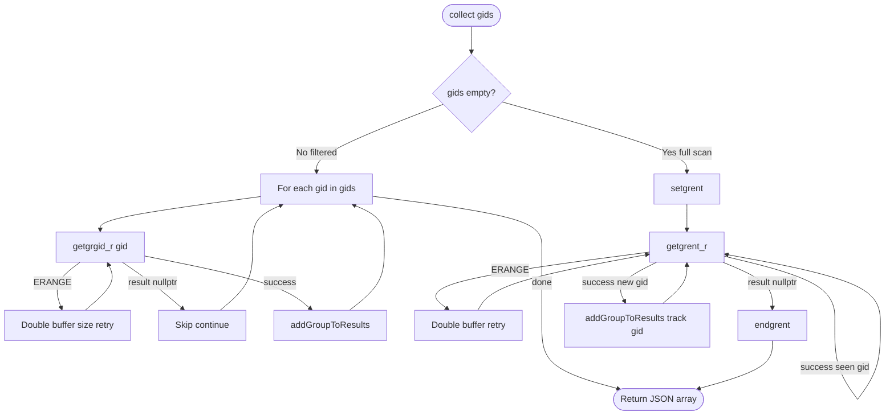
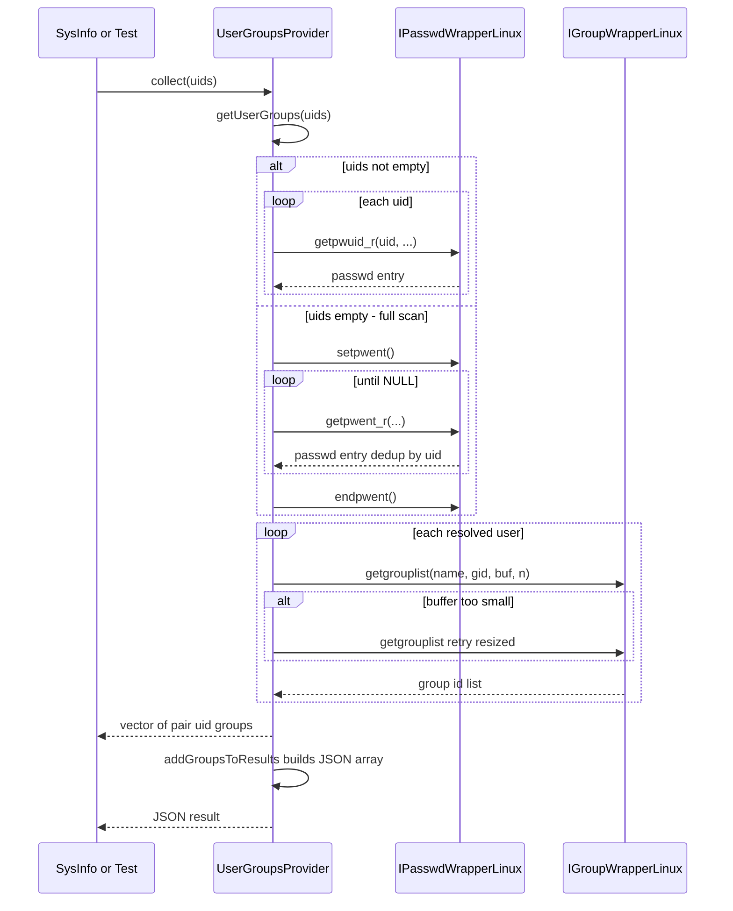
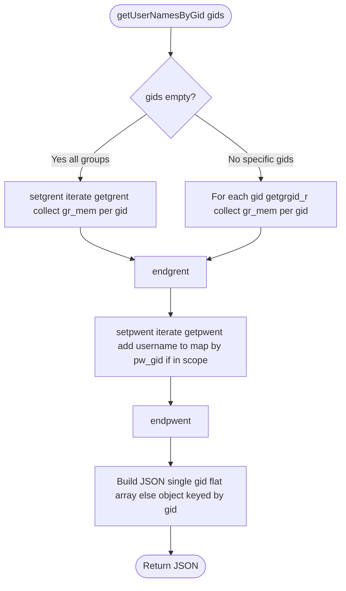

# Data Provider – Linux Groups Module (`data_provider_groups_linux`)

## Introduction

The **`data_provider_groups_linux`** module is the Linux-specific implementation of the
system-inventory "groups" data source used by the Wazuh **System Information Data Provider**
(`sysinfo` library, see [System_Information_Data_Provider_(C++)](System_Information_Data_Provider_(C++).md)).
It is responsible for reading local Unix group/user account information from the
operating system (`/etc/group`, `/etc/passwd` and the associated `libc` NSS APIs) and
exposing it as normalized JSON documents that are later consumed by:

- The **Syscollector** module (`sysinfo_groups()` in `sysInfo.cpp`) that ships inventory
  snapshots of hosts to the manager.
- The **Inventory Harvester** (`GroupElement`, `UserElement`) that indexes this data into
  the Wazuh Indexer.

This module has two focused responsibilities:

1. **`GroupsProvider`** – Enumerate operating-system groups (`/etc/group`), optionally
   filtered by a set of GIDs, and return group metadata (name, GID, signed GID).
2. **`UserGroupsProvider`** – Resolve the *many-to-many* relationship between users and
   groups: which groups a user belongs to (`getgrouplist`), which group names correspond
   to a UID, and which usernames belong to a given GID.

Both classes are thin, testable wrappers around glibc's reentrant NSS group/passwd
functions (`getgrgid_r`, `getgrent_r`, `getgrouplist`, `getpwuid_r`, `getpwent_r`, etc.),
isolated behind interfaces (`IGroupWrapperLinux`, `IPasswdWrapperLinux`, `ISystemWrapper`)
to allow dependency injection and unit testing without touching the real system databases.

---

## 1. Module Position in the System

`data_provider_groups_linux` is a **platform-specific leaf** inside the broader
`data_provider_groups` family, which itself is part of the
[System_Information_Data_Provider_(C++)](System_Information_Data_Provider_(C++).md) module.
Sibling platform implementations exist for Darwin and Windows
(`data_provider_groups_darwin`, `data_provider_groups_windows`), all exposing an
analogous `GroupsProvider` / `UserGroupsProvider` API so that upper layers can remain
platform-agnostic.



For details on the broader C++ inventory pipeline and the wazuh_modules daemon that
schedules syscollector scans, see:
- [System_Information_Data_Provider_(C++)](System_Information_Data_Provider_(C++).md)
- [Advanced_Security_Modules_(C++_Inventory_&_Vulnerability)](Advanced_Security_Modules_(C++_Inventory_&_Vulnerability).md) (`inventory_harvester_module`)
- [Wazuh_Modules_Daemon_(C)](Wazuh_Modules_Daemon_(C).md) (`wm_syscollector.c`)

---

## 2. Component Overview

| File | Component | Responsibility |
|---|---|---|
| `groups_linux.hpp` / `groups_linux.cpp` | `GroupsProvider` | Enumerate OS groups (optionally filtered by GID set) and serialize to JSON |
| `user_groups_linux.hpp` / `user_groups_linux.cpp` | `UserGroupsProvider` | Resolve user↔group membership; provide UID→group-names and GID→usernames lookups |
| `user_groups_linux.hpp` | `UserInfo` (private struct) | Lightweight holder for `{name, uid, gid}` used while iterating `/etc/passwd` |

Both providers depend on abstraction interfaces defined in the shared
`data_provider_wrappers_unix` sub-module (see
[System_Information_Data_Provider_(C++)](System_Information_Data_Provider_(C++).md) →
`data_provider_wrappers_unix`):

- `IGroupWrapperLinux` — abstracts `getgrgid_r`, `getgrent_r`, `getgrent`, `setgrent`,
  `endgrent`, `getgrouplist`.
- `IPasswdWrapperLinux` — abstracts `getpwuid_r`, `getpwent_r`, `getpwent`, `setpwent`,
  `endpwent`, `getpwnam_r`, `fgetpwent_r`.
- `ISystemWrapper` — abstracts `sysconf()` calls (e.g. `_SC_GETPW_R_SIZE_MAX`,
  `_SC_GETGR_R_SIZE_MAX`) used to size reentrant-call buffers.

The concrete production implementations of these interfaces are
`GroupWrapperLinux` and `PasswdWrapperLinux` (in
`wrappers/unix/linux/group_wrapper.hpp` and `passwd_wrapper.hpp`), which simply forward
to the corresponding glibc functions. This indirection lets unit tests substitute mock
wrappers (see `Unit_Tests_-_...` families for the pattern used across the codebase).



---

## 3. `GroupsProvider` — Group Enumeration

### Purpose
Return a JSON array describing OS groups, either:
- **Filtered**: for a specific `std::set<gid_t>` (fast path using `getgrgid_r` per GID), or
- **Full scan**: iterating the entire group database with `setgrent`/`getgrent_r`/`endgrent`,
  de-duplicating GIDs already seen.

### Output shape
```json
[
  { "groupname": "sudo", "gid": 27, "gid_signed": 27 },
  { "groupname": "docker", "gid": 999, "gid_signed": 999 }
]
```

### Process Flow



### Key implementation notes
- Uses a growable heap buffer (`MAX_GETPW_R_BUF_SIZE` initial guess = 16 KB) and retries
  on `ERANGE` from the reentrant glibc calls — a common pattern for NSS lookups whose
  required buffer size cannot be known in advance.
- The full-scan path explicitly tracks visited GIDs in a `std::set<long>` to avoid
  duplicate entries (NSS group sources — files, LDAP, etc. — can otherwise yield repeats).
- `gid_signed` is emitted alongside `gid` because some GIDs (e.g., from NIS/AD/LDAP-backed
  group backends) may need a signed 32-bit representation downstream for consistency with
  other platforms (Windows SIDs, Solaris) — mirrored by sibling modules
  `data_provider_groups_darwin` / `data_provider_groups_windows`.

---

## 4. `UserGroupsProvider` — User/Group Membership Resolution

### Purpose
Provide three complementary views of the user↔group relationship graph:

1. **`collect(uids)`** — full membership rows: one JSON object per `(uid, gid)` pair,
   representing every group a user belongs to (primary + supplementary via
   `getgrouplist`).
2. **`getGroupNamesByUid(uids)`** — for each UID, the list of *group names* (not just
   GIDs) the user belongs to. Returns a flat array if a single UID is requested, or an
   object keyed by UID string otherwise.
3. **`getUserNamesByGid(gids)`** — the inverse mapping: for each GID, the set of
   *usernames* whose primary or supplementary group membership includes that GID.
   Iterates `/etc/group` member lists (`gr_mem`) plus `/etc/passwd` primary-GID entries,
   merging both into a de-duplicated `std::set<std::string>` per GID.

### Output shapes

`collect()`:
```json
[
  { "uid": 1000, "gid": 1000 },
  { "uid": 1000, "gid": 27   },
  { "uid": 1000, "gid": 999  }
]
```

`getGroupNamesByUid({1000})` (single UID → flat array):
```json
["users", "sudo", "docker"]
```

`getUserNamesByGid({})` (all groups → object keyed by GID):
```json
{
  "27":  ["alice", "bob"],
  "999": ["alice"]
}
```

### Internal helper: `getUserGroups`
This private method is the workhorse shared by `collect()` and `getGroupNamesByUid()`.
It iterates `/etc/passwd` (either a single UID via `getpwuid_r`, or the whole database
via `setpwent`/`getpwent_r`/`endpwent` with UID de-duplication), and for each user calls
`getgrouplist()` to obtain **all** groups (primary + supplementary), growing the
`groups` buffer if the initial guess (`EXPECTED_GROUPS_MAX = 64`) is insufficient.



### `getUserNamesByGid` data-merge flow



This two-source merge (group member lists **and** passwd primary-GID) ensures that a
user is reported under a GID even if they only belong to it as their *primary* group
(which is often absent from `/etc/group`'s member list).

---

## 5. Dependency & Buffer-Sizing Details

- Both providers use **reentrant** glibc calls (`_r` suffix) instead of the classic
  non-reentrant `getgrent()`/`getpwent()` where safe concurrent use is required; however,
  `GroupsProvider` and `getUserNamesByGid` also use the plain `getgrent()`/`getpwent()`
  in specific enumeration loops where global iterator state is acceptable (single-threaded
  collection calls).
- Buffer sizes are derived from `sysconf(_SC_GETPW_R_SIZE_MAX)` /
  `_SC_GETGR_R_SIZE_MAX` via the injected `ISystemWrapper`, capped at
  `MAX_GETPW_R_BUF_SIZE` (16 KB) to bound worst-case allocations, with graceful growth
  (`ERANGE` retry loop) in `GroupsProvider`.
- `EXPECTED_GROUPS_MAX` (64) is the initial guess for `getgrouplist()`'s output array;
  if a user belongs to more groups, the call fails, returns the required count via
  `nGroups`, and the code resizes and retries — the standard idiom for this POSIX API.

---

## 6. Relationship to Other Modules

| Related Module | Relationship |
|---|---|
| [System_Information_Data_Provider_(C++)](System_Information_Data_Provider_(C++).md) | Parent module; `SysInfo::groups()` / `sysinfo_groups()` invoke `GroupsProvider` per-platform |
| `data_provider_groups_darwin`, `data_provider_groups_windows` (siblings, documented within [System_Information_Data_Provider_(C++)](System_Information_Data_Provider_(C++).md)) | Equivalent providers for other OSes with the same public API shape |
| `data_provider_users` (documented within [System_Information_Data_Provider_(C++)](System_Information_Data_Provider_(C++).md)) | Parallel provider family for standalone user records (`UsersProvider`, `ShadowProvider`, `LoggedInUsersProvider`) that complements group data |
| `data_provider_wrappers_unix` (documented within [System_Information_Data_Provider_(C++)](System_Information_Data_Provider_(C++).md)) | Supplies `IGroupWrapperLinux`, `IPasswdWrapperLinux`, `ISystemWrapper`, and their concrete Linux implementations consumed here |
| [Advanced_Security_Modules_(C++_Inventory_&_Vulnerability)](Advanced_Security_Modules_(C++_Inventory_&_Vulnerability).md) → `inventory_harvester_module` (`GroupElement`, `UserElement`) | Downstream consumer that indexes group/user JSON into the Wazuh Indexer |
| [Wazuh_Modules_Daemon_(C)](Wazuh_Modules_Daemon_(C).md) → `wm_syscollector.c` | Schedules periodic syscollector scans that ultimately call into this provider through `sysInfo.cpp` |
| [API_&_Management_Framework_(Python)](API_&_Management_Framework_(Python).md) → `syscollector_module` | Exposes collected group/user inventory over the REST API (`get_group_info`, `get_user_info` endpoints) |

---

## 7. Testing Considerations

Because `GroupsProvider` and `UserGroupsProvider` accept injected wrapper interfaces via
their non-default constructors, unit tests can supply mock implementations of
`IGroupWrapperLinux` / `IPasswdWrapperLinux` / `ISystemWrapper` to:
- Simulate `ERANGE` buffer-growth scenarios.
- Simulate large group-membership lists exceeding `EXPECTED_GROUPS_MAX`.
- Simulate empty/absent NSS entries without requiring a real multi-user Linux system.

This pattern is consistent with the broader Wazuh testing strategy documented in
[Unit_Tests_-_Syscheck_FIM](Unit_Tests_-_Syscheck_FIM.md) and other `Unit_Tests_-_*`
modules, which rely heavily on dependency-injected wrappers plus `cmocka`-style mocking
for deterministic, platform-independent test execution.
