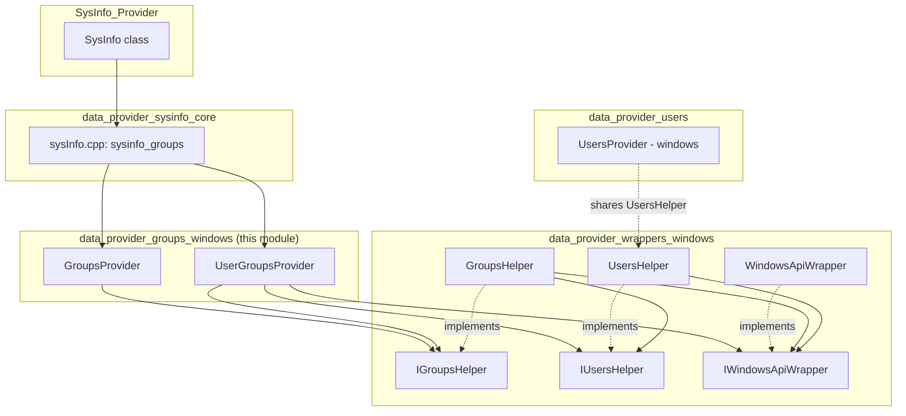
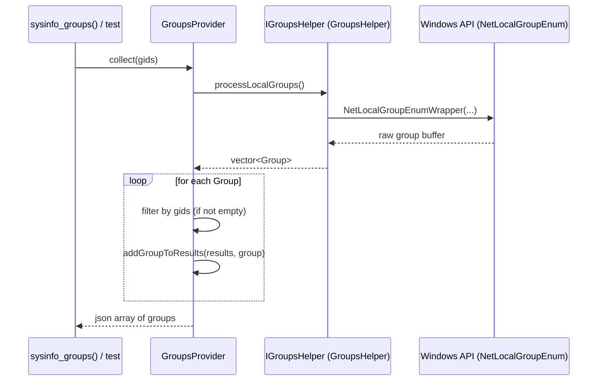
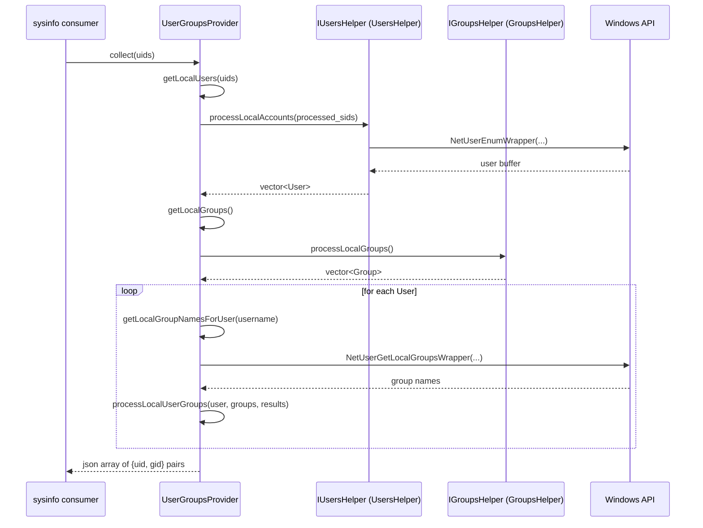
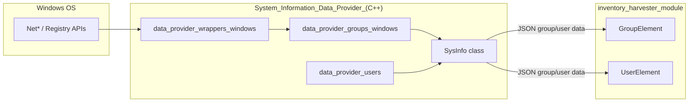

# Data Provider – Groups (Windows)

## Introduction

The **`data_provider_groups_windows`** module implements the Windows-specific
logic used by the Wazuh System Information Data Provider (`SysInfo`) to
enumerate local **groups** and the **user ↔ group** relationships that exist
on a Windows host. It is the Windows counterpart of the equivalent
[`data_provider_groups_linux`](data_provider_groups_linux.md) and
[`data_provider_groups_darwin`](data_provider_groups_darwin.md) modules, and
together with [`data_provider_users`](data_provider_users.md) it feeds group
and user inventory data into the broader
[`System_Information_Data_Provider_(C++)`](System_Information_Data_Provider_(C++).md)
subsystem (in particular `sysinfo_groups()` in `sysInfo.cpp`), which in turn
is consumed by the [Inventory Harvester](inventory_harvester_module.md) to
populate the group/user indices.

The module is intentionally small and focused: it exposes two public
provider classes, `GroupsProvider` and `UserGroupsProvider`, both of which
depend on injectable Windows API/helper abstractions so that they can be unit
tested without a real Windows environment.

## Purpose & Core Functionality

| Component | Responsibility |
|---|---|
| `GroupsProvider` | Enumerates all local Windows groups (via `NetLocalGroupEnum`) and returns them as a JSON array, optionally filtered by a set of GIDs. |
| `UserGroupsProvider` | Enumerates local Windows users and, for each user, resolves the local groups the user belongs to, producing `{uid, gid}` pair records. It also exposes convenience lookups: group names by UID, and usernames by GID. |

Both classes delegate all actual Windows API calls to wrapper interfaces
(`IWindowsApiWrapper`, `IGroupsHelper`, `IUsersHelper`) defined in
[`data_provider_wrappers_windows`](data_provider_wrappers_windows.md). This
separation allows:

* **Testability** – wrappers can be mocked in unit tests.
* **Reusability** – `GroupsHelper` and `UsersHelper` encapsulate the raw
  Win32 calls (`NetUserEnum`, `NetLocalGroupEnum`, `NetUserGetLocalGroups`,
  registry access for roaming profiles, SID conversion, etc.) and are shared
  by both providers.

## Architecture

### Class Diagram

```mermaid
classDiagram
    class GroupsProvider {
        -shared_ptr~IGroupsHelper~ m_groupsHelper
        +GroupsProvider(groupsHelper)
        +GroupsProvider()
        +collect(gids) json
        -addGroupToResults(results, group) void
    }

    class UserGroupsProvider {
        -shared_ptr~IWindowsApiWrapper~ m_winapiWrapper
        -shared_ptr~IUsersHelper~ m_usersHelper
        -shared_ptr~IGroupsHelper~ m_groupsHelper
        +UserGroupsProvider(winapiWrapper, usersHelper, groupsHelper)
        +UserGroupsProvider()
        +collect(uids) json
        +getGroupNamesByUid(uids) json
        +getUserNamesByGid(gids) json
        -processLocalUserGroups(user, groups, results) void
        -getLocalUsers(uids) vector~User~
        -getLocalGroups() vector~Group~
        -getLocalGroupNamesForUser(username) vector~string~
    }

    class IGroupsHelper {
        <<interface>>
        +processLocalGroups() vector~Group~
    }

    class GroupsHelper {
        -shared_ptr~IWindowsApiWrapper~ m_winapiWrapper
        -shared_ptr~IUsersHelper~ m_usersHelper
        +processLocalGroups() vector~Group~
    }

    class IUsersHelper {
        <<interface>>
        +getUserShell(sid) string
        +processLocalAccounts(processed_sids) vector~User~
        +processRoamingProfiles(processed_sids) vector~User~
    }

    class UsersHelper {
        -shared_ptr~IWindowsApiWrapper~ m_winapiWrapper
        +getUserShell(sid) string
        +processLocalAccounts(processed_sids) vector~User~
        +processRoamingProfiles(processed_sids) vector~User~
        +getSidFromAccountName(name) unique_ptr~BYTE[]~
        +psidToString(sid) string
        +getRidFromSid(sid) DWORD
    }

    class IWindowsApiWrapper {
        <<interface>>
        +NetUserEnumWrapper(...) DWORD
        +NetLocalGroupEnumWrapper(...) DWORD
        +NetUserGetInfoWrapper(...) DWORD
        +NetUserGetLocalGroupsWrapper(...) DWORD
        +RegOpenKeyExWWrapper(...) DWORD
        +LookupAccountSidWWrapper(...) BOOL
        +LookupAccountNameWWrapper(...) bool
    }

    class WindowsApiWrapper {
        +NetUserEnumWrapper(...) DWORD
        +NetLocalGroupEnumWrapper(...) DWORD
        +NetUserGetInfoWrapper(...) DWORD
        +NetUserGetLocalGroupsWrapper(...) DWORD
        +RegOpenKeyExWWrapper(...) DWORD
        +LookupAccountSidWWrapper(...) BOOL
        +LookupAccountNameWWrapper(...) bool
    }

    class Group {
        +uint32_t generation
        +uint32_t gid
        +string sid
        +string groupname
        +string comment
    }

    class User {
        +uint32_t generation
        +uint32_t uid
        +uint32_t gid
        +string sid
        +string username
        +string description
        +string type
        +string directory
    }

    GroupsProvider --> IGroupsHelper : uses
    UserGroupsProvider --> IWindowsApiWrapper : uses
    UserGroupsProvider --> IUsersHelper : uses
    UserGroupsProvider --> IGroupsHelper : uses
    GroupsHelper ..|> IGroupsHelper
    UsersHelper ..|> IUsersHelper
    WindowsApiWrapper ..|> IWindowsApiWrapper
    GroupsHelper --> IWindowsApiWrapper : uses
    GroupsHelper --> IUsersHelper : uses
    UsersHelper --> IWindowsApiWrapper : uses
    GroupsHelper ..> Group : produces
    UsersHelper ..> User : produces
```

### Module Dependency Diagram

## Data Flow

### `GroupsProvider::collect()` Sequence

### `UserGroupsProvider::collect()` Sequence

## Component Details

### `GroupsProvider`
Located in `src/data_provider/src/extended_sources/groups/include/groups_windows.hpp`.

* **Constructors**:
  * `GroupsProvider(std::shared_ptr<IGroupsHelper> groupsHelper)` – allows
    dependency injection (used in unit tests with mocked helpers).
  * `GroupsProvider()` – default constructor that instantiates a concrete
    `GroupsHelper` (with its own default `WindowsApiWrapper` / `UsersHelper`).
* **`collect(gids)`** – Calls `m_groupsHelper->processLocalGroups()` to get
  all `Group` structures, then builds a JSON array, filtering by the
  optional `gids` set. Delegates per-item serialization to the private
  `addGroupToResults` helper.

### `UserGroupsProvider`
Located in `src/data_provider/src/extended_sources/groups/include/user_groups_windows.hpp`.

* **Constructors**: analogous DI pattern as `GroupsProvider`, but requiring
  three collaborators: `IWindowsApiWrapper`, `IUsersHelper`, `IGroupsHelper`.
* **`collect(uids)`** – Produces the full list of `{uid, gid}` associations
  for local users, optionally restricted to the provided `uids`. Internally:
  1. Retrieves local users (`getLocalUsers`).
  2. Retrieves local groups (`getLocalGroups`).
  3. For each user, resolves the group names the user belongs to
     (`getLocalGroupNamesForUser`, backed by `NetUserGetLocalGroups`) and
     matches them against known groups to emit UID/GID pairs
     (`processLocalUserGroups`).
* **`getGroupNamesByUid(uids)`** – Convenience lookup returning, for each
  requested UID, the list of group names the user belongs to (single UID →
  flat array; multiple UIDs → object keyed by UID).
* **`getUserNamesByGid(gids)`** – Inverse lookup: for each requested GID,
  returns the usernames of members of that group.

## Dependencies

This module relies exclusively on the interfaces and concrete
implementations from
[`data_provider_wrappers_windows`](data_provider_wrappers_windows.md):

| Dependency | Role |
|---|---|
| `IGroupsHelper` / `GroupsHelper` | Enumerates local groups via `NetLocalGroupEnum` and builds `Group` structures (SID, GID, name, comment). |
| `IUsersHelper` / `UsersHelper` | Enumerates local user accounts (`NetUserEnum`) and roaming profiles (registry-based), builds `User` structures, and provides SID⇄name/RID conversion helpers. |
| `IWindowsApiWrapper` / `WindowsApiWrapper` | Thin wrapper around raw Win32 API calls (`NetUserEnum`, `NetLocalGroupEnum`, `NetUserGetLocalGroups`, registry functions, SID conversion functions) enabling mocking in tests. |
| `Group` / `User` (POD structs) | Data-transfer structures shared between the helpers and the providers. |

The module does **not** depend on the Linux (`data_provider_groups_linux`)
or Darwin (`data_provider_groups_darwin`) group providers; each platform has
an independent implementation, all exposing a similar `collect()`-based API
consumed uniformly by
[`data_provider_sysinfo_core`](data_provider_sysinfo_core.md) (`sysInfo.cpp`,
function `sysinfo_groups`) through platform-specific compilation.

## Integration in the Larger System

The JSON produced by `GroupsProvider` and `UserGroupsProvider` ultimately
flows into `sysinfo_groups()` in
[`data_provider_sysinfo_core`](data_provider_sysinfo_core.md), which is
exposed through the `SysInfo` public API
([`SysInfo_Provider`](SysInfo_Provider.md)). Downstream, the
[Wazuh Modules Daemon](Wazuh_Modules_Daemon_(C).md) syscollector module
(`wm_syscollector.c`) and the
[`inventory_harvester_module`](inventory_harvester_module.md)
(`GroupElement`, `UserElement`) consume this data to populate the group and
user inventory indices used by the Wazuh indexer.

## Related Documentation

* [`data_provider_groups_linux.md`](data_provider_groups_linux.md) – Linux equivalent implementation.
* [`data_provider_groups_darwin.md`](data_provider_groups_darwin.md) – macOS/Darwin equivalent implementation.
* [`data_provider_users.md`](data_provider_users.md) – User inventory providers across platforms.
* [`data_provider_wrappers_windows.md`](data_provider_wrappers_windows.md) – Windows API wrapper abstractions used by this module.
* [`data_provider_sysinfo_core.md`](data_provider_sysinfo_core.md) – Core `SysInfo` implementation that aggregates all providers (`sysinfo_groups`, `sysinfo_users`, etc.).
* [`SysInfo_Provider.md`](SysInfo_Provider.md) – Public `SysInfo` interface consumed by callers.
* [`inventory_harvester_module.md`](inventory_harvester_module.md) – Consumer of group/user inventory data for indexing.
* [`Wazuh_Modules_Daemon_(C).md`](Wazuh_Modules_Daemon_(C).md) – Hosts the syscollector wazuh module that triggers data collection.
