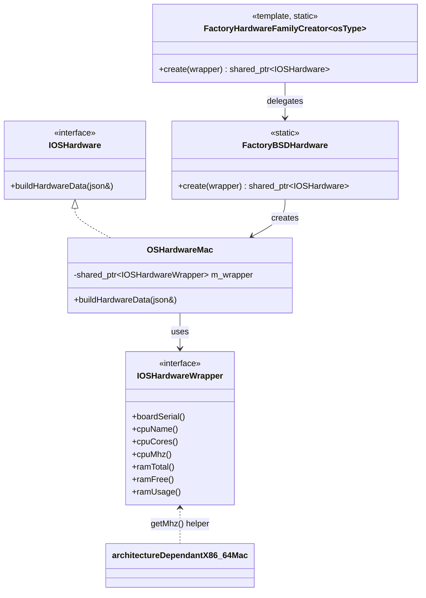
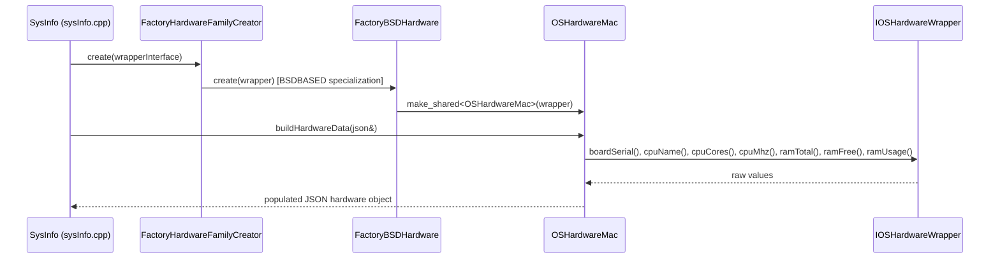

# Data Provider – Hardware Module

## 1. Purpose

The **`data_provider_hardware`** module is a small, focused C++ component of the [System Information Data Provider](System_Information_Data_Provider_(C++).md) subsystem. Its sole responsibility is to **abstract and retrieve host hardware inventory information** — such as board serial number, CPU model/cores/speed, and RAM totals/usage — through a platform-agnostic interface that hides OS-specific implementation details from the rest of the data provider library.

This module follows the **Abstract Factory** design pattern (mirroring the sibling `data_provider_network`, `data_provider_packages`, and `data_provider_osinfo` modules) so that the platform-specific hardware collector can be selected transparently at compile/run time based on the detected `OSPlatformType`.

## 2. Architecture Overview

The module is composed of three files with three collaborating concerns:

1. **Factory Selector** (`factoryHardwareFamilyCreator.h`) — a templated factory that dispatches, based on `OSPlatformType`, to the concrete platform family creator (currently only `BSDBASED`, which covers macOS).
2. **Platform Implementation** (`hardwareImplMac.h`) — contains both the concrete `OSHardwareMac` collector class (implementing the `IOSHardware` interface) and its own nested factory (`FactoryBSDHardware`) that instantiates it.
3. **Low-Level Helper** (`architectureDependantX86_64Mac.cpp`) — a small utility function (`getMhz`) that reads the raw CPU frequency from the OS via a wrapper primitive, used internally by the Mac hardware collector.

### Data Flow

## 3. Core Components

### 3.1 `FactoryHardwareFamilyCreator<osType>` (`factoryHardwareFamilyCreator.h`)

A C++ template class specialized per `OSPlatformType`. The generic (unspecialized) template throws a `std::runtime_error` ("Error creating network data retriever" — note: the error message is a residual copy-paste from the network module's factory), signaling that no hardware collector exists for that platform. The `BSDBASED` specialization delegates directly to `FactoryBSDHardware::create(...)`.

This is the single entry point used by the higher-level `SysInfo` class (see [`sysinfo_core`](data_provider_sysinfo_core.md)) to obtain a platform-appropriate `IOSHardware` instance without needing to know which concrete class implements it.

### 3.2 `OSHardwareMac` / `FactoryBSDHardware` (`hardwareImplMac.h`)

- **`OSHardwareMac`** implements the `IOSHardware` interface (defined outside this module, in the shared `hardwareInterface.h`). It holds a `shared_ptr<IOSHardwareWrapper>` and, in `buildHardwareData(nlohmann::json&)`, populates the output JSON with:
  - `serial_number` — board serial
  - `cpu_name`, `cpu_cores`, `cpu_speed`
  - `memory_total`, `memory_free`, `memory_used`

  All actual OS calls are delegated to the injected `IOSHardwareWrapper`, keeping `OSHardwareMac` itself free of direct system-call dependencies (facilitating unit testing via mock wrappers).

- **`FactoryBSDHardware`** is a tiny static factory (`create(wrapper)`) that simply returns `std::make_shared<OSHardwareMac>(wrapper)`. It is the target of the `BSDBASED` specialization in `FactoryHardwareFamilyCreator`.

### 3.3 `getMhz` (`architectureDependantX86_64Mac.cpp`)

A free function used by the Mac hardware wrapper implementation (`hardwareWrapperImplMac.h`, outside this module's core component list) to read the CPU frequency via `sysctlbyname("hw.cpufrequency", ...)` on x86_64 Mac systems, converting the raw Hz value to MHz. It throws a `std::system_error` if the `sysctlbyname` call fails. This isolates architecture-specific quirks (x86_64 vs. Apple Silicon read differently) from the rest of the hardware collection logic.

## 4. Extensibility

Adding support for a new OS family (e.g., Linux, Windows, Solaris) follows the same pattern used across the sibling `data_provider_*` modules:

1. Implement a concrete `IOSHardware` class (e.g., `OSHardwareLinux`) plus its own `IOSHardwareWrapper` implementation.
2. Add a `FactoryXxxHardware` static factory class.
3. Add a new specialization of `FactoryHardwareFamilyCreator<osType>` for the new `OSPlatformType`.

No changes are required to calling code, since consumers always go through `FactoryHardwareFamilyCreator<osType>::create(...)`.

## 5. Relationship to Other Modules

| Module | Relationship |
|---|---|
| [`data_provider_sysinfo_core`](data_provider_sysinfo_core.md) | Hosts the `SysInfo` facade class and the C API (`sysinfo_hardware`, etc.) that invokes this module's factory to populate the `hardware` field of the overall system info JSON payload. |
| [`data_provider_network`](data_provider_network.md), [`data_provider_packages`](data_provider_packages.md), [`data_provider_osinfo`](data_provider_osinfo.md) | Sibling modules following the identical Abstract Factory + platform-wrapper pattern for other inventory categories (network interfaces, packages, OS info respectively). |
| [`data_provider_wrappers_unix_darwin`](data_provider_wrappers_unix_darwin.md) / Windows wrapper modules | Supply the lower-level OS primitive wrappers (`IOSHardwareWrapper` implementations) that `OSHardwareMac` depends on. |
| [`Wazuh_Modules_Daemon_(C)`](Wazuh_Modules_Daemon_(C).md) — specifically `wm_syscollector.c` | The Syscollector wazuh module invokes the `sysinfo_hardware` C API (built on top of this module) to collect and forward hardware inventory events. |
| [`inventory_harvester_module`](inventory_harvester_module.md) | Consumes hardware inventory data (via `HwElement`/`InventoryHardwareHarvester`) that ultimately originates from this collection pipeline. |

## 6. Summary

`data_provider_hardware` is a minimal, single-purpose module implementing the platform-selection and macOS-specific hardware collection logic within Wazuh's cross-platform System Information Data Provider. It exemplifies the codebase's consistent use of the Abstract Factory pattern to decouple platform detection from data collection logic, enabling straightforward extension to additional operating systems.
