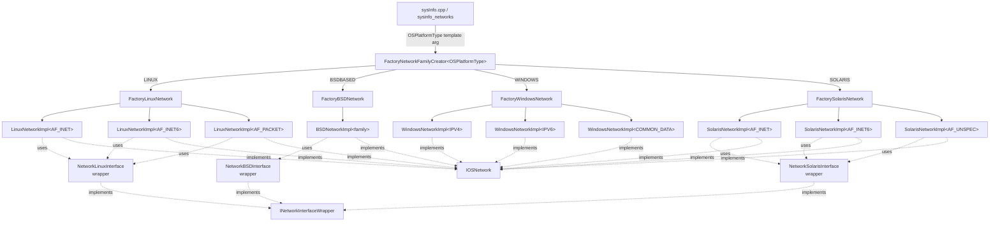
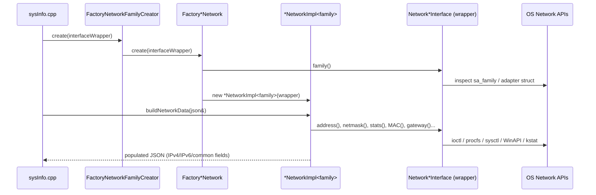

# Data Provider Network Module

## 1. Purpose

The `data_provider_network` module is the **network interface introspection layer** of Wazuh's cross-platform `SysInfo` data provider (part of the broader [System_Information_Data_Provider_(C++)](System_Information_Data_Provider_(C++).md) subsystem — see [data_provider_sysinfo_core](data_provider_sysinfo_core.md) for the component that consumes this module).

Its single responsibility is: **given a raw, OS-native network interface handle (`ifaddrs`, `lifreq`, Windows adapter struct, etc.), produce a normalized JSON representation** of that interface's addressing, statistics, and metadata, regardless of which operating system Wazuh is running on.

This normalized JSON is consumed by `sysinfo_networks()` (in `sysInfo.cpp`) and ultimately surfaces as the `network` inventory data harvested by Wazuh agents (feeding modules such as `syscollector` and `inventory_harvester`).

## 2. Architecture Overview

The module follows the **Abstract Factory + Strategy** design pattern combined with **template specialization**:

1. A platform-agnostic wrapper interface (`INetworkInterfaceWrapper`, declared outside this module but implemented within it) exposes uniform getters (`address()`, `netmask()`, `gateway()`, `stats()`, `MAC()`, etc.) over the OS-native interface structure.
2. A platform-agnostic data model interface (`IOSNetwork`) exposes a single method, `buildNetworkData(nlohmann::json&)`, that fills in a JSON object using the wrapper.
3. For each supported platform, a `Factory*Network` class inspects the address family of the wrapper (`AF_INET`, `AF_INET6`, `AF_PACKET`/`AF_UNSPEC`, etc.) and instantiates the correct **template specialization** of the platform's `*NetworkImpl<family>` class, each of which knows how to serialize that specific family's fields into JSON.
4. A top-level meta-factory, `FactoryNetworkFamilyCreator<OSPlatformType>`, dispatches to the correct platform factory based on a compile-time `OSPlatformType` template parameter (`LINUX`, `BSDBASED`, `WINDOWS`, `SOLARIS`), allowing the calling code (`sysInfo.cpp`, per-OS `.cpp` files) to remain platform-agnostic at the call site.

All concrete implementations write into a shared `nlohmann::json` object with a common schema (`network_ip`, `network_netmask`, `network_broadcast`, `network_gateway`, `host_mac`, `host_network_egress_*`, `host_network_ingress_*`, `interface_name`, `interface_type`, `interface_state`, `interface_mtu`, etc.), which is what makes the platform abstraction transparent to upstream code.

## 3. Data Flow

## 4. Sub-modules

The module is organized by platform, since each operating system requires a distinct strategy for retrieving low-level network data (procfs on Linux, `ioctl`/`sysctl` on BSD, `lifreq`/`kstat`/CLI tools on Solaris, and native Win32 APIs on Windows), while sharing a common interface contract.

| Sub-module | Description | Documentation |
|---|---|---|
| **Core Interfaces & Factory Dispatch** | Platform-agnostic `IOSNetwork` model, `LinkStats` structure, and the top-level `FactoryNetworkFamilyCreator` that routes to the correct OS-specific factory. | [data_provider_network_core.md](data_provider_network_core.md) |
| **Linux Implementation** | Retrieves IPv4/IPv6/link-layer data from `ifaddrs`, `/proc/net`, `/sys/class/net`, and Debian/RedHat network config files. | [data_provider_network_linux.md](data_provider_network_linux.md) |
| **BSD Implementation** | Retrieves interface data from `ifaddrs` and BSD `sysctl`/routing tables (used by macOS/*BSD family); currently a partial/skeleton specialization set. | [data_provider_network_bsd.md](data_provider_network_bsd.md) |
| **Solaris Implementation** | Uses `lifreq`/`lifconf` ioctls, `kstat`, and CLI tools (`netstat`, `dladm`, `ifconfig`) to gather interface data on Solaris. | [data_provider_network_solaris.md](data_provider_network_solaris.md) |
| **Windows Implementation** | Builds network JSON from Win32/IP Helper adapter structures for IPv4, IPv6, and common adapter data. | [data_provider_network_windows.md](data_provider_network_windows.md) |

## 5. Relationship to Other Modules

* **[data_provider_sysinfo_core](data_provider_sysinfo_core.md)** — `sysInfo.cpp`'s `sysinfo_networks()` is the primary consumer; it iterates OS-native interface lists and calls into this module's factories to build the final `network` JSON array returned to callers.
* **[data_provider_hardware](data_provider_hardware.md)**, **[data_provider_osinfo](data_provider_osinfo.md)**, **[data_provider_packages](data_provider_packages.md)**, **[data_provider_ports](data_provider_ports.md)** — sibling data-family modules under the same `SysInfo` facade, following analogous per-platform factory patterns.
* **[data_provider_wrappers_unix](data_provider_wrappers_unix.md)** / **[data_provider_wrappers_windows](data_provider_wrappers_windows.md)** — lower-level OS API wrappers (not specific to networking) that follow the same wrapper/interface philosophy used here.
* **syscollector_module** (see [Wazuh_Modules_Daemon_(C)](Wazuh_Modules_Daemon_(C).md) and `syscollector_module_native_daemon`) — the `Syscollector` C++ daemon component invokes `SysInfo::networks()` (backed by this module) periodically to detect and report network configuration changes to the manager via `dbsync`/`rsync` ([Shared_Modules_Infrastructure_(C++)](Shared_Modules_Infrastructure_(C++).md)).
* **inventory_harvester_module** (see [Advanced_Security_Modules_(C++_Inventory_&_Vulnerability)](Advanced_Security_Modules_(C++_Inventory_&_Vulnerability).md)) — consumes the network inventory events (indirectly derived from this module's JSON schema) to populate the `InventoryNetworkHarvester`/`NetIface` indexer documents.

## 6. Key Design Notes

* **Template specialization instead of virtual dispatch for family-specific logic**: `LinuxNetworkImpl<AF_INET>`, `<AF_INET6>`, `<AF_PACKET>` (and analogous specializations for other platforms) are distinct compiled types, each overriding `buildNetworkData`. The generic (non-specialized) template body simply `throw`s, guaranteeing a compile-/run-time contract that every family in use has an explicit implementation.
* **`LinkStats`** (defined in `inetworkInterface.h`) is the single shared structure for RX/TX byte, packet, error, and drop counters across all platforms, keeping statistics reporting consistent.
* **Fail-fast construction**: All wrapper constructors (`NetworkLinuxInterface`, `NetworkBSDInterface`, `NetworkSolarisInterface`) throw `std::runtime_error` on a null underlying OS handle, preventing downstream null-pointer dereferences.
* **Address family dispatch is data-driven**: each `Factory*Network::create()` reads `interfaceWrapper->family()` at runtime and switches on OS-specific family constants (`AF_INET`, `AF_INET6`, `AF_PACKET`, `AF_UNSPEC`, or Windows-specific enums like `IPV4`/`IPV6`/`COMMON_DATA`), so a single native interface entry may be visited multiple times (once per family) to accumulate IPv4, IPv6, and common/link-layer data into the same JSON object.
