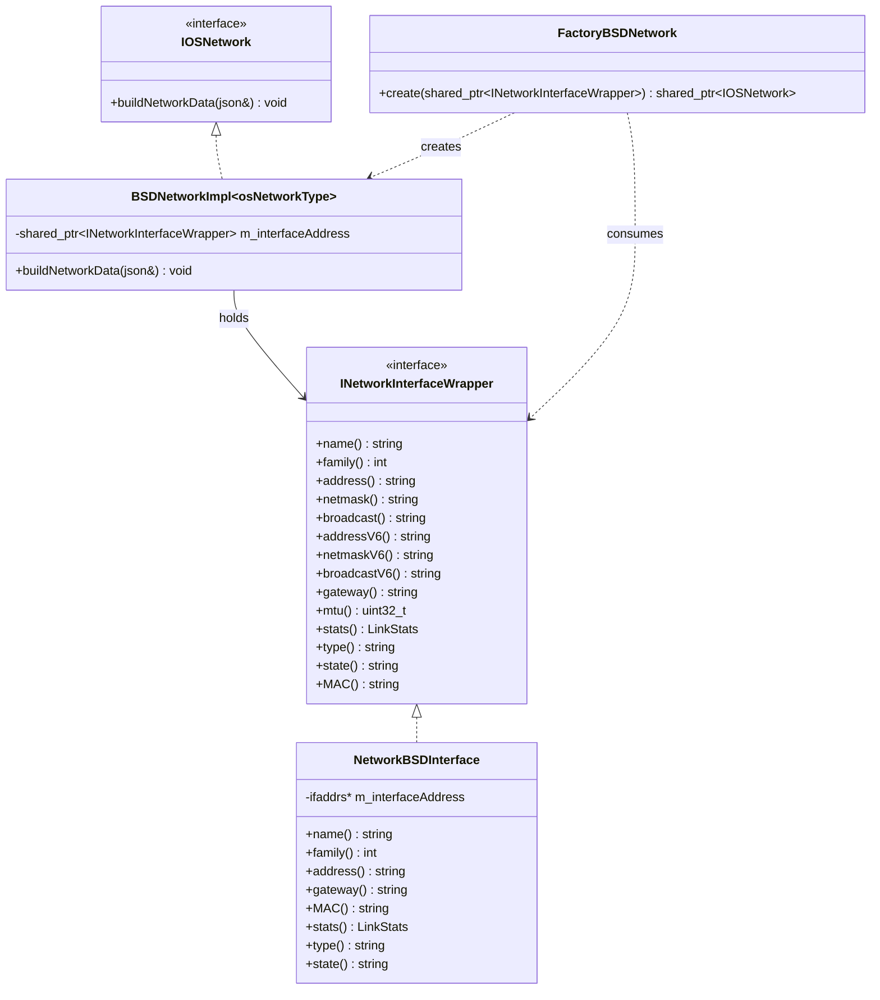
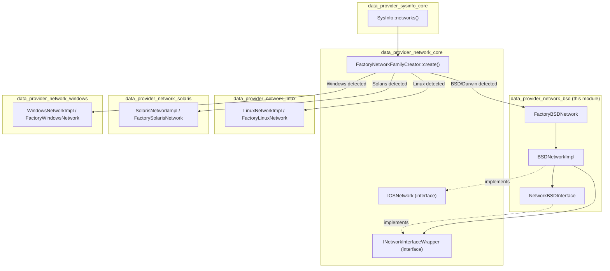
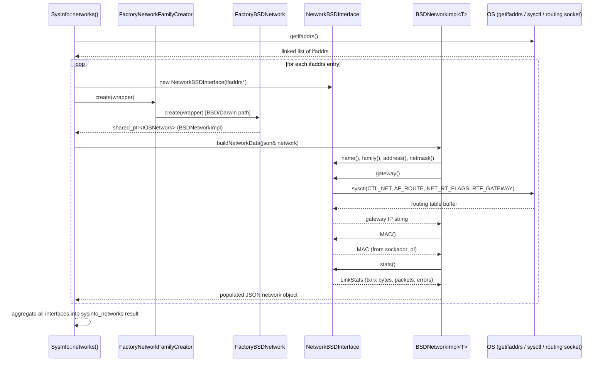
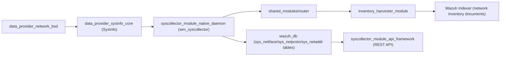

# Data Provider Network BSD Module

## Introduction

The **data_provider_network_bsd** module is a platform-specific implementation unit within Wazuh's `System Information Data Provider` (the C++ component responsible for collecting host inventory data such as hardware, OS, packages, ports, and network information). This module supplies the **BSD-family (FreeBSD, OpenBSD, and macOS/Darwin)** implementation of the network interface data collector, translating raw OS-level network structures (`ifaddrs`, `sockaddr_dl`, routing socket messages) into the normalized JSON network inventory format consumed by the rest of Wazuh (agent inventory sync, Syscollector, and the indexer).

It is one of several OS-specific "backends" behind a common factory/strategy abstraction (`IOSNetwork` / `INetworkInterfaceWrapper`), sibling to the Linux, Solaris, and Windows implementations, all of which are selected dynamically at runtime by [data_provider_network_core](data_provider_network_core.md) via `FactoryNetworkFamilyCreator`.

## Purpose and Scope

This module's sole responsibility is to:

1. **Wrap** BSD-specific network interface data structures (obtained via `getifaddrs()`) behind the common `INetworkInterfaceWrapper` interface.
2. **Extract** interface attributes — IPv4/IPv6 addresses, netmasks, broadcast addresses, MAC address, MTU, link statistics, gateway, interface type, and administrative state — using BSD/Darwin-specific system calls (`sysctl`, routing socket parsing, `sockaddr_dl` link-layer structures).
3. **Populate** a `nlohmann::json` network object with this data through the `IOSNetwork::buildNetworkData()` contract, ready for consumption by [data_provider_sysinfo_core](data_provider_sysinfo_core.md).
4. **Instantiate** the correct templated implementation via a factory (`FactoryBSDNetwork`), mirroring the pattern used by the Linux, Solaris, and Windows equivalents.

Out of scope: this module does not perform the actual `getifaddrs()` enumeration loop (that lives in [data_provider_network_core](data_provider_network_core.md) via `FactoryNetworkFamilyCreator`), nor does it handle OS/package/hardware inventory — those are separate sibling submodules under the parent [System Information Data Provider](data_provider_sysinfo_core.md) family.

## Core Components

| Component | File | Responsibility |
|---|---|---|
| `NetworkBSDInterface` | `networkBSDWrapper.h` | Concrete `INetworkInterfaceWrapper` implementation wrapping a single `ifaddrs*` entry for BSD/Darwin. Extracts address family, IPv4/IPv6 addresses, netmask, broadcast, gateway (via routing socket + `sysctl`), MAC (via `sockaddr_dl`), MTU, link stats, interface type, and up/down state. |
| `sockaddr_dl` (usage) | `networkBSDWrapper.h` | BSD/Darwin link-layer socket address structure used to extract the interface's physical (MAC) address and link type (`sdl_type`). |
| `BSDNetworkImpl<osNetworkType>` | `networkInterfaceBSD.h` | Templated `IOSNetwork` implementation, parameterized by address family (e.g., `AF_INET`/`AF_INET6`), that receives an `INetworkInterfaceWrapper` and builds the JSON output via `buildNetworkData()`. |
| `FactoryBSDNetwork` | `networkInterfaceBSD.h` | Factory that returns the appropriate `BSDNetworkImpl<>` specialization wrapped in a `shared_ptr<IOSNetwork>`, given an `INetworkInterfaceWrapper` instance. |

### Component Relationship Diagram

## Architecture Context

This module sits at the platform-abstraction layer of the network inventory subsystem. The generic factory in the parent module selects between BSD, Linux, Solaris, and Windows implementations based on compile-time/OS detection, so that upstream callers (`sysInfo.cpp`, Syscollector) remain platform-agnostic.

## Data Flow

The typical execution flow when Wazuh collects network inventory on a BSD/Darwin host:

## Key Implementation Details

### `NetworkBSDInterface` (`networkBSDWrapper.h`)

- Constructed from a raw `ifaddrs*` pointer; throws `std::runtime_error` if null.
- **Address extraction**: Uses `Utils::NetworkHelper::IAddressToBinary()` (from [shared_utils](shared_utils.md) / `networkHelper.h`) to convert `sockaddr_in`/`sockaddr_in6` structures into normalized string form for `address()`, `netmask()`, `broadcast()`, and their IPv6 counterparts.
- **Gateway resolution**: Unlike Linux (which reads `/proc/net/route`), BSD has no such procfs entry. This implementation queries the kernel routing table directly via `sysctl` with `{CTL_NET, AF_ROUTE, 0, AF_UNSPEC, NET_RT_FLAGS, RTF_UP | RTF_GATEWAY}`, then walks the returned buffer of `rt_msghdr` records, matching the route's interface index (`sdl_index`) against the current interface's `sockaddr_dl` to find the associated gateway IPv4 address.
- **MAC address**: Extracted from the `sockaddr_dl` link-layer structure (`sdl_data` offset by `sdl_nlen`), formatted as a colon-separated hex string, only when `sdl_alen` matches `MAC_ADDRESS_COUNT_SEGMENTS` (6 bytes).
- **Interface type**: Mapped from `sdl_type` (e.g. `IFT_ETHER`, `IFT_FDDI`, `IFT_PPP`, `IFT_ATM`) via the static lookup table `NETWORK_INTERFACE_TYPE` and `Utils::NetworkHelper::getNetworkTypeStringCode()`.
- **Link statistics**: Populated from the `if_data` structure attached to `ifa_data` (packet/byte counts, errors, drops) into the shared `LinkStats` struct (defined in [data_provider_network_core](data_provider_network_core.md)).
- **State**: Derived from `ifa_flags & IFF_UP`.
- Fields not obtainable on BSD (metrics, DHCP status) return safe defaults (`""`, `"unknown"`).

### `BSDNetworkImpl` / `FactoryBSDNetwork` (`networkInterfaceBSD.h`)

- `BSDNetworkImpl` is a template class parameterized by `osNetworkType` (an address-family discriminator, e.g. distinguishing IPv4 vs IPv6 builders), holding a `shared_ptr<INetworkInterfaceWrapper>`.
- The generic (unspecialized) `buildNetworkData()` throws `std::runtime_error("Non implemented specialization.")` — concrete address-family specializations (implemented in the corresponding `.cpp`, not shown here) perform the actual JSON population using the wrapper's accessor methods.
- `FactoryBSDNetwork::create()` is the single entry point used by the OS-detection factory to obtain a ready-to-use `IOSNetwork` instance for a given interface wrapper, decoupling caller code from the concrete implementation type.

## Design Patterns

- **Strategy / Factory Pattern**: `IOSNetwork` and `INetworkInterfaceWrapper` are abstract interfaces; `FactoryBSDNetwork` (and its Linux/Solaris/Windows counterparts) select and construct the concrete strategy at runtime based on the host OS.
- **Adapter Pattern**: `NetworkBSDInterface` adapts the native, OS-specific `ifaddrs`/`sockaddr_dl` structures to the platform-neutral `INetworkInterfaceWrapper` contract.
- **Template Method**: `BSDNetworkImpl<T>::buildNetworkData()` provides a common structure for populating JSON output, specialized per network family.

## Dependencies

- **[data_provider_network_core](data_provider_network_core.md)** — defines the shared `IOSNetwork`, `INetworkInterfaceWrapper` interfaces, `LinkStats` struct, and the `FactoryNetworkFamilyCreator` that dispatches to this module on BSD/Darwin hosts.
- **[shared_utils](shared_utils.md)** — provides `Utils::NetworkHelper` (IP address conversion, network type string mapping) and `stringHelper.h` utilities used throughout `networkBSDWrapper.h`.
- **[data_provider_sysinfo_core](data_provider_sysinfo_core.md)** — the top-level `SysInfo` class that invokes the network factory as part of full system inventory collection (`sysinfo_networks`).
- Sibling OS backends (mutually exclusive at build time): **[data_provider_network_linux](data_provider_network_linux.md)**, **[data_provider_network_solaris](data_provider_network_solaris.md)**, **[data_provider_network_windows](data_provider_network_windows.md)**.

## How It Fits Into the Overall System

Network inventory data produced by this module flows into the broader Wazuh inventory/vulnerability pipeline:

On agents running FreeBSD, OpenBSD, or macOS, this module is compiled in place of the Linux/Solaris/Windows equivalents to produce the `network` section of the agent's syscollector snapshot, which is subsequently synchronized to `wazuh-db`, exposed through the [syscollector_module_api_framework](syscollector_module_api_framework.md) REST endpoints, and indexed by the [inventory_harvester_module](inventory_harvester_module.md) for search/visualization in the Wazuh indexer.

## Related Documentation

- [data_provider_network_core.md](data_provider_network_core.md) — shared network interfaces and factory dispatch logic
- [data_provider_network_linux.md](data_provider_network_linux.md) — Linux equivalent implementation
- [data_provider_network_solaris.md](data_provider_network_solaris.md) — Solaris equivalent implementation
- [data_provider_network_windows.md](data_provider_network_windows.md) — Windows equivalent implementation
- [data_provider_sysinfo_core.md](data_provider_sysinfo_core.md) — top-level `SysInfo` orchestration and OS-specific `sysInfo*.cpp` entry points
- [shared_utils.md](shared_utils.md) — common C++ helper utilities (network, string, hashing) used across data provider modules
- [syscollector_module_native_daemon.md](syscollector_module_native_daemon.md) — the wazuh-modulesd Syscollector daemon that consumes this inventory data
- [syscollector_module_api_framework.md](syscollector_module_api_framework.md) — API/CLI framework layer exposing network inventory data
- [inventory_harvester_module.md](inventory_harvester_module.md) — consumes and indexes network inventory events downstream
