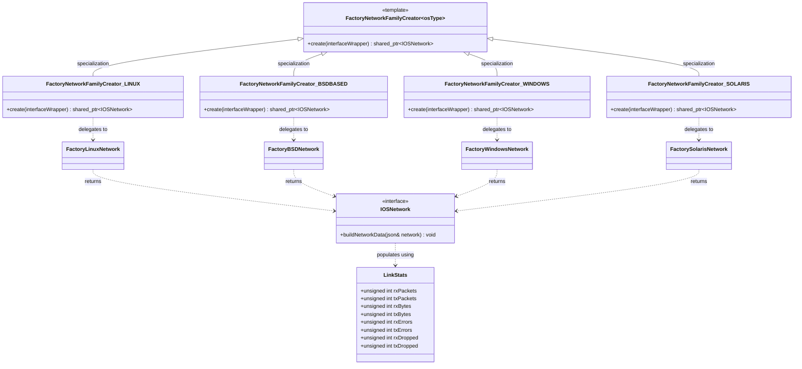
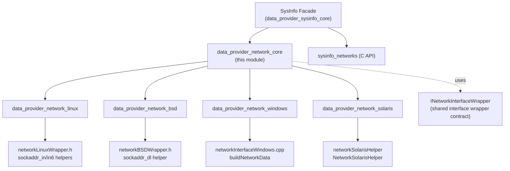
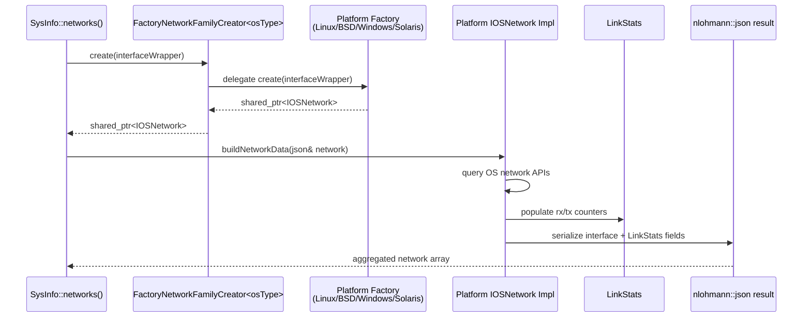
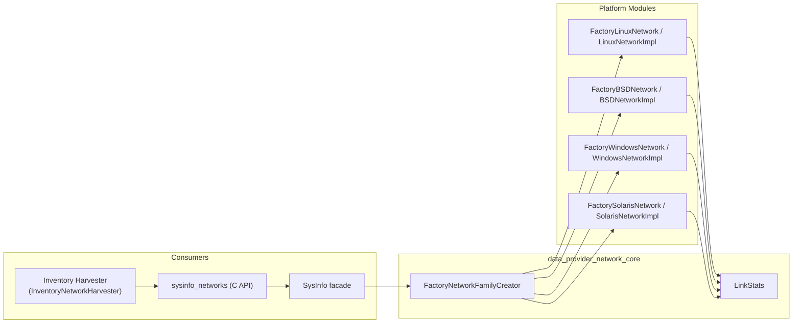

# Data Provider Network Core

## Introduction

`data_provider_network_core` is the platform-agnostic foundation of the Wazuh **network inventory** subsystem inside the **System Information Data Provider (C++)** module. It defines the shared abstractions and the factory dispatch mechanism used to collect network interface information (addresses, statistics, gateways, etc.) across all supported operating systems, without exposing any OS-specific code itself.

This module contains only two header-defined components:

- **`LinkStats`** — a plain data structure that represents interface-level network traffic counters (packets/bytes sent and received, errors, drops).
- **`FactoryNetworkFamilyCreator<osType>`** — a compile-time (template-specialized) factory that resolves to the correct platform implementation of network data retrieval (Linux, BSD, Windows, or Solaris) and returns a common `IOSNetwork` interface pointer.

Because this module holds no platform-specific logic, it acts as the **contract layer** that all platform-specific network sibling modules (`data_provider_network_linux`, `data_provider_network_bsd`, `data_provider_network_solaris`, `data_provider_network_windows`) implement against, and that the higher-level `SysInfo` facade (in [data_provider_sysinfo_core](data_provider_sysinfo_core.md)) depends on to produce unified JSON network inventory output.

---

## Purpose and Core Functionality

The core responsibilities of this module are:

1. **Define a stable data contract** (`LinkStats`) for network interface statistics that is independent of the underlying OS network APIs (e.g., `ioctl`, `sysctl`, WMI, `kstat`).
2. **Provide a single dispatch point** (`FactoryNetworkFamilyCreator`) that, given a compile-time `OSPlatformType` and a wrapped network interface handle, returns the correct concrete `IOSNetwork` builder for that platform.
3. **Decouple** the generic `SysInfo::networks()` collection logic from platform-specific implementations, allowing new platforms to be added by simply adding a new template specialization without touching calling code.

This module does **not** perform any actual data collection — it only defines the interface/data shape and the factory selection logic. Actual OS-level data gathering is implemented in the platform-specific sibling modules.

---

## Architecture

### Component Relationships



### Module Position in the Data Provider



---

## Core Components

### `LinkStats`

A simple aggregate struct capturing per-interface traffic counters, used by every platform implementation to report standard network statistics in a uniform way:

| Field        | Description                              |
|--------------|-------------------------------------------|
| `rxPackets`  | Total packets received                    |
| `txPackets`  | Total packets transmitted                 |
| `rxBytes`    | Total bytes received                      |
| `txBytes`    | Total bytes transmitted                   |
| `rxErrors`   | Bad packets received                      |
| `txErrors`   | Packet transmit problems                  |
| `rxDropped`  | No buffer space on receive                |
| `txDropped`  | No buffer space on transmit               |

This struct is filled differently on each platform (e.g. Linux reads `/proc/net/dev` or uses `ioctl`, BSD/macOS use `sockaddr_dl`-based link-layer statistics, Windows uses `GetIfTable`/`GetIfEntry2`), but the resulting shape is identical, enabling `IOSNetwork::buildNetworkData()` implementations to emit a consistent JSON schema.

### `FactoryNetworkFamilyCreator<osType>`

A class template using **compile-time specialization** (not runtime polymorphism) to select the correct platform factory:

```cpp
template <OSPlatformType osType>
class FactoryNetworkFamilyCreator final { /* throws - unsupported platform */ };

template <> class FactoryNetworkFamilyCreator<OSPlatformType::LINUX>    { create() -> FactoryLinuxNetwork::create(...) };
template <> class FactoryNetworkFamilyCreator<OSPlatformType::BSDBASED> { create() -> FactoryBSDNetwork::create(...) };
template <> class FactoryNetworkFamilyCreator<OSPlatformType::WINDOWS>  { create() -> FactoryWindowsNetwork::create(...) };
template <> class FactoryNetworkFamilyCreator<OSPlatformType::SOLARIS>  { create() -> FactorySolarisNetwork::create(...) };
```

- The primary (unspecialized) template throws a `std::runtime_error`, guarding against use on an unsupported platform at build/compile selection time.
- Each specialization simply forwards to the platform-specific factory class (`FactoryLinuxNetwork`, `FactoryBSDNetwork`, `FactoryWindowsNetwork`, `FactorySolarisNetwork`) which are declared/implemented in the corresponding sibling modules:
  - [data_provider_network_linux](data_provider_network_linux.md)
  - [data_provider_network_bsd](data_provider_network_bsd.md)
  - [data_provider_network_windows](data_provider_network_windows.md)
  - [data_provider_network_solaris](data_provider_network_solaris.md)

The template parameter `OSPlatformType` is resolved statically (typically via preprocessor `#ifdef`/platform build configuration), which means only one specialization is ever compiled into a given platform binary — there is no runtime branching overhead.

---

## Data Flow

The following sequence shows how network inventory collection flows through this core module when the syscollector/data provider requests network info (e.g., via `SysInfo::networks()` / the C API `sysinfo_networks`):



The resulting JSON is what feeds into functions such as `sysinfo_networks` (see [data_provider_sysinfo_core](data_provider_sysinfo_core.md)) and ultimately into the Syscollector inventory pipeline consumed by [inventory_harvester_module](inventory_harvester_module.md) (`InventoryNetworkHarvester`, `InventoryNetworkProtocolHarvester`).

---

## Component Interaction Diagram



---

## How It Fits Into the Overall System

- **Parent module**: [data_provider_network](data_provider_network.md) groups this core module together with the platform-specific implementations (`data_provider_network_linux`, `data_provider_network_bsd`, `data_provider_network_solaris`, `data_provider_network_windows`).
- **Sibling infrastructure modules** in the broader System Information Data Provider tree, such as `data_provider_hardware`, `data_provider_osinfo`, and `data_provider_packages`, follow the same Factory + common-interface pattern, making this module a good architectural reference for how the whole data provider organizes cross-platform code.
- **Upstream consumer**: The `SysInfo` class (declared in `src/data_provider/include/sysInfo.hpp`, implemented across `src/data_provider/src/sysInfo*.cpp`) calls into this factory to build the `networks` JSON section returned by `SysInfo::networks()` and exposed through the C API function `sysinfo_networks` (see [data_provider_sysinfo_core](data_provider_sysinfo_core.md)).
- **Downstream consumer**: The collected network data (interfaces, addresses, protocols, statistics) is ingested by the [syscollector_module](syscollector_module.md) (native daemon `src/wazuh_modules/syscollector`) and surfaced through the framework API (`framework/wazuh/syscollector.py`, `framework/wazuh/core/syscollector.py`) as well as normalized/persisted by the [inventory_harvester_module](inventory_harvester_module.md) via `InventoryNetworkHarvester`, `InventoryNetworkProtocolHarvester`, and `InventoryPortHarvester` models.

---

## Extensibility Notes

Adding support for a new operating system family requires only:

1. Adding a new value to `OSPlatformType`.
2. Implementing a new `IOSNetwork` derivative and a `FactoryXNetwork::create(...)` static method in a new platform-specific module.
3. Adding a corresponding template specialization of `FactoryNetworkFamilyCreator<OSPlatformType::X>` in this core module that delegates to the new factory.

No changes are required in calling code (`SysInfo`), since the factory dispatch is fully encapsulated behind the `FactoryNetworkFamilyCreator` template interface defined here.

---

## Related Documentation

- [data_provider_network.md](data_provider_network.md) — parent network module (all platforms)
- [data_provider_network_linux.md](data_provider_network_linux.md) — Linux network implementation
- [data_provider_network_bsd.md](data_provider_network_bsd.md) — BSD/macOS network implementation
- [data_provider_network_solaris.md](data_provider_network_solaris.md) — Solaris network implementation
- [data_provider_network_windows.md](data_provider_network_windows.md) — Windows network implementation
- [data_provider_sysinfo_core.md](data_provider_sysinfo_core.md) — `SysInfo` facade and C API entry points
- [syscollector_module.md](syscollector_module.md) — consumer of network inventory data via the syscollector daemon and framework API
- [inventory_harvester_module.md](inventory_harvester_module.md) — normalizes/persists network inventory data for indexing
