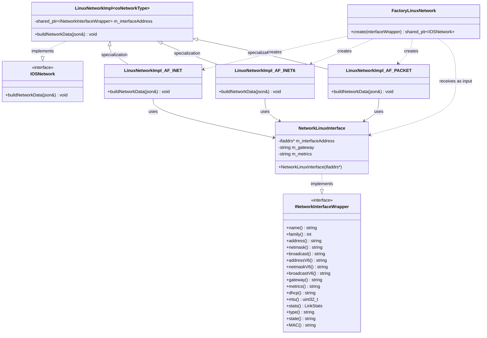
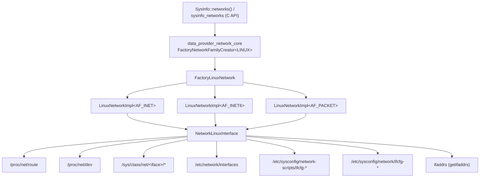
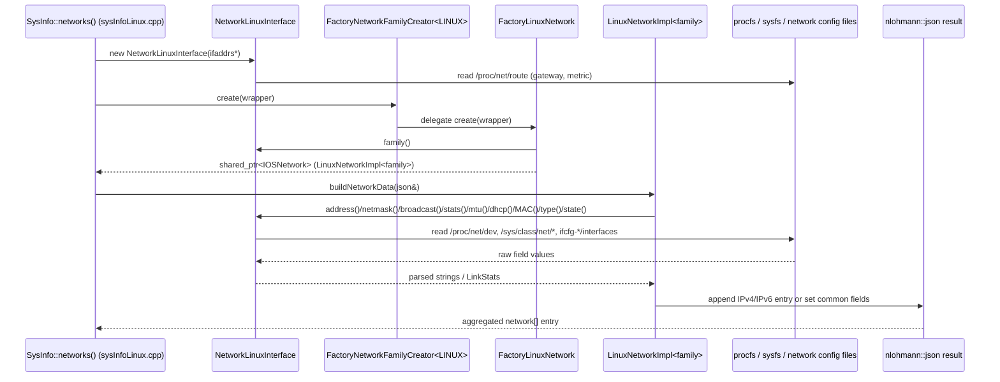
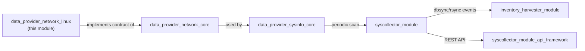

# Data Provider Network — Linux Implementation

## Introduction

`data_provider_network_linux` is the **Linux-specific implementation** of the network interface inventory collection strategy used by Wazuh's cross-platform `SysInfo` data provider (part of the [System_Information_Data_Provider_(C++)](System_Information_Data_Provider_(C++).md) subsystem). It is one of four platform sibling modules — alongside `data_provider_network_bsd`, `data_provider_network_solaris`, and `data_provider_network_windows` — that implement the platform-agnostic contract defined in [data_provider_network_core](data_provider_network_core.md).

This module is responsible for:

- Wrapping the native Linux `ifaddrs` structure (from `getifaddrs()`) behind the shared `INetworkInterfaceWrapper` interface (`NetworkLinuxInterface`).
- Reading Linux-specific system sources — `/proc/net/route`, `/proc/net/dev`, `/sys/class/net/<iface>/*`, `/etc/network/interfaces` (Debian-style), and `/etc/sysconfig/network-scripts` / `/etc/sysconfig/network` (RedHat/SUSE-style) — to extract addressing, statistics, gateway, MTU, DHCP, MAC, type, and operational state information.
- Producing per-address-family JSON fragments (`AF_INET`, `AF_INET6`, `AF_PACKET`) that conform to the common network inventory schema shared across all platforms.
- Exposing a small factory (`FactoryLinuxNetwork`) that the platform-agnostic `FactoryNetworkFamilyCreator<OSPlatformType::LINUX>` (in `data_provider_network_core`) delegates to at runtime.

Because the module fully encapsulates all Linux-specific file parsing and `ioctl`/procfs/sysfs access behind the shared `IOSNetwork` / `INetworkInterfaceWrapper` interfaces, no Linux-specific code leaks into calling code such as `SysInfo::networks()` (see [data_provider_sysinfo_core](data_provider_sysinfo_core.md)) or the higher-level [syscollector_module](syscollector_module.md).

---

## Purpose and Core Functionality

| Responsibility | Component |
|---|---|
| Select the correct `LinuxNetworkImpl<family>` specialization based on the interface's address family | `FactoryLinuxNetwork::create()` |
| Build the JSON fragment for IPv4 addresses (`network_ip`, `network_netmask`, `network_broadcast`, `network_metric`, `network_dhcp`) | `LinuxNetworkImpl<AF_INET>::buildNetworkData()` |
| Build the JSON fragment for IPv6 addresses (`network_ip`, `network_netmask`, `network_broadcast`, `network_metric`, `network_dhcp`) | `LinuxNetworkImpl<AF_INET6>::buildNetworkData()` |
| Build the JSON fragment for link-layer/common interface data (name, alias, type, state, MAC, MTU, gateway, RX/TX stats) | `LinuxNetworkImpl<AF_PACKET>::buildNetworkData()` |
| Provide raw field access (address, netmask, broadcast, gateway, DHCP status, MTU, stats, type, state, MAC) by reading `ifaddrs`, procfs and sysfs | `NetworkLinuxInterface` (implements `INetworkInterfaceWrapper`) |

The module does not perform interface *enumeration* itself (that is handled by the caller using `getifaddrs()` in `sysInfo.cpp`/`sysInfoLinux.cpp` — see [data_provider_sysinfo_core](data_provider_sysinfo_core.md)); it only knows how to describe a **single** already-obtained interface handle, once per relevant address family.

---

## Architecture

### Component Relationships



### Position Within the Data Provider



---

## Core Components

### `FactoryLinuxNetwork` (`networkInterfaceLinux.h`)

The Linux-side factory invoked by `FactoryNetworkFamilyCreator<OSPlatformType::LINUX>` (defined in [data_provider_network_core](data_provider_network_core.md)). It inspects the address family reported by the supplied `INetworkInterfaceWrapper` and instantiates the matching template specialization:

```cpp
std::shared_ptr<IOSNetwork> FactoryLinuxNetwork::create(const std::shared_ptr<INetworkInterfaceWrapper>& interfaceWrapper)
{
    const auto family { interfaceWrapper->family() };
    if (AF_INET  == family) return std::make_shared<LinuxNetworkImpl<AF_INET>>(interfaceWrapper);
    if (AF_INET6 == family) return std::make_shared<LinuxNetworkImpl<AF_INET6>>(interfaceWrapper);
    if (AF_PACKET== family) return std::make_shared<LinuxNetworkImpl<AF_PACKET>>(interfaceWrapper);
    // unsupported family -> nullptr
}
```

- Throws `std::runtime_error` if `interfaceWrapper` is `nullptr`.
- Returns `nullptr` for any address family other than `AF_INET`, `AF_INET6`, or `AF_PACKET` (silently ignored by the caller).

### `LinuxNetworkImpl<osNetworkType>` (`networkInterfaceLinux.h` / `.cpp`)

A class template parameterized on the OS address-family constant (`AF_INET`, `AF_INET6`, `AF_PACKET`). The **primary (unspecialized) template** simply throws `std::runtime_error("Non implemented specialization.")`, guaranteeing that only explicitly implemented families can be used. Three specializations exist in `networkInterfaceLinux.cpp`:

| Specialization | JSON Section | Fields Populated |
|---|---|---|
| `LinuxNetworkImpl<AF_INET>` | `network["IPv4"]` (array) | `network_ip`, `network_netmask`, `network_broadcast`, `network_metric`, `network_dhcp` |
| `LinuxNetworkImpl<AF_INET6>` | `network["IPv6"]` (array) | `network_ip`, `network_netmask`, `network_broadcast`, `network_metric`, `network_dhcp` |
| `LinuxNetworkImpl<AF_PACKET>` | Top-level fields | `interface_name`, `interface_alias`, `interface_type`, `interface_state`, `host_mac`, `host_network_egress_*`, `host_network_ingress_*`, `interface_mtu`, `network_gateway` |

The `AF_INET` and `AF_INET6` specializations throw `std::runtime_error` if the address string obtained from the wrapper is empty (guarding against malformed/incomplete `ifaddrs` entries). The `AF_PACKET` specialization pulls the aggregated `LinkStats` structure (defined in [data_provider_network_core](data_provider_network_core.md)) from the wrapper's `stats()` method and maps each counter into the corresponding `host_network_*` JSON field.

### `NetworkLinuxInterface` (`networkLinuxWrapper.h`)

The concrete Linux implementation of `INetworkInterfaceWrapper`, wrapping a single `ifaddrs*` node returned by `getifaddrs()`. Its constructor immediately parses `/proc/net/route` to resolve the interface's **default gateway** and **route metric**, storing them for later retrieval via `gateway()`/`metrics()`. All other accessors are computed on demand:

| Method | Data Source | Notes |
|---|---|---|
| `name()` | `ifa_name` | Strips VLAN/alias suffix after `:` |
| `family()` | `ifa_addr->sa_family` | Defaults to `AF_PACKET` if `ifa_addr` is null |
| `address()` / `netmask()` | `ifa_addr` / `ifa_netmask` via `getnameinfo()` | IPv4 (`sockaddr_in`) |
| `broadcast()` | `ifa_ifu.ifu_broadaddr`, or computed from address+netmask | Uses `Utils::NetworkHelper::getBroadcast` fallback |
| `addressV6()` / `netmaskV6()` / `broadcastV6()` | Same fields, cast as `sockaddr_in6` | IPv6 address has scope-id stripped (`%` split) |
| `gateway()` / `metrics()` | `/proc/net/route` | Parsed once in constructor |
| `dhcp()` | `/etc/network/interfaces` (Debian) **or** `/etc/sysconfig/network-scripts/ifcfg-*` / `/etc/sysconfig/network/ifcfg-*` (RedHat/SUSE) | Maps `BOOTPROTO`/`DHCPV6C`/`method` values via the `DHCP_STATUS` lookup table |
| `mtu()` | `/sys/class/net/<iface>/mtu` | |
| `stats()` | `/proc/net/dev` | Parses `rxBytes/txBytes/rxPackets/txPackets/rxErrors/txErrors/rxDropped/txDropped` into a `LinkStats` |
| `type()` | `/sys/class/net/<iface>/type` | Numeric ARPHRD_* code mapped via `NETWORK_INTERFACE_TYPE` table to a human string (`ethernet`, `wireless`, `tunnel`, etc.) |
| `state()` | `/sys/class/net/<iface>/operstate` | |
| `MAC()` | `/sys/class/net/<iface>/address` | |

This class also defines Linux-specific parsing helpers (`getNameInfo`, `getRedHatDHCPStatus`, `getDebianDHCPStatus`) and several private lookup tables/enums (`NETWORK_INTERFACE_TYPE`, `DHCP_STATUS`, `GatewayFileFields`, `DebianInterfaceConfig`, `RHInterfaceConfig`, `NetDevFileFields`) that encode the exact column layout of the various `/proc` and config files being parsed.

> Note: extended ARPHRD_* constants not guaranteed to be defined on all libc/kernel header combinations (e.g. `ARPHRD_TUNNEL`, `ARPHRD_IEEE80211`) are defined locally with `#ifndef` guards to keep the interface-type mapping table portable across build environments.

---

## Data Flow



Because `getifaddrs()` returns **one node per address family per interface**, the caller (`sysInfoLinux.cpp`) invokes the factory/`buildNetworkData()` pipeline once per node — meaning a single physical NIC typically contributes three separate calls (one each for `AF_INET`, `AF_INET6`, and `AF_PACKET`), which are merged into a single JSON object keyed by interface name at a higher level in `sysInfo.cpp` (see [data_provider_sysinfo_core](data_provider_sysinfo_core.md)).

---

## How It Fits Into the Overall System

- **Parent module**: [data_provider_network](data_provider_network.md) — groups this Linux implementation together with `data_provider_network_bsd`, `data_provider_network_solaris`, and `data_provider_network_windows` under the shared network-inventory umbrella.
- **Contract module**: [data_provider_network_core](data_provider_network_core.md) — defines `IOSNetwork`, `LinkStats`, and the `FactoryNetworkFamilyCreator<OSPlatformType::LINUX>` template specialization that dispatches into this module's `FactoryLinuxNetwork`.
- **Upstream caller**: `SysInfo::networks()` in `sysInfoLinux.cpp` / `sysInfo.cpp` (see [data_provider_sysinfo_core](data_provider_sysinfo_core.md)) enumerates interfaces via `getifaddrs()`, wraps each node in `NetworkLinuxInterface`, and drives the factory + `buildNetworkData()` calls documented here to build the final JSON returned by the C API `sysinfo_networks`.
- **Downstream consumers**:
  - The [syscollector_module](syscollector_module.md) native daemon (`Syscollector` class) periodically invokes `SysInfo::networks()` to detect and report network configuration changes via `dbsync`/`rsync` (see [Shared_Modules_Infrastructure_(C++)](Shared_Modules_Infrastructure_(C++).md)).
  - The framework-level API (`framework/wazuh/syscollector.py`, `framework/wazuh/core/syscollector.py`) exposes this inventory over the Wazuh REST API (see [syscollector_module_api_framework](syscollector_module_api_framework.md)).
  - The [inventory_harvester_module](inventory_harvester_module.md) normalizes and indexes the resulting network data using `InventoryNetworkHarvester`, `InventoryNetworkProtocolHarvester`, and `NetIface`/`Interface` models.



---

## Comparison With Sibling Platform Modules

| Aspect | Linux | BSD (`data_provider_network_bsd`) | Solaris (`data_provider_network_solaris`) | Windows (`data_provider_network_windows`) |
|---|---|---|---|---|
| Wrapper base struct | `ifaddrs` | `ifaddrs` + `sockaddr_dl` | `lifreq`/`lifconf` | Win32 adapter structures |
| Statistics source | `/proc/net/dev` | link-layer socket stats (`sockaddr_dl`) | `kstat` | `GetIfTable`/`GetIfEntry2` |
| DHCP detection | Debian/RedHat/SUSE config file parsing | N/A / OS-specific | CLI tool output | Win32 IP Helper API |
| Gateway resolution | `/proc/net/route` | routing socket / `sysctl` | `netstat`/`ifconfig` parsing | IP Helper API |
| Type/State source | `/sys/class/net/<iface>/{type,operstate}` | interface flags | `dladm`/`ifconfig` | adapter struct fields |

All four implementations converge on the same `IOSNetwork::buildNetworkData()` contract and JSON schema defined in [data_provider_network_core](data_provider_network_core.md), which is what allows `SysInfo` and its consumers to remain fully platform-agnostic.

---

## Related Documentation

- [data_provider_network.md](data_provider_network.md) — parent network module (all platforms)
- [data_provider_network_core.md](data_provider_network_core.md) — shared `IOSNetwork`/`LinkStats`/`FactoryNetworkFamilyCreator` contract
- [data_provider_network_bsd.md](data_provider_network_bsd.md) — BSD/macOS network implementation
- [data_provider_network_solaris.md](data_provider_network_solaris.md) — Solaris network implementation
- [data_provider_network_windows.md](data_provider_network_windows.md) — Windows network implementation
- [data_provider_sysinfo_core.md](data_provider_sysinfo_core.md) — `SysInfo` facade and C API entry points that drive this module
- [data_provider_wrappers_unix_linux.md](data_provider_wrappers_unix_linux.md) — other Linux-specific OS wrappers (users/groups/passwd/shadow) following the same wrapper philosophy
- [syscollector_module.md](syscollector_module.md) — native daemon and framework API consuming network inventory data
- [inventory_harvester_module.md](inventory_harvester_module.md) — normalizes/persists network inventory data for indexing
