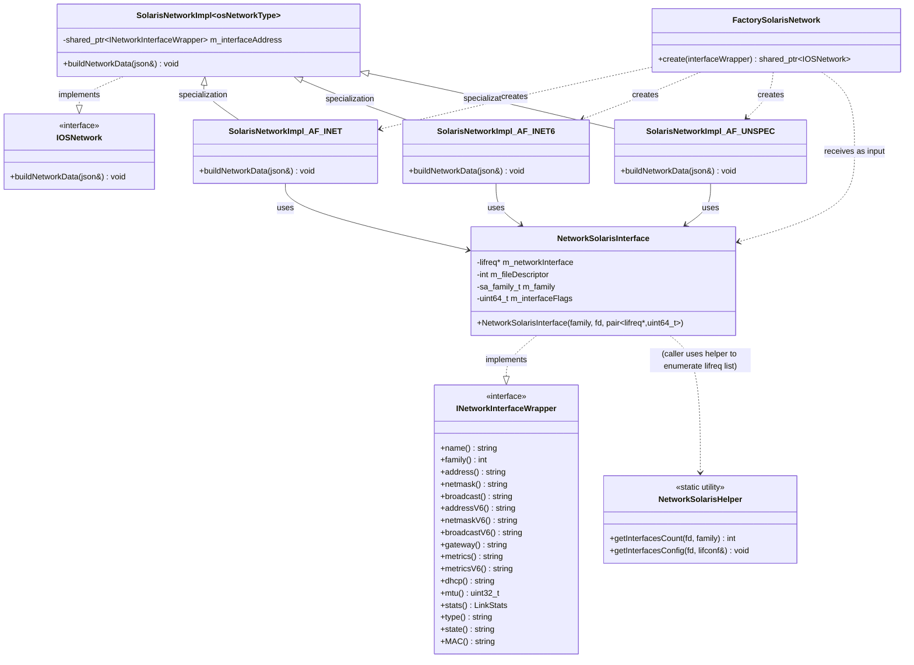
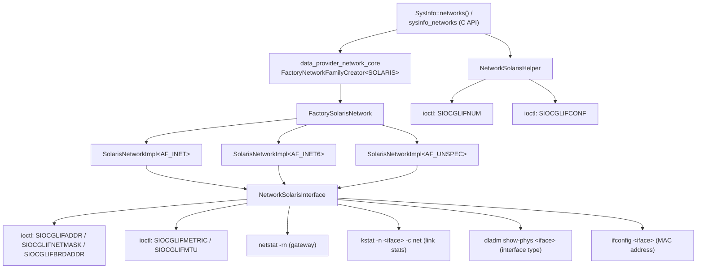
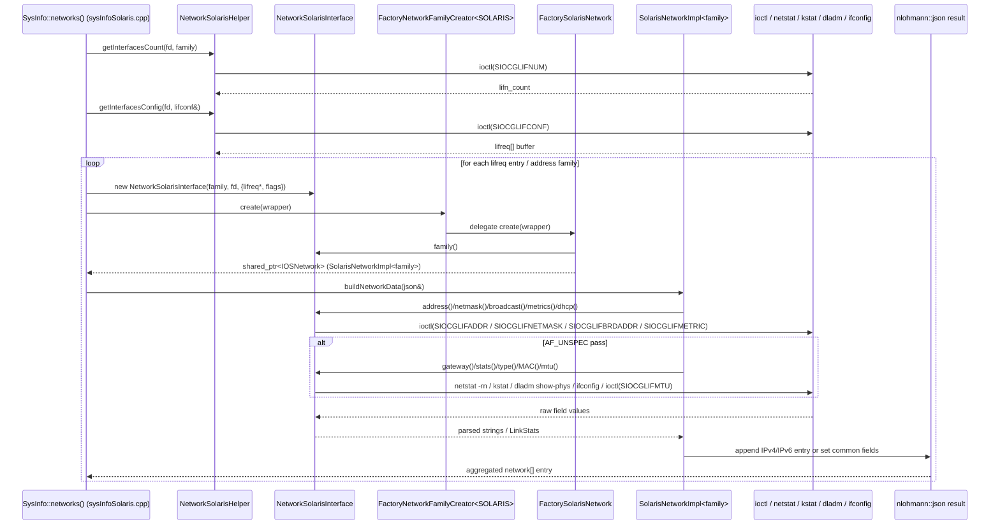
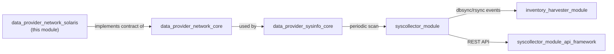

# Data Provider Network — Solaris Implementation

## Introduction

`data_provider_network_solaris` is the **Solaris/illumos-specific implementation** of the network interface inventory collection strategy used by Wazuh's cross-platform `SysInfo` data provider (part of the [System_Information_Data_Provider_(C++)](System_Information_Data_Provider_(C++).md) subsystem). It is one of four platform sibling modules — alongside `data_provider_network_linux`, `data_provider_network_bsd`, and `data_provider_network_windows` — that implement the platform-agnostic contract defined in [data_provider_network_core](data_provider_network_core.md).

This module is responsible for:

- Wrapping Solaris's `lifreq`/`lifconf` ("logical interface request/configuration") structures — obtained via the `SIOCGLIFNUM`/`SIOCGLIFCONF` `ioctl()` calls — behind the shared `INetworkInterfaceWrapper` interface (`NetworkSolarisInterface`).
- Issuing the Solaris-specific `ioctl()` requests (`SIOCGLIFADDR`, `SIOCGLIFNETMASK`, `SIOCGLIFBRDADDR`, `SIOCGLIFMETRIC`, `SIOCGLIFMTU`) needed to extract per-interface addressing, netmask, broadcast, metric, and MTU data.
- Shelling out to native Solaris CLI tools (`netstat -rn`, `kstat`, `dladm show-phys`, `ifconfig`) to obtain information not exposed via `ioctl()` — default gateway, link statistics, interface media/type, and MAC address.
- Producing per-address-family JSON fragments (`AF_INET`, `AF_INET6`, `AF_UNSPEC`) that conform to the common network inventory schema shared across all platforms.
- Exposing a small factory (`FactorySolarisNetwork`) that the platform-agnostic `FactoryNetworkFamilyCreator<OSPlatformType::SOLARIS>` (in `data_provider_network_core`) delegates to at runtime.
- Providing the low-level `NetworkSolarisHelper` utility that wraps the raw `ioctl()` calls used to discover how many logical interfaces exist (`SIOCGLIFNUM`) and to retrieve their configuration list (`SIOCGLIFCONF`).

Because the module fully encapsulates all Solaris-specific `ioctl`/`kstat`/CLI-parsing logic behind the shared `IOSNetwork` / `INetworkInterfaceWrapper` interfaces, no Solaris-specific code leaks into calling code such as `SysInfo::networks()` (see [data_provider_sysinfo_core](data_provider_sysinfo_core.md)) or the higher-level [syscollector_module](syscollector_module.md).

---

## Purpose and Core Functionality

| Responsibility | Component |
|---|---|
| Select the correct `SolarisNetworkImpl<family>` specialization based on the interface's address family | `FactorySolarisNetwork::create()` |
| Build the JSON fragment for IPv4 addresses (`network_ip`, `network_netmask`, `network_broadcast`, `network_metric`, `network_dhcp`) | `SolarisNetworkImpl<AF_INET>::buildNetworkData()` |
| Build the JSON fragment for IPv6 addresses (`network_ip`, `network_netmask`, `network_broadcast`, `network_metric`, `network_dhcp`) | `SolarisNetworkImpl<AF_INET6>::buildNetworkData()` |
| Build the JSON fragment for link-layer/common interface data (name, alias, type, state, MAC, MTU, gateway, RX/TX stats) | `SolarisNetworkImpl<AF_UNSPEC>::buildNetworkData()` |
| Provide raw field access (address, netmask, broadcast, gateway, DHCP status, MTU, stats, type, state, MAC) by combining `lifreq` `ioctl()` calls with CLI tool output | `NetworkSolarisInterface` (implements `INetworkInterfaceWrapper`) |
| Enumerate the number and configuration of logical interfaces present on the host | `NetworkSolarisHelper::getInterfacesCount()` / `getInterfacesConfig()` |

The module does not perform interface *enumeration* itself in the sense of building the final aggregated JSON array — that orchestration lives in the caller (`sysInfoSolaris.cpp`, see [data_provider_sysinfo_core](data_provider_sysinfo_core.md)), which uses `NetworkSolarisHelper` to obtain the `lifconf` list and then constructs one `NetworkSolarisInterface` per logical interface entry, describing it once per relevant address family.

---

## Architecture

### Component Relationships



### Position Within the Data Provider



---

## Core Components

### `FactorySolarisNetwork` (`networkInterfaceSolaris.h` / `.cpp`)

The Solaris-side factory invoked by `FactoryNetworkFamilyCreator<OSPlatformType::SOLARIS>` (defined in [data_provider_network_core](data_provider_network_core.md)). It inspects the address family reported by the supplied `INetworkInterfaceWrapper` and instantiates the matching template specialization:

```cpp
std::shared_ptr<IOSNetwork> FactorySolarisNetwork::create(const std::shared_ptr<INetworkInterfaceWrapper>& interfaceWrapper)
{
    const auto family { interfaceWrapper->family() };
    if (AF_INET   == family) return std::make_shared<SolarisNetworkImpl<AF_INET>>(interfaceWrapper);
    if (AF_INET6  == family) return std::make_shared<SolarisNetworkImpl<AF_INET6>>(interfaceWrapper);
    if (AF_UNSPEC == family) return std::make_shared<SolarisNetworkImpl<AF_UNSPEC>>(interfaceWrapper);
    // unknown family -> nullptr
}
```

- Throws `std::runtime_error("Error nullptr interfaceWrapper instance.")` if `interfaceWrapper` is `nullptr`.
- Returns `nullptr` for any address family other than `AF_INET`, `AF_INET6`, or `AF_UNSPEC` (silently ignored by the caller).
- Unlike Linux (which uses `AF_PACKET` for the link-layer/common fields) and BSD (which reads `sockaddr_dl`), Solaris uses **`AF_UNSPEC`** as the discriminator for the "common interface data" specialization (name, MAC, MTU, gateway, stats, type, state).

### `SolarisNetworkImpl<osNetworkType>` (`networkInterfaceSolaris.h` / `.cpp`)

A class template parameterized on the OS address-family constant (`AF_INET`, `AF_INET6`, `AF_UNSPEC`). The **primary (unspecialized) template** simply throws `std::runtime_error("Specialization not implemented")`, guaranteeing that only explicitly implemented families can be used. Three specializations exist in `networkInterfaceSolaris.cpp`:

| Specialization | JSON Section | Fields Populated |
|---|---|---|
| `SolarisNetworkImpl<AF_INET>` | `network["IPv4"]` (array) | `network_ip`, `network_netmask`, `network_broadcast`, `network_metric`, `network_dhcp` |
| `SolarisNetworkImpl<AF_INET6>` | `network["IPv6"]` (array) | `network_ip`, `network_netmask`, `network_broadcast`, `network_metric`, `network_dhcp` |
| `SolarisNetworkImpl<AF_UNSPEC>` | Top-level fields | `interface_name`, `interface_alias`, `interface_state`, `interface_type`, `host_mac`, `host_network_egress_*`, `host_network_ingress_*`, `interface_mtu`, `network_gateway` |

The `AF_INET` and `AF_INET6` specializations throw `std::runtime_error` (`"Invalid IpV4 address."` / `"Invalid IpV6 address."`) if the address string obtained from the wrapper is empty, guarding against malformed/incomplete `lifreq` entries. The `AF_UNSPEC` specialization pulls the aggregated `LinkStats` structure (defined in [data_provider_network_core](data_provider_network_core.md)) from the wrapper's `stats()` method and maps each counter into the corresponding `host_network_*` JSON field.

### `NetworkSolarisInterface` (`networkSolarisWrapper.hpp`)

The concrete Solaris implementation of `INetworkInterfaceWrapper`, wrapping a single `lifreq*` entry (plus its associated interface flags bitmask) obtained from a `lifconf` list. Unlike Linux/BSD (which parse a linked list of `ifaddrs` produced by `getifaddrs()`), Solaris requires an explicit sequence of `ioctl()` calls per field, since `lifreq` is a request/response structure reused for each query:

| Method | Data Source | Notes |
|---|---|---|
| `name()` | `lifr_name` | |
| `family()` | Constructor parameter (`m_family`) | Set explicitly by the caller when constructing the wrapper for a given address family pass |
| `address()` / `netmask()` | `ioctl(SIOCGLIFADDR)` / `ioctl(SIOCGLIFNETMASK)` on `lifr_addr`, cast as `sockaddr_in` | Converted via `Utils::NetworkHelper::IAddressToBinary()` |
| `broadcast()` | `ioctl(SIOCGLIFBRDADDR)` on `lifr_broadaddr`, cast as `sockaddr_in` | Only queried if `IFF_BROADCAST` flag is set; returns `"unknown"` otherwise |
| `addressV6()` / `netmaskV6()` | Same `ioctl()` calls, cast as `sockaddr_in6` | |
| `broadcastV6()` | `ioctl(SIOCGLIFBRDADDR)` cast as `sockaddr_in6` | Only queried if `IFF_BROADCAST` flag is set |
| `gateway()` | `netstat -rn` (parsed CLI output) | Matches the `default` route row whose interface-name field equals `name()` |
| `metrics()` / `metricsV6()` | `ioctl(SIOCGLIFMETRIC)` on `lifr_metric` | Same underlying value used for both IPv4 and IPv6 |
| `dhcp()` | `m_interfaceFlags & IFF_DHCPRUNNING` | Returns `"enabled"`/`"disabled"` directly from the cached interface flags — no config-file parsing (unlike Linux) |
| `mtu()` | `ioctl(SIOCGLIFMTU)` on `lifr_mtu` | |
| `stats()` | `kstat -n <iface> -c net` (parsed CLI output) | Extracts `ipackets64`, `rbytes64`, `opackets64`, `obytes64`, `dl_idrops`, `dl_odrops`, `ierrors`, `oerrors` into a `LinkStats` struct |
| `type()` | `dladm show-phys <iface>` (parsed CLI output) | Reads the `MEDIA` column of the tabular output |
| `state()` | `m_interfaceFlags & IFF_UP` | Returns `"up"`/`"down"` |
| `MAC()` | `ifconfig <iface>` (parsed CLI output) | Extracts the token following the `ether` keyword, reformats each octet in uppercase hex, colon-separated |
| `adapter()` | N/A | Always returns an empty string (no adapter/alias concept exposed on Solaris) |

Because each accessor issues its own targeted `ioctl()` or spawns its own CLI subprocess, `NetworkSolarisInterface` favors **on-demand, per-field queries** rather than doing a single up-front parse (as Linux does for `/proc/net/route`) — this trades a few extra syscalls/process spawns for simpler, more direct code that mirrors the native Solaris networking APIs.

### `NetworkSolarisHelper` (`networkSolarisHelper.hpp` / `.cpp`)

A small static-method-only utility class (not user-instantiable) used exclusively by the caller (`sysInfoSolaris.cpp`) — not by `NetworkSolarisInterface` itself — to discover and enumerate the set of logical interfaces on the host before constructing individual `NetworkSolarisInterface` wrappers:

| Method | Underlying `ioctl` | Purpose |
|---|---|---|
| `getInterfacesCount(fd, family)` | `SIOCGLIFNUM` | Returns the number of logical interfaces (`lifn_count`) for the given address family, used to correctly size the buffer passed to `getInterfacesConfig()` |
| `getInterfacesConfig(fd, lifconf&)` | `SIOCGLIFCONF` | Populates the `lifconf` structure (an array of `lifreq` entries) representing every logical interface of the requested family |

Both methods delegate the actual syscall to `UtilsWrapperUnix::ioctl()` (see [shared_utils](shared_utils.md)) for testability (allowing the syscall to be mocked in unit tests).

---

## Data Flow



Similar to the Linux and BSD implementations, the caller drives one `buildNetworkData()` invocation per relevant address family for each logical interface (`AF_INET`, `AF_INET6`, and `AF_UNSPEC` for the common/link-layer data), which are merged into a single JSON object keyed by interface name at a higher level in `sysInfo.cpp` (see [data_provider_sysinfo_core](data_provider_sysinfo_core.md)).

---

## How It Fits Into the Overall System

- **Parent module**: [data_provider_network](data_provider_network.md) — groups this Solaris implementation together with `data_provider_network_linux`, `data_provider_network_bsd`, and `data_provider_network_windows` under the shared network-inventory umbrella.
- **Contract module**: [data_provider_network_core](data_provider_network_core.md) — defines `IOSNetwork`, `LinkStats`, and the `FactoryNetworkFamilyCreator<OSPlatformType::SOLARIS>` template specialization that dispatches into this module's `FactorySolarisNetwork`.
- **Upstream caller**: `SysInfo::networks()` in `sysInfoSolaris.cpp` / `sysInfo.cpp` (see [data_provider_sysinfo_core](data_provider_sysinfo_core.md)) uses `NetworkSolarisHelper` to enumerate logical interfaces via `SIOCGLIFNUM`/`SIOCGLIFCONF`, wraps each `lifreq` entry in `NetworkSolarisInterface`, and drives the factory + `buildNetworkData()` calls documented here to build the final JSON returned by the C API `sysinfo_networks`.
- **Downstream consumers**:
  - The [syscollector_module](syscollector_module.md) native daemon (`Syscollector` class) periodically invokes `SysInfo::networks()` to detect and report network configuration changes via `dbsync`/`rsync` (see [Shared_Modules_Infrastructure_(C++)](Shared_Modules_Infrastructure_(C++).md)).
  - The framework-level API (`framework/wazuh/syscollector.py`, `framework/wazuh/core/syscollector.py`) exposes this inventory over the Wazuh REST API (see [syscollector_module_api_framework](syscollector_module_api_framework.md)).
  - The [inventory_harvester_module](inventory_harvester_module.md) normalizes and indexes the resulting network data using `InventoryNetworkHarvester`, `InventoryNetworkProtocolHarvester`, and `NetIface`/`Interface` models.



---

## Comparison With Sibling Platform Modules

| Aspect | Solaris (this module) | Linux (`data_provider_network_linux`) | BSD (`data_provider_network_bsd`) | Windows (`data_provider_network_windows`) |
|---|---|---|---|---|
| Wrapper base struct | `lifreq` / `lifconf` | `ifaddrs` | `ifaddrs` + `sockaddr_dl` | Win32 adapter structures |
| Enumeration mechanism | `ioctl(SIOCGLIFNUM)` + `ioctl(SIOCGLIFCONF)` via `NetworkSolarisHelper` | `getifaddrs()` | `getifaddrs()` | `GetAdaptersAddresses`/similar Win32 APIs |
| Common-data discriminator | `AF_UNSPEC` | `AF_PACKET` | link-layer pass via `sockaddr_dl` | adapter struct iteration |
| Statistics source | `kstat -n <iface> -c net` (CLI) | `/proc/net/dev` | link-layer socket stats (`sockaddr_dl`) | `GetIfTable`/`GetIfEntry2` |
| DHCP detection | Interface flag `IFF_DHCPRUNNING` (no file parsing) | Debian/RedHat/SUSE config file parsing | N/A / OS-specific | Win32 IP Helper API |
| Gateway resolution | `netstat -rn` (CLI parsing) | `/proc/net/route` | routing socket / `sysctl` | IP Helper API |
| Type/State source | `dladm show-phys` (CLI) / interface flags | `/sys/class/net/<iface>/{type,operstate}` | interface flags | adapter struct fields |
| MAC address source | `ifconfig <iface>` (CLI parsing) | `/sys/class/net/<iface>/address` | `sockaddr_dl` (`sdl_data`) | adapter struct fields |

All four implementations converge on the same `IOSNetwork::buildNetworkData()` contract and JSON schema defined in [data_provider_network_core](data_provider_network_core.md), which is what allows `SysInfo` and its consumers to remain fully platform-agnostic. The Solaris implementation is notably more **CLI-tool-dependent** than its siblings (relying on `netstat`, `kstat`, `dladm`, and `ifconfig` output parsing for several fields), reflecting the more limited `ioctl`/procfs surface available for network introspection on this platform compared to Linux's `/proc` and `/sys` filesystems.

---

## Design Patterns

- **Strategy / Factory Pattern**: `IOSNetwork` and `INetworkInterfaceWrapper` are abstract interfaces; `FactorySolarisNetwork` (and its Linux/BSD/Windows counterparts) select and construct the concrete strategy at runtime based on the interface's address family, itself selected at compile time per host OS via `FactoryNetworkFamilyCreator<OSPlatformType::SOLARIS>`.
- **Adapter Pattern**: `NetworkSolarisInterface` adapts the native `lifreq`/`ioctl()` API and assorted CLI tool outputs (`netstat`, `kstat`, `dladm`, `ifconfig`) to the platform-neutral `INetworkInterfaceWrapper` contract.
- **Template Method**: `SolarisNetworkImpl<T>::buildNetworkData()` provides a common structure for populating JSON output, specialized per network family (`AF_INET`, `AF_INET6`, `AF_UNSPEC`).
- **Facade / Helper**: `NetworkSolarisHelper` hides the raw `ioctl()` calls needed for interface enumeration behind a two-method static API, simplifying the caller and improving testability via `UtilsWrapperUnix`.

---

## Dependencies

- **[data_provider_network_core](data_provider_network_core.md)** — defines the shared `IOSNetwork`, `INetworkInterfaceWrapper` interfaces, `LinkStats` struct, and the `FactoryNetworkFamilyCreator<OSPlatformType::SOLARIS>` specialization that dispatches to this module.
- **[shared_utils](shared_utils.md)** — provides `Utils::NetworkHelper` (IP address conversion), `Utils::exec`/`Utils::split`/`Utils::trimRepeated`/`Utils::replaceAll` (CLI output parsing helpers), and `UtilsWrapperUnix::ioctl` (mockable syscall wrapper) used throughout `networkSolarisWrapper.hpp` and `networkSolarisHelper.cpp`.
- **[data_provider_sysinfo_core](data_provider_sysinfo_core.md)** — the top-level `SysInfo` class (`sysInfoSolaris.cpp`) that drives interface enumeration via `NetworkSolarisHelper` and invokes the network factory as part of full system inventory collection (`sysinfo_networks`).
- Sibling OS backends (mutually exclusive at build time): **[data_provider_network_linux](data_provider_network_linux.md)**, **[data_provider_network_bsd](data_provider_network_bsd.md)**, **[data_provider_network_windows](data_provider_network_windows.md)**.

---

## Related Documentation

- [data_provider_network.md](data_provider_network.md) — parent network module (all platforms)
- [data_provider_network_core.md](data_provider_network_core.md) — shared network interfaces (`IOSNetwork`, `LinkStats`) and factory dispatch logic
- [data_provider_network_linux.md](data_provider_network_linux.md) — Linux equivalent implementation
- [data_provider_network_bsd.md](data_provider_network_bsd.md) — BSD/macOS equivalent implementation
- [data_provider_network_windows.md](data_provider_network_windows.md) — Windows equivalent implementation
- [data_provider_sysinfo_core.md](data_provider_sysinfo_core.md) — top-level `SysInfo` orchestration and OS-specific `sysInfo*.cpp` entry points, including `sysInfoSolaris.cpp`
- [data_provider_osinfo.md](data_provider_osinfo.md) — sibling module providing the `SolarisOsParser` used for OS-release detection on the same platform
- [data_provider_packages.md](data_provider_packages.md) — sibling module providing `SolarisPackageImpl`/`SolarisWrapper` for package inventory on Solaris
- [shared_utils.md](shared_utils.md) — common C++ helper utilities (network, string, process execution) used across data provider modules
- [syscollector_module.md](syscollector_module.md) — the wazuh-modulesd Syscollector daemon that consumes this inventory data
- [syscollector_module_api_framework.md](syscollector_module_api_framework.md) — API/CLI framework layer exposing network inventory data
- [inventory_harvester_module.md](inventory_harvester_module.md) — consumes and indexes network inventory events downstream
