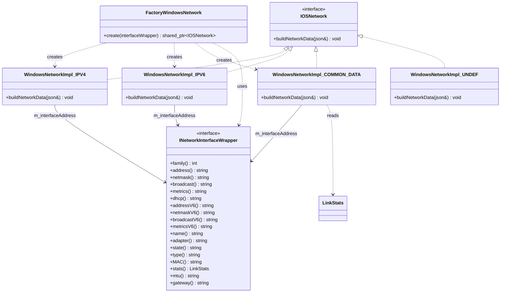
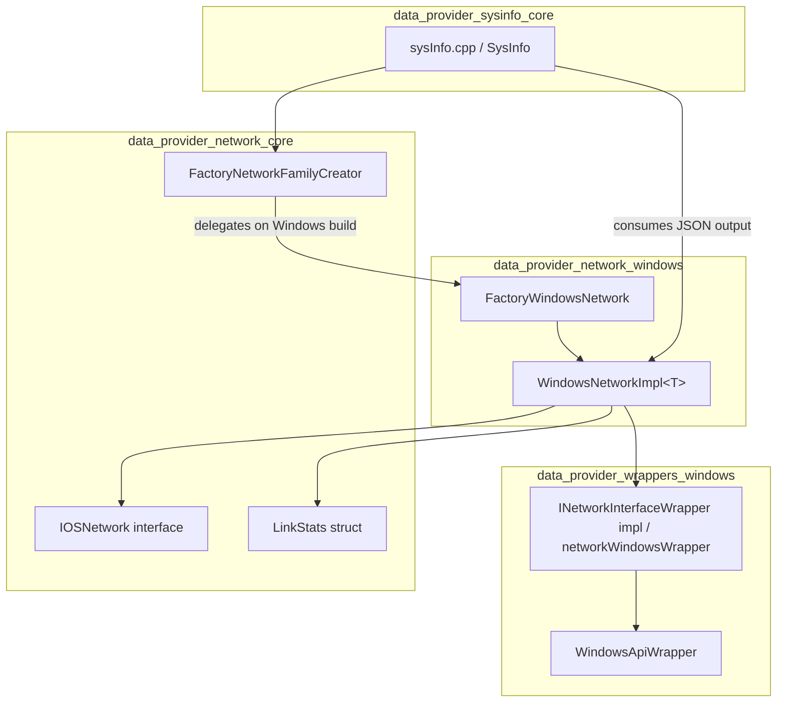
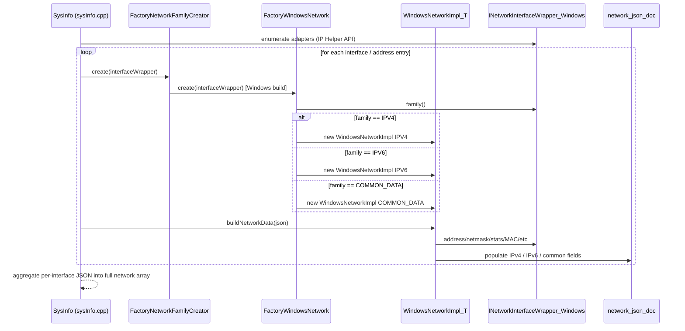
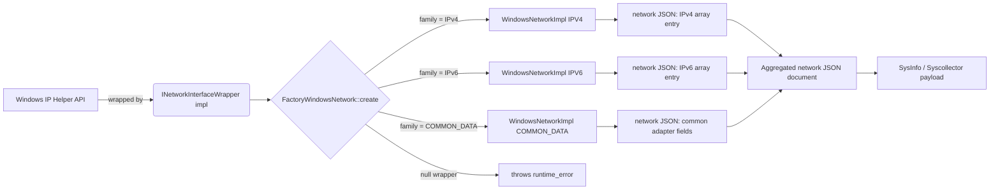

# Data Provider – Network (Windows)

## Introduction

The **`data_provider_network_windows`** module is the Windows-specific implementation of the network-information retrieval subsystem used by the Wazuh **System Information Data Provider** (`SysInfo`). It is responsible for transforming the raw network adapter data exposed by the Windows OS (through `INetworkInterfaceWrapper` implementations) into the normalized JSON structure that Wazuh uses across all platforms to describe host network interfaces (IPv4/IPv6 addresses, MAC, MTU, gateway, traffic counters, etc.).

This module is one of several OS-specific "leaf" implementations of a common network abstraction defined in [`data_provider_network_core`](data_provider_network_core.md). Sibling implementations exist for Linux (`data_provider_network_linux`), BSD (`data_provider_network_bsd`), and Solaris (`data_provider_network_solaris`); this document focuses exclusively on the Windows variant.

## Purpose & Core Functionality

On Windows, network adapter information is not retrieved through POSIX-style `getifaddrs()`/`ioctl()` calls but through the Windows IP Helper API (`GetAdaptersAddresses`, etc.), wrapped by a Windows-specific `INetworkInterfaceWrapper` implementation (outside the scope of this module, see `data_provider_wrappers_windows`). The `data_provider_network_windows` module consumes that wrapper and:

1. **Classifies** each network interface/address entry by address family (`IPv4`, `IPv6`, or `COMMON_DATA` for family-independent adapter metadata) using a factory pattern.
2. **Builds** the corresponding fragment of the final network JSON document (`nlohmann::json`) for that family, following the schema shared by all OS implementations.
3. **Aggregates** per-adapter statistics (packets, bytes, errors, drops) and general adapter properties (name, alias, state, type, MAC, MTU, gateway) into the `COMMON_DATA` section.

The module produces the same JSON shape used by the higher-level `SysInfo` component (`SysInfo_Provider`, see [data_provider_sysinfo_core](data_provider_sysinfo_core.md)) which is ultimately consumed by the **Syscollector** module and exposed through the Wazuh API (`syscollector_module`, see [syscollector_module_api_framework](syscollector_module_api_framework.md)) and stored via Wazuh DB.

## Architecture & Component Relationships

### Key Components

| Component | Description |
|---|---|
| `FactoryWindowsNetwork` | Factory that inspects the address-family of a given `INetworkInterfaceWrapper` and instantiates the correct `WindowsNetworkImpl<>` specialization. |
| `WindowsNetworkImpl<osNetworkType>` | Template class (specialized for `IPV4`, `IPV6`, `COMMON_DATA`, and `UNDEF`) implementing the `IOSNetwork` interface. Each specialization's `buildNetworkData()` populates a different part of the resulting JSON. |
| `buildNetworkData()` (per specialization) | The actual data-extraction/serialization logic, implemented in `networkInterfaceWindows.cpp`. |

### Class / Template Diagram

### Dependency Diagram (module level)

## Data Flow

The overall process of building the `network` section of the Syscollector/SysInfo JSON payload on a Windows host follows these steps:

### Behavior per specialization

- **`WindowsNetworkImpl<IPV4>::buildNetworkData`**
  Reads `address()`, `netmask()`, `broadcast()`, `metrics()`, `dhcp()` from the wrapper. If the IPv4 address is empty, it throws `std::runtime_error("Invalid IpV4 address.")`. On success, appends an object to the `IPv4` JSON array with keys: `network_ip`, `network_netmask`, `network_broadcast`, `network_metric`, `network_dhcp`.

- **`WindowsNetworkImpl<IPV6>::buildNetworkData`**
  Same pattern as IPv4 but uses the `*V6()` accessors (`addressV6`, `netmaskV6`, `broadcastV6`, `metricsV6`) and appends to the `IPv6` array. Throws `std::runtime_error("Invalid IpV6 address.")` on empty address.

- **`WindowsNetworkImpl<COMMON_DATA>::buildNetworkData`**
  Populates family-independent fields directly on the top-level network object: `interface_name`, `interface_alias`, `interface_state`, `interface_type`, `host_mac`, `interface_mtu`, `network_gateway`, and traffic counters derived from `LinkStats` (`host_network_egress_packages`, `host_network_ingress_packages`, `host_network_egress_bytes`, `host_network_ingress_bytes`, `host_network_egress_errors`, `host_network_ingress_errors`, `host_network_egress_drops`, `host_network_ingress_drops`).

- **`WindowsNetworkImpl<UNDEF>::buildNetworkData`**
  Defensive fallback specialization; always throws `std::runtime_error("Invalid network adapter family.")`. It exists purely as a compile-time safety net for the template mechanism, guarding against unexpected instantiation with an unsupported family value.

## Component Interaction

## Error Handling

The module relies on C++ exceptions (`std::runtime_error`) to signal invalid states rather than returning error codes:

- `FactoryWindowsNetwork::create` throws if `interfaceWrapper` is `nullptr`.
- `WindowsNetworkImpl<IPV4>::buildNetworkData` throws if the resolved IPv4 address string is empty.
- `WindowsNetworkImpl<IPV6>::buildNetworkData` throws if the resolved IPv6 address string is empty.
- `WindowsNetworkImpl<UNDEF>::buildNetworkData` always throws — it exists purely as a compile-time safety net for the template mechanism.

Callers (typically the `sysInfo.cpp` orchestration logic in [data_provider_sysinfo_core](data_provider_sysinfo_core.md)) are expected to catch these exceptions per-interface so a single malformed adapter does not abort the entire network scan.

## Interfaces & Extension Points

This module implements the platform-specific side of two abstractions defined in [data_provider_network_core](data_provider_network_core.md):

- **`IOSNetwork`** — the common interface all OS-specific network builders implement (`buildNetworkData(nlohmann::json&)`).
- **`FactoryNetworkFamilyCreator`** — the OS-agnostic factory entry point used by `SysInfo`; on Windows builds, this delegates (via conditional compilation) to `FactoryWindowsNetwork`.

To add support for a new address family or adapter data category on Windows, a new template specialization of `WindowsNetworkImpl<newType>` would need to be added, along with a corresponding branch in `FactoryWindowsNetwork::create`.

## Relationship to Other Modules

- **[data_provider_network_core](data_provider_network_core.md)** — Defines `IOSNetwork`, `LinkStats`, and the OS-agnostic `FactoryNetworkFamilyCreator` that this module specializes for Windows.
- **[data_provider_network_linux](data_provider_network_linux.md)**, **[data_provider_network_bsd](data_provider_network_bsd.md)**, **[data_provider_network_solaris](data_provider_network_solaris.md)** — Equivalent OS-specific implementations following the same `IOSNetwork` contract, useful for comparing platform differences.
- **[data_provider_wrappers_windows](data_provider_wrappers_windows.md)** — Supplies the low-level Windows API wrapper types (`WindowsApiWrapper`, `TWSapiWrapper`, etc.) that the (externally defined) `INetworkInterfaceWrapper` Windows implementation builds upon.
- **[data_provider_sysinfo_core](data_provider_sysinfo_core.md)** — The orchestrating layer (`sysInfo.cpp`, `SysInfo` class) that calls into the network family factory to assemble the complete system information payload, including hardware, OS, packages, ports, and processes alongside network data.
- **[syscollector_module_native_daemon](syscollector_module_native_daemon.md)** — The native `syscollector` Wazuh module daemon that periodically invokes `SysInfo` (and transitively this module) to collect and forward inventory data, which is eventually exposed via [syscollector_module_api_framework](syscollector_module_api_framework.md).

## Summary

`data_provider_network_windows` is a small, focused translation layer: it maps the Windows adapter/address abstraction (`INetworkInterfaceWrapper`) into the cross-platform `IOSNetwork` JSON-building contract used throughout the Wazuh Data Provider. Its design—an address-family factory plus per-family template specializations—mirrors the equivalent Linux, BSD, and Solaris implementations, allowing `SysInfo` and downstream consumers (Syscollector, the Wazuh API, and Wazuh DB) to work with a single, OS-independent network inventory schema.
