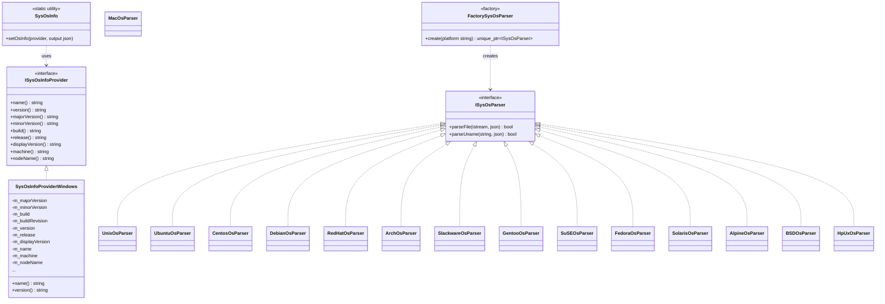
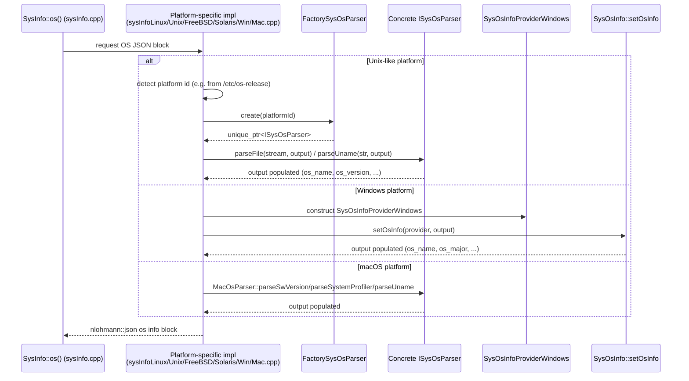

# Data Provider – OS Information Module (`data_provider_osinfo`)

## 1. Purpose

The `data_provider_osinfo` module is a small but critical part of the **System Information Data Provider (C++)** subsystem (see [System_Information_Data_Provider](System_Information_Data_Provider.md) for the parent module overview). Its sole responsibility is to **detect, parse and normalize operating-system identity information** — name, version, build, kernel release, platform family, etc. — across the many OS families that Wazuh agents/managers run on: Linux distributions (Ubuntu, Debian, CentOS/RHEL, Fedora, SuSE, Arch, Slackware, Gentoo, Alpine), BSD variants, Solaris, HP-UX, macOS, and Windows.

The module is consumed internally by the core `SysInfo` facade (implemented in [data_provider_sysinfo_core](data_provider_sysinfo_core.md), see `sysInfoLinux.cpp`, `sysInfoMac.cpp`, `sysInfoWin.cpp`, `sysInfoFreeBSD.cpp`, `sysInfoSolaris.cpp`, etc.) when it needs to populate the `os_*` fields of the `sysinfo_os` JSON block returned by `sysinfo_os()` in `sysInfo.cpp`. This JSON block is what eventually reaches `wazuh-modules/wm_syscollector` and, later, the [Inventory Harvester](inventory_harvester_module.md) `OsElement`, which indexes OS inventory data.

Because OS identification differs radically per platform (different files to read, different command outputs to parse, different registry/WMI queries on Windows), the module cleanly separates:

- **What** information is needed (a common interface / output schema), from
- **How** it is obtained on each platform (parser and provider implementations), using classic **Strategy** and **Factory** design patterns.

## 2. Architecture Overview

The module is composed of two cooperating layers:

1. **OS Info Provider layer** — abstracts a live, queryable OS information source (mainly relevant on Windows, where OS data comes from OS APIs rather than text files).
2. **OS Parsers layer** — abstracts the parsing of static text sources (`/etc/os-release`, `/etc/*-release`, `uname` output, `sw_vers`, `system_profiler`, etc.) found on Unix-like systems, selected dynamically through a factory keyed by platform name.

Note: `MacOsParser` does not implement `ISysOsParser`; it exposes macOS-specific methods (`parseSwVersion`, `parseSystemProfiler`, `parseUname`) because macOS OS-identity data is gathered from multiple heterogeneous command outputs rather than a single release file. It is instantiated directly by the macOS-specific code path in `sysInfoMac.cpp` (see [data_provider_sysinfo_core](data_provider_sysinfo_core.md)).

## 3. Core Components

### 3.1 `ISysOsInfoProvider` / `SysOsInfo` (`sysOsInfoInterface.h`)

- **`ISysOsInfoProvider`** is an abstract interface exposing accessor methods (`name()`, `version()`, `majorVersion()`, `minorVersion()`, `build()`, `release()`, `displayVersion()`, `machine()`, `nodeName()`) representing the raw pieces of OS identity that can be gathered on a live system through OS APIs.
- **`SysOsInfo`** is a stateless static utility class with a single responsibility: `setOsInfo(provider, output)`. It takes any concrete `ISysOsInfoProvider` implementation and fills a `nlohmann::json` object with the normalized Wazuh output schema:

  | JSON field | Source method |
  |---|---|
  | `os_name` | `name()` |
  | `os_major` | `majorVersion()` |
  | `os_minor` | `minorVersion()` |
  | `os_build` | `build()` |
  | `os_version` | `version()` |
  | `hostname` | `nodeName()` |
  | `os_distribution_release` | `release()` |
  | `os_full` | `displayVersion()` |
  | `os_kernel_release` | `version()` |
  | `architecture` | `machine()` |
  | `os_platform` | hardcoded `"windows"` |

  This design decouples the *acquisition* of OS data (provider) from its *serialization* (SysOsInfo), following the Strategy pattern — any future provider (e.g., a future non-Windows live-info provider) can reuse `SysOsInfo::setOsInfo` unchanged.

### 3.2 `SysOsInfoProviderWindows` (`sysOsInfoWin.h`)

The only current concrete implementation of `ISysOsInfoProvider`. It is constructed once and populates its immutable member fields (`m_majorVersion`, `m_minorVersion`, `m_build`, `m_buildRevision`, `m_version`, `m_release`, `m_displayVersion`, `m_name`, `m_machine`, `m_nodeName`) at construction time — typically by querying the Windows Registry, `GetVersionEx`/`RtlGetVersion`, or WMI (implementation resides in the corresponding `.cpp`, consumed by `sysInfoWin.cpp` in [data_provider_sysinfo_core](data_provider_sysinfo_core.md)). All accessor methods are simple `const` getters returning these cached values, keeping the class cheap to query repeatedly.

Because Windows exposes OS identity through system APIs rather than parseable text files, it needs its own provider class rather than a text parser — this is why Windows is handled by the *Provider* layer while all Unix-like systems are handled by the *Parser* layer described below.

### 3.3 `ISysOsParser` and Concrete Parsers (`sysOsParsers.h`)

`ISysOsParser` defines two virtual hook methods, both with safe default (`false`) implementations so a concrete parser only needs to override the one relevant to its platform:

- `parseFile(std::istream& in, nlohmann::json& output)` — used by parsers that read a release/version file line-by-line (most Linux distributions).
- `parseUname(const std::string& in, nlohmann::json& output)` — used by parsers that instead parse the output of the `uname` command (BSD, HP-UX).

Concrete parsers, one per OS family:

| Parser | Platform / Source file(s) | Strategy |
|---|---|---|
| `UbuntuOsParser` | `/etc/os-release` (`ubuntu`) | `parseFile` |
| `CentosOsParser` | `/etc/os-release` or `/etc/centos-release` | `parseFile` |
| `DebianOsParser` | `/etc/os-release` / `/etc/debian_version` | `parseFile` |
| `RedHatOsParser` | `/etc/redhat-release` family | `parseFile` |
| `ArchOsParser` | `/etc/os-release` (Arch) | `parseFile` |
| `SlackwareOsParser` | `/etc/slackware-version` | `parseFile` |
| `GentooOsParser` | `/etc/os-release` (Gentoo) | `parseFile` |
| `SuSEOsParser` | `/etc/os-release` / SuSE-specific files | `parseFile` |
| `FedoraOsParser` | `/etc/os-release` (Fedora) | `parseFile` |
| `SolarisOsParser` | Solaris release info | `parseFile` |
| `AlpineOsParser` | `/etc/os-release` (Alpine) | `parseFile` |
| `UnixOsParser` | Generic/fallback Unix `/etc/os-release` | `parseFile` |
| `BSDOsParser` | `uname` output (FreeBSD/OpenBSD) | `parseUname` |
| `HpUxOsParser` | `uname` output (HP-UX) | `parseUname` |
| `MacOsParser` | `sw_vers`, `system_profiler`, `uname` | `parseSwVersion` / `parseSystemProfiler` / `parseUname` (standalone class, not part of the `ISysOsParser` hierarchy) |

All the `parseFile`/`parseUname` method *bodies* are implemented in the corresponding `.cpp` translation unit (not shown in the header) — the header only declares the class contracts, keeping the interface stable while parsing logic can evolve independently per OS.

### 3.4 `FactorySysOsParser`

A simple string-keyed factory (`FactorySysOsParser::create(platform)`) that returns a `std::unique_ptr<ISysOsParser>` for a given lowercase platform identifier (`"ubuntu"`, `"centos"`, `"unix"`, `"bsd"`, `"fedora"`, `"solaris"`, `"debian"`, `"gentoo"`, `"slackware"`, `"suse"`, `"arch"`, `"rhel"`, `"hp-ux"`, `"alpine"`). If the platform string does not match any known family, it throws `std::runtime_error("Unsupported platform.")`. This factory removes all `if/else` platform-dispatch logic from client code (`sysInfoLinux.cpp`, `sysInfoUnix.cpp`, `sysInfoFreeBSD.cpp`, `sysInfoOpenBSD.cpp`, `sysInfoSolaris.cpp` — see [data_provider_sysinfo_core](data_provider_sysinfo_core.md)) into a single, easily extensible location.

## 4. Data / Control Flow

The resulting JSON object is merged by `sysinfo_os()` (in `sysInfo.cpp`, part of [data_provider_sysinfo_core](data_provider_sysinfo_core.md)) into the broader system information payload consumed by the Syscollector wazuh module (`wm_syscollector`, see [Wazuh_Modules_Daemon_(C)](wazuh_modules_core.md)) and ultimately by the [Inventory Harvester](inventory_harvester_module.md)'s `OsElement`/`InventorySystemHarvester` for indexing into the security data lake.

## 5. Design Rationale

- **Strategy pattern (parsers/providers):** Each OS family's quirky release-file format or API surface is isolated behind a common interface, so the calling code in `sysInfo*.cpp` files never needs to branch on platform beyond selecting the correct strategy.
- **Factory pattern (`FactorySysOsParser`):** Centralizes platform-name-to-parser mapping, making it trivial to add a new Linux distribution by adding one `if` clause and one new `ISysOsParser` subclass, without touching any calling code.
- **Separation of Provider vs Parser:** Windows exposes OS data through live system calls (hence a stateful *Provider* object queried through getters), while Unix-like systems expose OS data through static text files or command output (hence stateless *Parser* strategies operating on a stream or string). This mirrors the fundamentally different acquisition mechanisms rather than forcing a one-size-fits-all abstraction.
- **JSON-centric output:** All strategies populate a shared `nlohmann::json` object using the same field names, guaranteeing a uniform schema regardless of which platform-specific path produced the data. This is what keeps `sysinfo_os()` in `sysInfo.cpp` platform-agnostic at the call site.

## 6. Extending the Module

To add support for a new Linux distribution family:
1. Create a new class deriving from `ISysOsParser`, overriding `parseFile` (or `parseUname` if the identity comes from `uname`).
2. Implement the parsing logic in a corresponding `.cpp` file.
3. Add a new `if (platform == "...")` branch in `FactorySysOsParser::create`.
4. Ensure the platform-detection code in the relevant `sysInfo*.cpp` file (see [data_provider_sysinfo_core](data_provider_sysinfo_core.md)) can identify and pass the new platform string.

No changes are required to `ISysOsParser`, `SysOsInfo`, or any Windows-specific code, since the abstraction boundary fully isolates new platform support.

## 7. Related Modules

- [System_Information_Data_Provider](System_Information_Data_Provider.md) — parent module overview and architecture of the whole C++ data provider library.
- [data_provider_sysinfo_core](data_provider_sysinfo_core.md) — the platform-specific `SysInfo` implementations (`sysInfoLinux.cpp`, `sysInfoWin.cpp`, `sysInfoMac.cpp`, `sysInfoFreeBSD.cpp`, `sysInfoOpenBSD.cpp`, `sysInfoSolaris.cpp`, `sysInfoUnix.cpp`) that are the direct consumers of this module.
- [SysInfo_Provider](SysInfo_Provider.md) — the top-level `SysInfo` public interface (`sysInfo.hpp`) exposed to the rest of the codebase.
- [data_provider_hardware](data_provider_hardware.md), [data_provider_network](data_provider_network.md), [data_provider_packages](data_provider_packages.md), [data_provider_ports](data_provider_ports.md), [data_provider_groups](data_provider_groups.md), [data_provider_users](data_provider_users.md) — sibling data-provider sub-modules that supply the other categories of inventory data (hardware, network, packages, ports, groups, users) alongside OS info.
- [syscollector_module](syscollector_module.md) — the Wazuh Syscollector module (framework + native daemon) that triggers and consumes `SysInfo` (including OS info) periodically from agents.
- [inventory_harvester_module](inventory_harvester_module.md) — consumes the normalized OS info JSON (via `OsElement`/`InventorySystemHarvester`) to index OS inventory data into the security data lake.
